# Crypto.com 评论 2022 |贷款，赌注，交易[必读]

> 原文：<https://medium.com/coinmonks/crypto-com-review-f143dca1f74c?source=collection_archive---------1----------------------->

Crypto.com 是一个加密货币平台，于 2016 年在香港成立。他们拥有 1000 多万活跃用户，并拥有 900 名成员的团队，为 90 多个国家提供支持。

他们提供了一个完整的生态系统，包括加密贷款、赌注、交易、支付、visa 卡、DeFi 钱包、DeFi 掉期、CRO 本地令牌和 Crypto.org 开源的免许可区块链。

# Crypto.com 评论:摘要

*   Crypto.com 提供了一个包含各种产品的加密生态系统。
*   通过使用 crypto Earn 下注，您的 Crypto 可赚取高达 6.5%的利润。利率取决于你下注的金额。
*   加密信贷提供贷款价值(LTV)比率高达 50%的即时贷款
*   Crypto.com 支付是一个支付应用程序，允许您进行移动充值和礼品卡，进行支付，将支付网关集成到您的网站，并获得奖励。
*   Crypto.com Visa 卡是一种用于加密货币支付的预付费 Visa 卡。
*   DeFi 钱包是非保管型钱包，完全控制你的资金和私钥。
*   Crypto.com 应用是购买、销售、发展和管理加密货币的一站式平台。
*   DeFi swap 允许您直接从您的 DeFi 钱包中购买和交换 DeFi 代币
*   Crypto.org 链是一个开源的，公共的，无需许可的区块链，速度快，费用低。
*   crypto.com 的本土标志是 CRO
*   Crypto.com 交易所提供各种功能，如保证金，现货，衍生品交易，辛迪加和增压器。
*   该平台是完全安全的，具有多层安全架构，每层都有控制。
*   他们还提供广泛的客户支持，网站上有足够的所有产品的信息。

# CRO 硬币

Crypto.com 提供其本土的 CRO 代币。它允许本地 crypto.com 连锁店的跨资产中间货币结算。这种代币在全球 22 个交易所有售。它在 CoinMarketCap 排名第 21 位。CRO 目前的交易额为 2.1547 亿美元，市值为 35.8 亿美元

## 使用 CRO 的好处

1.  您将获得折扣费用、优先令牌分配和更高的 crypto.com 收益。
2.  MCO Visa 卡和加密移动支付的独有优势
3.  更优惠的加密收入和加密信用
4.  分散式金融产品

# Crypto.com 产品

## 1.加密收入

Crypto.com 允许你通过赌注赚取高达 6.5%的加密。利息每周以你下注的硬币支付。

以下利率是如果你押 5000 或更少的 CRO 股份。

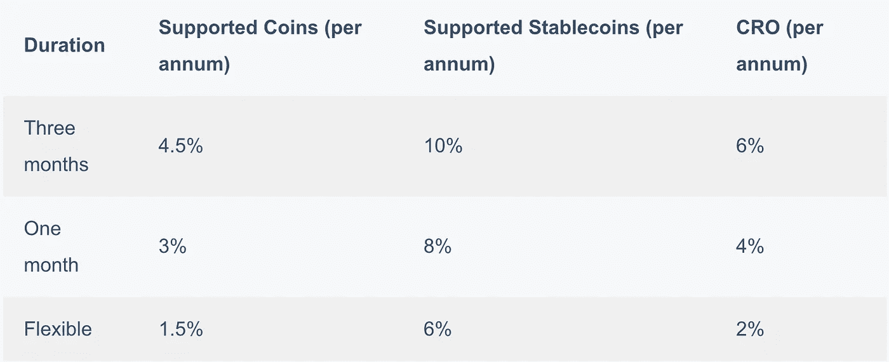

以下利率是如果你押 50，000 或更少的 CRO 股份。

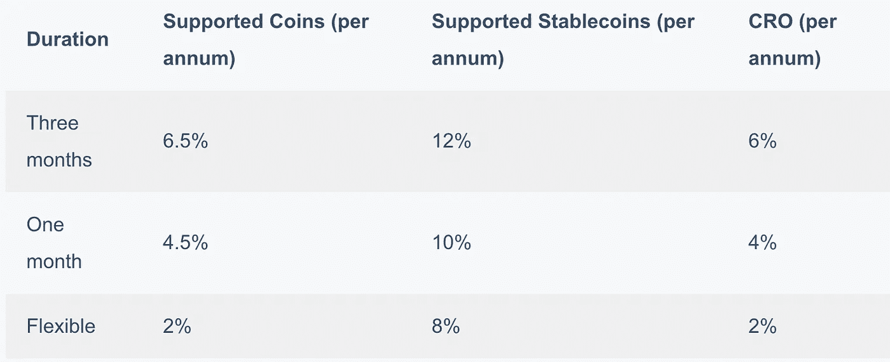

Crypto.com 支持以下硬币

*   比特币
*   以太坊
*   莱特币
*   XRP
*   币安
*   链环
*   制造者
*   PAX 帕克斯金
*   主要的
*   宇宙
*   比特币现金
*   凯伯网络
*   埃尔隆德
*   金恩
*   阿尔格兰德
*   我的天啊
*   塞勒
*   韦钱

Crypto.com 支持以下稳定条款

*   PAXOS 标准
*   美元硬币
*   极限
*   TrueUSD
*   TrueGBP
*   TrueCAD
*   特鲁奥

## 2.加密信贷

加密信贷是一种即时贷款功能，允许您借用高达 50%的加密抵押品。你可以决定你的信用额度和偿还时间表。加密资产甚至不用出售就可以货币化。没有声明的最后期限或滞纳金。Crypto.com 不执行任何信用检查。

利率是每年 12%,但如果你下注 50，000 CRO 或更多，那么利率是每年 8%

## 3.Crypto.com 薪酬

Crypto.com 支付是一种支付应用程序，允许您使用超过 15 种 DeFi 令牌进行支付，如 BTC、瑞士联邦理工学院、USDC、LTC、CRO 等。

**特性**

*   向商家付款
*   移动充值——你必须输入一个手机号码，他们会让你知道他们是否支持移动运营商。
*   在 30 多个国家拥有 300，000 多家商店的 300 多个品牌的礼品卡。其中一些是苹果 iTunes，星巴克，易贝，阿迪达斯，Airbnb 驯鹿咖啡，等等。
*   向朋友发送免费加密
*   在领先的在线零售商购物，如 Ledger、BCVAULT、Travala.com、Coinzilla

此外，您还将根据类别获得报酬。

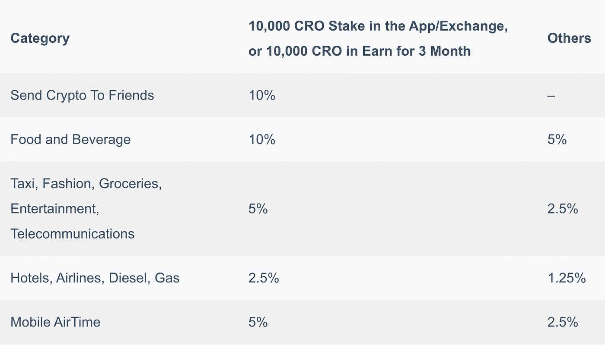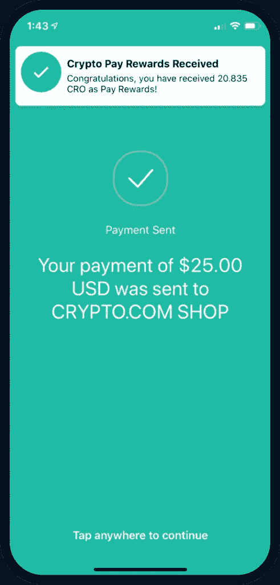

他们也有一个支付网关，你可以与网站集成。 [API 文档](https://pay-docs.crypto.com/#overview)使得集成更加容易。你可以在这里报名同样的。目前已经集成了 [WooCommerce、](https://woocommerce.com/) [OpenCart](https://www.opencart.com/) 等。商家可以通过仪表板管理他们的交易。

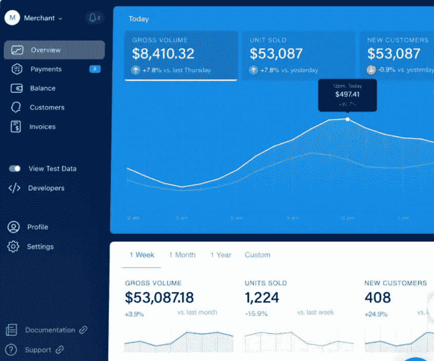

# 4.Crypto.com 金属 Visa 卡

Crypto.com 卡是一种预付的 visa 卡。他们可以使用加密货币、银行转账和信用卡/借记卡充值。

要申请这张卡，你需要持有 CRO 代币 180 天。这些代币的数量取决于您希望使用的卡等级。这些卡片分为五层。有必要完成 KYC 验证。汇率取决于您使用的卡层。

所有卡奖励在 CRO 支付，并直接存入您的加密钱包。一旦交易完成，它们就会反映在你的钱包里。该卡的好处包括网飞，Spotify，Prime，Airbnb，Expedia 和其他订阅。你可以在这里查看更多关于他们的信息。

采购返利以美元报销。折扣上限在每月的第一天重新设定。

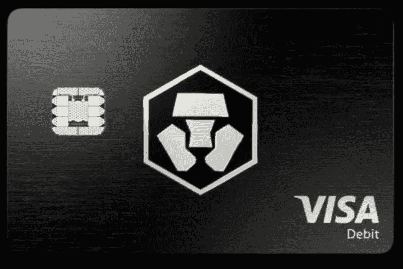

## 5.Crypto.com 应用程序

Crypto.com 应用是购买、销售、发展和管理加密货币的一站式平台。它作为一个保管人，易于使用。

*   该应用程序支持 100 多种加密货币和 20 种法定货币。
*   你可以存放加密和发送加密的应用程序用户免费。
*   提取资金需要支付小额固定费用。
*   可以通过设置价格警报和价格变动警报来跟踪加密货币。

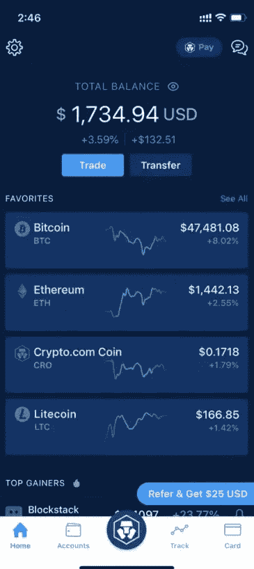

## 6.DeFi 钱包

Crypto.com 提供非托管的 DeFi 钱包，让你完全控制你的私人钥匙和加密货币。您可以将 DeFi 钱包与 Crypto.com 应用程序连接，随时随地管理您的资金。

**特色**

*   它允许轻松管理 100+硬币。
*   您可以轻松导入十二/十八/二十四个单词的恢复短语。
*   赚取十个以上的复合、渴望、宇宙等代币的利息。
*   没有锁定期，收益稳定。
*   您可以在仪表板中查看天然气价格以及供应流动性和掉期的费用。
*   使用多层安全特征来保护令牌。

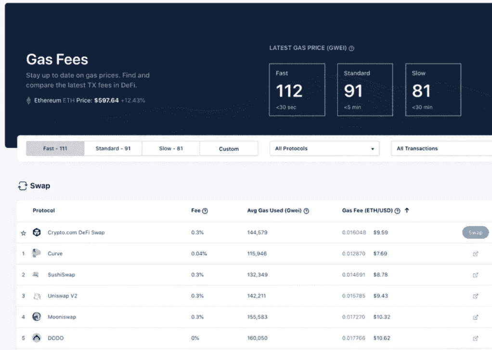

## 7.DeFi 互换

它允许你直接从你的 DeFi 钱包中获得和交换 DeFi 代币。流动性提供者可以享受选定池的互换费用分享和红利收益。

此外，你可以入股 CRO，将你的收益率提高到 20 倍。

# Crypto.org 链

Crypto.org 链是一个[开源](https://github.com/crypto-com)，公共，无权限，安全，容错的区块链。分散式网络速度快，费用低。

该网络支持支付、DeFi 和 NFTs。你可以在它的[白皮书中了解更多。](https://crypto.com/images/crypto_com_whitepaper.pdf)

该网络将于 2021 年 3 月 24 日启动。您可以通过令牌迁移 Web 工具提前注册，以便在 Mainnet 启动时接收本机 CRO。

开发者社区在 [Discord](https://discord.com/invite/pahqHz26q4) 中可用。您也可以在这里查看 Crypto.org 链浏览器[，它有关于事务、块高度、活动验证器等等的信息。](https://crypto.org/explorer/)

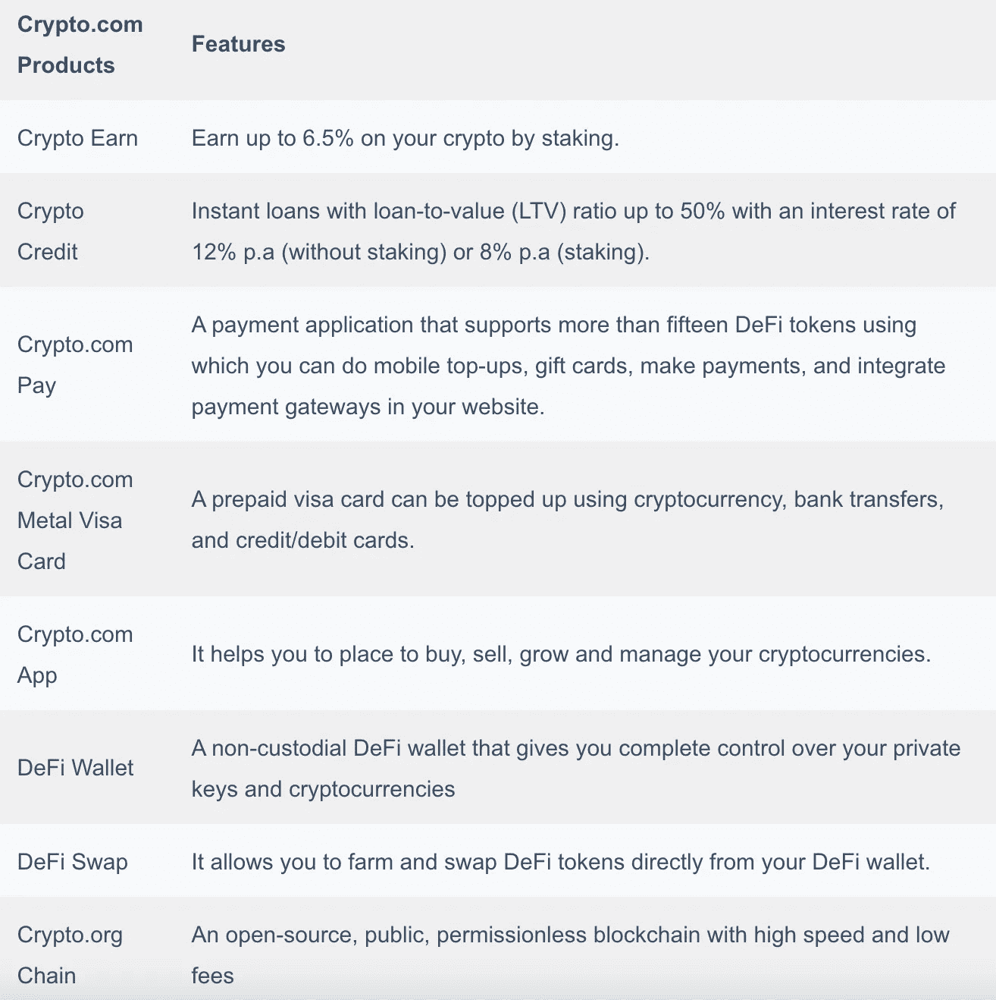

# Crypto.com 交易所

Crypto.com 提供了一个易于使用的交易终端，具有 270 万 TPS 匹配引擎和 50 微秒的核心延迟。它们提供了多种功能——

*   订单—限价、市价、高级(止损和限价)
*   3 倍杠杆的保证金交易
*   现款现货交易
*   衍生品交易
*   辛迪加允许你打折购买新上市的硬币。
*   增压器——它们是为某些资产提供可观回报的赌注池。

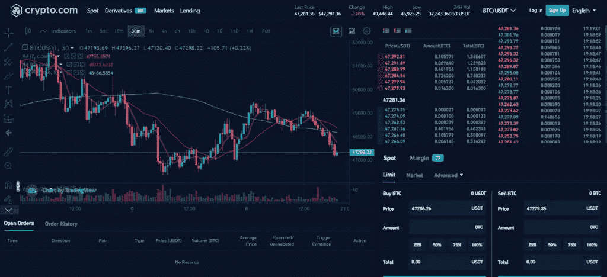

# Crypto.com 费用

交易费用根据交易量分为五个等级。如果你在 CRO 投资或者在 CRO 支付费用，你会得到更多的折扣。此外，你还将从你的 CRO 股份中获得 10%的年息。

折扣以 CRO 回扣的形式给出。计算和支付在一小时内完成。

此外，VIP 客户还享有专属奖励。你必须把你的申请邮寄到[vip@crypto.com](mailto:vip@crypto.com)，如果你达到期望的交易量，你将成为 VIP 客户。

一些额外津贴包括

1.  提前获得产品发布
2.  VIP 客户经理和 API 技术工程师
3.  场外大宗交易
4.  独家研究报告
5.  从您的推荐中获得净交易费的 50%佣金

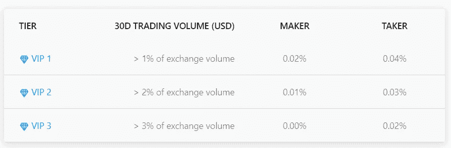

取款费用和限额取决于您使用的加密货币。点击可以查看[的全部名单。](https://crypto.com/exchange/document/fees-limits?tab=1)

# 密码。Com 评论:安全性

Crypto.com 提供多层安全架构，每层都有控制措施。他们使用冷藏来储存加密货币。一小部分资金存储在热钱包中，用于与总账硬件安全模块和多重签名技术集成的日常活动。他们与 Ledger 合作，集成了他们的机构级托管解决方案、硬件安全模块、Ledger vault 和多重签名技术。

这些资产由劳氏财团 2012 年 [Arch](https://insurance.archcapgroup.com/) 承保的 1 亿美元直接保单担保。加上这个，[Crypto.com](https://crypto.com/en/index.html)拥有 3 . 6 亿美元的综合保险，包括直接和间接保险。

他们将法定货币储存在托管银行账户中。如果您是美国居民，您的美元余额由联邦存款保险公司承保，最高可达 250，000 美元。

[亚马逊网络服务(AWS](https://aws.amazon.com/) )用于防火墙、流量自动加密、传输中的受控加密、业务连续性等[更多](https://aws.amazon.com/security/)。

智能合同已经由外部审计师 [Quantstamp](https://quantstamp.com/) 和 [Certik](https://certik.org/) 认证。

使用双因素身份验证、生物识别、电子邮件和电话验证来保护帐户。您可以通过电子邮件验证将外部地址列入白名单，从而防止不必要的撤销。

[Crypto.com](https://blog.coincodecap.com/go/crypto-com)符合加密货币安全标准(CCSS)、ISO 27001:2013、ISO/IEC 27701:2019 和 PCI:DSS 3 . 2 . 1(1 级)的行业最高安全和合规标准，这使他们成为第一家同时拥有所有这些证书的加密公司。此外，他们有一个专门的团队来执行内部审查，并确保符合法规要求。

存款支票接受 [KYC/](https://en.wikipedia.org/wiki/Know_your_customer) AML/ ATF 合规审查。所有提款申请都经过审查，以发现可疑交易。如果您的交易超过阈值，运营团队将需要手动批准。他们还使用第三方人工智能和分析工具来筛选交易。

# Crypto.com 评论:客户支持

你可以在 contact@crypto.com 的[联系到他们。你也可以在推特上和他们联系。](mailto:contact@crypto.com)

他们经营着一个 Youtube 频道，里面有演示和指导视频。你也可以成为他们的电报社区的一员，这个社区有多种语言版本。

# Crypto.com 评论:结论

Crypto.com 是一个用户友好的加密生态系统，提供了一套产品。其网站上有所有产品的详细信息。该系统是透明和安全的。他们有吸引人的动机来促进 CRO 代币的使用。交易费用很低，并根据交易量和 CRO 股份分成不同的级别。这是一个一站式商店，提供您在加密领域需要的任何东西。

# Crypto.com 评论:常见问题

**Crypto.com 合法吗？**

是的，Crypto.com 是一个合法安全的平台，提供广泛的加密产品。该平台符合业界最高的安全性和合规性标准。这些资产有 3.6 亿美元的综合保险，包括直接和间接保险。

**什么是 Crypto.com 币？**

Crypto.com 提供其本土的 CRO 代币，在 CoinMarketCap 排名第 21 位，目前的交易量为 2.1547 亿美元。它提供专属福利、折扣费用和更高的 Crypto.com 收益

**什么是 Crypto.org 链？**

Crypto.org 链是一个[开源](https://github.com/crypto-com)，公共，无许可的区块链。分散式网络速度快，费用低。它是安全的和容错的。

crypto.com 安全吗？

他们使用冷钱包、双因素身份认证、外部地址白名单、生物识别、用于防火墙和流量加密的 AWS 以及许多其他做法来完全保护平台。

什么是 Crypto.com 钱包？

Crypto.com 提供非托管 DeFi 钱包，让您完全控制您的私人钥匙和加密货币。您可以将 DeFi 钱包与 Crypto.com 应用程序连接，随时随地管理您的资金。

Crypto.com 有 visa 卡吗？

是的，Crypto.com 提供预付费 visa 卡，可以使用加密货币、银行转账和信用卡/借记卡充值。根据你愿意下注的 CRO 代币，纸牌分为五层。

> *加入 Coinmonks* [*电报频道*](https://t.me/coincodecap) *和* [*Youtube 频道*](https://www.youtube.com/c/coinmonks/videos) *获取每日* [*加密新闻*](http://coincodecap.com/)

# 另外，阅读

*   [复制交易](/coinmonks/top-10-crypto-copy-trading-platforms-for-beginners-d0c37c7d698c) | [加密税务软件](/coinmonks/crypto-tax-software-ed4b4810e338)
*   [网格交易](https://coincodecap.com/grid-trading) | [加密硬件钱包](/coinmonks/the-best-cryptocurrency-hardware-wallets-of-2020-e28b1c124069)
*   [密码电报信号](/coinmonks/top-3-telegram-channels-for-crypto-traders-in-2021-8385f4411ff4) | [密码交易机器人](/coinmonks/crypto-trading-bot-c2ffce8acb2a)
*   [最佳加密交易所](/coinmonks/crypto-exchange-dd2f9d6f3769) | [印度最佳加密交易所](/coinmonks/bitcoin-exchange-in-india-7f1fe79715c9)
*   [开发者最佳加密 API](/coinmonks/best-crypto-apis-for-developers-5efe3a597a9f)
*   最佳[密码借贷平台](/coinmonks/top-5-crypto-lending-platforms-in-2020-that-you-need-to-know-a1b675cec3fa)
*   [免费加密信号](/coinmonks/free-crypto-signals-48b25e61a8da) | [加密交易机器人](/coinmonks/crypto-trading-bot-c2ffce8acb2a)
*   [杠杆代币的终极指南](/coinmonks/leveraged-token-3f5257808b22)
*   [赚取利息的五大 Crypto.com 备选方案](https://coincodecap.com/crypto-com-alternatives)
*   [Crypto.com NFT 平台综述](https://coincodecap.com/crypto-com-nft-platform)
*   [Crypto.com 对比特币基地](https://coincodecap.com/coinbase-vs-crypto-com)

