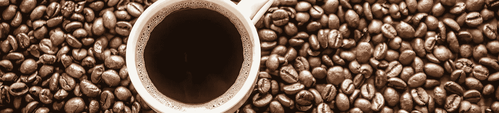
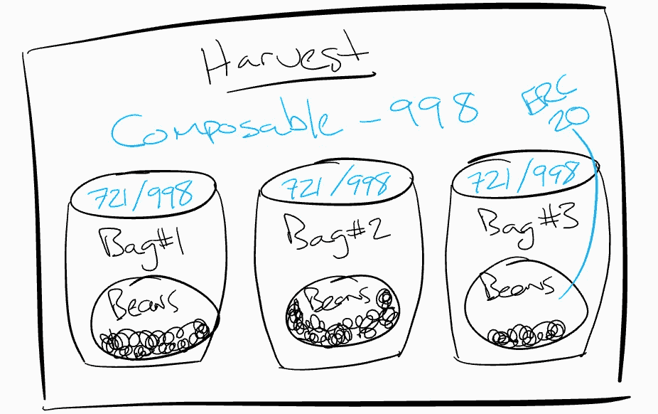

# 加密组件—构建模块和应用

> 原文：<https://medium.com/coinmonks/crypto-composables-building-blocks-and-applications-65902709298c?source=collection_archive---------0----------------------->

Image: [Canva](https://www.canva.com/learn/visual-design-composition/)

介绍 [ERC-998 可组合不可替换令牌标准](https://github.com/ethereum/EIPs/issues/998)的[第一篇帖子](/coinmonks/introducing-crypto-composables-ee5701fde217)获得了很多关注。社区的许多成员发表了一些令人敬畏的评论，包括: [@atphyses](https://twitter.com/atphyses) ，[米哈伊尔·拉里奥诺夫](https://medium.com/u/5ed829dc7d02?source=post_page-----65902709298c--------------------------------)，[马切伊·戈尔斯基](https://medium.com/u/47f89b402c63?source=post_page-----65902709298c--------------------------------)。在许多关于这个帖子的电话和电子邮件之后，每个人都想知道…这个项目是什么？

> 没有项目…也没有象征性的销售。

我的热情在于扩展以太坊的标准组件，这样开发者就可以用它们来创造令人惊奇的、可互操作的体验。这将刺激加密和区块链技术的采用。这种心理模型的一个很好的例子是 Trent McConaghy 最近关于模拟计算电路的推文。现在盯着你的电脑屏幕，想想这一切是如何由微小的元件和晶体管产生的。

好吧。你正在为将可替换的 [ERC-20](https://github.com/ethereum/EIPs/blob/master/EIPS/eip-20.md) 令牌(ft)和不可替换的 [ERC-721](https://github.com/ethereum/EIPs/blob/master/EIPS/eip-721.md) 令牌(NFT)组成复杂的集合和层次结构制定标准。那又怎样？有许多用例，有些实用，有些有趣(也许同样有利可图)。我心目中的 JavaScript 英雄， [Eric Elliott](https://medium.com/u/c359511de780?source=post_page-----65902709298c--------------------------------) ，花了很多年[向我们的头脑](/javascript-scene/the-hidden-treasures-of-object-composition-60cd89480381)灌输四人帮的一个概念……

> 优先选择对象组合而不是类继承

我将通过几个用例介绍区块链上对象合成的概念。这些例子将使用现有的标准以太坊令牌和一个名为 [Composables](https://github.com/ethereum/EIPs/issues/998) 的新的 NFTs 扩展。

# 使用案例—法律

法律合同一塌糊涂。它们很长，难以理解，而且是定制的。几个世纪以来，知识套利一直服务于法律体系。现在，书呆子们正在敲门，试图为人们自动化协议和法律程序。这与组件有什么关系？

大多数法律合同只不过是将双方或多方约束成协议的一系列条款。法律合同可以很容易地由一套标准条款组成，并为各方提供投入。这些条款是不可替代的，独特的，可以根据合同的总体目标定制。契约本身将是一个 [ERC-998](https://github.com/ethereum/EIPs/issues/998) 可组合的定义有关参与方的元数据。可组合组件及其拥有的条款现在可以形成一个复杂的法律协议。

# 用例——供应链来源

Image: [Degrees Coffee Co.](https://nugss.unbc.ca/?page_id=60)

区块链的许多项目都在探索供应链管理和来源。不可变的共享记录符合这个行业的逻辑。范围狭窄或庞大的实现将很难吸引寻求采用标准的应用程序开发人员和企业。可能不太清楚 composables 在这里的位置，但是请看一下。

一个咖啡农在一块地里收获了 500 袋 25 公斤的咖啡豆。他们乘不同的卡车去不同的面包店。在烤面包机，袋子接收关于烘烤类型的数据。他们最终上了不同的卡车，在去商店的路上。一旦到了商店，咖啡豆就被使用，生产出美味的咖啡。一个布鲁克林潮人扫描二维码，看到她正在喝的咖啡豆，它们在哪里被烘焙，烘焙类型，田地，农民…你明白了。巨大的感知价值。

我们可以追踪几块咖啡地，从收获到种植。通过为每次收获铸造一个新的 ERC-998 组合，我们可以附加 ERC-721 不可替换的令牌来代表袋子，如果袋子也支持组合接口，我们可以在里面放置可替换的 ERC-20 令牌。这样，一杯咖啡可以被看作是从一个特定的袋，烘烤，烘烤，收获，农民花费一定数量的“豆”代币。唷。

# 使用案例—虚拟资产

如果你从事加密工作一分钟，你就会听说过 [CryptoKitties](https://www.cryptokitties.co/) 。提出 ERC-721 标准是迪特尔·雪莉和母公司 Axiom Zen 的坚实举措。它迫使社区围绕 NFTs 的标准接口走到一起。这意味着像 [Rarebits.io](https://rarebits.io/) 这样的公司可以轻松引入新的数字资产，而 [userfeeds.io](https://userfeeds.io/) 可以为拥有 CryptoKitties 等数字 NFT 化身的用户建立第二层社交网络。

想象一个游戏中的物品，比如盾牌，有 5 个特殊宝石的底座。你找到几块石头，装上它们，然后决定卖掉盾牌。你可以把这个组合带到一个分散的市场。由于有了可组合的接口，所有的资产都可以被列举出来进行销售。只需要一次购买就可以把盾牌卖给它的新主人。一旦收到，新的所有者可以将石头从盾牌上转移，也许将它们装备到特殊的盔甲上，这样的组合比使用盾牌时更加强大。很多东西值得思考。

# 摘要

可组合的加密资产是以太坊区块链和社区的分散应用程序的下一个非可替代物的发展。有解决现实世界问题的实际用例，也有让虚拟游戏资产在游戏中和市场上都达到全新深度的有趣用例。标准接口使得跨协议和分散应用混合和匹配资产比以往任何时候都更容易。这导致了社区中更多的交叉、实验和交流。在此加入[讨论，帮助推动该标准向前发展。](https://github.com/ethereum/EIPs/issues/998)

[medium.com/@mattdlockyer](/@mattdlockyer)
[twitter.com/mattdlockyer](https://twitter.com/mattdlockyer)
linkedin.com/in/mattlockyer

 [## ERC-998 可组合不可替换令牌标准发行#998 以太坊/EIPs

### 标题:ERC-998 可组合不可替换令牌标准作者:马特·洛克耶(github: mattlockyer)状态:草案类型…

github.com](https://github.com/ethereum/EIPs/issues/998)  [## 介绍加密组件

### 自从比特币问世以来，我们已经有了一个可证明的分散数字稀缺模型，可用于替代资产…

medium.com](/coinmonks/introducing-crypto-composables-ee5701fde217)