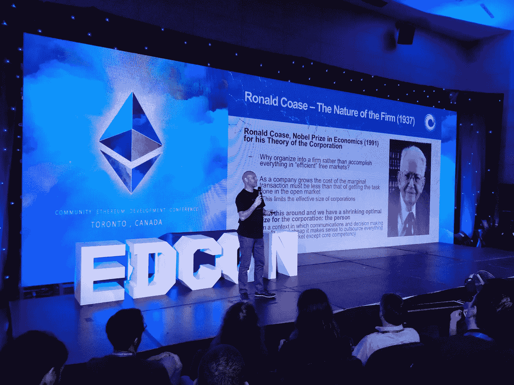

# 加密组件 ERC-998 更新😊

> 原文：<https://medium.com/coinmonks/crypto-composables-erc-998-update-1cc437c13664?source=collection_archive---------1----------------------->

24 天前，我在 [Github](https://github.com/ethereum/EIPs/issues/998) 和[本帖](/coinmonks/introducing-crypto-composables-ee5701fde217)都提出了以太坊的 ERC-998 可组合不可替代令牌标准。该标准背后的动机是为在[以太坊区块链](https://ethereum.org/)上的标准化代币创建一个公共接口，以组成集合和层次。一个[可组合资产的构建模块](/@mattdlockyer/crypto-composables-building-blocks-and-applications-65902709298c)。例如:一套代表指数基金的 [ERC-20](https://github.com/ethereum/EIPs/blob/master/EIPS/eip-20-token-standard.md) 代币；一个由 [ERC-721](https://github.com/ethereum/EIPs/blob/master/EIPS/eip-721.md) 不可替代代币(NFT)和 ERC-20 可替代代币(ft)组成的虚拟背包；家庭、电器、花园和树木的完全令牌化责任，所有这些都嵌套在一个单一的土地所有权令牌中。这是一个发现创建这个[构建模块](https://blog.oceanprotocol.com/towards-a-hierarchy-of-token-building-blocks-6c8dd7b42341)的最有效方式的机会，从一个巨大而活跃的[以太坊开发者社区](https://www.quora.com/Who-has-a-better-developer-community-Bitcoin-or-Ethereum)中获取想法。🤗

这篇文章的某些部分可能会代码过多。我也提供外行人的版本，所以我鼓励你坚持下去。


EDCON After Party Banner — PUMP IT!

最后我还会提供一份来自多伦多的更新。我与社区中的哪些人交谈过，NFTs 的进展如何，以及我打算如何争取对该标准的支持。

# 现在发生了什么？🤨

So it begins

我正在记录这个经历，以便其他以太坊开发者可以看到提出一个标准是什么感觉。我的第一次传递有保护子资产所有权的运行代码(我当时称之为子资产)。诚然，这段代码有许多错误。我在区块链做了 10 个月的顾问，我的可靠性技能有点生疏了😣。此外，我需要再多温习一下标准。在深入比较代码之前，我将分解标准的范围。

*   可组合 NFT(ERC-998)拥有其他可组合 NFT(ERC-998)、NFT(ERC-721)或 FTs (ERC-20)的安全方式
*   对扩展开放，对修改关闭
*   最低的天然气成本
*   标准接口—令牌和协议互操作性
*   最小的集成开销—dapp、钱包和交换

从我的 OOP 和函数式编程背景来看，我认为这是一个维护父子关系的问题。所以我认为最好的开始方式是建模。我将展示将 ERC-721 添加到可组合的 ERC-998 的第一次尝试，然后我将解释问题并展示当前的实现。我目前使用的术语是“拥有”而不是“孩子”来代表可组合对象拥有的 NFT。

# 添加控球权—第一次传球😕

```
/// tokenId of composable, mapped to child contract address
/// child contract address mapped to child tokenId or amount
mapping(uint256 => mapping(address => uint256)) children;/// add ERC-721 children by tokenId
/// @requires owner to approve transfer from this contract
/// call _childContract.approve(this, _childTokenId)
/// where this is the address of the parent token contract
addChild(
  uint256 _tokenId,
  address _childContract,
  uint256 _childTokenId
) {
  // call the transfer function of the child contract
  // if approve was called with the address of this contract
  // the ownership of the child token(s) will be transferred to this contract
  require(
    _childContract.call(
      bytes4(sha3("transferFrom(address,address,uint256)")),
      msg.sender, this, _childTokenId
    )
  );
  // if successful, add children to the mapping
  // generate a 'pseudo address' for the specific child tokenId
  // address construction is analogous to 'contract address + nonce'
  // use 0 == no child token, and 1 == child token exists
  address childToken = address(
    keccak256(_childContract, _childTokenId)
  );
  children[_tokenId][childToken] = 1;
}
```

🤔呀！尤其令人讨厌的是，要将 ERC-721 转移到这个 composable，需要首先调用“approve”。这意味着用户将不得不进行两次函数调用来编写。此外，我计划使用单一映射来表示 ERC-20 的拥有量和 ERC-721 的拥有量，整数 1 表示拥有，0 表示不拥有。恶心！最后，没有额外的簿记来跟踪可组合组件所拥有的 NFT 的契约或这些契约所拥有的令牌 id。一些重要的工作需要完成！

# 添加控球权—第二次传球😁

🚨警告大量代码块🚨

进一步向下滚动，查看正在发生的事情的详细解释！

```
/**************************************
 * ERC-998 Begin Composable
 **************************************/// mapping from nft to all ftp and nftp contracts
mapping(uint256 => address[]) nftpContracts;// mapping for the nftp contract index
mapping(uint256 => mapping(address => uint256)) nftpContractIndex;// mapping from contract pseudo-address owner nftp to the tokenIds
mapping(address => uint256[]) nftpTokens;// mapping from pseudo owner address to nftpTokenId to array index
mapping(address => mapping(uint256 => uint256)) nftpTokenIndex;// mapping NFTP pseudo-address to bool
mapping(address => bool) nftpOwned;/**************************************
* Public View Methods (wallet integration)
**************************************/// returns the nftp contracts owned by a composable
function nftpContractsOwnedBy(uint256 _tokenId) public view returns (address[]) {
  return nftpContracts[_tokenId];
}// returns the nftps owned by the composable for a specific nftp contract
function nftpsOwnedBy(uint256 _tokenId, address _nftpContract) public view returns (uint256[]) {
  return nftpTokens[_nftpOwner(_tokenId, _nftpContract)];
}

// check if nftp is owned by this composable
function nftpIsOwned(uint256 _tokenId, address _nftpContract, uint256 _nftpTokenId) public view returns (bool) {
 return nftpOwned[_nftpAddress(_tokenId, _nftpContract, _nftpTokenId)];
}/**************************************
* Composition of ERC-721/998 NFTs
**************************************/// adding nonfungible possessions
// receives _data which determines which NFT composable of this contract the possession will belong to
function onERC721Received(address _from, uint256 _nftpTokenId, bytes _data) public returns(bytes4) {
  handleReceived(msg.sender, _nftpTokenId, _data);
  return ERC721_RECEIVED;
}// internal call from composable safeTransferNFTP
function fromComposable(address _from, uint256 _nftpTokenId, bytes _data) internal {
  handleReceived(_from, _nftpTokenId, _data);
}function handleReceived(address _from, uint256 _nftpTokenId, bytes _data) internal {
  // convert _data bytes to uint256, owner nft tokenId passed as string in bytes
  // bytesToUint(_data)
  // i.e. tokenId = 5 would be "5" coming from web3 or another contract
  uint256 _tokenId = bytesToUint(_data);
  // log the nftp contract and index
  nftpContractIndex[_tokenId][_from] = nftpContracts[_tokenId].length;
  nftpContracts[_tokenId].push(_from);
  // log the tokenId and index
  address nftpOwner = _nftpOwner(_tokenId, _from);
  nftpTokenIndex[nftpOwner][_nftpTokenId] = nftpTokens[nftpOwner].length;
  nftpTokens[nftpOwner].push(_nftpTokenId);
  // set bool of owned to true
  nftpOwned[_nftpAddress(_tokenId, _from, _nftpTokenId)] = true;
  // emit event
  emit Added(_tokenId, _from, _nftpTokenId);
  // return safely from callback of nft
}
```

很多都变了。从顶部开始，还有许多额外的映射。这是为了跟踪这个可组合体所拥有的契约和令牌 id。仍然有一个简单的布尔映射，以便在提供了可组合令牌 ID、NFT 所有权(NFTP)合同地址和 NFTP 令牌 ID 时返回 true。这使得检查 NFTPs 的所有权变得简单明了。

# 我的代币拥有哪些代币？🤨

其他映射是为了确保 dapps、钱包和分散式交换机有办法枚举可组合 NFT 的所有 NFTPs。这个[评论](https://github.com/ethereum/EIPs/issues/998#issuecomment-385069671)是由[马切伊·戈尔斯基](https://medium.com/u/47f89b402c63?source=post_page-----1cc437c13664--------------------------------)做出的🤩此外还有一些非常有用的评论。通过为 nftp 的契约提供视图函数以及从每个契约返回令牌 id 数组的能力，dapps 可以很容易地查询可组合的 nftp。

# 效率最大化😍

最后一个重要的问题是取消了首先在 NFT 上调用“approve”的要求，然后将 NFT 添加到可组合对象中。这会导致构造令牌的两个步骤，这是不好的！再次，[拉里奥诺夫](https://medium.com/u/5ed829dc7d02?source=post_page-----1cc437c13664--------------------------------)🤩社区提供的这个[评论](https://github.com/ethereum/EIPs/issues/998#issuecomment-383451402)让我开始实现上面看到的`onERC721Received`功能。基本上，每个“实现良好”的 ERC-721 都有一个名为`safeTransferFrom`的函数，它可以触发另一个合同的回调。

函数调用方可以提供智能协定的地址，该地址应实现 ERC721Receiver 接口和回调函数。可以把契约地址想象成一个指针，指向另一个契约中已知回调函数的位置。一旦 ERC-721 完成了它的传输，这个函数将被调用。我真的想让这个标准向后兼容任何 ERC-721，这样他们就不必实现 ERC721Receiver 接口，只有 composable 才需要实现。

# 我的代币在哪里？🤪

现在大问题来了…如果我将我的 NFT 发送到可组合智能合约地址，那么我传输的 NFT 属于哪个可组合 NFT 呢？这就是`_data`论点发挥作用的地方。使用 ERC-721 函数的重载版本:

`safeTransferFrom(address _from, address _to, uint256 _tokenId, bytes _data)`

我们可以传递一些任意的数据，这些数据将一直传递到我们的可组合组件的`onERC721Received`函数！

在可组合函数的`handleReceived`函数中，我们采用`_data`参数，它必须是`bytes`类型，并将其转换为`uint256`下面是实现这一点的代码，仅供参考(遗憾的是，我失去了与这个# latenightcoding 的链接):

```
function bytesToUint(bytes b) internal pure returns (uint256 result) {
  result = 0;
  for (uint256 i = 0; i < b.length; i++) {
    uint256 c = uint256(b[i]);
    if (c >= 48 && c <= 57) {
      result = result * 10 + (c - 48);
    }
  }
}
```

将该字节数据转换为无符号整数允许我们将 NFT 转换为可组合契约，同时为可组合 NFT 提供 ID，该可组合将拥有最近传输的不可替换的 NFTP 令牌所有权。

# 快速回顾

*   一个 NFT 被发送到可组合智能合约
*   可组合现在拥有 NFT 作为 NFTP
*   在可组合契约中调用了`onERC721Received`函数
*   将 bytes 参数转换成一个无符号整数，我们知道哪个组合应该“拥有”NFTP

# 时髦的地址😯

您可能已经注意到对 _nftpOwner 和 _nftpAddress 的一些调用。这些是生成唯一地址的内部函数，以减少所需的嵌套映射数量。

```
// generates a pseudo-address from the nft that owns, nftp contractfunction _nftpOwner(uint256 _tokenId, address _nftpContract) internal pure returns (address) {
  return address(keccak256(_tokenId, _nftpContract));
}// generates a pseudo-address for the nftp from the nft that owns, nftp contract, nftp tokenIdfunction _nftpAddress(uint256 _tokenId, address _nftpContract, uint256 _nftpTokenId) internal pure returns (address) {
  return address(keccak256(_tokenId, _nftpContract, _nftpTokenId));
}
```

这些函数散列输入并返回地址类型。我可以将散列保留为 bytes32，但是由于我们表示的本质上是伪地址，所以地址映射感觉更合适。

> “没人说这很容易”

# 足够的代码——什么时候 EIP？🤣

ERC-998 发生了许多令人兴奋的事情。当我在多伦多的#EDCON 时，我和一些我认识的以太坊社区的人交谈过，包括:[约瑟夫·卢宾](https://medium.com/u/6a370863659c?source=post_page-----1cc437c13664--------------------------------)，[维塔利克·布特林](https://medium.com/u/587a00dbce51?source=post_page-----1cc437c13664--------------------------------)，[哈德森·詹姆森](https://medium.com/u/169bf6f2b2a7?source=post_page-----1cc437c13664--------------------------------)，[大卫·克诺特](https://medium.com/u/e72e321450c0?source=post_page-----1cc437c13664--------------------------------)和[乔恩·崔](https://medium.com/u/4c28429586dd?source=post_page-----1cc437c13664--------------------------------)。这为我提供了必要的反馈、联系和线索，让我开始标准化 ERC-998，同时也招募了一些顶尖的代码人才来看看我到目前为止取得的进展。鼓励！

现在最酷的部分来了。你知道吗，你可以从以太坊基金会获得一笔小额赠款，用于标准之类的工作。我也不知道，直到乔恩·崔建议我这么做！感谢我的朋友 [Kevin Owocki](https://medium.com/u/194c20cf90b6?source=post_page-----1cc437c13664--------------------------------) 和 [GitCoin](https://mobile.twitter.com/GetGitcoin) 我将有一个优秀的奖金系统给开发者来帮助我开发这个标准，同时也受益于以太坊基金会的慷慨。完全披露:我还没有开始这个过程，但我打算……*咳*😂

# 外卖💖



当想到 Joe Lubin 在 EDCON 上的演讲时，你会想象一个“工作”这个词不再有那种刻板印象的世界。人们聚集在他们热衷的想法和价值观周围。流动的组织取代了一度僵化的结构和等级制度。今天可能是 Cryptokitties，明天可能是自组织的本地基础设施项目。有一点是肯定的。我们只有通过共同建设来实现这个未来。

# NTFs 的未来😎

在#EDCON 期间，我也受到了以太坊社区的广泛关注。有很多很酷的人在用 NFTs 做着令人惊奇的事情，包括在香港的第一次不可替代的代币会议！请跟随[朱杰汉](https://medium.com/u/414baf69bd08?source=post_page-----1cc437c13664--------------------------------)了解更多详情！还有一个由[吴家善](https://medium.com/u/2dca3bb82e?source=post_page-----1cc437c13664--------------------------------)在纽约创立的密码游戏工作室正在筹备资金！很棒的东西。

除了这些即将到来的伟大项目，[布莱恩·弗林](https://medium.com/u/c0cacba41b4d?source=post_page-----1cc437c13664--------------------------------)开始了[不可替代的每周简讯](/@brianubiquik/introducing-the-not-so-fungible-weekly-94d0aeefcf85)。如果你对 NFTs 和即将到来的收藏品、游戏和组件感兴趣，请订阅！

# 包裹

这里是组件代码的工作库:

 [## mattlockyer/composables-998

### composables-998 -一个为以太坊开发 ERC-998 标准的实现和文档报告。

github.com](https://github.com/mattlockyer/composables-998) 

别忘了以`npm i`和`truffle test`为起点。

最后，关于 ERC-998 的最新评论(请自制一些)在这里:

[](https://github.com/ethereum/EIPs/issues/998) [## ERC-998 可组合不可替换令牌标准发行#998 以太坊/EIPs

### 标题:ERC-998 可组合不可替换令牌标准作者:马特·洛克耶(github: mattlockyer)状态:草案类型…

github.com](https://github.com/ethereum/EIPs/issues/998) 

你可以在这里找到我:

[medium.com/@mattdlockyer](/@mattdlockyer)
twitter.com/mattdlockyer
linkedin.com/in/mattlockyer

谢谢你能走到这一步！