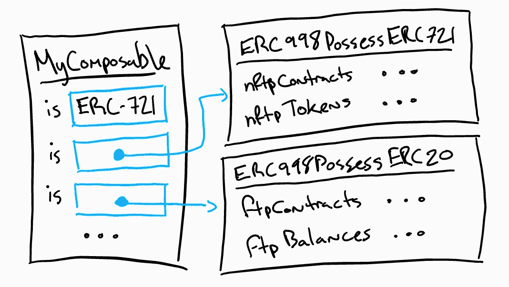
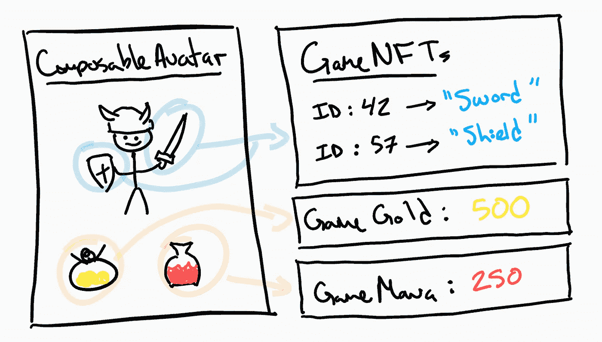

# 加密组件 ERC-998 更新#2

> 原文：<https://medium.com/coinmonks/crypto-composables-erc-998-update-2-4b160df79836?source=collection_archive---------5----------------------->


Blockchain Week NYC

哇！我在纽约！共识 2018 正在进行，我不在😂。

现在让我们来讨论一些更实际的东西……为可组合不可替换令牌(CNFTs)构建一个标准接口。感谢[理查德·伯顿](https://medium.com/u/db924dbde4c3?source=post_page-----4b160df79836--------------------------------)在[平衡工作室](https://balance.io/)招待我们进行*其实*搭建的事情。#BUIDLWEEK


[Richard Burton](https://medium.com/u/db924dbde4c3?source=post_page-----4b160df79836--------------------------------) and Balance Wallet crew at the Brooklyn HQ

自从我发布了“[介绍加密可组合组件 T10”和“T11 加密可组合组件—构建模块和应用 T12”之后，我已经被 NFT 领域的许多项目、以太坊社区的兴趣和整体支持所淹没🤗。延伸到以太坊社区，这种支持将使其成为 ERC-721 的标准接口和扩展，允许 CNFTs 拥有 NFTs (ERC-721)和 FTs (ERC-20)。一份**实施工作草案**在此:](/coinmonks/introducing-crypto-composables-ee5701fde217)

[](https://github.com/mattlockyer/composables-998) [## mattlockyer/composables-998

### composables-998 -一个为以太坊开发 ERC-998 标准的实现和文档报告。

github.com](https://github.com/mattlockyer/composables-998) 

本次更新涵盖了 ERC-998 到 2 个选择界面的重构。拥有 FTs 的大部分代码是在周日晚上飞往纽约的飞机上写的。这个代码已经在上面的工作报告中进行了松散的测试。虽然在这成为标准之前还有很多工作要做，但是有一个草案实现将允许其他开发者和我自己**开发一些****dapp**。一旦上了 testnet，这些 dapps 将展示一个开放的、可互操作的可组合令牌标准的威力。提示:请在接下来的几周内注意😂。

# 重构 ERC-998 接口


Curation Markets meetup with [Trent McConaghy](https://medium.com/u/f1cb98e196bc?source=post_page-----4b160df79836--------------------------------) hosted by [FOAM](https://medium.com/u/959e75125558?source=post_page-----4b160df79836--------------------------------)

最近我完成了 ERC-998 的第一部分，也是我认为最难的部分:让一个 CNFT 拥有其他 CNFT 和标准 NFT。这在很大程度上是因为非功能性测试比功能性测试更复杂。对于 NFT，你必须跟踪每个令牌的唯一性`tokenId`,而对于 FTs，你不必在意，因为它们不是唯一的。任何可替换令牌都与任何其他可替换令牌相同，余额表示为单个整数余额。那么这个重构怎么样呢？

我选择将 ERC-998 接口重构为两部分，跟随几个 OpenZeppelin 标准实现的脚步，保持代码模块化。在下面的代码和讨论中，不可替换的令牌拥有(NFTP)和可替换的令牌拥有(FTP)代表由可组合的。下面是重构的样子:



Composing Composables with Inheritance

有了这个新的架构，就有可能创建只拥有和管理**NFT(721)或者只拥有和管理**FTs(20s)的组件，或者同时拥有和管理**和**的组件。例如:代表**指数基金**的可组合合约对于每只基金都有唯一的 NFT，但只需要从`ERC998PossessERC20.sol`合约继承。这也将减少部署到区块链的合同规模。最近的重构支持这一逻辑，同时仍然为 CNFTs 拥有 NFT 和 ft 敞开大门。****

# 拥有 FTs 的 CNFTs

我知道，在解决 CNFT 拥有 NFT 案例(即拥有其他唯一令牌 ID 阵列的唯一令牌 ID)的管理难题后，这将变得很容易。虽然 cnft 拥有 NFTs 仍然是一个草案，需要一些额外的功能和健壮性，但我想探索 cnft 拥有 FTs 的概念。这变得容易多了，因为“拥有 NFT”案例中的大部分代码可以在这里使用并简化为表示余额，而不是唯一令牌 id 的数组。下面来看一下*公共*接口:

```
// mapping from nft to all ftp contracts
mapping(uint256 => address[]) ftpContracts;// mapping for the ftp contract index
mapping(uint256 => mapping(address => uint256)) ftpContractIndex;// mapping from contract pseudo-address owner ftp to the tokenIds
mapping(address => uint256) ftpBalances;/**************************************
* Public View Functions (wallet integration)
**************************************/// returns the ftp contracts owned by a composable
function ftpContractsOwnedBy(uint256 _tokenId) public view returns(address[]) {
  return ftpContracts[_tokenId];
}// returns the ftps owned by the composable for a specific ftp contract
function ftpBalanceOf(uint256 _tokenId, address _ftpContract) public view returns(uint256) {
  return ftpBalances[_ftpAddress(_tokenId, _ftpContract)];
}/**************************************
* Public Transfer and Receive Methods
**************************************/function safeTransferFTP(
  address _to, uint256 _tokenId, address _ftpContract, uint256 _value, bytes _data
) public {
  transferFTP(_to, _tokenId, _ftpContract, _value);
  ftpReceived(_ftpContract, _value, _data);
}function onERC20Received(address _from, uint256 _value, bytes _data) public returns(bytes4) {
  ftpReceived(msg.sender, _value, _data);
  return ERC20_RECEIVED;
}
```

如果你不编码，不用担心。外行人的解释来了。

## 簿记

从顶层的映射开始。您需要跟踪并能够添加和删除 ERC-20 合同地址。这有助于钱包、交易所和应用程序枚举可能包含几个可替换令牌的特定 CNFT 的所有合约和余额。

那么为什么`ftpBalances`映射只有 1 级深(即平坦)？那是因为我使用了一个技巧，在我的[之前的代码更新](/coinmonks/crypto-composables-erc-998-update-1cc437c13664)中解释过，我称之为“伪地址”。基本上，对于每个在 ERC-20 合同`address`中有余额的 CNFT `tokenId`，我们将创建这些项目的新散列，并将其截断/转换为 Solidity 中的地址类型。这允许我们以适度的额外计算为代价来避免深度映射和存储浪费。

## 列举

钱包、交易所和应用程序都需要了解每个 NFT 拥有哪些令牌合约和余额。这由 public view 函数解决，该函数返回所有可替换令牌拥有(FTP)合同的列表，如果提供了所有者`tokenId`和 FTP 合同`address`，就可以找到平衡。

## 转移和接收

这很重要。目前，将 ERC-20 移入和移出可组合对象是模仿 ERC-721 标准的，其中有一个`ERC20Receiver.sol`很像从`ERC721Receiver.sol`中继承的，ERC-20 必须触发回调。为了实现这一目标，旧的 ERC-20 合同需要升级。由于这要么是不可能的，要么是不可取的，仍然可以选择批准，然后从 ERC-998 内部使用 ERC-20 的`transferFrom`功能。正如[米哈伊尔拉里奥诺夫](https://medium.com/u/5ed829dc7d02?source=post_page-----4b160df79836--------------------------------) [在 github](https://github.com/ethereum/EIPs/issues/998#issuecomment-383451402) 上指出的，有人试图用 ERC-20s 来制定回调行为标准。我希望他们能……*咳*😉

传送只是检查伪地址(`tokenId` x ftp `address`)的`ftpBalances`是否有足够的令牌余额，然后调用该 ftp 令牌的传送函数。然后我们需要从契约数组中移除 ftp 契约，并整理好`ftpBalances`。

# 是时候标准化了！



The Future of Decentralized Gaming

令人惊讶的是，我还没有遇到来自社区的任何负面反应。我通常从人们那里得到两种回答中的一种。周日晚上由 [FOAM](https://medium.com/u/959e75125558?source=post_page-----4b160df79836--------------------------------) 主办的纽约策展市场会议也不例外:

1.  我不明白。真的吗？太酷了！我想你可以用它来做 X Y Z？
2.  几个月前我就想到了这个，我写了一些代码来做这个，我想用这个！

**太好了！**无论哪种方式。让我们作为一个社区一起努力**来建造它！**

正如我在“[区块链标准正在吞噬世界](/coinmonks/blockchain-standards-are-eating-the-world-6bc4b59e297f)”中解释的那样，如果我们继续在孤岛中构建协议，我们将面临分散的、点对点的价值创造和交换被现任者吸收的风险。这种**不可能**发生！我们必须努力，“[走向一个代币积木的层级](https://blog.oceanprotocol.com/towards-a-hierarchy-of-token-building-blocks-6c8dd7b42341)”，否则以太坊社区和其他连锁店将失去其相关性，如果不被大众接受的话。简而言之，标准很重要，原因如下:

我发送给你一个由“非标准”协议 **X** 构建的 CNFT，你在只实现 CNFT 接口 **Z** 的 Wallet 中打开它，Wallet **Y** 无法枚举，因此你**无法**看到我发送给你的 Composable 的任何内容。这是很糟糕的用户体验。这也将使 dapps 和 cryptoassets 的采用陷入停滞。尤其是不可替代的令牌，它非常有希望形成更复杂的资产和第二层的构建块。参见 [userfeeds.io](https://userfeeds.io/) 和[cryptogoods.net](https://www.cryptogoods.net/)。

# 包扎


Curation Markets meetup with [Jess Sloss](https://medium.com/u/372146c430f5?source=post_page-----4b160df79836--------------------------------) hosted by [FOAM](https://medium.com/u/959e75125558?source=post_page-----4b160df79836--------------------------------)

ERC-998 的全功能实施草图被装载，列车即将离开车站。现在是时候参与进来了！我是 100%可接触的，公开透明的。我知道每个人都有项目要做，但是标准很重要，从长远来看会影响你的项目。我已经[申请了以太坊基金会的资助](https://twitter.com/mattdlockyer/status/994220700129935360?s=20)来资助我的好友[凯文·奥沃基](https://medium.com/u/194c20cf90b6?source=post_page-----4b160df79836--------------------------------)和[马克·贝林](https://medium.com/u/6263e72bcb5d?source=post_page-----4b160df79836--------------------------------)在他们的网络上解决以下问题:

*   就接口达成一致
*   最大限度降低天然气成本
*   强化实施安全性
*   扩展性回调
*   还有更多…

如果你有兴趣帮忙，请告诉我！

[medium.com/@mattdlockyer](/@mattdlockyer)T24[twitter.com/mattdlockyer](https://twitter.com/mattdlockyer)linkedin.com/in/mattlockyer

[](https://github.com/ethereum/EIPs/issues/998) [## ERC-998 可组合不可替换令牌标准发行#998 以太坊/EIPs

### 标题:ERC-998 可组合不可替换令牌标准作者:马特·洛克耶(github: mattlockyer)状态:草案类型…

github.com](https://github.com/ethereum/EIPs/issues/998)