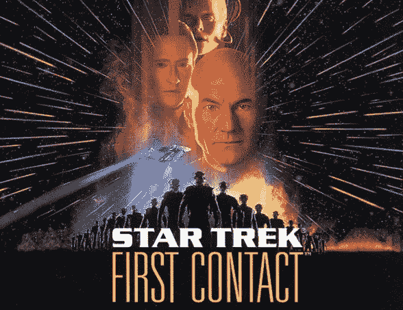
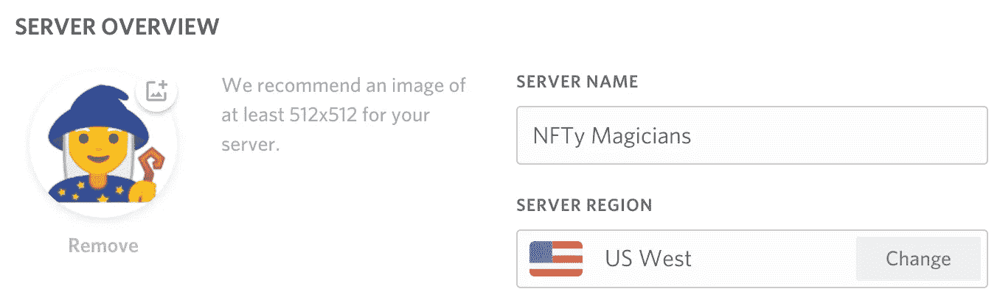
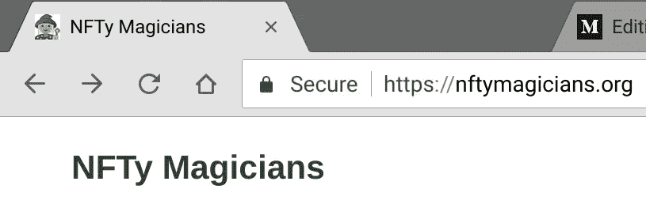
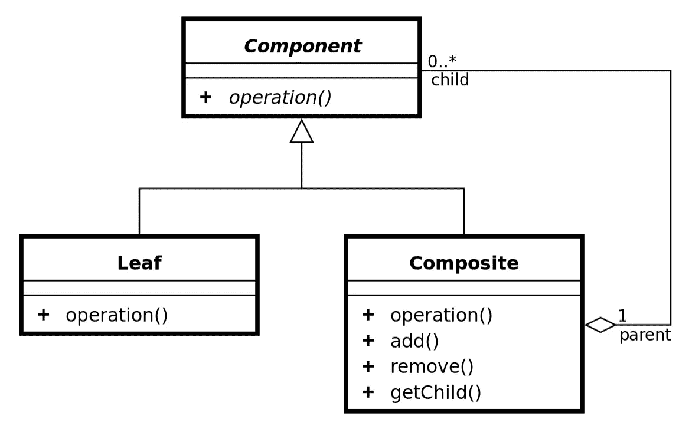

# 加密组件 ERC-998-更新 3:第一次接触

> 原文：<https://medium.com/coinmonks/crypto-composables-erc-998-update-3-first-contact-f3930a08636?source=collection_archive---------7----------------------->

我将谈论建立“NFTy 魔术师”社区，在第一次“Composables 调用”中讨论了什么，以及关于为**可组合不可替换令牌** (CNFTs)创建标准接口的一些想法。

## 背景和概述(如果你是潮人，跳过):

[](/coinmonks/introducing-crypto-composables-ee5701fde217) [## 介绍加密组件

### 自从比特币问世以来，我们已经有了一个可证明的分散数字稀缺模型，可用于替代资产…

medium.com](/coinmonks/introducing-crypto-composables-ee5701fde217) [](/coinmonks/crypto-composables-erc-998-update-1cc437c13664) [## 加密组件 ERC-998 更新😊

### 24 天前，我在 Github 和本帖中提出了以太坊的 ERC-998 可组合不可替换令牌标准。的…

medium.com](/coinmonks/crypto-composables-erc-998-update-1cc437c13664) [](/coinmonks/crypto-composables-erc-998-update-2-4b160df79836) [## 加密组件 ERC-998 更新#2

### 哇！我在纽约！共识 2018 正在进行，我不在😂。

medium.com](/coinmonks/crypto-composables-erc-998-update-2-4b160df79836) 

# 初次接触



I’m a fan… 🤩

在参加了多伦多的 EDCON 和主要在纽约的 NFT 交流后，以太坊基金会的[詹姆斯·皮茨](https://medium.com/u/2d57324be000?source=post_page-----f3930a08636--------------------------------)鼓励我建立一个[不和谐](https://discordapp.com/)和[对话](https://www.discourse.org/)。目的是将以太坊魔术师讨论的一些令牌标准转移到更广泛的社区中。以太坊魔术师主要关注核心以太坊代码库的改进，虽然令牌的标准接口很棒，但有时一个论坛没有足够的带宽来处理所有事情。这就是为什么我创建了 NFTy Magicians，一个基于 NFT 理念、项目、用例、讨论、实现、接口和标准的社区。👍

## NFTy 魔术师——一个不和谐的话语社区



Discord Channel for chat about NFT ideas, news, projects and use cases



Discourse for more formal discussions about NFT standards, interfaces and implementations

> 每个加入不和谐频道的人都非常热情和乐于助人。我要感谢每个人的时间和精力。🙏

一个讨论像 ERC-998 CNFTs 这样的标准接口提案的地方是必不可少的，因为现在在 NFT 空间有很多正在进行的事情。由 [0xcert](https://medium.com/u/106c9d734ba5?source=post_page-----f3930a08636--------------------------------) 团队所做的关于为什么 NFTs 如此重要[的精彩总结可以在这里找到](/0xcert/erc-721-hitting-a-home-run-77d6b4fca33d)。[标准](/coinmonks/blockchain-standards-are-eating-the-world-6bc4b59e297f)不是为一小部分项目或开发者服务，而是为整个社区服务。讨论是达成最佳解决方案的关键。对与数字稀缺资产的可组合性相关的细节进行彻底的考虑，是迈向对大多数人来说具有客观和逻辑共识的抽象的必要一步。把社区驱动的开发想象成定性的研究，被讨论、编码并抽象成大致定量的结果。真的挺优雅的。感谢詹姆斯·皮茨鼓励我开始这个过程。

# 第一个电话— ERC-998 CNFTs

Remember when this was a thing?

我们在 2018 年 5 月 29 日(星期二)进行了一次令人惊叹的首次电话会议，我想回顾一下其中的一些要点:

1.  需要标准事件？是的。直到接口完成；
2.  当 NFT 从 CNFT 除名时，是否会引发回调或事件？**回调**；
3.  向/从 CNFT 添加/删除其他合同需要批准；
4.  CNFT 中子树操作。动态编程解决方案？提交讨论；
5.  命名法:NFTs ->父/子；财务交易->余额；**共识**；
6.  继续探索与可组合注册中心互操作的方法；

这是一次非常富有成效的电话会议，许多伟大的思想和声音都出席了会议。它有助于澄清我应该在哪里花时间编写示例实现，以及其他人如何帮助我。我将在这里进一步阐述这些观点。

当然需要标准事件来监听和记录与组件相关的事件，但是对于所有其他 NFT 事件，ERC-721 事件就足够了。CNFT 特定事件类似于:

```
event ChildAdded(uint256 _tokenId, uint256 childTokenId, ...)
event ChildRemoved(uint256 _tokenId, uint256 childTokenId, ...)
```

因此，在这个实例中，您应该知道父 NFT 令牌 ID 和子令牌 ID。也许我们还会传递子令牌的合同地址；假设您知道触发事件的契约地址(父级)。

对于上下文，我们已经批准了在向 CNFTs 添加子代或余额时的回调，以便限制…组合的组合。在第(2)点中，我们讨论了当 NFT 或部分代币余额从 CNFT 中移除时，我们是否可以避免回调，以及一个事件是否足够。Maciej Górski 和我提出的观点是，某些物品的“粘性”在某些情况下很重要。因此，回调是必要的。这可能是这样的:

```
removeChild(..., uint256 childTokenId, ...) {
...
  require(childToken.isRemovableFromParent(this, childTokenId));
...
}
```

我们还很快决定，我们需要一个针对 composables 的批准流程，以批准由其他智能契约发起的子代或余额的发送和接收。这来自于 [Maciej Górski](https://medium.com/u/47f89b402c63?source=post_page-----f3930a08636--------------------------------) 在忙于赢得@ ETH Buenos Aires 时的一个用例。太棒了。

我们都有点担心 composables 的深度嵌套和“分解”这些资产的复杂性。这将需要多次转移或一些计划，使这一工作。我提到了一种动态编程技术，添加树的根地址作为每个子树的批准发送，但记账可能太繁琐了。搁置。

命名法比我想象的更有趣。我们有一个有趣的情况，NFT 可以拥有 NFT 或 FTs，或者两者都拥有。那么，在处理多重继承时，如何命名子项和余额并避免名称空间问题呢……嗯……所以我们稍微关注一下复合模式:



The Composite Design Pattern

好的，所以父/子的事情肯定适用于拥有其他 NFT 的 NFT，因为在 OOP 软件术语中，每个 NFT 就像一个对象的唯一实例。但是 ERC 20 的余额呢？我们将不得不使用与 ERC-20 规范相同的术语。达成共识！

最后，对于每个创建加密组件的人来说，重要的是不要给最终用户/开发人员带来额外的膨胀、气体成本或实现难题。来自 Userfeeds.io 的 [Maciej Górski](https://medium.com/u/47f89b402c63?source=post_page-----f3930a08636--------------------------------) 再次为所有项目甚至现有的 ERC-721 创建了一个可组合的注册表。我认为这是一个获得可组合性好处的好方法，而不必部署 CNFT。然而，人就是人，会有项目希望在他们部署的所有合同中拥有最终发言权，特别是如果这是他们的令牌经济如何运作的一部分。我在 ERC-998 上的目标是创建一个标准的界面，无论是否注册，你都可以与 CNFT 交互。我相信这两种方法在未来都可以得到支持。

## 感谢电话中的每一个人:

亚历山大 933
陈切尔
达夫基 2000
吉姆博比斯
杰沃普
弗林
梅斯特
马特洛克
宋旻浩
莫斯卡雷克
Mg6maciej | Userfeeds
娜塔莉-ckc
Tdng
Trung | Axie Infinity


We “sliced” through a ton of stuff on this call… 😍

# 进球进球太棒了！

我的目标从来都不是把 CNFTs 的接口当成 10 条戒律，并期望每个项目 Dapp 和 wallet 都实现它。令人惊讶的是，我没有自己的 CNFTs 项目，目前也没有参与任何项目。因此，我期待社区的能量和热情来回答我们应该建造什么和为什么建造。我对 CNFTs 的最终目标是不要把它踢过终点线。社区需要作为一个团队来做这件事。

Smashed that one in!

以太坊基金会成员花时间指导我和现在正在构建标准接口和令牌构建块的社区，他们的善良令人难以置信。我已经从区块链和 token 工程空间获得了很多能量；通过为其他人提供一个抓住这股浪潮的空间来回报是一个简单的决定。

你也可以帮助支持分散应用的标准接口、令牌和互操作性。你需要做的就是开始。

来加入我们的不和谐🧙

关于标准、接口和实现的更正式的讨论，请加入我们@[nftymagicians.org](http://nftymagicians.org)🧙的讨论

保持联系，对修改保持封闭，对扩展保持开放…😉

[medium.com/@mattdlockyer](/@mattdlockyer)
[twitter.com/mattdlockyer](https://twitter.com/mattdlockyer)T22[linkedin.com/in/mattlockyer](https://linkedin.com/in/mattlockyer)