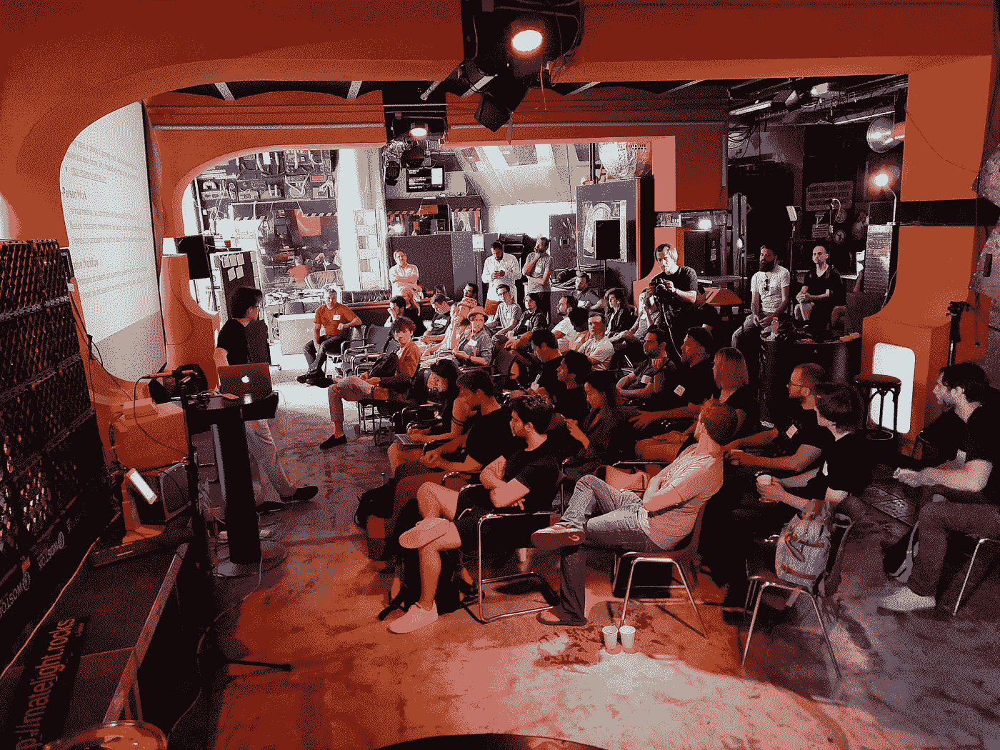
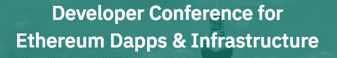
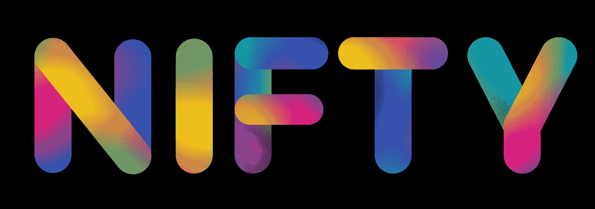
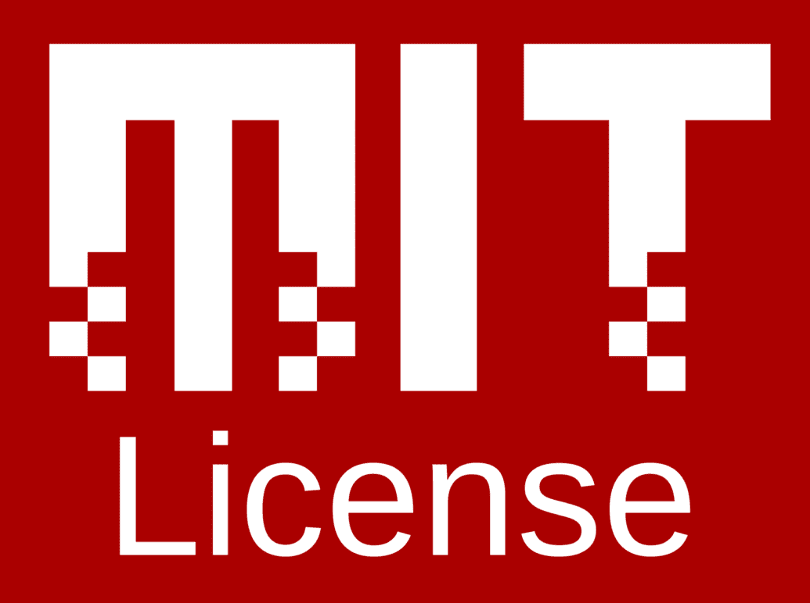

# 加密组件 ERC-998-更新 5

> 原文：<https://medium.com/coinmonks/crypto-composables-erc-998-update-5-eb0a748a9889?source=collection_archive---------5----------------------->

第四次 Composables 电话会议回顾:ERC-998 的公告、补充和更改，柏林以太坊魔术师，柏林 DappCon，Nifty Hong Kong， [Composables-998](https://github.com/mattlockyer/composables-998) (麻省理工学院)许可证，可组合 DApps，ERC-998 标准的下一步是什么？

## **背景和概述(如果你熟悉 ERC-998 就跳过):**

[推出加密组件](/coinmonks/introducing-crypto-composables-ee5701fde217) [加密组件 ERC-998 更新😊](/coinmonks/crypto-composables-erc-998-update-1cc437c13664) [加密组件 ERC-998 更新#2](/coinmonks/crypto-composables-erc-998-update-2-4b160df79836) [加密组件 ERC-998 —更新 3:第一次联系](/@mattdlockyer/crypto-composables-erc-998-update-3-first-contact-f3930a08636) [加密组件 ERC-998 —更新 4:“命名”](https://hackernoon.com/crypto-composables-erc-998-update-4-the-namening-7a05d28f3401)

## **总结**

自从马特·洛克尔上次更新以来，ERC-998 有了一些令人兴奋的重大变化。上个月还见证了一系列令人难以置信的国际会议，如柏林以太坊魔术师大会、柏林 DappCon 大会和 Nifty 香港大会。随着 DApp 用例的创建，NFT 和 composables 社区积极乐观。第一个实现 ERC-998 的 DApp mok ens . io 在 mainnet 上发布。DApps 开始在游戏和高级时装租赁中使用 ERC-998 进行实验。每一个新的用例都会带来新的问题和机会来加强 ERC-998 代码。诸如合成和分解的气体成本、多令牌铸造和空投等问题都是被提到需要进一步探索的领域。

## **电话#4 的出席者:**

*   阿兰法尔孔
*   亚历克斯|开放海洋
*   埃里克
*   赫萨默斯(哈利)
*   Jwaup
*   马特洛克(马特)
*   没有失踪。
*   穆德根(尼克)
*   娜塔莉-ckc(娜塔莉)
*   菲力浦
*   铲去
*   泰勒·道森
*   无限轴

## **简介**

第四次 composables 通话以马特·洛克耶的激动人心的宣布开始:ERC-998 已经在 mainnet 上用 [mokens.io](http://mokens.io) 实现了！尼克·穆奇令人难以置信的工作成就了 DApp 在 2018 年 8 月 4 日的成功发射。

Matt Lockyer 有另一个声明，他将作为一个冠军参与为这样的 EIPs 获得资金，并将转向更多的反向渠道，以便我们社区的那些人走在最前面。因此，Matt 介绍 Haley Summers 担任余下通话的主持人。Haley 一直在为 mokens.io 写博客和社区建设。

## 对 ERC-998 标准的补充和更改

ERC-998 最近最大的变化是增加了接口“ERC998ERC20BottomUp”。该接口扩展了 ERC-20 和 ERC-223 标准，使 ERC721 令牌能够拥有 ERC-20 令牌。这是 Jordan Schalm 添加的。

**ERC-998 标准的其他变化:**

*   将“_fromTokenId”参数添加到 transfer child/safeTransferChild 函数中。
*   标准中增加了“显式传递参数”一节。本节解释了为什么在每个传递函数中使用 from/to 参数。
*   标准中添加了“Transfer from/safetransforfrom 函数不传输令牌所拥有的令牌”一节。
*   该标准的认证部分得到了改进，删除了“直接所有者”的认证，只认证“根所有者”。
*   函数“ownerOfChild”和“tokenOwnerOf”现在返回 ERC998 幻值。这样做是为了更有效地遍历可组合树。

## [**柏林以太坊魔术师**](https://ethereum-magicians.github.io/berlin-council/)

马特在柏林参加柏林以太坊魔术师协会，在那里他见到了来自咕噜、地位和来自 ENF 的尼克·多德森。有人指出，目前制定令牌标准的过程没有得到很好的记录。需要更好的文档，以便更广泛的非技术社区能够理解 ERC 还不是一个标准。还有人指出，为生态工业园奖金和安全提供资金将激励社区更多地参与进来。项目可以集中资金，一起做一些事情。有一种明确的愿望，希望团队在令牌标准上进行合作。

戒指(Github 上的卷轴)也被详细讨论过。你可以在 ethereum-magicians.org[注册并参与讨论(不需要特别邀请)。环之间可以有一些重叠:](http://ethereum-magicians.org)

*   钱包响了更好的用户界面/UX，以帮助人们管理他们的资产。
*   与以太坊基金会的 0x 和 John Choy 讨论了如何建立类似 DAO 的东西来资助这项工作。
*   以太坊信号环，以信号良好的项目和教育在这个空间。

## [柏林达普康](https://www.dappcon.io/)

Matt 也参加了柏林的 DAppcon。缩放、等离子和分片都是热门话题。我们期待着观看“区块链的未来，会出什么问题？”当视频可用时。

## [**俏皮港**](https://www.nifty.gg/)

这个活动是由动力资本&分散的土地组织的。据说有很多很棒的黑客攻击！有人指出，NFT 空间并没有像人们希望的那样增长迅速。部分原因是人们进入 crypto 仍然有很多困难。

来自 Axie Infinity 的 Trung 队友介绍了 FT & NFT 在太空中的应用。他们与 NFT 领域的人进行了一些交流，人们正从仅仅用 NFTs 来表示事物转向更有趣的应用。例如:NFT 级数(随着时间增加 NFTs 的值)，可组合(例如，变平)，以及原子交换。

想了解更多关于 Nifty Hong Kong 的信息，请看上周 NFTy news 报道的[布莱恩·弗林。](/@brianubiquik/nfty-news-15-lets-get-nifty-recap-8990ebd52eef)

## 组件-998 (麻省理工学院)许可证

https://github.com/mattlockyer/composables-998 现在有一个许可证(MIT)，来帮助用户和贡献者。拥有开源许可非常重要，因为它让每个人都知道如何在 Github repo 中使用代码，并保护代码的贡献者。因此，如果这些未知因素阻碍了您，现在您可以在项目中使用代码或提交拉取请求时更加安心了！

MIT 许可证是一种非常常见的简单开源许可许可证。这些条件只要求保留版权和许可通知。用户知道软件是“按原样”提供的，代码作者不受责任保护。Github 在这一页的顶部很好地总结了什么是 MIT 许可证[https://github . com/mattlockyer/composables-998/blob/master/license . txt](https://github.com/mattlockyer/composables-998/blob/master/LICENSE.txt)

## 可组合 DApps

mokens.io

[**【mokens . io】**](http://mokens.io)**——这是 DApp 周末向以太坊 Mainnet 推出的。莫肯斯的合同旨在帮助人们创造有用和令人满意的密码收藏品。mok ens . io web 界面简化了制作不可替换令牌(NFT)和可组合令牌(cNFTs)的过程。类似于 Cryptokitties 在 ERC-721 最终确定之前发布的方式，mokens.io 促进了 ERC-998 规范的工作实现。**

****

**[**CryptoRome**](https://www.cryptorome.io/)**

**[**隐色**](https://www.cryptorome.io/)**——这个 DApp 正在使用 ERC-998 来组合人们在隐色中拥有的地(使用自下而上的可组合方法)。较大的土地单位(例如城市)是由较小的土地单位(例如城镇和村庄)，所有这些都是 ERC-721 令牌。组成的土地单位可以原样转让或出售给其他玩家，或者由玩家分解回底层土地资产。****

> ****“我们现在意识到 ERC-998 方法的潜力。在我们的土地上使用自下而上的方法给了我们以前没有的未来灵活性(我们已经有了一些有趣的想法)。”@下垂|隐色****

********

****[Mintable.app](http://mintable.app)****

****[mintable . app](http://mintable.app)—Rinkeby Testnet 上的这个 Dapp 允许你创建自己定制的 ERC-721 令牌。这个 DApp 是 ERC 721 公司的总经理，就像我的钱包一样。不断有新的游戏出现，但是目前没有一个通用的区域来浏览所有这些资产并进行交易。Mintable 致力于解决这个问题。一个强大的特性将会有一个用户界面，可以显示组件的树形结构。目前，这只是一个 MVP 和智能合同的测试，真正的前端产品目前正在工作，很快就会到来。****

****[这将允许踢收藏家保持记录的真实性和评估价值，以确保。Insure-Raxx 代币持有保险球和真品证书，以及其高端运动鞋系列的声誉 id。](/@raxxcoin/pitch-deck-1ad6167e002f)****

******马特的其他精彩评论:******

*   ****用户反馈:数字稀缺之上的社交层，在作为社交化身发言之前需要证明。核心分散主义者可能会质疑用户反馈的可信度。Token Talk 的 Patryk 写了关于它的文章。****
*   ****360 度虚拟现实视频的一个家伙解释 NFTs 包括 ERC-998 在 Meetup 类型的事件！谈到了拥有家电的房子。****
*   ****格纳科****
*   ****ariani——奢侈品****
*   ****没有失踪。从离心机发布****

****我们欢迎人们写下 composables 中正在发生的事情，并邀请人们参加 [NFTy 魔术师](https://discord.gg/5vHcaMW)！让我们知道你在做什么！我们希望收到您的来信！****

## ****ERC-998 标准的下一步是什么？****

******问题:** @Jwaup，“需要做什么才能让 ERC-998 进入最后通话阶段？”****

****尼克:ERC-998 在这个阶段仍有可能改变。目前，需要反馈、普遍同意、更多地采纳所提出的建议。尼克建议人们按原样试用 ERC-998，即使它可能会改变(在测试网上试用)，这样我们就可以知道它进展如何。****

****马特:像 Cryptokitties 一样，mokens.io 在 ERC-721 最终确定之前就已经发布了。它的成功是通过媒体上的博客传播的。另一个项目可能会基于我们还没有考虑的用例，展示其他的做事方式****

******问题:** @Trung，“ERC-998 合同库用气限制？****

******回答:**
尼克:我和莫肯斯撞见的那个:ERC-721 有函数，ERC-998 有函数，你有自己定制的函数。然后你得到一个大合同(超过 8M 气块大小限制)，或者超过合同大小限制，大约 24KB。解决方案是将 Mokens 分成两个契约:一个主契约实现一些功能，并使用 Solidity 中的委托调用将一些调用委托给第二个契约。它运行良好，如果你想查看的话，Mokens 的[源代码在网上。](https://etherscan.io/address/0xaaf401585b72c678afc09036510d3ef759bdaf7e#code)****

******问题:** @Trung，“如果想和 ERC-998 互动，经常转移代币可能成本很高。可能与 composable 有很多交互。”****

******答案:**
马特:觉得管理亲子关系(构成/分解)大概是气成本吧。****

****尼克:在测试中，把一个令牌转换成另一个令牌并不过分。也许如果你有一个有 200 个孩子的组合，那么分解它的成本会很高。取决于你想取出多少。枚举是可选的，所以可以去掉它以减少一些开销****

******问题:** @PhABC (Philip):如果你想把要打包的东西打包成一次转让，那还不如独立转让呢？****

****答案:
尼克:同意，就那样吧。如果你要为一个可组合汽车做多次运输，那么这就是你用可组合汽车节省汽油的地方。此外，容器可能适用于您的应用程序，也可能不适用。****

******问题:** @Spaded:“混淆代码或批量空投令牌。批量投放(例如 1 个集装箱中的 1000 件资产)然后给集装箱一次执行空投的命令是否可行？”****

******回答:**
尼克:同意，可以解锁的东西比较多，但不确定所有的可能性。希望人们会写博客。类似这样的事情听起来是可能的。****

****Matt:看看@rickmoo，是谁做的 Merkle 空投。批处理操作很酷。****

# ****我们每月举行会员电话会议！请务必加入 [**不和谐小组**](https://discord.gg/5vHcaMW) **并在下一次通话中加入我们！******

******编辑并共同编剧:**
[马特洛克耶](/@mattdlockyer) 娜塔莉陈景财
[尼克穆奇](/@mudgen)****