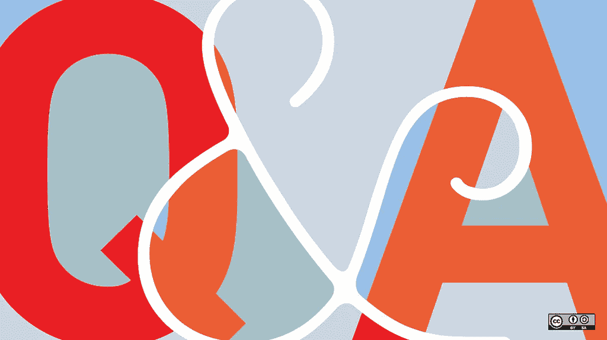

# 加密组件 ERC-998 —更新 6“在野外”

> 原文：<https://medium.com/coinmonks/crypto-composables-erc-998-update-6-in-the-wild-6ece410d263d?source=collection_archive---------4----------------------->

2018 年 9 月 6 日在 NFTy Magicians Discord Voice 频道举行的 Composables 电话会议的回顾。

“[River Wilderness Landscape](https://www.goodfreephotos.com/other-landscapes/river-wilderness-landscape.jpg.php)”

随着几个 DApps 将 ERC-998 应用到他们的游戏中，这些组合现在“在野外”了。在野外，适应和改变的能力意味着只有最强者才能生存。随着更多用例被测试，可组合的 ERC-998 标准变得越来越强大，围绕它的社区也越来越强大。

如果您的 DApp 正在使用或计划实施 ERC-998，我们希望您加入下一次通话！

# 背景和以前的 ERC-998 更新:

[推出加密组件](/coinmonks/introducing-crypto-composables-ee5701fde217)，[ERC-998 更新加密组件😊](/coinmonks/crypto-composables-erc-998-update-1cc437c13664)、[更新#2](/coinmonks/crypto-composables-erc-998-update-2-4b160df79836) 、[更新 3:“第一次接触](/@mattdlockyer/crypto-composables-erc-998-update-3-first-contact-f3930a08636)”、[更新 4:“点名”](https://hackernoon.com/crypto-composables-erc-998-update-4-the-namening-7a05d28f3401)、[更新 5](/coinmonks/crypto-composables-erc-998-update-5-eb0a748a9889)

[NFTy Magicians](https://www.nftymagicians.org/)

# NFTy 魔术师组合的参加者请致电:

*   [BitGuild](https://medium.com/the-notice-board) _Calvin(卡尔文)
*   Dafky2000
*   [下垂|隐色素(布莱恩)](/@brianlburns)
*   表情符号
*   [赫苏莫斯(哈利)](/@haleysummers)
*   詹姆斯·摩根| KnownOrigin.io
*   JOS3PH
*   穆德根(尼克)
*   [娜塔莉-ckc(娜塔莉)](https://www.linkedin.com/in/nathalie-ckc/)
*   隐色素

# **总结**

电话会议首先回顾了 Haley Summers 的最后一次通话，然后是 Nick Mudge 对 ERC-998 标准的更新。来自[cryprome](http://cryptorome.io)的 Brian Burns 和来自 [BitGuild](http://bitguild.io) 的 Calvin 分享了他们在 DApp 游戏中实施 ERC-998 的经验。

Haley Summers

# [回顾上次通话](/coinmonks/crypto-composables-erc-998-update-5-eb0a748a9889) —由来自 [mokens.io](http://mokens.io) 的 Haley Summers 负责

Matt Lockyer 通过建立合作关系和为生态工业园寻找资金来进行反向沟通。[尼克·穆奇](/@mudgen)宣布对 ERC-998 进行重大改动。柏林和 NFTY 以太坊魔术师协会简介。ERC-998 回购现在有麻省理工学院的许可证。DApps 更新自 Mokens.io，Crypto Rome，Mintable，Raxx Token，离心机上 Missingno 的帖子。关于 ERC 未来的问答循环赛-998。

Nick Mudge

# **支持 ERC-998 标准的材料的最新更新—由来自** [**mokens.io**](http://mokens.io) 的 Nick Mudge 领导

自从上次通话以来，ERC-998 标准没有改变，除非有重大理由，否则也不会改变。遍历可能是标准中最复杂的部分，所以决定增加更多关于遍历逻辑(伪代码)的文档。如果有人需要进一步澄清，Nick 希望听到反馈。

# **如何** [**隐色体**](https://www.cryptorome.io/) **是用 ERC-998——由布莱恩·伯恩斯从隐色体中引出的**

[CryptoRome](https://www.cryptorome.io/)

[**隐色简介**](/giglabs/erc-998-and-the-future-of-blockchain-game-assets-9fd1063126cf) **:**
布莱恩一直在 ERC-998 上跟踪马特，并与尼克·穆奇通信。《密码》是第一款使用 ERC-998 代币并分发给玩家的游戏。这些标记代表可组合的土地:可以组合成城镇的村庄，以及可以组合成城市的城镇。2018 年 8 月 31 日星期五，CryptoRome 开始铸造它们&发送给已经购买土地的玩家。

> 隐色术已经接近 5000 枚 ERC-998 代币了。

用了四天时间通过以太坊网络把代币推出去。2018 年 9 月 7 日星期五，市场将上线，玩家将能够使用这些代币进行交易。

[Implementation](http://www.creative-commons-images.com/highway-signs/images/implementation.jpg) Lessons

ERC-998 在 CryptoRome 中的实现经验:Brian 计划撰写关于 ERC-998(自下而上与自上而下)在 CryptoRome 中的实现的博客文章，以帮助其他任何想这样做的人。Brian 的首要建议是看看代币在未来将如何使用。

基于组件如何处理 ERC-721 的主要标准，CryptoRome 采用了自底向上。如果父节点是 ERC-721，请使用自下而上的方法。如果通过枚举跟踪子令牌，请使用自顶向下。因为 CryptoRome 已经有了一种方法来跟踪它们的令牌，所以不需要自顶向下的枚举实现。因为它们是向上扩展的，所以使用了自下而上的方法。

Brian 在合同规模方面遇到了一些麻烦。事后看来，一开始就应该使用代理合同。根据 Nick Mudge 的反馈，合同规模被更小的最终合同所抵消，这使合同变得更小。Brian 还将功能组件化，并使用了编译器优化。

[Next Step — Future](https://pixabay.com/en/shield-directory-forward-step-note-492991/)

【CryptoRome 的下一步:
我们希望看到大规模采用，并需要让 998 在钱包和市场上上市，如[比特币基地](https://www.coinbase.com/dashboard)、[信托钱包](https://trustwalletapp.com/)和 [OpenSea](http://opensea.io) 。它将对游戏社区产生巨大的网络效应。这将允许跨游戏资产更容易发生。一旦 ERC-998 令牌被标准化，以太扫描有望识别它。*

> Nick Mudge 的编者按:当有更广泛的用户采用时，Etherscan 将识别 ERC-998。ERC-998 是稳定的，在以太坊主网上实现。同样，当更广泛采用时，OpenSea 将添加显示 ERC-998 令牌所拥有的 NFT 的功能。

Follow Up [Question and Answers](https://www.flickr.com/photos/opensourceway/5556249000) for CryptoRome

**问&关于隐密的一个后续:** 尼克的问题:“隐密游戏有用户界面来合成地吗？”Brian 的回答:“这个月晚些时候就要发布了。现在，必须转到智能合同来组合/分解。城镇= 4 个合成令牌，城市= 13 个合成令牌。

来自 Calvin 的问题:“大多数游戏使用[元掩码](http://metamask.io)作为登录。您为什么使用常规登录？”
布莱恩的回答:“两者我们都有。我们希望吸引超屏蔽用户和&非超屏蔽用户。外观和感觉明天会改变。我们还将改进登录流程。”

Calvin 的问题:“当您说合同规模变得非常大时，是因为天然气成本，还是因为堆栈太大？你最终减了多少？”【Brian 的回答:“其实是运行时字节码大小，不能超过 24576 否则以太坊网络会屏蔽。你可以用 solc 而不是 truffle 来编译，如果 set optimizes runs 为 1 (truffle 默认为 200 runs)的话会更精简一点。这将增加未来交易的天然气成本。对于不需要访问存储的其他东西，我还将功能组件化到其他合同中。我会建议其他人使用代理。我预计这将导致未来更低的天然气成本，但尚未对此进行测试。”

卡尔文的问题:“你是如何实现元数据的？”【Brian 的回答:“实现了一切:枚举，元数据。名称、描述、图像和其他数据是离线的。如果你遵循元数据标准，你会没事的。”

约瑟夫的问题:“有多少层深？你提到了 13 层深。有什么最佳实践指导吗？”Brian 的回答:“13 个代币只有 3 层深。最下面一层是村庄，接下来是城镇，最上面是城市。你想去多深就去多深。从最顶层节点开始的一次传送只是一次以太坊交易。如果你在智能契约中编写一个递归函数，你不希望超过 1024 的限制。但是，可能不想走那么远。

尼克的问题:“作为一个开发者，实现 ERC-998 有多难？个人观点。”【Brian 的回答:“实现起来很简单，但是您必须首先考虑用例并弄清楚它。既然我对传递函数有了很好的理解，那就没那么糟糕了。对于一个新人来说，这是一个很大的挑战。尤其是在考虑应该自上而下还是自下而上时。”“RootOwnerOf”是一个很难理解的函数。文档非常有用。了解你会如何处理案例 8。希望在一篇博文中补充更多来阐述。”

Nathalie 的问题:“如何将文档添加到项目中，以便 6 个月后来的人知道在哪里可以找到它？有文章散布在不同的博客上。”

尼克、哈利和娜塔莉的评论和回答:提交 ERC-998 SubReddit 的链接，并在回购自述文件中添加 Reddit 的链接。

# 【Bitizens 是如何使用 ERC-998 的——由 Calvin 领衔从 [**BitGuild**](http://bitguild.io/)

[BitGuild](http://bitguild.io/)

**简介** :
Calvin 是 BitGuild 的集成工程师，BitGuild 是一个提供市场和用户登录的加密游戏门户，计划增加功能。他与团队合作，将他们的游戏整合到 BitGuild 门户网站中。卡尔文开始与 Bitizens 团队(一个独立的工作室)讨论将 ERC-998 用于 Bitizens avatar 衣柜的问题，该衣柜刚刚在 BitGuild 上推出。

**ERC-998 在 Bitizens 的实现:** Bitizens 的衣柜:上衣、下装、鞋袜都是 ERC-721/ERC-998 的代币。化身项目还没有在市场上。Bitizens 并不期望化身有太多的交易，而是化身的服装物品的交易。他们为每个服装发布的虚拟形象赠送了一个蓝宝汽车代币。查看[开源合同](https://github.com/BitGuildPlatform/Contracts/tree/master/contracts/bitizens)。

首席技术官，米哈伊尔，是 ERC-998 的早期讨论，是它的大力支持者。最初，Bitizens 试图使用一份合同来拥有不同的代币，然后交易该合同，但使用 ERC-998 要容易得多。最困难的部分是理解什么是可能的，什么是不可能的。

卡尔文计划写一篇中篇文章，介绍他们是如何决定使用自上而下还是自下而上的方法的。选择自上而下的方法是因为主令牌将是 ERC-721 头像。当有更多信息时，我会与 Nick 讨论做一个更具技术性的演示。

# **[**NFTy 魔术师**](https://discord.gg/5vHcaMW) **每月举行例会！我们邀请你加入** [**不和小组**](https://discord.gg/5vHcaMW) **成为 NFT 运动的一份子。****

****编辑并共同编剧:** [娜塔莉陈景才](https://www.linkedin.com/in/nathalie-ckc/)
[尼克·穆奇](/@mudgen)**

> **[直接在您的收件箱中获得最佳软件交易](https://coincodecap.com/?utm_source=coinmonks)**

****