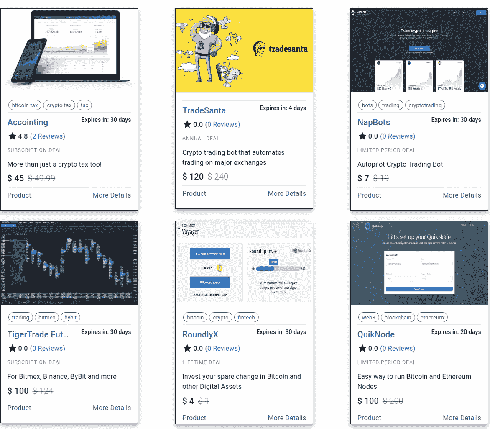
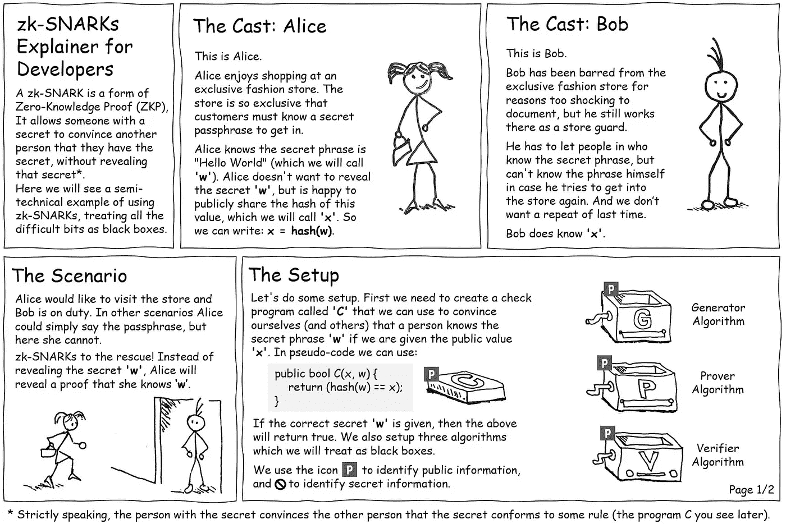

# 加密交易，Reddit 的代币发行，2 万订户…

> 原文：<https://medium.com/coinmonks/crypto-deals-reddits-token-launch-20k-subscribers-2f34148736b8?source=collection_archive---------5----------------------->

## "蜗牛爬富士山
但是要慢，要慢！"— **小林伊萨**

嘿伙计，

我希望你是安全的。让我们开始本周的更新。

两年后，我们发布了 3K+的文章，已经有了 2 万名订户。所以，感谢你订阅 Coinmonks。❤️

## [加密交易](https://coincodecap.com/deals)

本周，我们在 CoinCodeCap 上推出了“[加密交易](https://coincodecap.com/deals)”。所以现在你可以用最便宜的价格买到加密产品。

我们已经为你准备了一些很棒的交易。

*   Napbots 交易机器人享受 63%的折扣，起价 7 美元
*   **TradeSanta**—TradeSanta 交易机器人五折优惠
*   运行以太坊或比特币节点价值 200 美元的计划现在只需要 100 美元
*   **RoundlyX** —使用**“CoinCodeCap”**优惠券，在 crypto 中购买 45 美元或更多后，获得 4 美元的比特币
*   **会计** —加密税务工具 10%的折扣
*   泰格贸易——在那里最好的交易终端上优惠 24 美元

> [**现在访问所有秘密交易**](https://coincodecap.com/deals) **并在这里阅读关于秘密交易******。****

**

CoinCodecap Crypto Deals** 

## **BlockConf 数字 2020**

**查看完整的 8 小时不间断在线会议完整网络体验。 [***在这里注册。*T38**](https://www.blockconf.digital/#register)**

## **凯尔·埃利科特的最新消息**

*   **[Reddit 的大规模加密货币行动是一次令人兴奋的测试](https://decrypt.co/28780/reddits-big-cryptocurrency-move-is-an-exciting-test)**
*   **[太空中的比特币:Blockstream 的卫星网络现在快了 25 倍](https://cointelegraph.com/news/bitcoin-in-space-blockstreams-satellite-network-now-25x-faster)**
*   **[美国国会考虑在新冠肺炎进行基于区块链的投票](https://cointelegraph.com/news/us-congress-considers-blockchain-based-voting-amid-covid-19)**
*   **[中国电信:区块链对 5g 有重要的用例](https://cointelegraph.com/news/china-telecom-blockchain-has-significant-use-cases-for-5g)**
*   **[IBM、默克宣布 FDA 支持的药品追踪区块链成功](https://www.coindesk.com/ibm-merck-declare-fda-backed-drug-tracing-blockchain-a-success)**
*   **[绕过电报，开发者和验证者推出吨闭塞柴](https://www.coindesk.com/sidestepping-telegram-devs-and-validators-launch-fork-of-ton-blockchain) n 叉**
*   **[雅达利合作为代币采用铺平道路](https://cointelegraph.com/news/atari-partnership-paves-way-for-token-adoption)**
*   **[中国央行提出基于区块链的贸易融资平台](https://cointelegraph.com/news/chinas-central-bank-proposes-a-blockchain-based-trade-finance-platform)**
*   **[量子计算机可能在 2022 年破解比特币](https://decrypt.co/28560/quantum-computers-could-crack-bitcoins-encryption-by-2022)**
*   **[针对抵押品支付提议的类似 Spotify 的订阅模式](https://cointelegraph.com/news/spotify-like-subscription-model-proposed-for-collateral-payments)**
*   **[Crypto Startup School Back:Videos Now Live](https://a16z.com/2020/05/13/crypto-startup-school-online/)**
*   **[在冠状病毒封锁期间，分散应用难以成为主流](https://decrypt.co/27179/decentralized-apps-struggle-to-go-mainstream-amid-coronavirus-lockdown)**
*   **[闪电 2020:异端 Web3 开发者工具包](https://multicoin.capital/2020/05/05/lightning-2020-a-toolkit-for-heretical-web3-developers/)**
*   **运营 dapps 的区块链项目 NEAR 表示，它完成了一笔由安德森·霍洛维茨牵头的价值 2160 万美元的代币销售**
*   **[中国 Nervos 启动 500 万美元孵化器寻找杀手 dapp](https://decrypt.co/27928/nervos-china-incubator-blockchain)**

## **好的读物**

*   **美元能产生美分吗？——[尼尔森](https://medium.com/u/d8bc16a481f6?source=post_page-----2f34148736b8--------------------------------)**
*   **【2020 年比特币的状态**
*   **[降价:一位分析师](/coinmonks/decred-price-a-seasonality-study-414bac98bc99)[的季节性研究](https://medium.com/u/4af33197a9d?source=post_page-----2f34148736b8--------------------------------)**
*   **[BTC 投资资本和 S2F 模式](/coinmonks/btc-invested-capital-and-the-s2f-model-e537f85b2928)——[Aat de kwaustenie](https://medium.com/u/7bc3039e97ce?source=post_page-----2f34148736b8--------------------------------)**
*   **[显微镜下的比特币网络减半后的杂凑率](/coinmonks/the-bitcoin-networks-post-halving-hash-rate-under-the-microscope-3ba255ad43b9)——[token insight](https://medium.com/u/2b1ef783974d?source=post_page-----2f34148736b8--------------------------------)**
*   **美国大甩卖:让美国再次变得廉价**
*   **[我如何在 2020 年 3 月的比特币崩盘中损失了 30.000 美元](/coinmonks/how-i-lost-30-000-in-the-march-2020-bitcoin-crash-9b435a3d2a45)——[卡特迈](https://medium.com/u/5cd3a658183f?source=post_page-----2f34148736b8--------------------------------)**

**[一个零知识证明(ZKP)在一幅漫画中解释](/coinmonks/a-zero-knowledge-proof-zkp-explained-in-a-cartoon-df8b84cff394)——[凯文·斯莫尔](https://medium.com/u/1546c399b2d2?source=post_page-----2f34148736b8--------------------------------)**

****

**加入我们的 [***电报频道***](https://t.me/joinchat/FyuZERD5oyp6LWbwLASOKQ)*来谈论新的加密产品和区块链生态系统。***

*   ***如果你经营一家公司，请填写 [**这份由**](https://www.surveymonkey.com/r/remote_working_crypto_survey_covid19) **[LaborX](https://laborx.com/) 团队进行的** 调查，了解当前的疫情对你的业务的影响。***
*   ***你们检查过 [PaymentX](https://paymentx.io/?utm_source=coinmonks) 发票工具吗？让我知道你的经历如何。***

> ***[直接在您的收件箱中获得最佳软件交易](https://coincodecap.com/?utm_source=coinmonks)***

******

## ***在 Coinmonks 上发布***

***如果你喜欢在 crypto/区块链空间上写教育文章，并且想在 Coinmonks 出版物上发表。只需发邮件给我**或者 DM 我**[***推特***](https://twitter.com/coinmonks)*****

> *****“我们是一个非宣传性和非营利性的教育出版物，如果您喜欢阅读*[*coin monks*](https://medium.com/coinmonks)*[*您也可以捐助我们*](/coinmonks/monks-need-your-help-7440418d67ec) *。******

********暂时就这样，送我❤️，下次再说。********