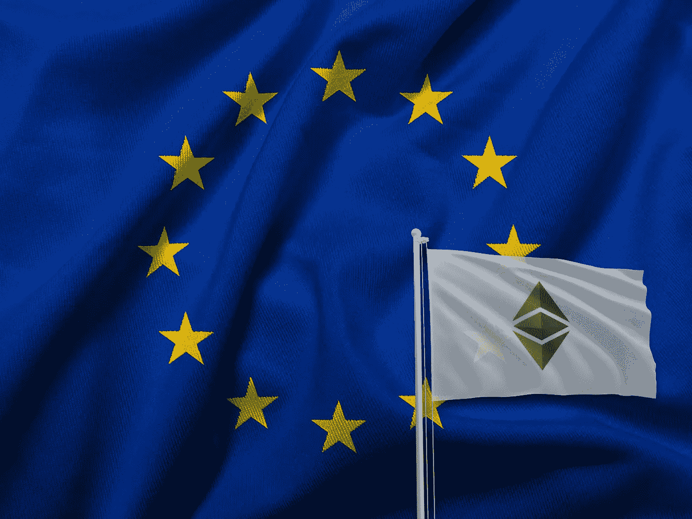
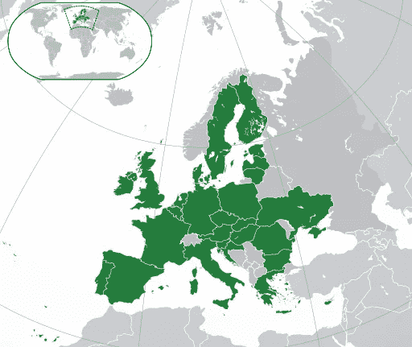

# 加密深潜:欧洲和英国

> 原文：<https://medium.com/coinmonks/crypto-deep-dive-europe-and-the-uk-9c81aeace147?source=collection_archive---------10----------------------->

比特币和以太坊等加密货币挑战了权贵和富人拥有的动态金融结构，使加密可能成为我们这个时代最有趣的话题之一。对于其支持者来说，加密几乎就像一个象征性的正义联盟，比特币扮演蝙蝠侠，以太坊扮演超人。背景是一场反对监管、争取数字和金融自由的持续战争。当然，坏人是大银行、政府和华尔街。战争进展如何？老实说，超人和蝙蝠侠正在赢得一些巨大的战斗！

然而，无论我有多爱蝙蝠侠，我担心联盟还没有一个坚实的答案来应对世界范围内的政府监管和集权战略，这最终可能会让他们输掉这场战争。在过去的两周里，我向大家展示了亚洲大陆和美洲目前正在发生的事情，因为它涉及到加密货币和即将到来的政府对所有数字货币的集中化，以及在某些情况下的加密禁令。

我们已经看到中国在那段时间关闭了所有的加密活动和采矿，萨尔瓦多承认比特币为合法货币，却遭到了令人惊讶的差评和公民抗议。在我看来，去中心化的数字货币落入政府监管的保护伞之下只是时间问题，可能是几个月，也可能是几年。

但是今天，正义联盟就像铁氟龙一样。自从中国禁止加密比特币以来，T2 已经从 8 月份的 47000 美元飙升至 63000 美元！以太坊增长更快，市场价值即将超过比特币，被誉为[的轻浮的](/coinmonks/the-flippening-what-it-is-and-why-it-matters-63e22486ca44)！普通的美国人、墨西哥富裕的贩毒集团和新加坡的新兴加密交易所正在为超人和蝙蝠侠的胜利而疯狂。收益是巨大的，当然，洗钱活动也在增加。

这就把我们带到了最后的区域分析，欧洲和英国。

## **欧洲&英国**

Image credit: cryptovalley.swiss

**瑞士:**你知道吗，瑞士一个昵称为 [Crypto Valley](https://cryptovalley.swiss/) 的小镇是比特币、以太坊、比特币瑞士、Consensys 和其他专注于加密的创业公司的公司总部所在地？

楚格的创业公司集体价值超过 400 亿美元！在瑞士，加密技术炙手可热，但楚格就像一个分散的数字货币天堂。例如，在 Zug，crypto 可用于各种市政服务，如交通，甚至纳税。

瑞士政府正在以一种独特而明智的方式帮助这个蓬勃发展的行业。最近，瑞士发起了一场运动，通过修改一些现有的法律来使加密更有吸引力，从而使瑞士的区块链产业“贵族化”。

“市场已经成熟，法律框架已经到位，许可证正在发放，一系列新的金融产品正在产生，”[凯蒂·理查兹说，](https://www.swissinfo.ch/eng/switzerland-takes-on-challenge-of-gentrifying-cryptocurrencies/47012122)一位瑞士女发言人与总部设在荷兰的[赛博资本](https://www.cybercp.com/)合作，这是一家加密货币投资基金。“瑞士正变得越来越具有创新性和竞争力。我们不断吸引其他国家的新公司。”

让美好时光滚滚向前！

**乌克兰:**这个东欧国家被一些人预测将成为下一个萨尔瓦多，因为它可能是下一个[让比特币成为法定货币的国家](https://www.notebookcheck.net/Ukraine-could-soon-become-the-second-country-to-adopt-Bitcoin-as-legal-tender.561547.0.html)。比特币目前在乌克兰是合法的、受监管的，该国处于有利地位，可以占据中国最近关闭的加密采矿业务的很大一部分。加密货币可能会在乌克兰蓬勃发展，在这个国家，洗钱一直是家族生意的一部分。乌克兰成为数字洗钱活动最猖獗的国家之一只是时间问题。

**英国:**英国在加密货币方面采取了与美国类似的立场，即其公民可以自由投资加密货币，它没有计划在短期内禁止加密货币，目前正在研究发行一种受监管的中央政府发行的硬币，称为[英国硬币](https://todayuknews.com/finance/bank-of-england-sees-flood-of-applicants-who-want-to-debate-britcoin/)。话虽如此，英国尤其落后于美国、加拿大、德国等其他世界强国，这些国家都在美国授权了 ETF 比特币等加密衍生品。衍生品为投资者提供了更好的产品选择，同时也让政府有机会实施更严格的货币监管。

> “对加密过于谨慎的做法，非但没有提升英国作为全球金融中心的地位，反而限制了英国在这个快速增长的革命性市场中分得一杯羹的能力。”[CryptoUk 执行董事伊恩·泰勒向英国《金融时报》表示。](https://www.ft.com/content/6e79e3e0-c7c9-4577-998c-5c79d24cf1d2)

我认为上面提供的例子与本系列中的其他全球地区是一致的，因为没有一致性。世界上每个国家在加密货币方面的做法确实因国家而异。这就是为什么这个秘密故事如此流畅，如此激动人心，但也令人困惑。底线是，加密目前是一项热门投资，但如果世界各国政府开始集中、监管并在某些情况下彻底禁止加密货币，它将面临暗淡的未来。

表示“受到某种对待的人”:dividend | reverend

> 加入 Coinmonks [电报频道](https://t.me/coincodecap)和 [Youtube 频道](https://www.youtube.com/c/coinmonks/videos)了解加密交易和投资

## 也阅读

 [## 最佳加密交易所| 2021 年十大加密货币交易所

### 编辑描述

blog.coincodecap.com](https://blog.coincodecap.com/crypto-exchange)  [## 2021 年 10 大最佳加密贷款平台| CoinCodeCap

### 编辑描述

blog.coincodecap.com](https://blog.coincodecap.com/crypto-lending)  [## 2021 年最佳免费加密交易机器人

### 2021 年币安、比特币基地、库币和其他密码交易所的最佳密码交易机器人。四进制，位间隙…

medium.com](/coinmonks/crypto-trading-bot-c2ffce8acb2a)  [## 最佳 4 个加密交易信号电报通道

### 这是乏味的找到正确的加密交易信号提供商。因此，在本文中，我们将讨论最好的…

medium.com](/coinmonks/best-crypto-signals-telegram-5785cdbc4b2b)  [## BlockFi 评论 2021:利弊和利率| CoinCodeCap

### 编辑描述

blog.coincodecap.com](https://blog.coincodecap.com/blockfi-review)  [## 如何在印度购买比特币？2021 年购买比特币的 7 款最佳应用[手机版]

### 如何使用移动应用程序购买比特币印度

medium.com](/coinmonks/buy-bitcoin-in-india-feb50ddfef94)  [## 加密税务软件——五大最佳比特币税务计算器[2021]

### 不管你是刚接触加密还是已经在这个领域呆了一段时间，你都需要交税。

medium.com](/coinmonks/best-crypto-tax-tool-for-my-money-72d4b430816b)  [## 存储比特币的最佳加密硬件钱包[2021] | CoinCodeCap

### 编辑描述

blog.coincodecap.com](https://blog.coincodecap.com/best-hardware-wallet-bitcoin)  [## Pionex 评论 2021 |免费加密交易机器人和交换

### Pionex 是为交易自动化提供工具的后起之秀。Pionex 上提供了 9 个加密交易机器人…

medium.com](/coinmonks/pionex-review-exchange-with-crypto-trading-bot-1e459d0191ea)