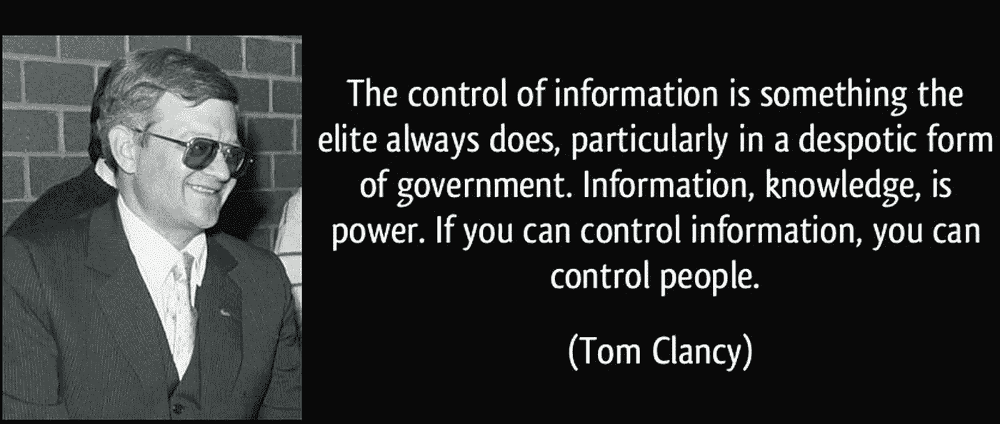

# 秘密教育&新投资者的错误认知

> 原文：<https://medium.com/coinmonks/crypto-education-the-wrong-perception-of-new-investors-4751e1a4c475?source=collection_archive---------1----------------------->

*Lead Image from:* [*Unsplash*](https://unsplash.com/photos/bzdhc5b3Bxs)*, by* [*Teemu Paananen*](https://unsplash.com/@xteemu) *(modified)*

世界各地对加密货币投资的积极情绪日益增长，尽管对加密货币的核心特征也存在过度的无知。加密传播者大多是 BTC 的基金经理，他们只关心交换价值以及如何推动机构采用加密货币，可能并不了解加密货币的基本特征。

可悲的是，我们观察到对加密货币的无许可特性的讨论故意缺席，这导致了真正采用的停滞。

相反，我们在屏幕上看到像迈克尔·塞勒这样的人在推动一项“投资”议程，最终将所有的密码交给监管者的突发奇想。

绝大多数新人不太明白你银行里的钱不属于你，也从来不明白财务自由的概念。同样的新来者仍然没有弄清楚持有私人钥匙、使用非保管钱包的重要性，以及 KYC 的危险。

我记得我 2017 年加入的时候，一些正派的人在努力教育新人。现在，只有投机者和交易者在谈论投资、投资回报率、交易和价格，而对技术本身一无所知。太多这些无用的盛况使得 crypto 成为了 PayPal 2.0。

在这篇文章中，我讨论了这些主题，因为除了今年数百万新加入加密的人之外，还有很高比例的投资者和投机者进入了之前的牛市，但仍然很少了解加密货币的去中心化或审查抵抗功能的重要性。

## 加密的采用是稳健的，但出于错误的原因

*Image from* [*Unsplash*](https://unsplash.com/photos/KQBE5nFh30k)

每个进入加密领域的人都是出于投资目的。除了加密货币之外，DeFi 的崛起并没有包括任何其他资产类别，因此它仍然与实体经济无关。

我们经常讨论财务自由或财务独立这个词，但是让我问你，这些词对你来说意味着什么？

你有没有想过，我们不是在谈论投资，投资回报率，年利率，或任何形式的利润投资于加密作为资产？

因为这是一个普遍的误解。财务自由并不意味着你会通过投资 crypto 而暴富。这并不意味着你将有辞掉工作，在热带岛屿上退休的自由。

可悲的是，这就是基金经理对自由的理解。拥有更多的菲亚特。就我所见，这个领域的很多人都是这样理解这个概念的。

## 财务自由是我们的私人钥匙

金融自由是加密货币给予世界各地每个人的自由，让他们可以在没有中间人的情况下转移资金。在区块链世界里没有拒绝代码。

这不是中央集权的银行窃国体系。我们谈论的是绝对的自由，你可以用你的钱做任何你想做的事情，而不需要征得同意。

除了你，没人能控制你的密码。我们拥有的密码不在我们的钱包里。它们在区块链里面，钱包只能用来移动它们。如今，我们有越来越多的保管钱包作为选择，甚至更完全的集中投资选择，提供加密货币，但不允许访问移动硬币。这些硬币不是你的。

你是在 Robinhood 还是 Revolut 买的 Dogecoin？不是你的狗。

你是通过 PayPal 还是 Square 买的比特币？不是你的比特币。

私人密钥让您可以访问您的加密财富。不是你的罗宾汉密码。你买的任何东西，如果还放在保管兑换钱包里，都不是你的。只有当你把它转移出去的时候，它才成为你的，在一个你拥有私人钥匙的非保管钱包里。

## 政府正在加强控制

*Image from* [*Quotemaster*](https://www.quotemaster.org/government+control#&gid=1&pid=5)

政府现在正在推动立法，以采用 KYC 合规和托管功能，并禁止任何其他服务，让您的资金。

比特币的快速扩张导致了品牌名称被 Blockstream 劫持，规模开发停滞，取而代之的是第二层解决方案的开发。正如我们今天在 Strike 和萨尔瓦多的例子中看到的那样，BTC 版本的比特币很快将与白皮书的最初愿景无关。

*   不是 P2P 而是 Layer-2。
*   没有对私钥的控制，而是集中的第二层网络。
*   LN 中心的集中化
*   KYC/反洗钱合规，匿名不是一个选项
*   中间人没有被除掉
*   Strike 和其他类似的 LN 钱包与 PayPal 没有区别
*   审查制度而不是抵制审查制度，
*   通过集中控制权授权交易

除非交易由集中的金融中心管理，否则 Crypto 不符合政府征税和大规模监控的目的。Musk 了解 PayPal，并且愿意将 crypto 转变为 PayPal 2.0。

您的数据必须与姓名相关联，无论银行转帐到交易所时是否已经发生了这种情况。由于区块链的复杂性和各种混淆机制，政府将需要运行区块链分析的巨大成本，他们不喜欢这样。

相反，在多尔西和马斯克等“企业家”的帮助下，政府已经有了一个更简单的解决方案，实施监管钱包和服务，这将降低监控成本，增加权力和控制。

由于这些机构要求 BTC 变得更加规范，BTC 社区似乎同意任何事情，甚至没有质疑。

**关注我:**

*●*[***read cash***](https://read.cash/@Pantera)*●*[***noise cash***](https://noise.cash/u/Pantera99)*●*[***Medium***](/@panterabch)*●*[***Hive***](https://hive.blog/@pantera1)*●*[***Steemit【t】***](https://steemit.com/@pantera1)

*●* [***推特***](https://twitter.com/Panterabch)*●*[***LinkedIn***](https://www.linkedin.com/in/panterabch/)**●*[*Reddit*](https://www.reddit.com/user/PanteraBCH)*

**原发布于*[*https://read . cash*](https://read.cash/@Pantera/crypto-education-and-the-wrong-perception-of-newcomers-40cd6165)*。**

> *加入 [Coinmonks 电报频道](https://t.me/coincodecap)，了解加密交易和投资*

## *另外，阅读*

*   *[什么是保证金交易](https://blog.coincodecap.com/margin-trading) | [美元成本平均法](https://blog.coincodecap.com/dca)*
*   *[BigONE 交易所评论](/coinmonks/bigone-exchange-review-64705d85a1d4) | [电网交易 Bot](https://blog.coincodecap.com/grid-trading)*
*   *[3 商业评论](/coinmonks/3commas-review-an-excellent-crypto-trading-bot-2020-1313a58bec92) | [Pionex 评论](/coinmonks/pionex-review-exchange-with-crypto-trading-bot-1e459d0191ea) | [Coinrule 评论](/coinmonks/coinrule-review-2021-a-beginner-friendly-crypto-trading-bot-daf0504848ba)*
*   *[莱杰 vs n rave](/coinmonks/ledger-vs-ngrave-zero-7e40f0c1d694)|[莱杰 nano s vs x](/coinmonks/ledger-nano-s-vs-x-battery-hardware-price-storage-59a6663fe3b0) | [币安评论](/coinmonks/binance-review-ee10d3bf3b6e)*
*   *[Bybit Exchange 审查](/coinmonks/bybit-exchange-review-dbd570019b71) | [Bityard 审查](https://blog.coincodecap.com/bityard-reivew) | [CoinSpot 审查](https://blog.coincodecap.com/coinspot-review)*
*   *[3 commas vs crypto hopper](/coinmonks/3commas-vs-pionex-vs-cryptohopper-best-crypto-bot-6a98d2baa203)|[赚取加密利息](/coinmonks/earn-crypto-interest-b10b810fdda3)*
*   *最好的比特币[硬件钱包](https://blog.coincodecap.com/best-hardware-wallet-bitcoin) | [BitBox02 回顾](/coinmonks/bitbox02-review-your-swiss-bitcoin-hardware-wallet-c36c88fff29)*
*   *[BlockFi vs 摄氏度](/coinmonks/blockfi-vs-celsius-vs-hodlnaut-8a1cc8c26630) | [Hodlnaut 审核](/coinmonks/hodlnaut-review-best-way-to-hodl-is-to-earn-interest-on-your-bitcoin-6658a8c19edf) | [KuCoin 审核](https://blog.coincodecap.com/kucoin-review)*
*   *[Bitsgap 审查](/coinmonks/bitsgap-review-a-crypto-trading-bot-that-makes-easy-money-a5d88a336df2) | [Quadency 审查](/coinmonks/quadency-review-a-crypto-trading-automation-platform-3068eaa374e1) | [Bitbns 审查](/coinmonks/bitbns-review-38256a07e161)*
*   *[加密复制交易平台](/coinmonks/top-10-crypto-copy-trading-platforms-for-beginners-d0c37c7d698c) | [Coinmama 评论](/coinmonks/coinmama-review-ace5641bde6e)*
*   *[印度的加密交易所](/coinmonks/bitcoin-exchange-in-india-7f1fe79715c9) | [比特币储蓄账户](/coinmonks/bitcoin-savings-account-e65b13f92451)*
*   *[OKEx vs KuCoin](https://blog.coincodecap.com/okex-kucoin) | [摄氏替代度](https://blog.coincodecap.com/celsius-alternatives) | [如何购买 VeChain](https://blog.coincodecap.com/buy-vechain)*
*   *[币安期货交易](https://blog.coincodecap.com/binance-futures-trading)|[3 commas vs Mudrex vs eToro](https://blog.coincodecap.com/mudrex-3commas-etoro)*
*   *[加密套利](/coinmonks/crypto-arbitrage-guide-how-to-make-money-as-a-beginner-62bfe5c868f6)指南| [如何做空比特币](/coinmonks/how-to-short-bitcoin-568a2d0b4ae5)*
*   *[币安交易机器人](/coinmonks/binance-trading-bots-d0d57bb62c4c) | [OKEx 评论](/coinmonks/okex-review-6b369304110f) | [Atani 评论](https://blog.coincodecap.com/atani-review)*
*   *[最佳加密交易信号电报](/coinmonks/best-crypto-signals-telegram-5785cdbc4b2b) | [MoonXBT 评论](/coinmonks/moonxbt-review-6e4ab26d037)*
*   *[Godex.io 审核](/coinmonks/godex-io-review-7366086519fb) | [邀请审核](/coinmonks/invity-review-70f3030c0502) | [BitForex 审核](https://blog.coincodecap.com/bitforex-review)*