# 最佳加密交易所—2023 年十大加密货币交易所

> 原文：<https://medium.com/coinmonks/crypto-exchange-dd2f9d6f3769?source=collection_archive---------0----------------------->

在加密货币交易所交易需要了解市场，这可以帮助你获得利润。在开始你的交易之旅之前，首先，你需要知道什么是加密货币。

# 什么是加密货币？

加密货币是一种新的资产类别，只以数字形式存在，由区块链技术驱动。你可以像股票和商品一样交易加密货币。

没有中央机构发行加密货币。[区块链](https://coincodecap.com/what-is-blockchain-a-simple-guide-for-dummies)帮助记录和管理交易。也是技术催生了加密货币。

所有记录都受到保护，并使用强大的加密技术存储在分布式账本中。

现在你知道了什么是加密货币，你需要知道你可以在哪里使用加密货币来获利。

# 什么是加密货币交易所？

简单地说，加密交易所允许你买卖加密资产。

加密货币交易所通过充当中介，方便用户进行资产交易。并通过交易手续费赚取利润。

在本文中，我们将根据多个参数来研究排名前 10 位的加密货币交易所。

# 摘要

> **查表**[此处](https://blog.coincodecap.com/crypto-exchange#Summary) **。**

[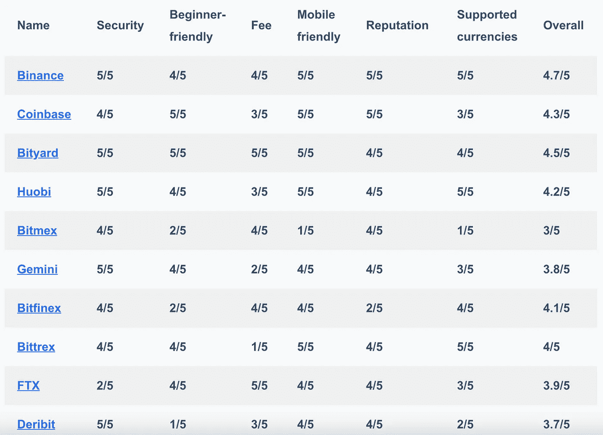](https://blog.coincodecap.com/crypto-exchange#Summary)

**Check Table** [**here**](https://blog.coincodecap.com/crypto-exchange#Summary)**.**

> 我们开办了一个密码信号频道，如果你有兴趣请在这里加入****。****

# **10 大最佳加密交易所**

**要投资加密市场，首先你需要了解提供服务的各种加密交换平台。因此，让我们列出十个最好的加密货币交易平台。**

# **1.[币安](https://www.binance.com/en/register?ref=UARTH1S1)**

## **什么是**币安**？**

**“二元+金融”是造就币安的两个词。 [**币安**](https://www.binance.com/en/register?ref=UARTH1S1) 是一个提供交易平台和各种加密货币相关服务的加密交易所。**

**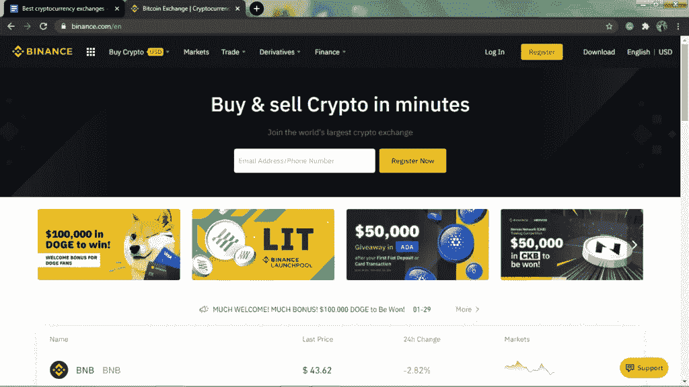**

**2018 年 1 月，币安成为全球交易量最大的交易所。现在是 2021 年，这个交流平台仍然设法保持了它在顶部的位置。**

**币安不仅提供交易服务，还帮助用户学习区块链和加密知识。**

## **币安位于哪里？**

**币安的起源可以追溯到中国，尽管由于中国政府禁止加密货币，他们不得不转移公司。币安目前在日本运营。**

## **币安的现货和保证金交易**

****现货交易:币安**提供多种现货交易功能。用户可以在多个界面中选择，新手和专业交易者都可以。**

**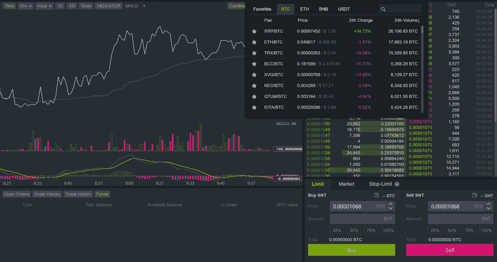**

****保证金交易:**用户可以在一些可用的硬币上以高达 10 倍的杠杆进行交易。**

## **如何从币安撤出？**

**一旦你成为币安的注册用户并开始交易，你需要不时地取款。**

**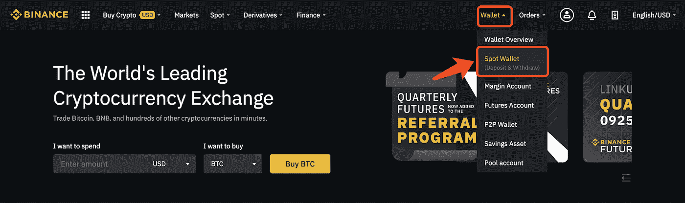**

**币安允许在登录你的账户后轻松取款，然后你可以点击现货钱包按钮。**

**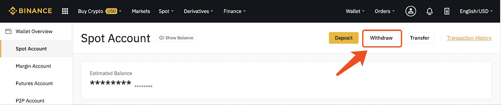**

**您必须点击取款按钮才能进行交易。**

## **币安费**

**币安对每笔交易收取 0.1%的交易费。然而，他们对存款不收取任何费用，对取款收取 0.0004 BTC。**

**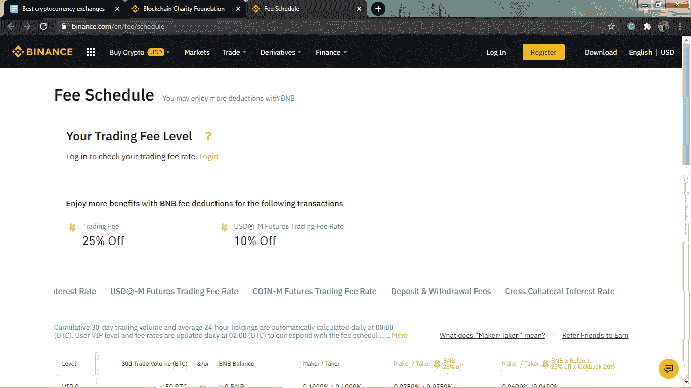**

**币安为其用户在交易时使用币安币提供 25%的折扣。**

## **币安有多安全？**

**[**币安**](https://www.binance.com/en/register?ref=UARTH1S1) 是最大的密码交易所；因此，安全性是一流的。他们为您提供 24x7 全天候支持，每秒钟处理超过 1，400，000 笔交易。**

## **币安:利弊**

**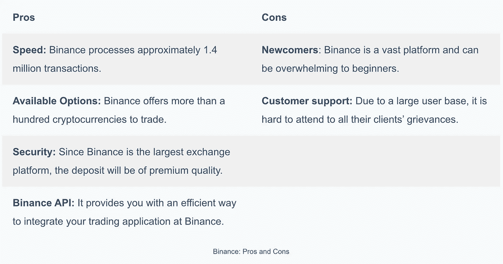**

**希望学习如何使用币安或如何在币安交易？去看看我们关于比较[币安和 Pionex](https://coincodecap.com/pionex-vs-binance?utm_source=rss&utm_medium=rss&utm_campaign=pionex-vs-binance) 的终极指南。**

# **2.[比特币基地](https://coinbase-consumer.sjv.io/7mbkNg)**

## **什么是**比特币基地**？**

**比特币基地是世界上最广泛的加密货币交易平台之一。它在 100 多个国家和 4300 多万已验证用户中可用。它是美国最受欢迎的密码交易所。**

**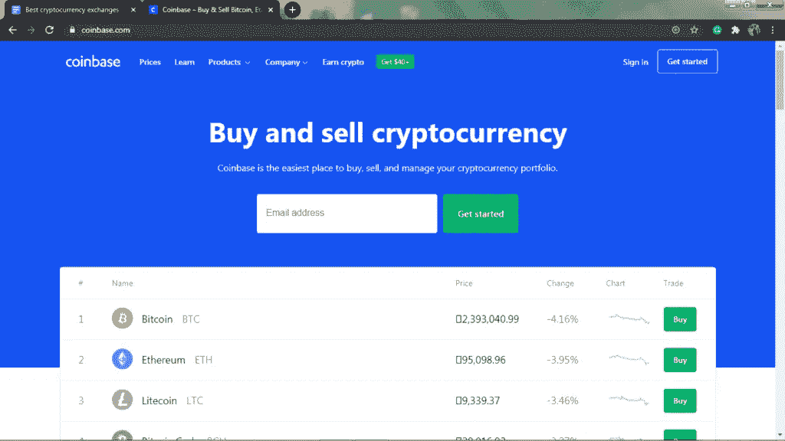**

**由于其简单易用的界面，比特币基地被认为是初学者的完美平台。**

## **比特币基地位于哪里？**

**比特币基地于 2012 年首次出现在美国加利福尼亚州的旧金山。比特币基地的总部仍然在旧金山。然而，现在它在美国多个城市都有办事处。**

## **如何使用比特币基地？**

**[**比特币基地**](http://blog.coincodecap.com/go/coinbase) 可以从任何设备访问，但它是一个完整的基于浏览器的平台。首先，你需要在交易平台上创建你的账户，然后存入金额开始交易。**

**首次登录时，您将看到一个购买加密货币的选项，这将启动您的加密货币之旅。**

## **什么是比特币基地职业？**

**[**比特币基地**](https://coinbase-consumer.sjv.io/VLeLj) 是美国最受欢迎的交易平台。不过，它附带的功能有限，对初学者来说很友好。同时，[比特币基地 Pro](https://coinbase-consumer.sjv.io/7mbkNg) 提供了一个强大的数字加密交易平台。**

**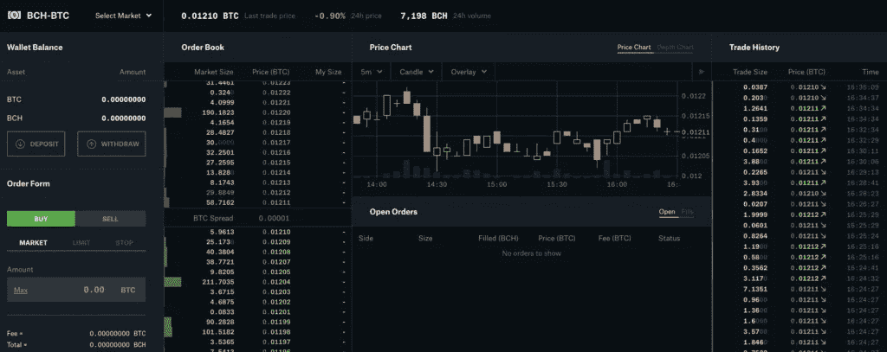**

**一旦你准备好独自完成所有事情，[比特币基地 Pro](https://coinbase-consumer.sjv.io/7mbkNg) 为你提供了一个更低佣金的选择。它还有机会进行保证金交易，还能让用户以更低的手续费进行额度设定、交易和止损。**

## **比特币基地存款和加密货币支持**

**比特币基地不仅接受加密货币，还允许您以法定货币进行存款。此外，比特币基地允许你购买和出售硬币从您的借记卡或信用卡甚至银行帐户。**

## ****比特币基地**费**

**比特币基地有一个非常复杂的费用结构，也是非常高，如果你不是比特币基地亲用户。比特币基地收取的费用取决于购买价值、支付方式，甚至地点。**

**以下是比特币基地在美国收取费用的概况:**

**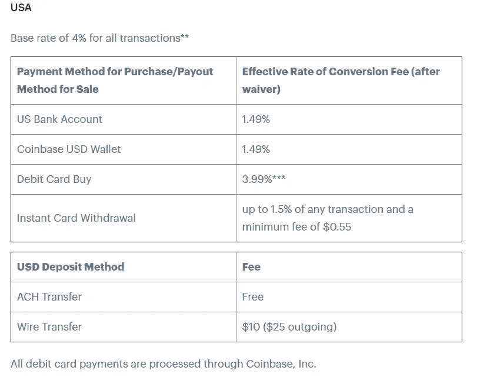**

## **比特币基地有多安全？**

**比特币基地使用的是高级安全功能，你所需要做的就是从你这边维护安全。比特币基地提供生物识别安全、两步验证和保险，以防比特币基地出现漏洞。但是，如果您执行任何粗心大意的行为，则此保险无效。**

**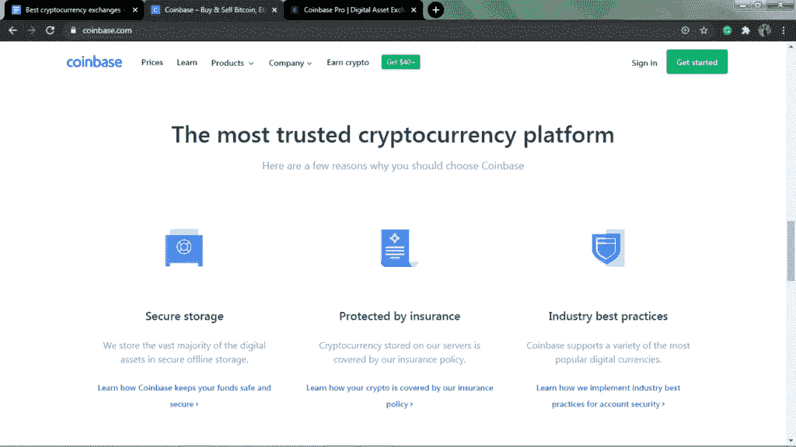**

**[比特币基地](https://coinbase-consumer.sjv.io/7mbkNg)将用户几乎所有的资金存储在冷藏中心，保护用户免受黑客攻击。**

## **比特币基地利弊**

**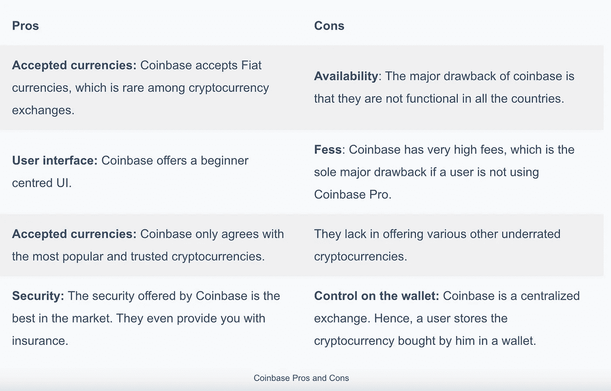**

## **什么是比特币基地钱包？**

**比特币基地还向其用户提供了一个加密钱包。你可以通过阅读我们详细的[比特币基地钱包](https://coincodecap.com/coinbase-wallet-review-the-best-bitcoin-wallet)回顾了解更多。**

# **3. [Bityard](https://www.bityard.com/?ru=zPe4QC)**

## **什么是 Bityard？**

****Bityard** 是世界上最好的加密货币合约交易所之一。凭借其易于使用的界面和即时注册流程，Bityard 是一个初学者友好的加密货币交易平台。**

**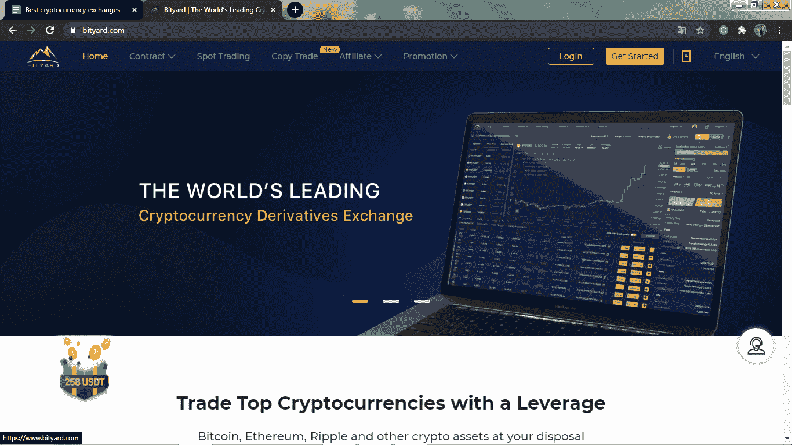**

**[**Bityard**](https://www.bityard.com/?ru=zPe4QC) 是寻求接触加密市场的交易者的完美平台。因为它为用户提供了最快的交易之一。它还能在一秒钟内完成一百万笔交易。**

## **Bityard 位于哪里？**

**Bityard 于 2019 年在新加坡成立，监管其在新加坡的所有交易。**

**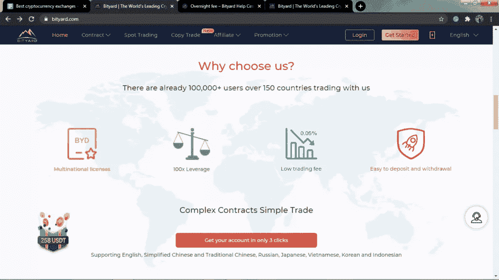**

**然而，Bityard 在 150 多个国家提供服务，远比许多大型交易平台重要。**

## **如何使用 Bityard？**

**[**Bityard**](https://www.bityard.com/?ru=zPe4QC) 提供了一个最基本且易于使用的接口。首先，你需要完成注册过程，然后存入一定金额，开始在 Bityard 进行交易。**

**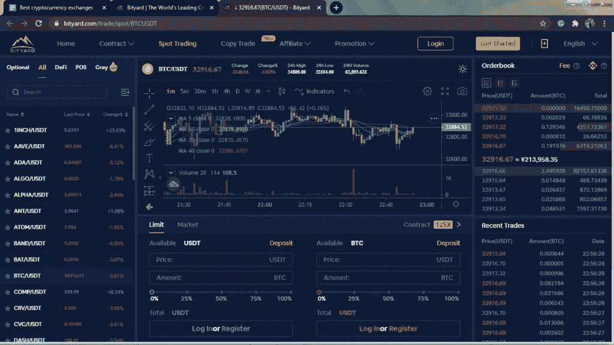**

**Bityard 提供传统的加密货币合约交易以及复制交易。[**Bityard**](https://coincodecap.com/bityard-copy-trading)的复制交易对新手来说是了解市场和发展交易技巧的绝佳机会。**

## **什么是复制交易？**

**复制交易允许你复制专业交易者的交易策略。要了解更多关于 Bityard 复制交易的信息，请阅读我们的[Bityard 复制交易终极指南](https://coincodecap.com/bityard-copy-trading)。**

**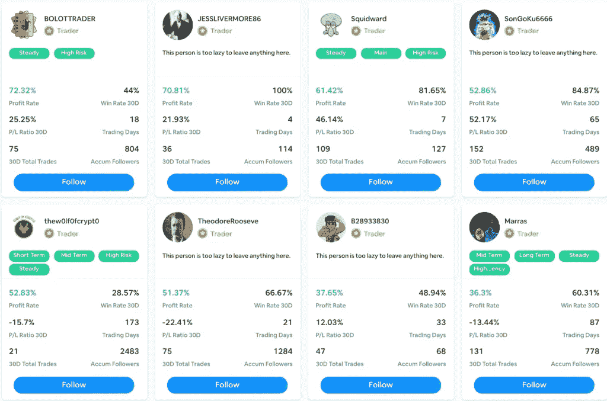**

## **比特币储蓄和加密货币支持**

**Bityard 以两种重要形式吸收存款。你可以从你的加密钱包中转账存入资金，或者使用你的 VISA 或 Mastercard 购买 USDT。**

**然而，如果你是 Mainland China 人、印尼人或越南人，你还有第三个选择。Bityard 提供接受来自这些位置的用户的菲亚特。**

## **比特码费用**

**Bityard 提供 5 USDT 的浅层交易入口，收取 0.05%的货币兑换费。**

**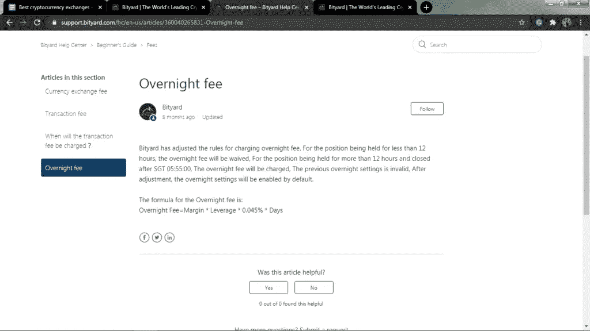**

**但是，以下公式可以确定开盘价和收盘价:**

**(保证金*杠杆* 0.05%)**

## **Bityard 安全吗？**

**许多加密货币合约交易所都属于一个司法管辖区。但是，Bityard 不一样；它隶属于四个司法管辖区，由以下机构管理:**

*   **美国货币服务**
*   **爱沙尼亚对欧盟的中期审查**
*   **澳大利亚的 AUSTRAC**
*   **新加坡人 ACRA**

**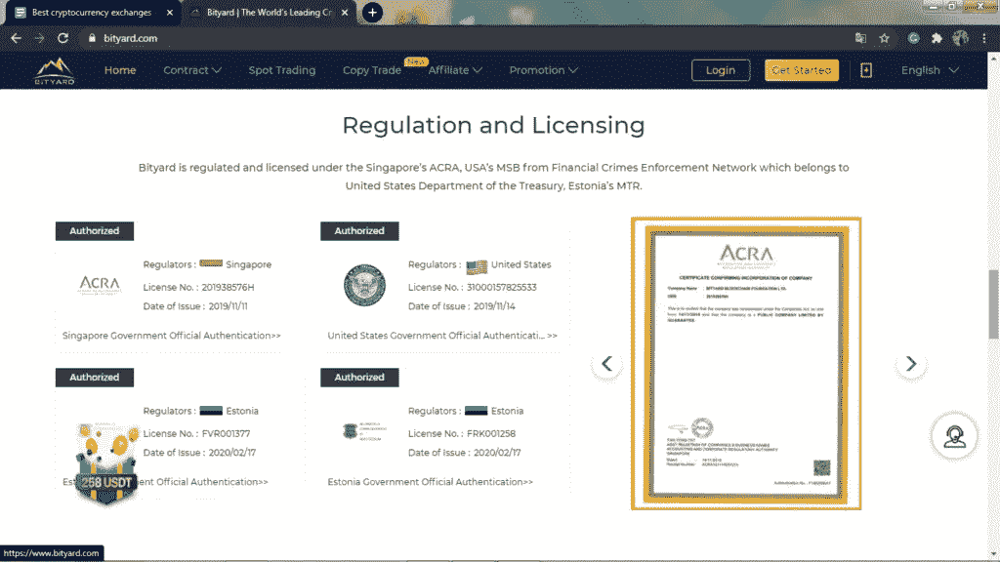**

**Bityard 仅存储钱包中资金的一小部分。剩下的资金被冷藏起来，安全性最佳。您还应该通过使用两步验证和保护数据安全来维护帐户的安全。Bityard 帮助您避免网络钓鱼攻击，因为整个通信都是 SSL 加密的。**

## **比特码:利弊**

**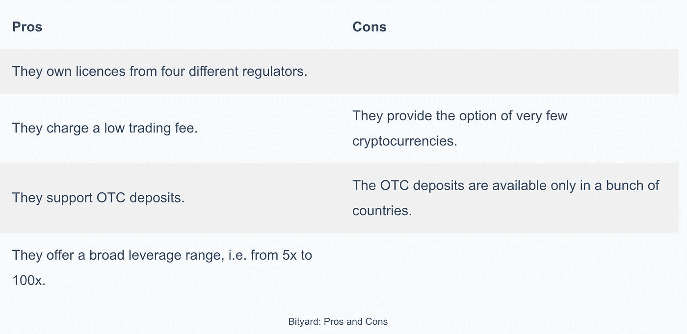**

**要了解更多关于 Bityard 的信息，请阅读我们对 Bityard 的详细[评论。](https://coincodecap.com/bityard-reivew)**

# **4.[霍比](https://www.huobi.com/en-us/topic/invited/?invite_code=dsze8)**

## **火币环球是什么？**

**火币是市场上最早提供服务的加密交换平台之一，自 2013 年以来。**

**上线仅三个月，火币的营业额就达到了 40 亿美元。到 2014 年，[火币](https://www.huobi.com/en-us/topic/invited/?invite_code=dsze8)已经将这一数额翻了两番，并在亚洲加密货币市场上留下了印记。**

**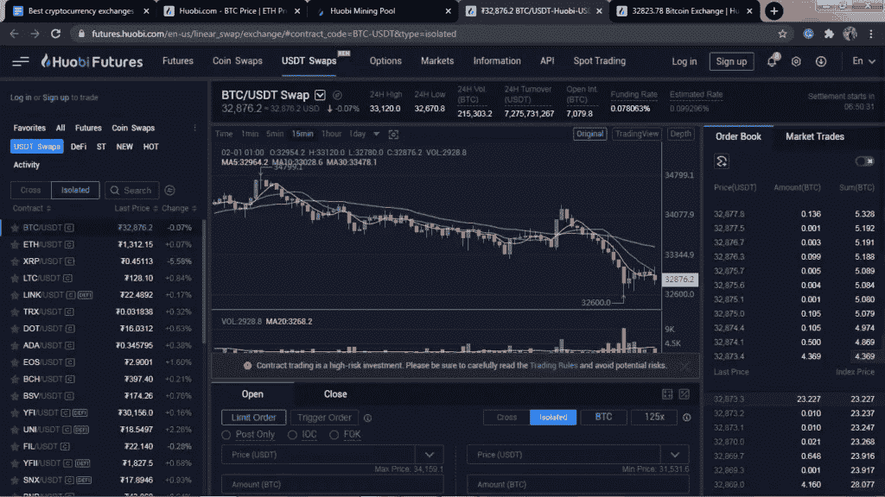**

## **火币位于哪里？**

**到 2013 年底，Leon Li 在中国运营了交易平台。然而，中国在 2017 年禁止了加密货币的交易。 [**火币**](https://www.huobi.com/en-us/topic/invited/?invite_code=dsze8) 将总部迁至韩国首尔，仍从首尔控制全球业务。**

## **火币怎么用？**

**首先你需要在 [Huobi](https://blog.coincodecap.com/go/huobi) 上创建你的账户，然后你必须完成 KYC 验证程序。**

**[**火币**](https://www.huobi.com/en-us/topic/invited/?invite_code=dsze8) 是非常先进的平台；因此，它还提供了一个面向初学者的虚拟界面。**

## **火币加密货币支持和存款**

**火币几乎接受所有的加密货币作为押金。此外，火币网还为用户提供使用信用卡、借记卡甚至银行转账进行存款的机会。**

**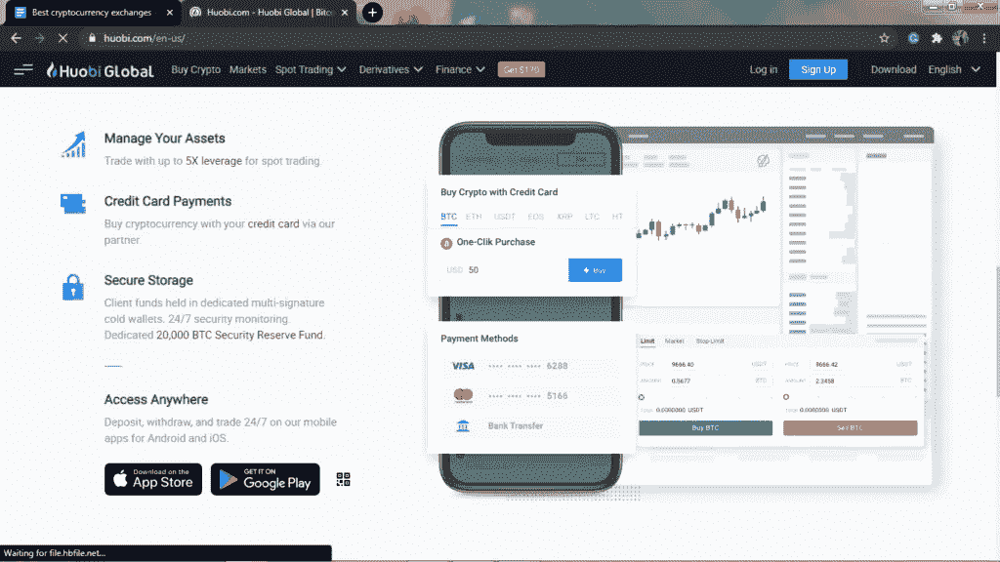**

## **火币费**

**火币没有具体的提现费用，因为他们会根据市场情况不时更新。然而，[火币](https://www.huobi.com/en-us/topic/invited/?invite_code=dsze8)提供 VIP 会员资格，最多可降低 60%的费用。**

**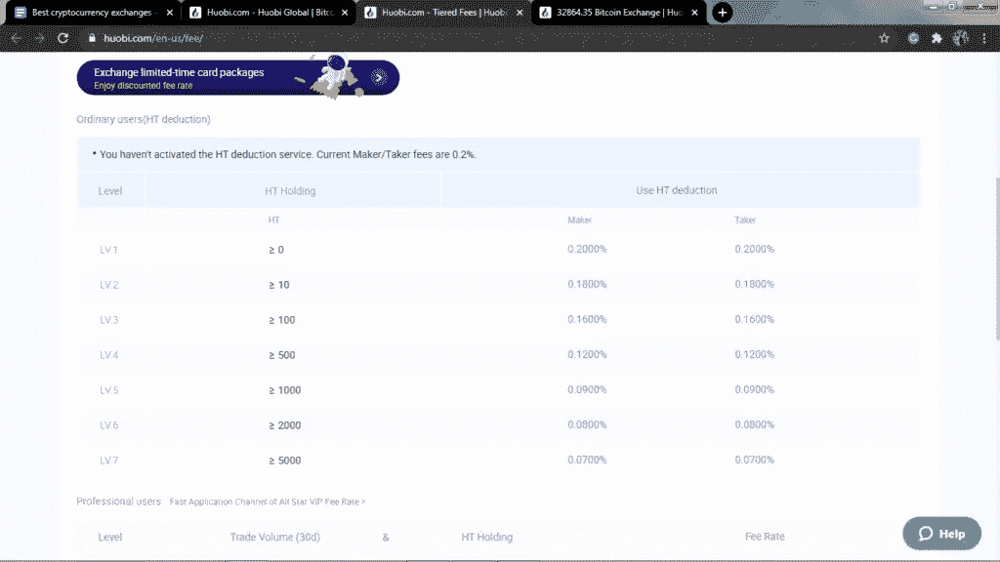**

**你也可以使用 HT token 将它们存放在你的钱包里，并在交易或取款时使用，从而将费用削减近一半。**

**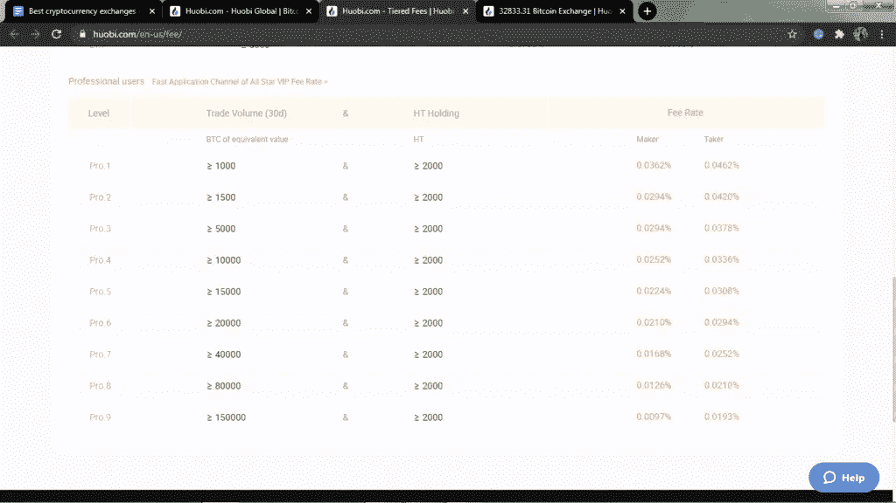**

## **火币到底有多安全？**

**集中式交易所最本质也是最可怕的一点就是有被黑的可能。然而， [**火币**](https://www.huobi.com/en-us/topic/invited/?invite_code=dsze8) 从未丢失过一个比特币，他们声称你的资产在他们的最高安全措施下是高度安全的。火币网最近推出了其[用户保护基金](/@benchi10/the-huobi-buyback-program-launches-to-protect-users-funds-6243607c8b68)。**

## **火币:利弊**

**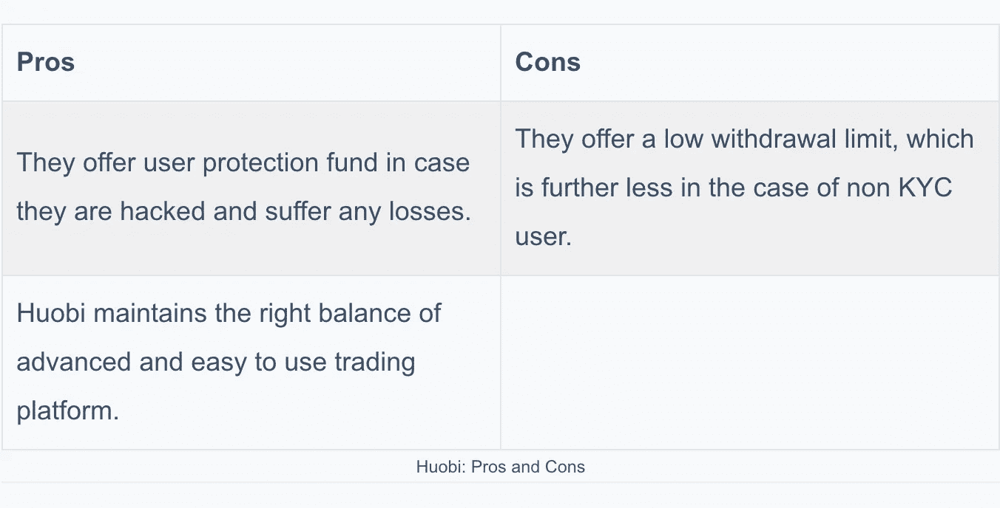**

# **5. [Bitmex](https://www.bitmex.com/register/kOHufx)**

## **什么是 **Bitmex** ？**

**成立于 2014 年的 [**Bitmex**](https://www.bitmex.com/register/kOHufx) 已被证明是加密交易的最佳平台之一。Bitmex 提供杠杆合约，是一个点对点交易平台。**

**Bitmex 允许其用户使用比特币买卖资产。另外，Bitmex 只处理比特币，产生的盈亏都在比特币里。它不需要任何法定货币。**

**用户注册完成后，Bitmex 没有交易限制。然而， [Bitmex 目前在美国面临一项审判](https://www.nytimes.com/2020/10/01/technology/bitmex-bitcoin-criminal-charges.html)，并且不向美国居民提供服务。**

## **如何使用 Bitmex？**

**[**Bitmex**](https://www.bitmex.com/register/kOHufx) 提供了一个非常过时的用户界面。它甚至感觉开发者在网站首次出现的一年后忘记了增强他们的网站。然而，它仍然是功能性的，并提供所有必要的信息。**

**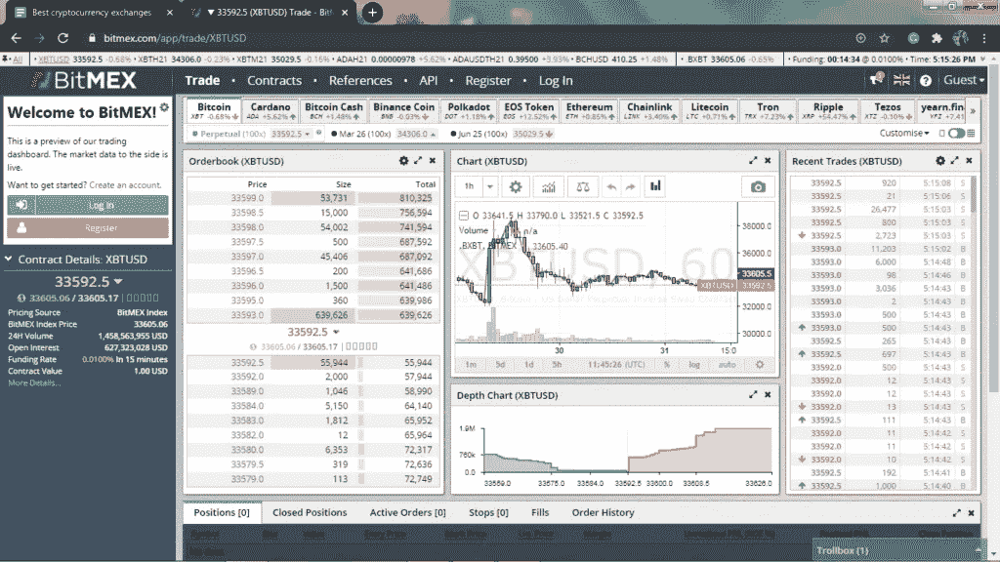**

**要在 [**Bitmex**](https://www.bitmex.com/register/kOHufx) 进行交易，首先需要完成注册。一旦你做了你的第一笔交易，你就可以通过有效的订单来查看它们。**

**Bitmex 在设计其界面时考虑到了台式机的要求，因此当你第一次访问他们的网站时，你会看到你面前复杂的屏幕。然而，Bitmex 是首批提供 100 倍杠杆交易的加密交易所之一。**

## **Bitmex 费用**

**[**Bitmex**](https://www.bitmex.com/register/kOHufx) 不收取任何存取款费用。然而，他们确实收取最低比特币网费，这是根据比特币动态确定的。**

**Bitmex 根据杠杆收取做市商费、接受者费和结算费，如下所示:**

**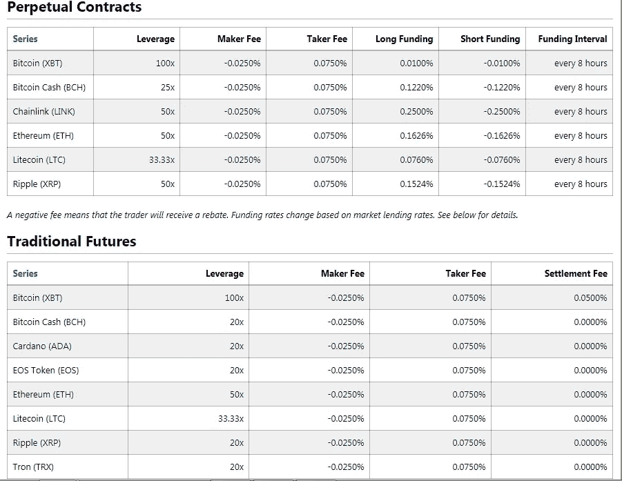**

## **Bitmex 有多安全？**

**[**Bitmex**](https://www.bitmex.com/register/kOHufx) 使用亚马逊网络服务，确保服务器受到良好保护，各种安全设施可用。Bitmex 非常重视用户资产的安全。要了解更多关于其安全性的信息，请访问[此处](https://www.bitmex.com/app/security)。**

**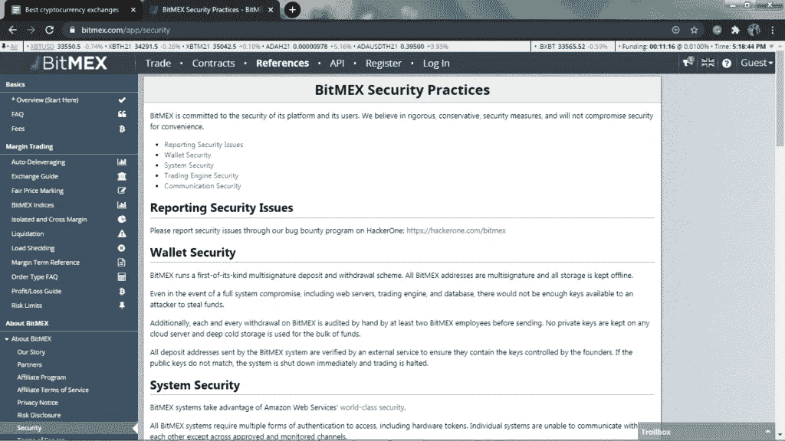**

## **Bitmex 利弊**

**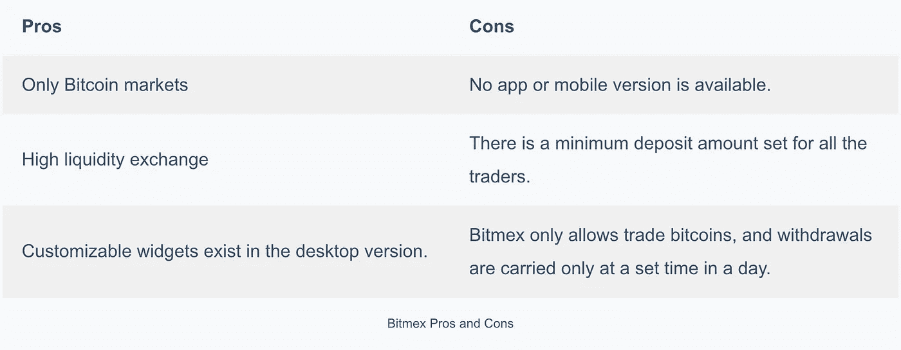**

# **6. [**双子座**](https://gemini.sjv.io/gbP2q2)**

## **双子座是什么？**

**[**Gemini**](https://gemini.sjv.io/gbP2q2) 是美国极少数受监管的加密货币交易所之一。它由 [NYSDFS](https://en.wikipedia.org/wiki/New_York_State_Department_of_Financial_Services) 明确管理。Gemini 为您提供交易和存储 20 多种最著名的加密货币。双子座记住新手交易者和有经验的交易者。它是少数几个基于投资者技能提供服务的平台之一。**

**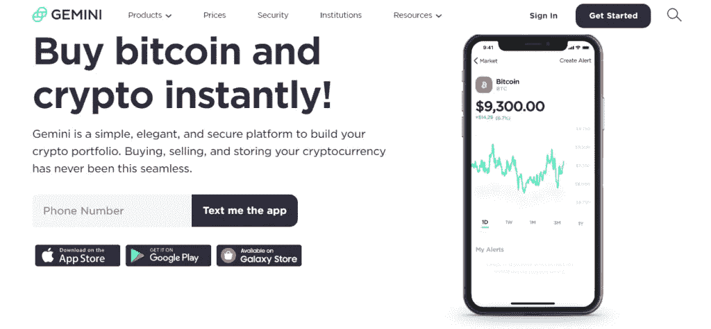**

**双子座现在也提供其**信用卡**，比特币或其他加密货币的回报率高达 3%。**

## **双子座位于哪里？**

**双子座是由 ConnectU 的创造者在 2014 年创建的。是的，你没看错，文克莱沃斯双胞胎(脸书的前身)。截至目前，双子座正在不断扩大其用户范围，特别是在亚洲和欧洲。**

## **双子座怎么用？**

**当您完成注册过程后，您必须向您的帐户注入资金才能继续交易。Gemini 为你提供了一个带有主用户界面的移动应用程序。**

## **双子座接受什么货币？**

**双子座接受几乎所有重要数字资产的存款，最近开始接受法定货币。然而，双子座只接受美元作为法定货币。此外，Gemini 接受来自世界各地的电汇和来自美国公民的 ACH。**

## **双子座费**

**双子座不收任何押金费用。Gemini 目前的收费表如下:**

*   **[手机费](https://gemini.com/mobile-fee-schedule/)**
*   **[活跃交易者费用](https://gemini.com/activetrader-fee-schedule/)**
*   **[网费](https://gemini.com/web-fee-schedule/)**
*   **[转会费](https://gemini.com/transfer-fee-schedule/)**
*   **[托管费](https://gemini.com/custody-services/#fee-schedule)**

**下图是双子座收取的费用。然而，如果你需要更多的信息，你可以访问上面的链接。**

**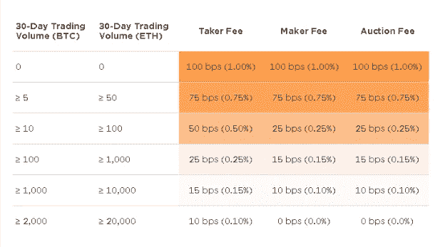**

## **双子座有多安全？**

**Gemini 提供了加密市场上最好的证券之一。它保护您的资产免受外部黑客威胁，同时记住您不会犯任何人为错误。Gemini 还遵守严格的规则，确保 Gemini 的团队无法获得您的资产，以防止内部人员滥用访问权限。**

**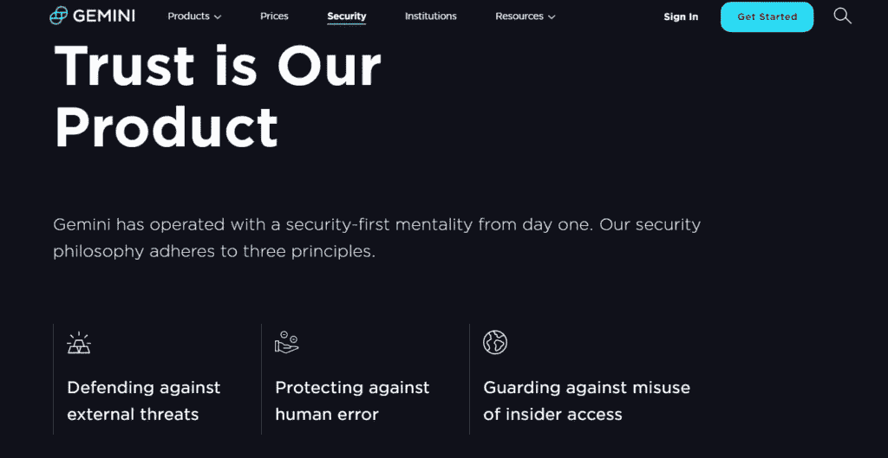**

**[Gemini](https://gemini.sjv.io/gbP2q2) 提供各种其他功能，如双因素认证、[冷藏](https://coincodecap.com/how-to-secure-your-crypto-wallet#Cold_storage)和便于取款的热钱包。想了解更多关于他们的安全问题，你可以访问他们的网站。**

## **双子座的利弊**

**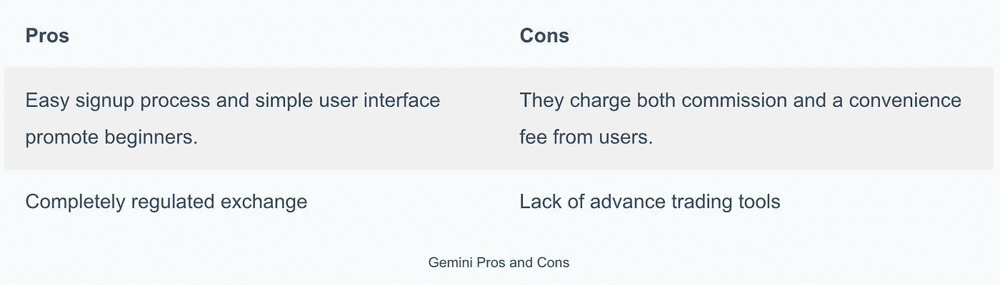**

# **7. [Bitfinex](https://www.bitfinex.com/?refcode=7P5O4Dyt2)**

## **什么是 **Bitfinex** ？**

**Bitfinex 是最好的加密货币交易平台之一。它为用户提供点对点技术和各种资产的保证金交易。**

**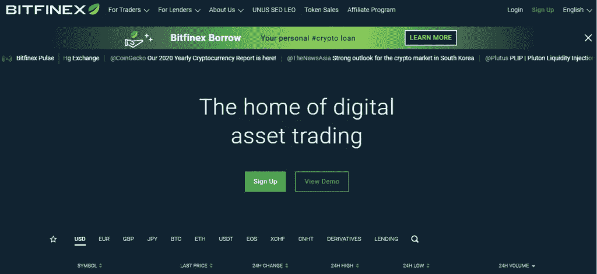**

**Bitfinex 由拥有多年经验的专家领导，每天都在蓬勃发展，为他们的用户提供一个与众不同的平台。然而，在 2015 年，一次黑客攻击导致近 1500 个比特币丢失。**

## **Bitfinex 位于哪里？**

**Bitfinex 成立于 2012 年 12 月，总部位于香港。然而，它在过去发生过各种各样的事故，你可以在这里阅读。**

## **如何使用 Bitfinex？**

**Bitfinex 旨在迎合专业交易者的需求，同时拥有简单的用户界面。你可以从你的 [Android](https://play.google.com/store/apps/details?id=com.bitfinex.mobileapp&hl=en) 或 [iOS](https://itunes.apple.com/us/app/bitfinex/id1436383182?ls=1&mt=8) 访问 Bitfinex。**

**完成注册过程后，您需要存入一定金额才能开始交易。**

## **Bitfinex 存款和加密货币支持**

**Bitfinex 接受几乎所有主要形式的存款。这包括加密货币、法定存款、信用卡和借记卡。**

**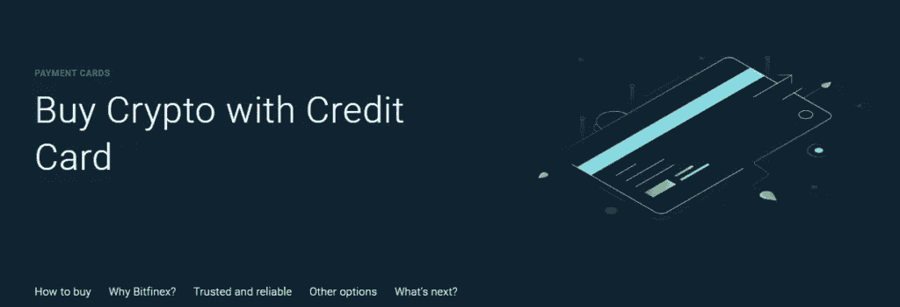**

**要了解他们接受的付款方式，请访问[此处](https://support.bitfinex.com/hc/en-us/articles/115004405873-A-Beginner-s-Guide-to-Bitfinex#h_01EJ0VD5GP4AA9XYZKA1RD42QQ)。**

## **Bitfinex 费用**

**你可以查看下图中的 Bitfinex 交易费用，或者访问他们的网站。**

**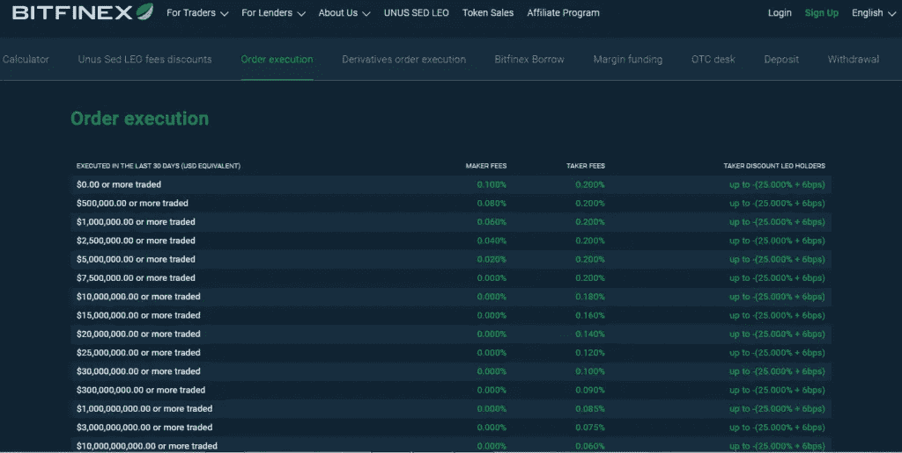**

**Bitfinex 对电汇存款和取款收取费用，具体如下:**

**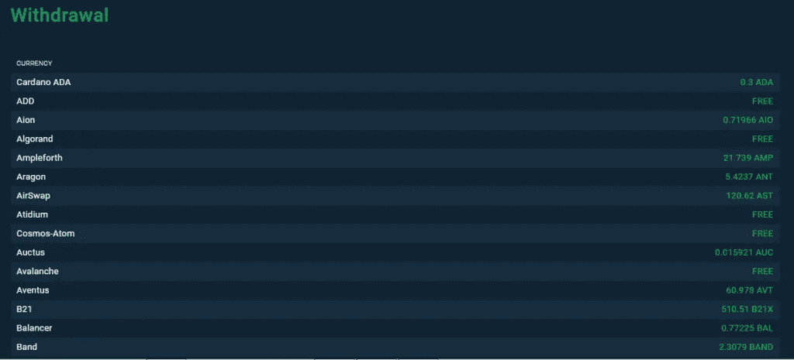**

## **Bitfinex 有多安全？**

**[**Bitfinex**](https://www.bitfinex.com/?refcode=7P5O4Dyt2) 通过 OpenPGP 为其用户提供双因素认证、U2F、高级 API 密钥权限、高级验证工具、取款保护、邮件加密。**

**像所有其他中央加密货币平台一样，它们以离线冷藏模式存储几乎所有用户的资产。**

**然而，看到他们麻烦不断的过去，人们很难相信他们的安全，然而已经过去很长时间了，他们无疑已经从错误中吸取了教训。**

## **Bitfinex 的利弊**

**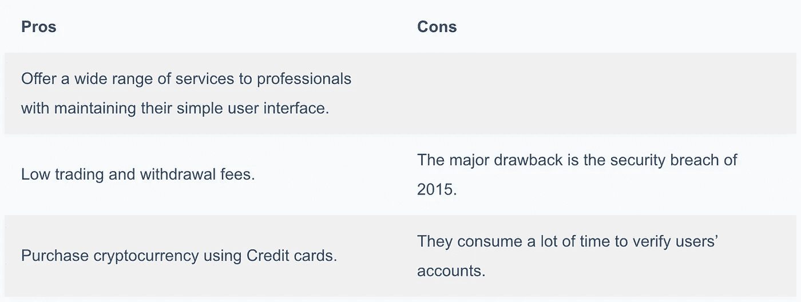**

# **8. [Bittrex](https://bittrex.com/Account/Register?referralCode=50M-YJB-BMX)**

## **什么是 **Bittrex** Global？**

**像几乎所有进入前十的旧加密平台一样， **Bittrex** 也是最好的加密货币交易所之一。Bittrex 不区分专家客户和初学者客户，并向他们提供尖端技术。**

**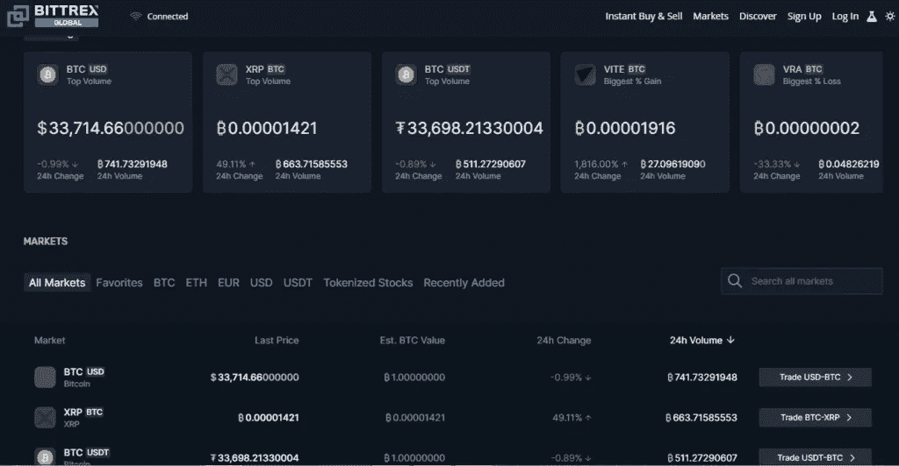**

**只有当你完成并通过他们的文件验证后，Bittrex 才允许你交易。**

## **Bittrex 位于哪里？**

**三个人于 2013 年底在美国创立了 Bittrex。三位创始人都曾是微软的员工。Bittrex 目前在列支敦士登运营。**

## **如何使用 Bittrex？**

**[**Bittrex**](https://bittrex.com/Account/Register?referralCode=50M-YJB-BMX) 向除美国以外的全球客户提供服务。然而，美国的客户可以联系另一家公司 Bittrex Inc。**

**注册后，您需要以 Bittrex 接受的货币存入金额。他们有一个快速和简单的用户界面，将帮助您开始您的加密之旅。然而，他们不提供保证金交易，这是许多专业交易者在交易时可能缺乏的。**

**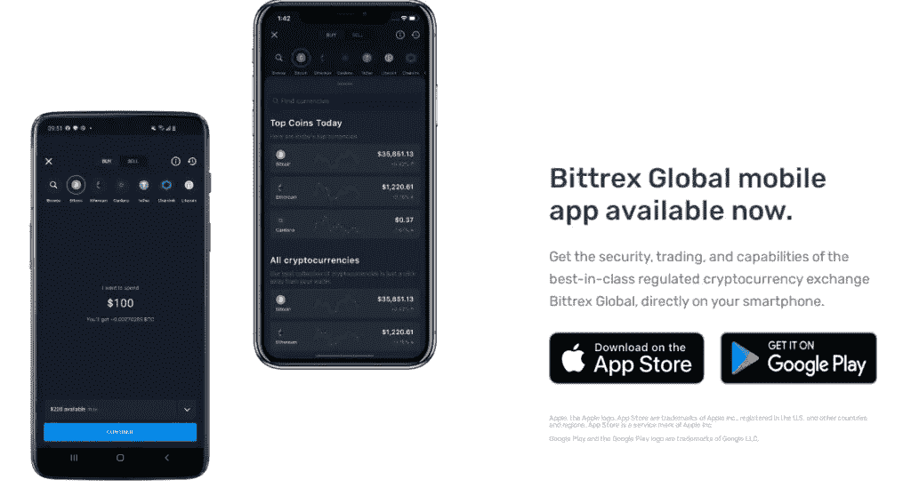**

## **Bittrex 存款和加密货币支持**

**来自美国的存款只能通过电汇进行。然而，来自世界各地的人们可以使用几乎所有的替代硬币和加密货币进行存款。**

## **Bittrex 费用**

**据 Bittrex 称，他们收取的佣金是市场上竞争对手中最低的。**

**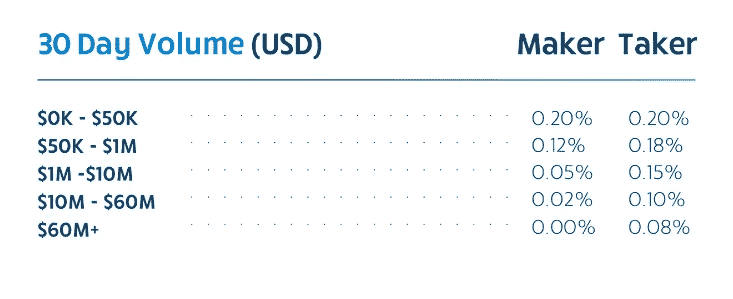**

**除此之外，他们还根据市场情况收取区块链规定的交易费。**

## **Bittrex 安全吗？**

**在各种加密货币交易所中，它们提供了最好的安全服务之一。像所有主要竞争对手一样，他们提供双因素身份认证来保护用户数据的安全。**

**[**Bittrex**](https://bittrex.com/Account/Register?referralCode=50M-YJB-BMX) 将其用户的所有资金存储在高度戒备和安全的离线冷库中。**

## **Bittrex 的利弊**

**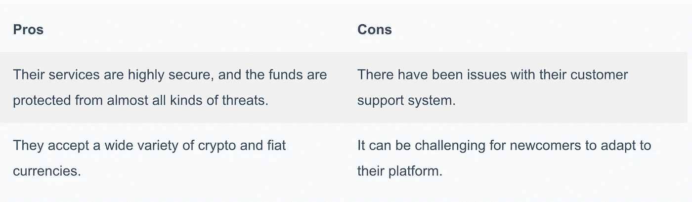**

# **9. [FTX](https://ftx.com/#a=5809823)**

## **什么是 **FTX** ？**

**[**FTX**](https://ftx.com/#a=5809823) 是全球最好的密码交易交易所之一，由瞄准未来的新一代人领导。众所周知，FTX 是“交易者和交易者的”交易平台凭借其卓越和不断发展的技术，他们为市场上的所有交易者提供服务。**

**他们相信开发一个足够简单的平台来开始你的交易之旅，并且足够强大让专家无缝使用。**

**FTX 最近推出了现货保证金交易。你可以在这里看一看。**

**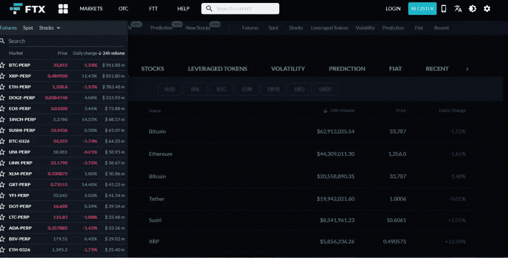**

## **FTX 位于哪里？**

**萨姆·班克曼·弗里德，麻省理工的毕业生，也是一名交易员，领导了 FTX 基金会。在推出 FTX 之前，他还为领先的加密货币流动性提供商 al meda T1 奠定了基础。**

**FTX[的总部位于安提瓜和巴布达。](https://ftx.com/#a=5809823)**

## **如何使用 FTX？**

**[**FTX**](https://ftx.com/#a=5809823) 在加密货币行业有一个强大的网络，因为许多其他领先的加密风险投资基金支持它。他们是市场上第一个为投资者推出各种功能的公司。**

**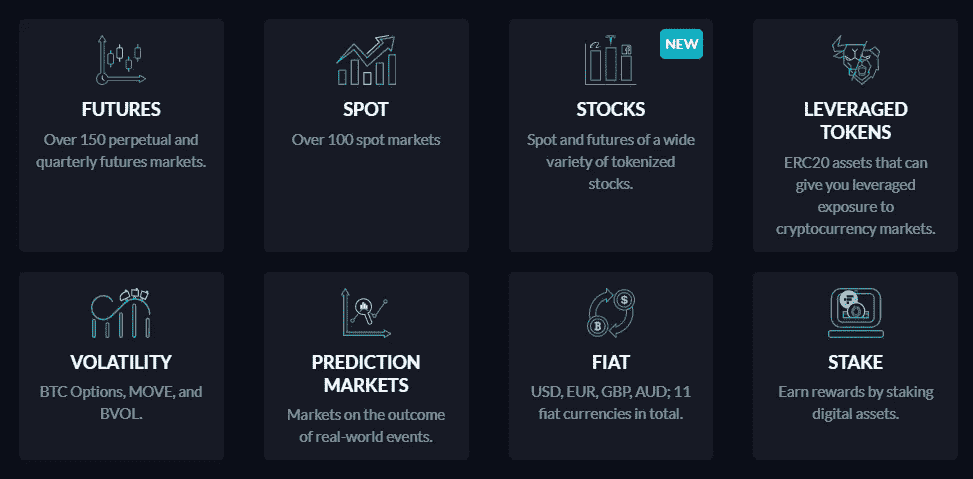**

**在 FTX 开始交易毫不费力。你所需要做的就是创建你的账户，存入你想要兑换的金额。FTX 提供高达 101 倍的杠杆，这对其用户来说是非常有利可图的。**

**然而，在开始之前，你需要完成你的 KYC。**

## **FTX 存款和加密货币支持**

**FTX 是用户友好的，允许用户使用他们提供的所有加密货币转移存款。此外，他们允许菲亚特转移和信用卡，这对他们的用户来说是一个加分**

## **FTX 费**

**FTX 对存款和取款不收任何费用。更重要的是，他们对期货结算或场外交易不收取任何费用。**

**FTX 提供分级收费结构，如下所述:**

**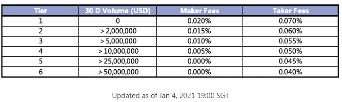**

**如果你想了解更多关于 FTX 收费的信息，请访问[这里](https://help.ftx.com/hc/en-us/articles/360024479432-Fees)。**

## **FTX 安全吗？**

**由于他们是加密货币市场的新手，他们需要对自己的存储资金格外安全。然而， [FTX](https://ftx.com/#a=5809823) 的制造商并没有透露任何关于他们安全协议的信息。**

**阅读我们的 [FTX 加密交易所评论](/coinmonks/ftx-crypto-exchange-review-53664ac1198f)以了解关于该平台的更多信息。**

## **FTX 赞成和反对**

**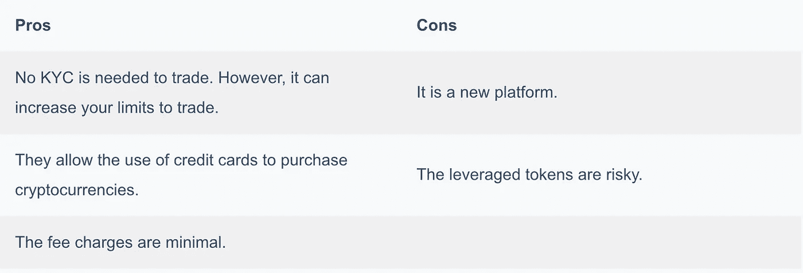**

# **10.[德里比特](https://www.deribit.com/reg-11668.6979)**

## **什么是 **Deribit** ？**

**Deribit 这个名字来源于“衍生品”和“比特币”**

**Deribit 向更有经验的交易者而不是密码交易新手提供期权和期货交易服务。**

**该平台擅长提供杠杆交易，在以太坊和比特币中分别提供高达 50 倍和 100 倍的杠杆。**

**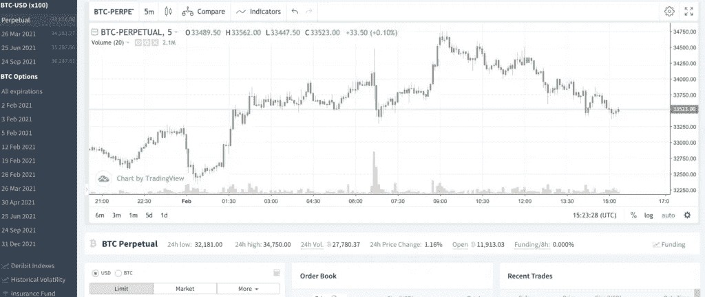**

## **德里比特位于哪里？**

**2016 年， [**德里比特**](https://www.deribit.com/reg-11668.6979) 通过其创始人乔恩·詹森诞生。该公司总部位于荷兰，目前仍在荷兰埃尔梅洛为其全球客户提供服务。**

## **如何使用 Deribit？**

**首先，你必须创建一个帐户，并用你的电子邮件注册。然后下一步是完成你的 KYC，因为它会提升你的交易体验。**

**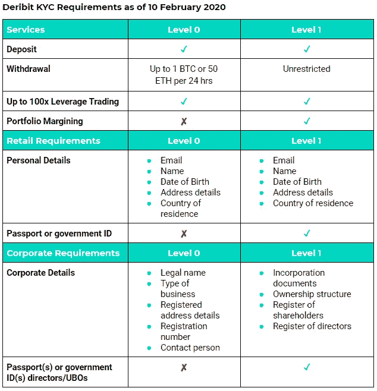**

## **Deribit 接受哪些付款方式？**

**[**Deribit**](https://www.deribit.com/reg-11668.6979) 只允许你转移比特币。对于取款，您需要转到取款选项卡并提交提取所需金额的请求。**

## **代币费**

**它遵循一个创造者-接受者模型。订单有两种类型。“制造商”订单增加了订单簿的流动性。它被立即执行。“接受者”订单从订单簿中移除流动性。它不会立即执行。**

**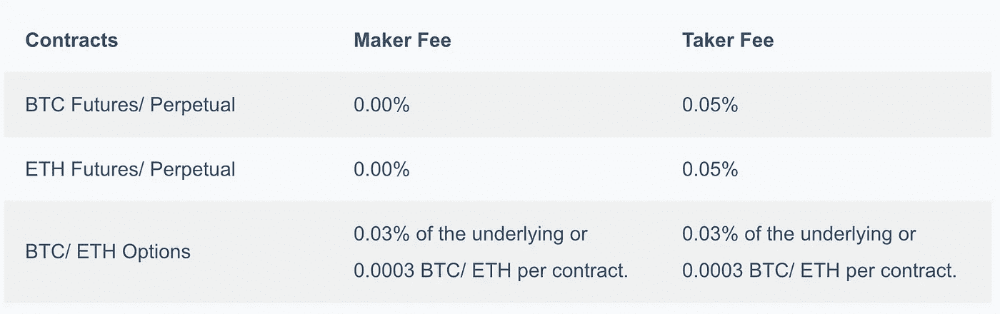**

**期权费不得超过期权价格的 12.5%。**

**对于期权和未来交割也有额外的费用。期货和期权分别为 0.025%和 0.015%。期权的额外费用不得超过期权价格的 12.5%。**

**清算也有额外的费用。它会自动加入保险基金。**

**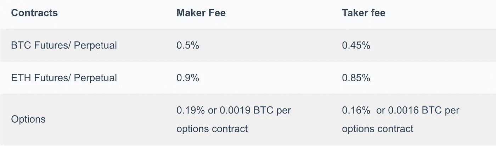**

**存款不收取任何费用。**

## **德里比特有多安全？**

**据 [**Deribit**](https://www.deribit.com/reg-11668.6979) 统计，其 99%的资金在线下模式下都有一个冷库的家。因此，它可以防止他们受到任何恶意攻击。但是，也降低了客户取款的速度。**

**Deribit 提供 IP 锁定服务，如果 IP 地址发生变化，系统将终止您的会话。它们还提供双因素身份验证。但是，您必须在设置帐户后启用它。**

**阅读我们的 [Deribit 评论](/coinmonks/deribit-review-options-fees-apis-and-testnet-2ca16c4bbdb2)以了解有关该平台的更多信息。**

**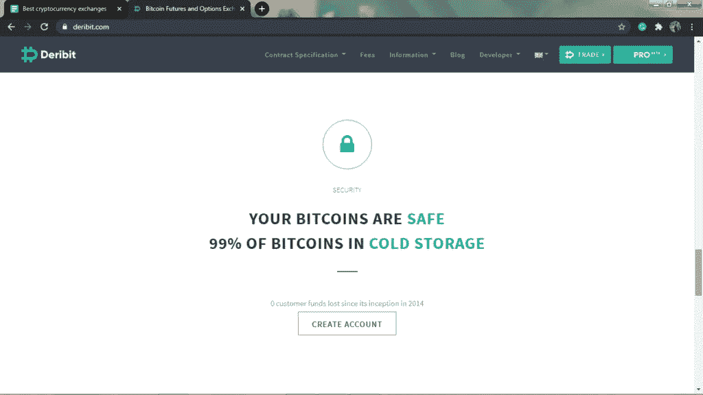**

# **嘲笑正反两面**

**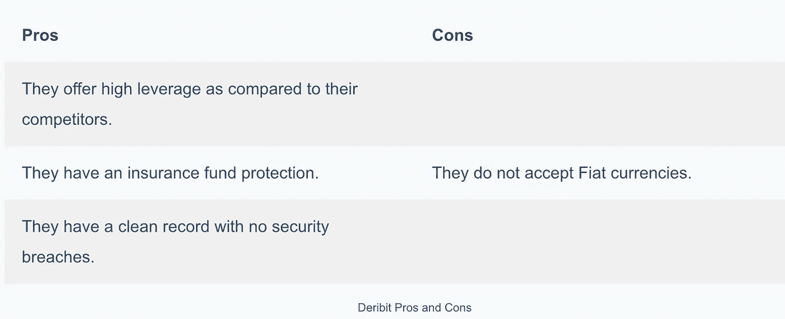**

# **最佳加密交换:结论**

**几乎所有的交易平台都有其优缺点。尽管如此，有些还是为交易者提供了所有的功能。根据我们的经验，我们建议您选择币安的**，因为它是世界上最大的加密交易平台。然而，**[**Bityard**](https://www.bityard.com/?ru=zPe4QC)也提供可与币安媲美的服务。******

# ****加密货币交易所:常见问题****

******最好的加密货币交易所是哪家？******

****一个提供良好流动性、安全性、低费用、用户界面多样的平台是最好的密码交易所。****

******哪个加密货币交易所最适合新手？******

****嗯，答案取决于你寻求加密货币平台提供的服务。然而，我们认为币安或 Bityard 可以满足您作为初学者的要求。****

******美国没有加密货币交易所吗？******

****不，有些平台是美国监管的。如比特亚德、比特币基地、双子星等。但是很多平台不符合美国政府的指导方针。这些平台不向美国公民提供服务。****

> ****加入 Coinmonks [电报频道](https://t.me/coincodecap)和 [Youtube 频道](https://www.youtube.com/c/coinmonks/videos)获取每日[加密新闻](http://coincodecap.com/)****

## ****另外，阅读****

*   ****[复制交易](/coinmonks/top-10-crypto-copy-trading-platforms-for-beginners-d0c37c7d698c) | [加密税务软件](/coinmonks/crypto-tax-software-ed4b4810e338)****
*   ****[网格交易](https://coincodecap.com/grid-trading) | [加密硬件钱包](/coinmonks/the-best-cryptocurrency-hardware-wallets-of-2020-e28b1c124069)****
*   ****[密码电报信号](http://Top 4 Telegram Channels for Crypto Traders) | [密码交易机器人](/coinmonks/crypto-trading-bot-c2ffce8acb2a)****
*   ****[面向开发人员的最佳加密 API](/coinmonks/best-crypto-apis-for-developers-5efe3a597a9f)****
*   ****最佳[密码借贷平台](/coinmonks/top-5-crypto-lending-platforms-in-2020-that-you-need-to-know-a1b675cec3fa)****
*   ****杠杆代币的终极指南****
*   ****[AscendEx Staking](https://coincodecap.com/ascendex-staking)|[Bot Ocean Review](https://coincodecap.com/bot-ocean-review)|[最佳比特币钱包](https://coincodecap.com/bitcoin-wallets-india)****
*   ****[Bitget 回顾](https://coincodecap.com/bitget-review)|[Gemini vs block fi](https://coincodecap.com/gemini-vs-blockfi)|[OKEx 期货交易](https://coincodecap.com/okex-futures-trading)****
*   ****[Capital.com 评论](https://coincodecap.com/capital-com-review) | [香港的加密借贷平台](https://coincodecap.com/crypto-lending-hong-kong)****
*   ****[最佳加密 RSS 源](https://coincodecap.com/crypto-rss-feeds) | [最佳 eToro 替代品](https://coincodecap.com/etoro-alternative)****
*   ****[红狗赌场评论](https://coincodecap.com/red-dog-casino-review) | [Swyftx 评论](https://coincodecap.com/swyftx-review) | [CoinGate 评论](https://coincodecap.com/coingate-review)****

****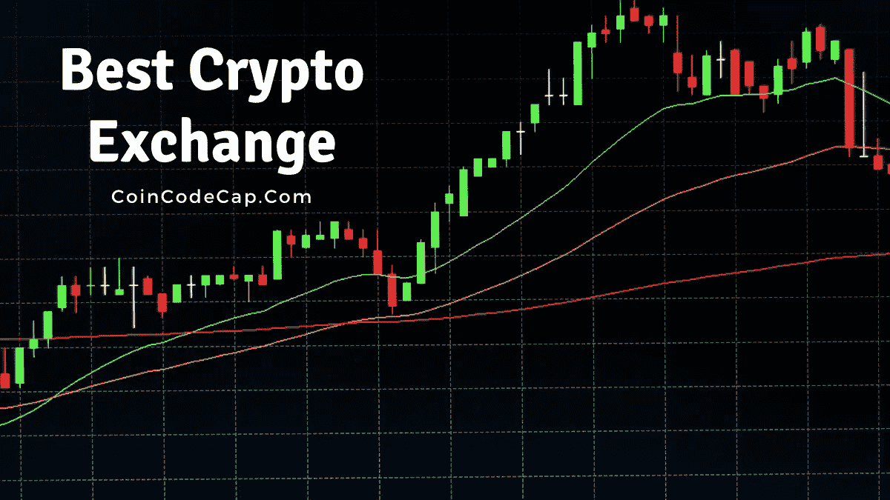****