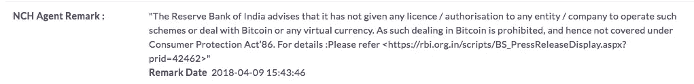

# 印度的加密交易平台:这些平台上的钱或加密资产安全吗？

> 原文：<https://medium.com/coinmonks/crypto-exchange-platforms-in-india-is-the-money-or-the-crypto-assets-safe-on-these-platforms-from-ab67e499f4f6?source=collection_archive---------9----------------------->

在对印度储备银行(Reserve Bank of India)制定的关于加密货币交易平台监管的指导方针的解释/误解之间的所有争论中，加密货币投资者、交易平台和专家都向我们保证，该授权并没有特别将任何虚拟货币视为“非法”。但是，如果印度央行的命令没有将这些“虚拟货币”归类为非法，那么在印度进行交易合法吗？哪些规则/管理策略适用于提供 exchange 服务的 exchange 平台？印度央行一直警告公民不要进行虚拟货币/资产/代币交易，最近还排除了另一项约束银行和此类机构进行任何虚拟货币交易的指导方针。

**RBI 指令摘录:**

> 13.技术创新，包括虚拟货币的基础技术创新，有可能提高金融体系的效率和包容性。然而，虚拟货币(VC)也被称为加密货币和加密资产，引发了对消费者保护、市场诚信和洗钱等问题的担忧。
> 储备银行一再警告包括比特币在内的虚拟货币的用户、持有者和交易者，在处理此类虚拟货币时存在各种风险。鉴于相关的风险，现已决定，受印度储备银行监管的实体不得与任何处理或结算风险资本的个人或商业实体进行交易或向其提供服务。已经提供此类服务的受监管实体应在规定时间内退出关系。这方面的通知正在单独发出

[在印度，比特币的交易量上升至每年 200 亿美元的巨大数字](https://inc42.com/features/cryptocurrency-exchanges-ethereum-bitcoin-india/),许多交易平台在过去几年里也有所发展。过去几个月，交易平台上的用户数量呈指数级增长，Coinmarketcap 上的市场报告显示，印度顶级交易平台的 24 小时交易量高达 500 万美元(多种虚拟货币)。随着加密交易者数量的指数级增长和人们对虚拟货币交易的巨大兴趣，多达 [15 个交易平台](https://yourstory.com/2017/12/indian-startups-cryptocurrency-trading/)目前正在运行，为印度交易者带来“轻松”交易的虚拟货币。
除了虚拟货币在交易平台上交易的合法/非法地位，另一个问题是在交易平台上交易有多安全/不安全。

最近，我在一个交易平台上遇到了一个问题，原因是某些新的公司政策被强制执行(没有任何事先通知),我的帐户在平台上被冻结了。在与该公司的客户服务主管进一步讨论这个问题时，我们无法找到一个共同的解决办法。现在，交易平台通过锁定我的账户坚定地站在他们一边，我无法提取我的加密资产，令人惊讶的是，我的 INR 余额也被冻结了。我进一步决定着手解决这个问题，并与消费者论坛联系，充当仲裁人，帮助我提取资产并关闭账户。在向消费者论坛登记争议后，24 小时内我收到了令人震惊的回复，称加密货币/虚拟货币的交易以及由此产生的任何影响都不能根据 86 年《消费者保护法》保护消费者。

**消费者论坛备注摘录:**

现在，印度央行和消费者论坛明确指出，他们不会受理任何与虚拟货币/加密货币的交换/交易/贸易有关的损失/欺诈/或任何纠纷，哪个机构为虚拟货币(在印度)的交换和融资平台制定管理规则。如果交易平台和个人交易者之间存在任何未达成共识的争议，交易者可以向谁寻求影响/充当争议的仲裁人？我们如何知道/相信/信任我们的钱/资产在各自的平台上是“安全的”和“归我们所有”的？屈服于 FOMO，我们都只是盲目地踏入空井，而不是在交易中亏损，我们实际上是在交易平台上赔钱吗？

> [在您的收件箱中直接获得最佳软件交易](https://coincodecap.com/?utm_source=coinmonks)

# ❤️喜欢，分享，留下你的评论

如果你喜欢这篇文章，不要忘记喜欢，与你的朋友和同事分享，并在下面留下你对这篇文章的评论。
跟我来……