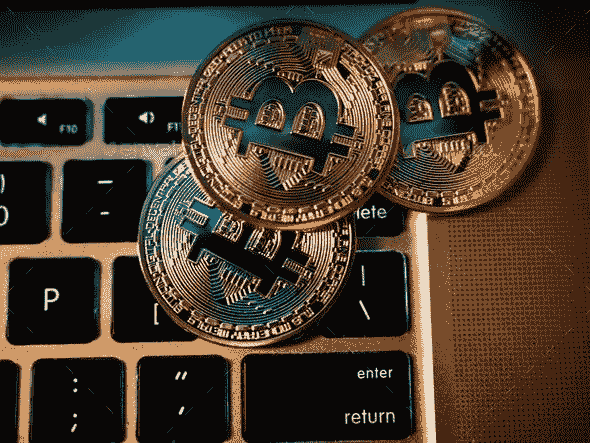

# 秘密时尚还是可能的未来？

> 原文：<https://medium.com/coinmonks/crypto-fad-or-a-possible-future-cc5aafa6a8d5?source=collection_archive---------8----------------------->

一项让一些人在一夜之间成为百万富翁的投资，加上精英支持者和全球相关性，似乎是有利可图的，不是吗？现在想象一下，同样的投资如此不稳定，以至于突然失去价值，或者在你的国家被禁止，这是否会造成一个困境？

如果你的答案是肯定的，那么你已经进入了加密货币的领域，投资者和大众都在预测它在未来的相关性，并会问这样的问题:

*   加密货币的优缺点是什么？
*   加密货币是如何被审核的或者它是否有一些真正的合法性？
*   为什么人们应该投资加密？它的风险因素有多不稳定？
*   加密货币将如何影响当前的全球经济？

最后，最不和谐和相关的是

*   加密是一种时尚、骗局还是全球经济的未来？

**什么是加密货币？**

密码或加密货币是一种虚拟的分散式货币，由加密技术保护，采用区块链技术在全球分类账的帮助下进行交易，全球分类账使用一种称为密码术的高级加密技术，使交易安全。它的设计方式是将交易所的个人所有权记录存储在计算机化的数据库中，并且由于不是由任何国家的政府机构发行，加密货币免受政府监管机构的任何参与和操纵。然而，2018 年，印度央行对比特币等所有虚拟货币实施了禁令，这是为了确保该国金融系统的安全，免受被政府视为非法的私人货币的影响，尽管如此，2020 年 3 月 4 日，印度最高法院取消了在印度交易加密货币的禁令。

# **加密货币如何成为经济的前卫模式？**

**货币的去中心化和自治性质**

分散化意味着货币不受政府的垄断控制，就像法定货币一样。加密货币由独立开发商、私人组织以及开采它们的个人和机构控制，使其成为一种无视国家限制和边界的货币。

加密货币恰好是由矿工和开发者在他们的硬件上自主管理和维护的。由于采矿者获得的激励，交易记录和货币的完整性得以保持，并反过来保持记录分散。

**安全和隐私**

由于区块链分类账是建立在求解复杂的数学方程的基础上的，因此很难破译，因为操纵一笔交易需要对所有的全球分类账进行修改，这既麻烦又无法实现。这使得加密货币比电子交易更安全。

加密货币使用假名，隐藏用户的真实钱包余额和地址，并混合多项交易，以躲避指向任何用户的连锁分析。帐户和存储的数据不会附加到用户的配置文件。

**将免受经济通货膨胀的影响**

通货膨胀被定义为给定货币的购买力随着时间的推移而下降。战争和经济危机后，世界经历了大量的通货膨胀，然而，由于比特币等加密货币的数量固定，其价值随着市场需求的增加而增加，从长远来看，这可以防止通货膨胀。全球发行了 2100 万枚比特币，而法定货币可以由国有化银行随时印制。

**经济高效且更快捷的资金兑换和转账方式**

成本效益来源于需要支付的交易费用的可忽略数量，由于缺乏第三方支付网关，跨境交易的验证在加密货币方面实际上是免费的。由于国际和国内交易所的验证障碍较少，交易速度非常快。通过加密货币交易，如美元，印度卢比或欧洲欧元可以转换成比特币，以太坊，莱特币等。以最低的交易费用。

# **加密货币怎么会是一个噪音更大的空容器？**

**没有完全分散，存在可扩展性问题**

虽然它们在摆脱政府机构的束缚方面是分散的，但加密货币仍然处于大型利益相关者、组织和创造者的控制之下。他们可以在硬币上做手脚，大幅改变价格。因此使得加密货币具有波动性，比特币的波动率高达 76.49%。加密货币最大的问题是规模问题，尽管数字硬币的使用越来越多，但与 VISA 等支付巨头处理的交易数量相比，加密货币仍然相形见绌。有几个解决方案，如 lightning networks、sharding 和 staking，正在被整合以克服可扩展性问题。

**网络安全和数据丢失问题**

加密货币的交换是不安全的，因为交换存储用户的钱包数据用于无缝操作。但是，这些数据可能会被黑客窃取，他们可以从帐户中提取资金。我们已经看到比特币被盗数千乃至数百万美元。为了防止这种黑客行为，开发者创造了不可追踪、不可渗透的源代码，但将这种私钥丢失到用户的钱包里可能会导致他们永远无法追回自己的资金。这将给投资者带来巨大的经济损失。

**价格的波动和内在价值的缺乏**

沃伦·巴菲特说“你不能评估比特币的价值，因为它不是一种创造价值的资产……它是这类事物中真正的泡沫。”数字硬币的波动性与缺乏内在价值有关。它不能像有形资产一样保存，这个问题可以通过增加加密货币的使用和随之而来的波动性的降低来解决。

**可用于非法交易**

由于加密货币的匿名因素更高，政府机构很难追踪交易信息和用户的凭证。这使其成为在黑暗网络上购买毒品、贩运等货币交换模式的滋生地。加密货币还可以用来转换非法货币，以隐藏其可追溯性。

# **未来**

因此，加密货币的未来有其局限性，比如在电脑崩溃或被黑客窃听时抹去一个人的全部数字资产。随着加密货币越来越受欢迎，政府监管也相应增加，这是一个悖论，失去了其主要的分散优势。与主要为技术熟练者制造的法定货币相比，这是一种货币模式。尽管有太多的缺点和优点，但像任何其他创新一样，加密需要时间来成熟和发展，直到它成为这个世界经济中的常见交易模式。

> 加入 Coinmonks [电报频道](https://t.me/coincodecap)和 [Youtube 频道](https://www.youtube.com/c/coinmonks/videos)了解加密交易和投资

## 也阅读

 [## 最佳加密交易所| 2021 年十大加密货币交易所

### 编辑描述

blog.coincodecap.com](https://blog.coincodecap.com/crypto-exchange)  [## 2021 年 10 大最佳加密贷款平台| CoinCodeCap

### 编辑描述

blog.coincodecap.com](https://blog.coincodecap.com/crypto-lending)  [## 2021 年最佳免费加密交易机器人

### 2021 年币安、比特币基地、库币和其他密码交易所的最佳密码交易机器人。四进制，位间隙…

medium.com](/coinmonks/crypto-trading-bot-c2ffce8acb2a)  [## 最佳 4 个加密交易信号电报通道

### 这是乏味的找到正确的加密交易信号提供商。因此，在本文中，我们将讨论最好的…

medium.com](/coinmonks/best-crypto-signals-telegram-5785cdbc4b2b)  [## BlockFi 评论 2021:利弊和利率| CoinCodeCap

### 编辑描述

blog.coincodecap.com](https://blog.coincodecap.com/blockfi-review)  [## 如何在印度购买比特币？2021 年购买比特币的 7 款最佳应用[手机版]

### 如何使用移动应用程序购买比特币印度

medium.com](/coinmonks/buy-bitcoin-in-india-feb50ddfef94)  [## 加密税务软件——五大最佳比特币税务计算器[2021]

### 不管你是刚接触加密还是已经在这个领域呆了一段时间，你都需要交税。

medium.com](/coinmonks/best-crypto-tax-tool-for-my-money-72d4b430816b)  [## 存储比特币的最佳加密硬件钱包[2021] | CoinCodeCap

### 编辑描述

blog.coincodecap.com](https://blog.coincodecap.com/best-hardware-wallet-bitcoin)  [## Pionex 评论 2021 |免费加密交易机器人和交换

### Pionex 是为交易自动化提供工具的后起之秀。Pionex 上提供了 9 个加密交易机器人…

medium.com](/coinmonks/pionex-review-exchange-with-crypto-trading-bot-1e459d0191ea)