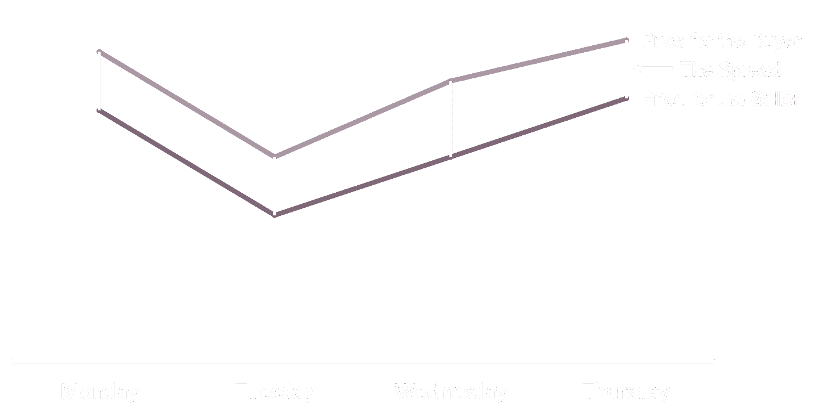

# 加密费 101

> 原文：<https://medium.com/coinmonks/crypto-fees-101-6fd8d5aaebea?source=collection_archive---------2----------------------->

不管你的加密组合是涨是跌，它肯定会让别人变得富有。当比特币基地上市时，它们的价值超过了世界上三大股票交易所的总和。

这些交易所的价值如此之高，是因为它们收取的费用是传统金融交易所的 50 多倍(T2)。这是从你口袋里掏出的真正的钱，也是为什么我们要分解这些费用来帮助你理解交易、持有和使用密码的主要成本。

为了更容易理解，我们将把费用分成由您使用的交易所评估的费用和由区块链总账本身评估的费用。

***边注*** *:如果你想在读完这篇文章后更好地理解收费，请查看“* [*如何从交易加密中赚更多的钱，保证！*](/@StardustWealth/how-to-make-more-money-from-trading-crypto-guaranteed-4b5ab801dc28)

# *交换费*

> *交易所费用代表你支付给比特币基地、双子、北海巨妖等交易所的所有费用。用于保存、交易和转移您的硬币。我们把它分成了交易费用和一般维护费用。*

## *交易费用*

> *比特币基地在 1，930 亿美元的交易量中获得了 11 亿美元的交易收入，约占每笔交易费用的 0.57%。*

**

*交易费用代表了交易所的大部分收入，与传统投资相比，加密投资的交易费用急剧膨胀。与 0.57%的费率相比，像纽约证券交易所这样的传统金融交易所只收取 0.01%左右的费用。*

*所有的交易所通常通过两种方式从你的交易中赚钱。左边是比特币基地的费用披露，突出了交易费用。该费用由两部分组成，一部分是价差费用，另一部分是订单费用(他们称之为“比特币基地费用”)。*

***订单费/交易费***

*订单费用非常直接，它们是每笔交易收取的固定或可变费用。从上面你可以看到比特币基地是如何设定 200 美元以下的固定门槛，以及超过 200 美元的 1.49%。这是对每一笔交易的评估，无论是买还是卖。*

***价差(隐藏费用)***

**

*Spread Fees*

*价差有点复杂，也更难评估。每个交易所都有一个当你卖硬币时他们从你手里买硬币的价格(称为**出价**)，以及当你买硬币时他们卖给你硬币的价格(称为**要价**)。价差是两个报价之间的差异，通常对于频繁交易的资产来说很小，截至撰写本文时，AAPL 的买卖价差为 0.007%，让我们看看加密交易所。*

**

*在撰写本文时，这是比特币基地对其专业产品和标准比特币基地的买卖价差。基本上，如果你在比特币基地专业版上买了 1 BTC，然后马上卖掉，你会损失 1 便士。按照比特币基地标准，即使没有交易费，你也会亏损 387.48 美元(T4)。高利差会让你损失一大笔钱，而且可能非常高。更复杂的是，每个交易所的每个交易对都有自己的价差。如果你想实时看到所有的价差和汇率，这里有一个链接。*

# ***维护费***

*另外，大部分交易所在你转账的时候都会收取手续费。无论是进入，离开，甚至在他们的交换内部。以下是几项主要费用:*

***存取款手续费***

*这些都是需要小心的最棘手的费用。北海巨妖对[加密](https://support.kraken.com/hc/en-us/articles/360000292886-Cryptocurrency-deposit-fees-and-minimums)和[法定](https://support.kraken.com/hc/en-us/articles/360000381846-Fiat-currency-deposit-methods-fees-and-minimums)存款都收费，而且免费选项很少。[除了 ACH 法定存款之外，比特币基地收取高达 4%的高额费用](https://help.coinbase.com/en/coinbase/trading-and-funding/pricing-and-fees/fees)。*

*此外，当你试图取款时，你将面临更高的费用。北海巨妖提取加密货币和法定货币 T21 的费用要高得多，而且没有免费选项。幸运的是，除了即时取款借记卡，比特币基地没有任何取款费用。*

***钱包/转账费用***

*幸运的是，这些费用似乎是过去的遗物。大多数主要交易所现在都免费提供钱包和转账服务，但也有一些拒不接受的，比如双子星公司收取 0.4%的托管费，北海巨妖 T2 公司收取地址开通费。*

***赌注费用***

*赌注费用是交易所最新的费用类型，而且非常昂贵。 [比特币基地收取所有博彩利润的 25%作为费用](https://help.coinbase.com/en/coinbase/trading-and-funding/pricing-and-fees/fees)，而[北海巨妖紧随其后，收取所有博彩利润的 15%](https://support.kraken.com/hc/en-us/articles/360053188871) 。如果你在交易所下注，你可能会损失 15-30%的回报。*

# *区块链费用*

*除了交换费，每当您在钱包之间转移资金并且交易被验证并记录在区块链总账中时，您通常会产生费用(这也称为[链上交易](https://www.investopedia.com/terms/c/chain-transactions-cryptocurrency.asp))。一般来说，网上交易非常昂贵和缓慢，所以有无数的其他方式进行交易，而不需要在区块链分类账中记录交易。这些解决方案跨越了技术上复杂的闪电网络，到为其所有用户提供一个公共链上钱包的交易所，并使用一个内部数据库来跟踪哪个用户拥有多少%的钱包。*

***分类账交易费用***

*分类帐费用取决于您正在转移的硬币的具体类型和在给定时刻的网络需求。这些费用波动性很大，在短期和长期内变化很大。例如，在 2021 年 4 月 21 日转移任何数量的比特币都会产生 62.79 美元的费用，但在撰写本文时，即 3 个月后，同样的交易只会产生 3.21 美元。*

***外链费用***

*大多数交易所通过将所有内部交易置于链外，并且仅在硬币需要从其平台向外移动时启动链上交易，来提供免费的内部转移。*

*从外部来看，闪电网络[牺牲了一些安全性](https://www.coindesk.com/bitcoin-lightning-network-vulnerabilities-not-exploited-yet)以加快交易速度，并有可能将费用降低到零点几美分。不幸的是，它不是一个神奇的子弹，因为它需要两个节点打开和关闭通道，每次都有一个链上的事务，这可能会产生大量的费用，特别是如果通道在关闭前只看到几个事务。*

# *结论*

*虽然加密货币是金融服务中一个令人兴奋的新领域，但有大量的费用和隐藏成本需要警惕和跟踪。我们试图为你总结所有不同类型的费用，试图帮助你尽可能多地把你辛苦赚来的钱放进你的口袋，希望这本书有所帮助。*

*如果您觉得您的费用太高，请查看我们的 exchange 费用指南，看看如何节省费用。*

*[比特币基地&比特币基地亲费指南 ](/@StardustWealth/saving-on-fees-coinbase-vs-coinbase-pro-38e5531ba95f)*

***北海巨妖收费指南***

***双子座收费指南***

*如果您感到不知所措，不想构建自己的自定义 Excel 来跟踪所有不同类型的费用； [Stardust](https://www.stardust.finance/) 将汇总你所有的费用和回报，并与你的同行进行比较，这样你就知道你是否达到了目标，或者你是否可以改进。*

> *加入 [Coinmonks 电报频道](https://t.me/coincodecap)，了解加密交易和投资*

## *也阅读*

* [## 最佳加密交易所| 2021 年十大加密货币交易所

### 加密货币交易所的加密交易需要了解市场，这可以帮助你获得利润…

blog.coincodecap.com](https://blog.coincodecap.com/crypto-exchange)  [## 2021 年 9 大最佳加密借贷平台

### 当谈到加密货币贷款时，大量因素等同于良好的收入状况。此外，借款的一部分…

blog.coincodecap.com](https://blog.coincodecap.com/crypto-lending)  [## 2021 年最佳加密交易机器人(免费和付费)

### 2021 年币安、比特币基地、库币和其他密码交易所的最佳密码交易机器人。四进制，位间隙…

medium.com](/coinmonks/crypto-trading-bot-c2ffce8acb2a)*