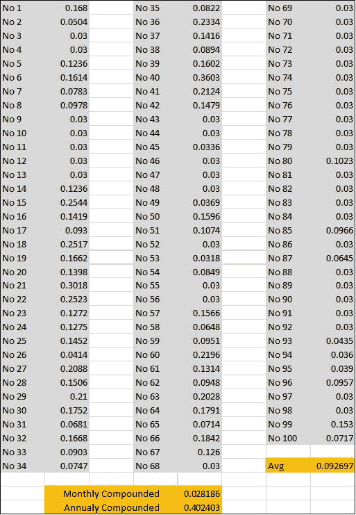

# 加密期货、融资利率和杠杆

> 原文：<https://medium.com/coinmonks/crypto-futures-funding-rate-and-leverage-4f77813f394f?source=collection_archive---------1----------------------->

Gerd Altmann from Pixabay [https://pixabay.com/illustrations/dollar-currency-money-us-dollar-517113/](https://pixabay.com/illustrations/dollar-currency-money-us-dollar-517113/)

根据 Block[https://www . The Block crypto . com/linked/56019/open-interest-for-bit coin-futures-supers-50 亿美元](https://www.theblockcrypto.com/linked/56019/open-interest-for-bitcoin-futures-surpasses-5-billion)的数据，截至 2020 年 2 月，各交易所的比特币期货未平仓合约已达 50 亿美元。

虽然这不到比特币网络价值的 3%，但这是一个高增长市场(自 2019 年 9 月以来增长了近 150%)，杠杆可以轻松扩展到 50 倍。鉴于比特币市场平均每天的交易价值约为其网络价值的 5%，并且其中很大一部分是未使用的产出(但这里没有显示交易所账户的交易——只有转账)，期货活动构成了比特币价格甚至方向性的重要驱动力。

对于这篇文章，我将忽略非比特币期货(假设它们最多只占比特币未平仓权益的 10%以下)，而专注于与融资利率相关的杠杆效应。

首先一个定义:资金利率是期货合约持有者一方支付给另一方的费用。这是永久合约的一个特征，它是由没有结算日的期货合约定义的。交易所通过融资利率进行传递，这是由头寸持有人之间的交易所进行的。

理由是，这一利率将有助于期货价格在多月期间以预期的方式更紧密地与现货价格趋同，但在现货价格长期上涨或下跌期间，期货往往会在曲线前移动。因此，在上涨的市场中，期货价格往往高于现货价格，而在下跌的市场中，期货价格往往低于现货价格(可能没有上涨阶段那么明显)。

你可以找到更多的资金利率: [*这里*](https://support.kraken.com/hc/en-us/articles/360024615952-Overview-of-fees-on-Kraken-Futures) 来自北海巨妖和 [*这里*](https://www.bitmex.com/app/perpetualContractsGuide) 来自 Bitmex。

我们所说的典型融资利率是多少？为什么写他们很重要？杠杆在这里起作用吗？

首先，回顾一下 Bitmex 的融资利率——最大的期货交易所，拥有约 20%的未平仓合约。从下面的图表可以看出，最近 100 个融资利率点(在 Bitmex 上是 8 小时周期)都是正数。这意味着多头已经为交易所交易的比特币价格相对于现货的正价差支付了空头。

Bitmex Last 100 Funding Rate Observations (19 February 2020)

每天 100 次观察的平均值为 0.092697%。虽然这看起来是一个小数字，但按月复合计算，每月为 2.81%，每年为 40.2%。

现在让我们试着理解这在实践中意味着什么。首先，请注意，如果你交易的是一对货币，这个成本就相当于利差。例如，如果你买入欧元兑美元，你的期货价格将高于现货价格，以反映美国利率高于欧元区利率的事实。自然，做空欧元/美元会产生回报，或者换句话说，当做空该合约时，买方将从高于现货价格的价格中获益。

回到比特币，请注意，由于它是无息资产，每年 40.2%的美元融资成本是巨大的。这当然是对价格上涨的预期和价格追逐高杠杆头寸的结果。然而，考虑到成熟的市场，即使在下跌趋势中可能会迅速转为负值，这也太高了。

实际上，这个机制是如何影响作为投资者/交易者的你的:

你送 1000 美元的抵押品。

你以 20 倍的杠杆交易获得 20，000 美元的突出价值。

在目前的融资费结构下，价格没有变化，如果你做多，就支付融资费，如果你做空，就收到融资费。

因此，无论哪种方式，你的年成本将是突出的价值 x 年成本。在本例中，这是 20，000 x 40.2% = 8，400 美元。

而如果价格停滞不前，这种正利差将会崩溃，因为这种利率会持续一段时间(即大多数主要交易所的最后一个月)；如果价格回到这个融资费用周期开始时的起点，那么上述成本(和收益)将在没有任何实际价格变化的情况下增加到不同的方面。

换句话说，杠杆放大了融资费用效应，因此 40.2%最终可能是 40.2%乘以(与杠杆限制一样大)50。由于大多数交易在较短的时间内完成，投资者倾向于站在不同的一边，这种影响可能会被忽视。如果研究更长时间的融资费用，费率将更接近于零，但不一定是几个月的时间，这可能对投资者的净利润产生很大影响。

另一方面，长期的正或负融资费用往往与投资者情绪密切相关。因此，在融资费用长时间倾向于一个方向，随后价格向该方向移动后，可能意味着向相反方向移动的可能性正在增加。

最后，如果你还没有做的话，请记下基金费用及其对你的头寸的影响。这个非常有用的机制可以有效地改变交易的整体回报，如果在一段时间内不加检查的话，会变得更好或更坏。

> [在您的收件箱中直接获得最佳软件交易](https://coincodecap.com/?utm_source=coinmonks)

