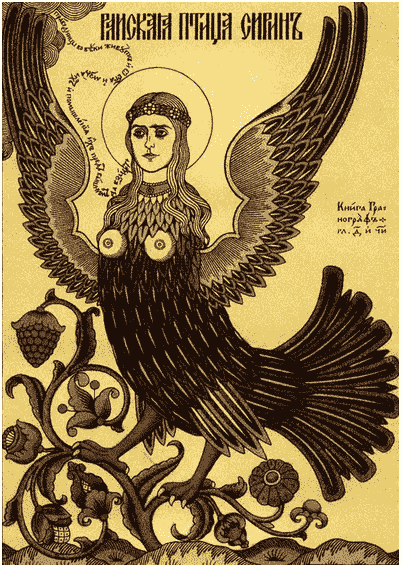
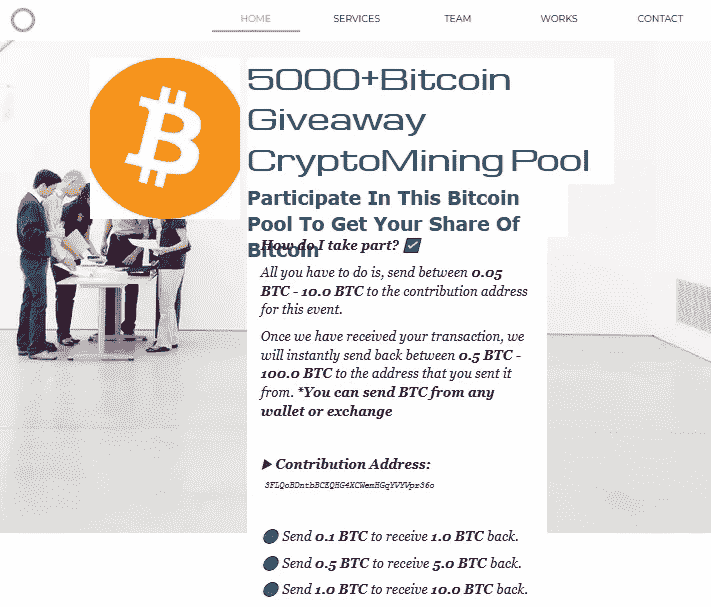
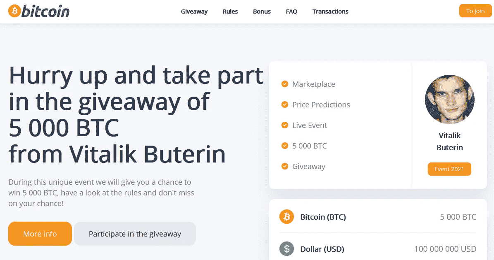
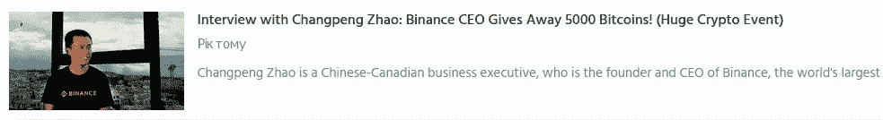
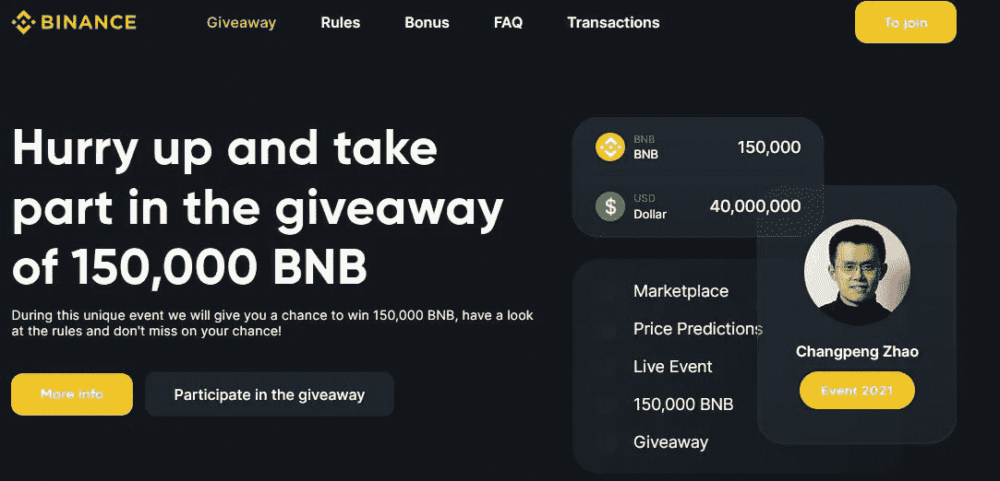
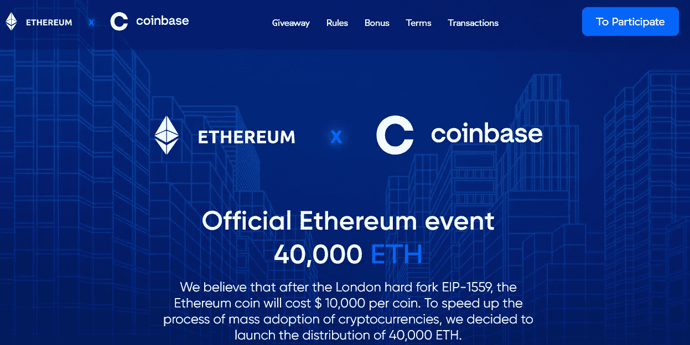
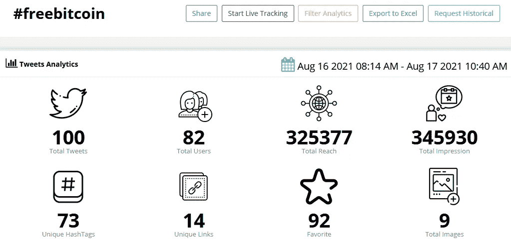
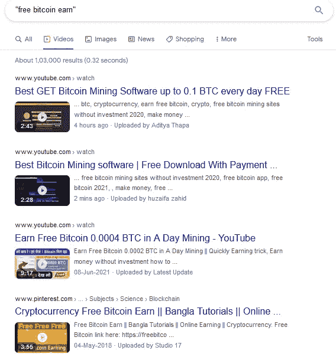
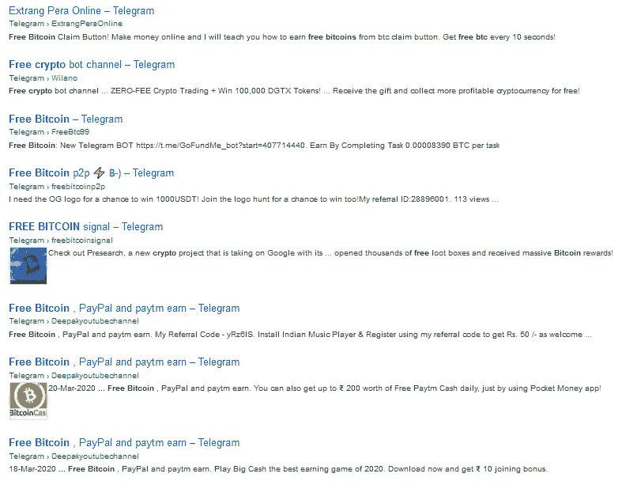
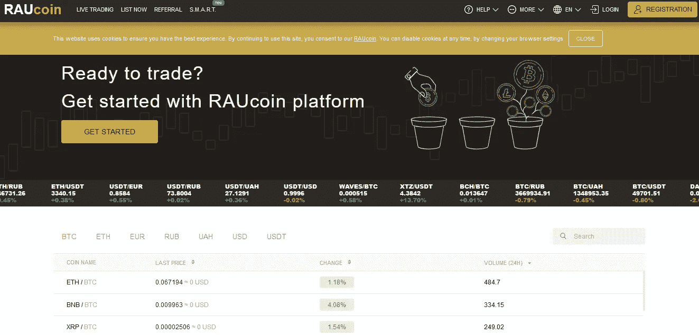

# 加密赠品:加密空间中的时间神圣诱饵

> 原文：<https://medium.com/coinmonks/crypto-giveaway-time-hallowed-bait-in-cryptospace-113496982483?source=collection_archive---------3----------------------->

## 不要被骗

对于一个公司来说，免费赠品对于与客户建立和谐的关系是很重要的。这就固化了信任、品牌口碑、口碑牵引等各种因素。这些活动通常由需要迅速吸引公众注意力的新企业进行。

在加密货币中，“T2”比特币赠品“T3”已经出现在网络空间的每个角落。很快，许多人甚至不检查广告促销活动/内容的合法性就跟风而上。在大多数情况下，它只是以将密码爱好者的钱输给一个组织良好的诈骗网络而告终。就像“塞巴斯蒂安”,他被 T4 的电子商务推广网站“T5”的比特币赠品骗了，损失了 10BTC(为了让比特币翻倍),总计损失了 561975 美元。

这种视觉吸引力的网站是不可信的



**Siren** | Image Credit: Meyoko Illustrations

> 注意:塞壬是希腊神话中的生物，它们在海里优美地歌唱。迷人的汽笛声让水手们失去了理智，忘记了方向，最终溺死在海里。这就是为什么在现代语境中“警笛”这个词代表**警告信号**。

这种诈骗网站是塞壬的现代表征，他们失去了对感官的控制，陷入了比特币赠品的诱饵。

在这篇文章中，我们将揭露这种骗局，并提供一个关于加密领域**该做什么和不该做什么**的见解。

有不同类型的比特币赠品:-

**独立活动**

这些活动以自我为中心，举办加密货币赠品活动，在其宣传广告中不绑定任何个人/组织。以下是一个例子



Landing Page: bitcoin-giveaway.website2.me

在这个[网站上，](http://bitcoin-giveaway.website2.me/)威胁者给出了一个比特币地址，通过引诱比特币持有者将其比特币翻倍来接收他们的付款。

**名人冒名顶替**

密码领域的知名人士是骗子进行网络钓鱼活动的常见目标。这通常由以下人员进行

> 1.在域名上选择名人名字
> 
> 2.在托管网站上出现名人照片


Elon featured in a fake Bitcoin & Ether Giveaway (SCAM)

以下是一个名人冒名顶替钓鱼的案例



Giveaway Scam featuring Vitalik Buterin

这是来自网站的截图: **2021-buterin.online** 其中 **Vitalik Buterin** (以太坊创始人)是赠品骗局驱动的主角。

其他密码行业的名人如埃隆·马斯克、迈克尔·塞勒、赵昌鹏、布莱恩·阿姆斯壮、查理斯·霍金森等名列前茅。



A Fake Video advertising Giveaway from Binance Founder

**虚假从属关系**

这种类型的赠品骗局是通过将合法的加密机构如比特币基地、币安等绑定到虚假的赠品促销活动中来实现的。与其他骗局相比，这种类型的骗局更成功，因为许多公认的加密机构偶尔(如 Hardfork 或 Christmas)会举办此类赠品活动。因此，公众会对此类事件持乐观态度，而不会持怀疑态度。



Landing Page of binance-gift.com



Landing Page [ch-event.com]

**推广如火如荼**

骗子们很聪明地瞄准了兴趣各异的不同群体，以便从集体行动中获取最大利润。因此，许多公共平台被锚定为宣传虚假赠品促销。

大多数赠品通过推特获得关注。比方说，让我们看看赠品标签的范围:-



**Twitter Analytics for the keyword “Free Bitcoin”**

这是 Twitter Analytics 中记录的单个关键词“ **freebitcoin** 命中的结果，该结果在一天内获得了 32.5 万次点击。

> **注意**:大部分推广/推文来自水龙头网站手柄，如 freebitco.in 或 CoinPump 等。推特更集中于拉丁美洲国家

从这个关键词来看，很明显，“赠品”的热潮不会很快过去，而且随着加密货币的采用量激增，它将继续获得更多的牵引力。

> **注**:在调查过程中，还发现有很多赠品 Twitter 句柄，拥有大量的黑名单关注者。

一个简单的谷歌搜索就能显示这类骗局的近期发生情况。



Google Search Result

上述搜索查询从谷歌获得了约 100 万个结果(骗局)。如果你仔细观察，你可以看到一些声称免费比特币的视频是在几分钟/几小时前上传的，这使得这成为比特币人的热门话题。

我测试了一个名为“ **SpiderBit** 的此类广告矿工，发现它在几个平台上都是恶意的。这里是[链接](https://www.virustotal.com/gui/file/1f5029b2845ad02999d5732385e397d3994e4a3a45f860bf1901715feb996f93/details)查看报告。以下是 IOCs

```
MD5: 986239e3d9b0753d74b0b1ea0d8826e3
SHA-1: 52c98ca62f041861c85e4cd1a002294b23f0876d
SHA-256:1f5029b2845ad02999d5732385e397d3994e4a3a45f860bf1901715feb996f93
```

脸书、Telegram 等其他平台无异于传播关于比特币或其他替代币的错误信息。



“Free Bitcoin” search query in Telegram Groups

这是电报搜索中的一个搜索查询，在群组中收获了大约 35K 个结果。由于这些数字令人震惊，很明显，许多人会上当受骗，最终受益的是骗子。

**专门的“假”交易平台**

有许多针对新手交易者的交易平台不断涌现。这些都是骗子为了诈骗老百姓而设的蜜罐。



Raucoin.com


Bloomextra.com

> 注意:我们将在另一篇文章中讨论虚假交易

从上述平台可以明显看出，骗子密切关注每一个社交媒体平台**以便传播错误信息，有时还会策划一场伪装成加密赠品计划的网络钓鱼活动。**

**赠品骗子的作案手法**

> 1 **。选票填充评论**:由于许多新推出的加密货币网站没有获得干净的支票，骗子们利用 TrustPilot 等各种平台上的选票填充评论。
> 
> 2.**引人注目的视频**:骗子经常使用 Streamable 或 Vimeo 等视频平台来宣传虚假赠品的诈骗项目，因为 Youtube 视频链接一旦被识别为诈骗就很容易被删除(这并不意味着 Vimeo 正式支持诈骗项目，但删除行动会很慢)。大多数视频没有显示确切的网址，因为它们是伪造的，并在骗子的机器上本地运行(改变 BTC 平衡以吸引受害者)。
> 
> 3.**虚假钱包余额**:许多龙头网站宣传巨额回报或最佳加密汇率(加密兑换)，并会显示用户个人账户/钱包中的良好余额。但这里有一个技巧:-用户将无法提取，导致资金冻结。大多数用户没有意识到这一事实，因为他们耐心地等待更大的金额累积到他们的帐户中，希望立即提取。
> 
> 4.**空投假面具**:空投新代币/加密货币是真的，但比特币、以太、Ada 等知名加密货币的赠品可能是骗局，除非是由任何经过认证的渠道托管。许多人被新令牌欺骗，因为新推出的令牌无法从区块链空间获得干净的凭证。
> 
> 5.**隐私屏蔽诈骗网站**:发现大部分赠品网站托管有隐私屏蔽服务(大部分位于**冰岛**-保留隐私)，因此排除了 Crypto 项目的真实性。
> 
> 6.**自动交易**:永远不要让任何人进入你的加密资金进行自动加密交易，期望获得高额回报。
> 
> 7.**妄想的 PC 矿工程序**:surface web 上有大量的加密矿工程序，引用为“**用你的家用 PC** 赚取免费比特币”。你需要明白一个事实，比特币只能通过使用专门的硬件设备如 Antminer 或专用的采矿钻机来开采。这是因为在区块链确认一个比特币区块需要额外的力量。下载并安装一个软件不会给个人电脑任何特权。

**诈骗清单— IOCs**

以下是骗子使用的诈骗网站和比特币地址列表

[](https://docs.google.com/spreadsheets/d/1agyaaY3AH_hWujqQHX5wwgh3wi5k8UmvPx1jVkBFCYo/edit?usp=sharing) [## 加密赠品诈骗名单

### Sheet1 网站，比特币，以太坊，DOGE，ADA saylor-strategy.com…

docs.google.com](https://docs.google.com/spreadsheets/d/1agyaaY3AH_hWujqQHX5wwgh3wi5k8UmvPx1jVkBFCYo/edit?usp=sharing) 

如果遇到新的赠品骗局，您可以编辑表格并添加。如果你将来调查这类案件，这个电子表格会对你有帮助。请随意向此列表贡献虚假加密赠品骗局，并帮助社区。

> **注意**:我在 50 个条目的列表中只添加了 4 种加密货币。还有许多网站展示了其他流行的替代硬币。

随着科技以更快的速度发展，骗子们利用智能科技来欺骗公众。在 Deep Fake 等技术的帮助下，任何骗子都可以模仿合法的人格，并可以推动虚假赠品活动！在钻研这些“有前途的”提议之前，运用你的逻辑；-)

> 在 [Twitter](https://twitter.com/RakeshKrish12/) 上关注我，了解有趣的 DarkWeb/InfoSec 简短发现！；-)

> **注:- *本文纯属个人研究，未经作者同意，不得在任何地方使用/发表。***

> 加入 [Coinmonks 电报频道](https://t.me/coincodecap)，了解加密交易和投资

## 另外，阅读

*   [尤霍德勒 vs 科恩洛 vs 霍德诺特](/coinmonks/youhodler-vs-coinloan-vs-hodlnaut-b1050acde55a) | [Cryptohopper vs 哈斯博特](https://blog.coincodecap.com/cryptohopper-vs-haasbot)
*   [币安 vs 北海巨妖](https://blog.coincodecap.com/binance-vs-kraken) | [美元成本平均交易机器人](https://blog.coincodecap.com/pionex-dca-bot)
*   [如何在印度购买比特币？](/coinmonks/buy-bitcoin-in-india-feb50ddfef94) | [WazirX 评论](/coinmonks/wazirx-review-5c811b074f5b) | [BitMEX 评论](https://blog.coincodecap.com/bitmex-review)
*   [比特币主根](https://blog.coincodecap.com/bitcoin-taproot) | [Bitso 点评](https://blog.coincodecap.com/bitso-review) | [排名前 6 的比特币信用卡](/coinmonks/bitcoin-credit-card-bc8ab6f377c6)
*   [双子座 vs 比特币基地](https://blog.coincodecap.com/gemini-vs-coinbase) | [比特币基地 vs 北海巨妖](https://blog.coincodecap.com/kraken-vs-coinbase) | [硬币罐 vs 硬币点](https://blog.coincodecap.com/coinspot-vs-coinjar)
*   [印度加密交易所](/coinmonks/bitcoin-exchange-in-india-7f1fe79715c9) | [比特币储蓄账户](/coinmonks/bitcoin-savings-account-e65b13f92451) | [Paxful 审核](/coinmonks/paxful-review-4daf2354ab70)