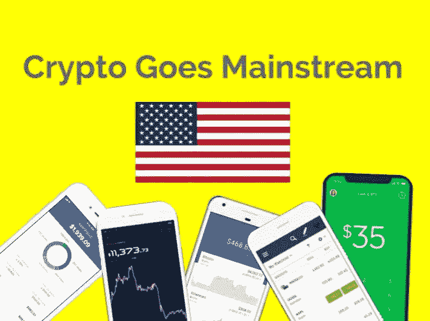
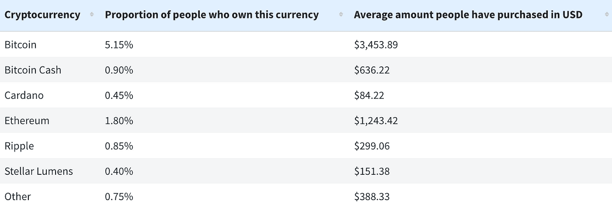
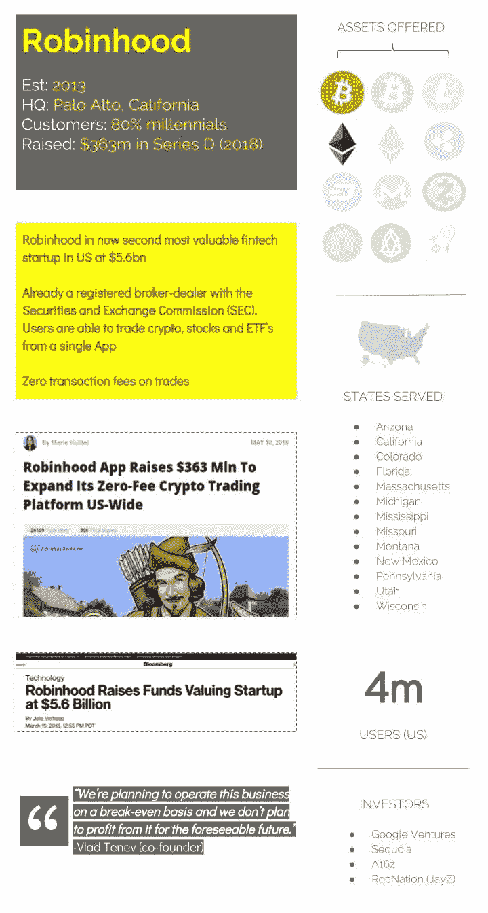
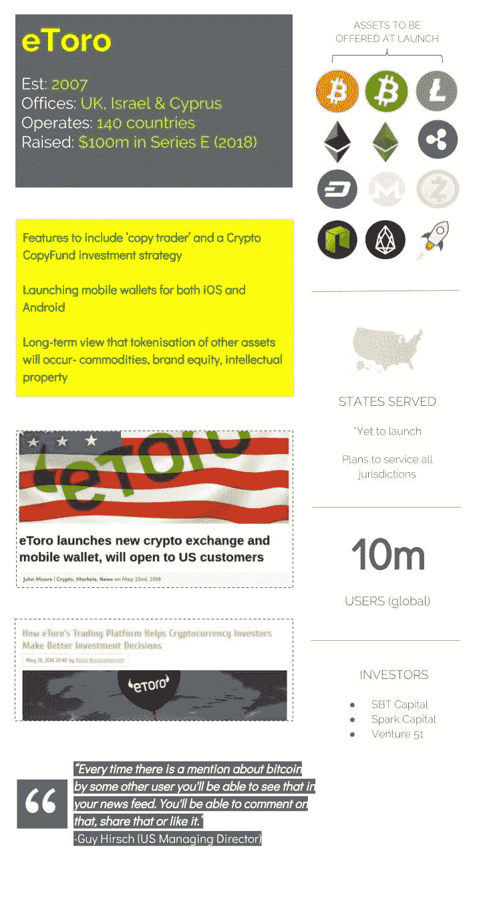
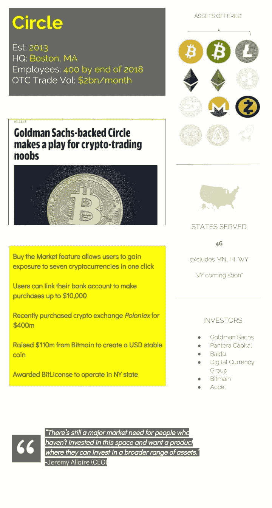
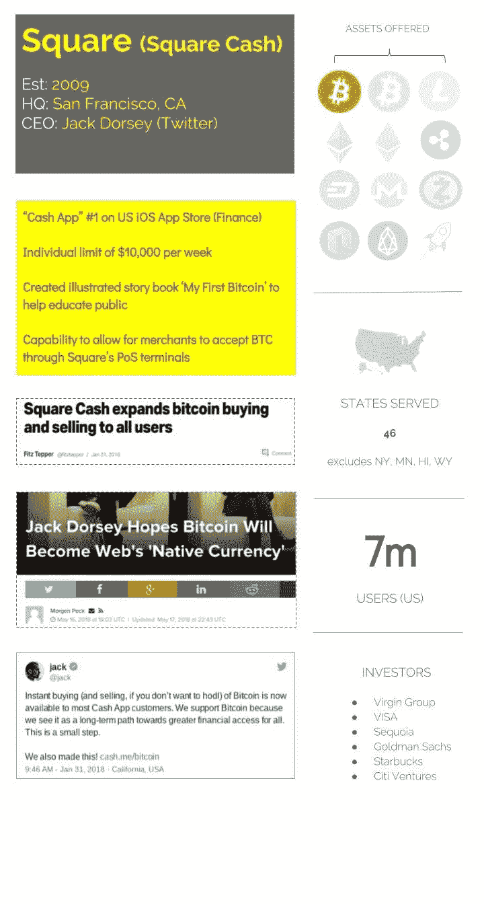
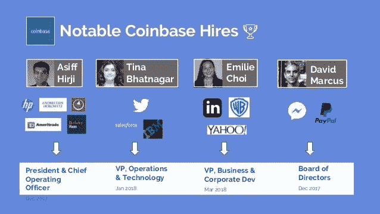
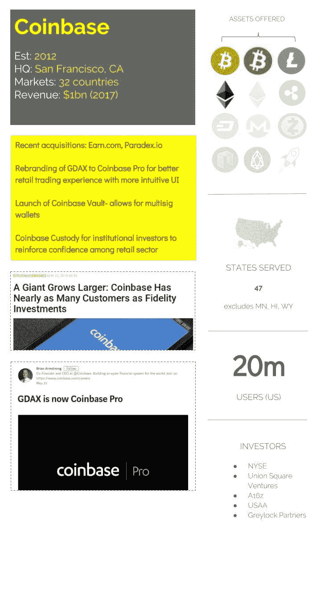

# 加密成为主流:美国散户投资者之战

> 原文：<https://medium.com/coinmonks/crypto-goes-mainstream-the-battle-for-the-u-s-retail-investor-ba20cd9319a0?source=collection_archive---------7----------------------->

尽管在过去的六个月里，cryptoasset 受到了所有媒体的关注，但认知度可能很高，但采用率仍然很低。理解上的技术、安全和经济障碍可能在阻止散户投资者更广泛采用方面发挥了作用。

2017 年 12 月，[发现者](https://www.finder.com/)对 2000 名美国成年人进行的[调查](https://www.finder.com/why-people-arent-buying-cryptocurrency)显示，不到 8%的人拥有任何地下室。

Source- [finder: Why People Aren’t Buying Cryptocurrency](https://www.finder.com/why-people-arent-buying-cryptocurrency)

2017 年，普通公众进入加密资产市场的选择有限。比特币基地曾寄希望于对该行业日益增长的兴趣，尽管可以肯定地说，他们对随后出现的狂热规模视而不见。尽管他们在位于 [#1](https://techcrunch.com/2017/12/07/coinbase-hits-top-spot-on-apples-us-app-store/) 的苹果美国应用商店中短暂占据了至高无上的地位，但他们仍然遭受着超负荷的服务器、积压的客户服务请求和[银行收费错误](https://www.theverge.com/2018/2/15/17017374/coinbase-cryptocurrency-bitcoin-ether-unauthorized-charges)的困扰。

对于新来者来说，纯粹基于密码的交换有时缓慢而繁琐，并且与已经拥有商誉的公司/品牌没有关联(除非 Circle 最近收购了 Poloniex ),这使得为 KYC/反洗钱而放弃你的护照细节和银行账户信息令普通公众担忧。

快进到今天，你会发现现在不缺少公司希望利用这个市场的空白。

**减少障碍=增加潜在市场**

一个巨大的赌注是，为了加入美国零售加密交易商/投资者的下一波外围浪潮，你需要提供快速、可靠和直观的移动平台，同时充当保管钱包。2018 年的剩余时间将会有多家加密资产托管机构，它们都有独特的定位和服务产品，以迎合美国市场。因为面对现实吧，群众不愿意，或者说不能安全地管理自己的私钥。下面是一些移动友好的菲亚特入口，旨在吸引美国零售加密投资者/交易者。

# 1.罗宾汉

由于他们的零费用股票交易，他们已经有了一批追随者。五年前 reddit 上的一个帖子引发了一场风暴。在宣布提供加密资产交易的计划后，超过 100 万客户注册了早期访问。

**为什么重要** - **零费用加密资产交易**。Robinhood 计划让这项服务成为一个亏损的领导者，在最近的 D 系列之后，他们有足够的资金在一个重要的时间范围内维持自己。他们还拥有高度参与的客户群，已经在他们的平台上交易(股票)。

# 2.eToro

Yoni Assai(eToro 的首席执行官)对加密资产并不陌生，早在 2011 年，他就和 Vitalik Buterin 一起为[彩色硬币](https://docs.google.com/document/d/1AnkP_cVZTCMLIzw4DvsW6M8Q2JC0lIzrTLuoWu2z1BE/edit)撰写了白皮书。此外，eToro 早在 2014 年就向特定市场的客户提供比特币差价合约。

**为什么重要-** **1)** **社交交易。** eToro 成功地将社交媒体(如趋势、评论和分享)的相同多巴胺生成原则与加密交易平台整合在一起(无意冒犯 Poloniex trollbox [R.I.P])。鉴于 Twitter 和 Reddit 在加密信息领域的重要性，这对于临时加密交易员来说是一个有吸引力的功能。 **2)** 通过**“复制交易者”**功能模仿其他交易者交易的能力。最初将提供 10 项资产，这是其竞争对手中最广泛的令牌产品之一。

> “从房地产到金属、大宗商品、股票、知识产权和品牌资产——都将在未来十年被符号化。”
> 
> *-盖伊·赫希(eToro 美国董事总经理)*

# 3.圆

Circle 号称是一家“全球加密金融公司”，目前每月处理超过 20 亿美元的场外交易，并提供大量互联产品以将用户留在他们的系统中——支付(Circle Pay)、投资(Circle Invest)和交易(Poloniex & Circle Trade)。在高盛(Goldman Sachs)和百度(Baidu)等投资者的支持下，可以合理地认为，他们有机会接触到独特的合作伙伴、政治影响力和资源，以确保他们的持续增长。

**为什么重要-** 他们持有 [**比特许可证**](https://bitsonline.com/lawsky-bitlicense-ripple-board/) 在纽约州经营，是仅有的 5 家公司之一(包括比特币基地)。他们最近的转向和重新启动意味着他们可以立即接触到该州的 2000 万居民，这些居民多年来一直没有得到充分的服务，因为许多与密码相关的企业[收拾行装](https://www.coindesk.com/bitlicense-refugees-kraken-shapeshift-ceos-talk-escape-new-york/)前往更受欢迎的监管牧场。Circle 最近也宣布了他们自己的 stable coin (USDC)，由吴&(加密采矿芯片制造商和采矿池运营商——ant pool)提供 1.1 亿美元的支票资助。到目前为止，所有稳定的硬币都面临着挑战，我们必须监测 USDC，看看它长期表现如何。在差异化方面，Circle 提供了“购买市场”功能，允许用户立即购买其提供的七种加密资产的定制加权指数。

# 4.平方

便携式 PoS 终端提供商 Square Cash 凭借其 [Square 读卡器](https://squareup.com/ca?gclid=Cj0KCQjw0a7YBRDnARIsAJgsF3N-o3zClwIKYVEorIki8pLsTG7SeJRgznG4NGg1Zr_8Qh9Cw2F7JgIaAqSuEALw_wcB&pcrid=252503075202&pdv=c&pkw=square+reader&pmt=e)席卷了独立的商品和服务业务，并拥有 700 万美国客户，之后于 2015 年推出了 Square Cash，以促进集中式点对点支付。这一现有的商业客户群将有可能接受比特币作为一种支付方式，而不会对服务造成太大影响。

**为什么重要-** 杰克·多西有一个雄心勃勃的计划来帮助**将比特币提升为互联网的本土货币**。鉴于他担任 Twitter 首席执行官的任期，可以说他对网络如何在未来发展以促进价值转移有着独特的见解。

# 5.比特币基地

最后但并非最不重要的一点是，比特币基地近年来发展迅速。该公司制定了宏伟的计划，消除了去年困扰它的许多运营瓶颈，并积极吸引人才，这将有助于推动未来几十年的连贯战略。

*Source-* [*Follow the Talent: Career Moves within Crypto*](https://www.slideshare.net/AnilPatel49/follow-the-talent-career-moves-within-blockchain)

**为什么重要-** 最近的一系列公告-重新命名和重新设计他们的交易平台 *GDAX* 为 [*比特币基地 Pro*](https://pro.coinbase.com/) ，升级比特币基地金库以支持 [multisig](https://en.bitcoin.it/wiki/Multisignature) 钱包，最近收购了 Paradex.io 和 Earn.com-所有这些都表明，未来比特币基地将在塑造加密资产生态系统的快速发展中发挥关键作用。

> "很简单地说，我们想成为加密的谷歌."
> 
> *-亚当·怀特(副总裁&总经理)*

这就是我们的现状。我们从这里走向何方是任何人的猜测，但你可以肯定的是，下次美国零售人口决定[一起进入所有加密市场](https://twitter.com/CryptoMessiah/status/980933505654943745)时，基础设施、工具和服务将在很大程度上到位，具有吸引力的激励措施和客户保留意识。

如果您想查看整套幻灯片，您可以在 这里查看 [**。**](https://www.slideshare.net/AnilPatel49/crypto-goes-mainstream-the-battle-for-the-us-retail-investor)

***关于作者***

*Anil 是加密资产管理、趋势和托管领域的顾问和教育家。Anil 最近推出了首个区块链大学奖学金。他在加拿大温哥华工作*