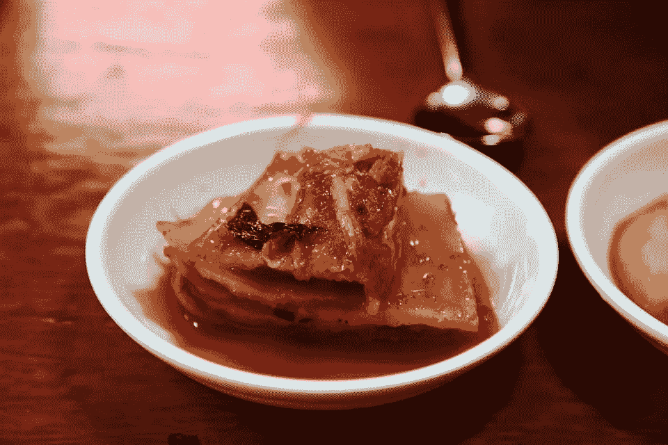
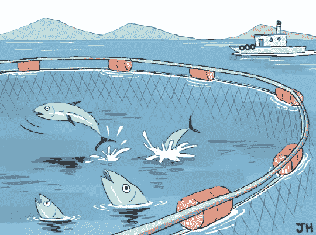

# 韩国的秘密文化——汉江热

> 原文：<https://medium.com/coinmonks/crypto-in-korea-the-past-and-the-future-fe0514bbfbd8?source=collection_archive---------1----------------------->

渔网和发酵卷心菜与韩国的秘密产业有什么共同之处？

*为什么韩国人喜欢加密交易，这个行业在不久的将来会有怎样的变化？*

*用一个词来形容韩国的秘密故事再合适不过了，那就是赌博。但这种情况即将改变。*

很少有人**没有**听说过韩国的比特币。

2017 年，一个人口刚刚超过 5000 万的国家完成了所有比特币交易的 20%，是 ETH 的最大市场。多达 300 万用户开设了加密交易账户。韩国学生在课间查看比特币价格，工人们在排队买咖啡时交易比特币，[爷爷奶奶在家里玩市场](https://money.cnn.com/2017/12/12/technology/south-korea-bitcoin-mania/index.html)。

[Kimchi — a popular side dish and a crypto phenomenon.](https://www.koreaexpose.com/kimchi-premium-arbitrage-cryptocurrency-regulations-korea/)

当韩国本地比特币价格比美国交易所高出 40%时，这种狂热达到了顶峰。Coinmarketcap 甚至从加密汇率中下调了韩国价格。这种现象被称为“泡菜溢价”:著名的发酵卷心菜配菜。

2018 年政府打击投机活动后，泡菜溢价消失了。首先，政府强迫使用实名银行账户进行密码交易，并在当年晚些时候完全禁止 ico。泡菜的溢价可能早已消失，但狂热仍在:

> -7%的韩国人在 2019 年购买了[#加密资产](https://www.linkedin.com/feed/hashtag/?keywords=cryptoassets&highlightedUpdateUrns=urn%3Ali%3Aactivity%3A6662990914602045440)。
> -人均投资 6 000 美元。
> -60% —是投资金额较 2018 年的增长。

 [## 韩国正在为比特币疯狂

### 在韩国，学生在课间查看价格，工人在排队买咖啡时交易价格，还有…

money.cnn.com](https://money.cnn.com/2017/12/12/technology/south-korea-bitcoin-mania/index.html) 

对这种狂热的一个解释是韩国对新技术的接受很快，但还有更多原因:文化和叙事。

了解韩国文化:汉江上的奇迹

1950-1953 年的朝鲜战争使韩国成为世界上最贫穷的国家之一。2020 年，它是最富有的国家之一。

快速的经济增长归功于被称为“财阀”的家族企业集团、对出口的重视、劳动力的努力工作以及韩国人的心态。做事又快又好的心态。

빨리 빨리(快！快！)心态渗透韩国人的生活方式。分秒必争。食物必须快速送达，火车必须准时到达，建筑物必须在几周内建成。无论你做什么，请快速有效地做。快速致富也不例外。

然而，变得更加富有变得更加困难。自 2012 年以来，经济增长已经从 2000 年之前的两位数增长放缓至 3%左右。因此，致富的方法包括投资股票或房地产，然而，市场并不适合所有人。

缺乏高风险投资的 T2，当房地产变得昂贵和利率上升时，房地产和国内股票就变得不那么有吸引力了。衍生品交易有严格的认证要求，自 2011 年以来，科技股指数 KOSDAQ 几乎没有上涨。长期以来，另一种选择是赌博。

**快速致富的方法——赌博。**

问题是，赌博在韩国甚至不合法。

包括彩票、赛马、赛船和骑自行车、赌场赌博在内的游戏是非法的——甚至对出国旅游的韩国人也是如此。

> [根据政府于 2012 年成立的韩国赌博问题中心](https://www.usatoday.com/story/sports/winter-olympics-2018/2018/02/23/south-korea-wants-build-casino-industry-where-all-welcome-but-koreans/366031002/)的数据，韩国的赌博成瘾率比其他主要国家高两到三倍。虽然还不清楚这些统计数据是如何编制的，但韩国人特别容易染上赌瘾的观点是一种广泛传播的社会理论，它为围绕这一问题的法律提供了信息。

由于其他投资受到限制，加密被视为快速致富的途径。

韩国人将秘密交易视为赌博，试图在短时间内赚很多钱。

在西方,“解除银行禁令”、“做多比特币，做空银行家”或“比特币是一种数字感冒”的秘密故事正主导着叙事。但在韩国，这些故事的影响力较小，因为韩国人对金融和银行业的信任度很高。

归根结底，比特币作为数字黄金的故事不够诱人，因为黄金的价格不可能在一天内暴涨 100%。

**那么，一个封闭的渔网和密码有什么关系呢？**

为了让交易者参与进来，让肾上腺素激增，一些本地交易所成了满足需求的专家。

例如，在主要交易所上市总是吸引投资者的注意，但只有在韩国，退市同样是一个机会。

> 退市窗口要求关闭存款，因此随着新代币的流入受到限制，投机者抬高价格，以便在不可避免的抛售之前做最后一搏。自然，在投机者中，退市通知与上市一样受到关注，甚至更多。

更刺激的盛宴是交换维护。当存款和取款被关闭，但交易没有被禁止，有一个名字叫가두리(一个封闭的网用来容纳活鱼)。就像无法逃脱网的鱼一样，封闭的市场不依赖于外部价格，套利也是不可能的，这使得在这种环境下进行交易成为一场真正的赌徒盛宴。

가두리 — an inclosing net used to contain live fish

公平地说，这种内部市场交易在韩国的股票交易中也很流行，但 crypto 提供了使用之前已经测试过的相同工具的新机会。

一些交易所甚至不屑于开放加密存款和取款，而是专门专注于内部市场交易。随着韩国出台新的加密法规，这些交易所已经面临消亡。

**监管——处于变革边缘的行业**

从明年 3 月开始，交易所必须向金融监管机构注册。所有交易所都必须拥有 ISMS 证券许可证和实名制银行账户(只有 4 家交易所两者都有)。在 2021 年 9 月之前未能注册的[加密货币交易所的负责人可能面临最高五年](https://theicon.ist/2019/11/22/passing-of-ftra-revision-opens-path-to-crypto-normalization/)的监禁或最高 5000 万韩元的罚款。

> 随着交易所数量的减少和监管审查的加强，韩国的新股上市也可能变得罕见。[此外，有人提议从 2021 年 10 月开始对加密货币收益征收 20%的税](https://thenews.asia/korean-crypto-tax-amendment-sent-for-review/)。

 [## 韩国的秘密监管:交易所获得政府的批准。

### 《报告和使用特定金融交易信息法》修正案，又称《金融…

medium.com](/@hanbitco.com/crypto-regulation-in-korea-exchanges-get-green-light-from-the-government-48221279bbe3) 

随着所有这些变化，作为赌博或快速致富方式的替代方案的秘密叙事可能会发生变化。这也意味着投机者的法定资本流入减少，但从好的方面来看，机构投资者和狂热的加密信徒将拥有一个更加透明、可信和可持续的投资环境，并将最终创造一个新的加密叙事。

> [*在您的收件箱中直接获得最佳软件交易*](https://coincodecap.com/?utm_source=coinmonks)

