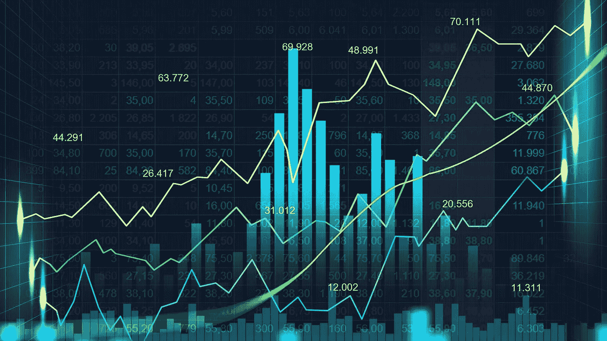

# 加密指数比较—哪个指数的回报最高？

> 原文：<https://medium.com/coinmonks/crypto-index-comparison-which-index-has-the-highest-return-ce5e1cf71f82?source=collection_archive---------2----------------------->

加密市场早已不再仅仅由比特币和以太坊组成。与此同时，不同地区有数千种加密货币，涵盖各种使用案例，目前需求旺盛。此外，几乎每天都有新项目推出，试图用创新的方法解决当今的问题。