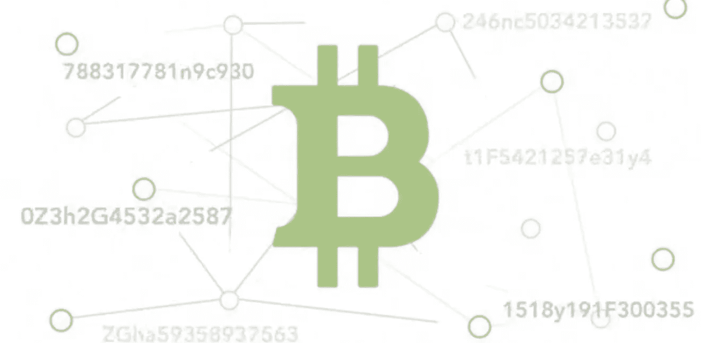
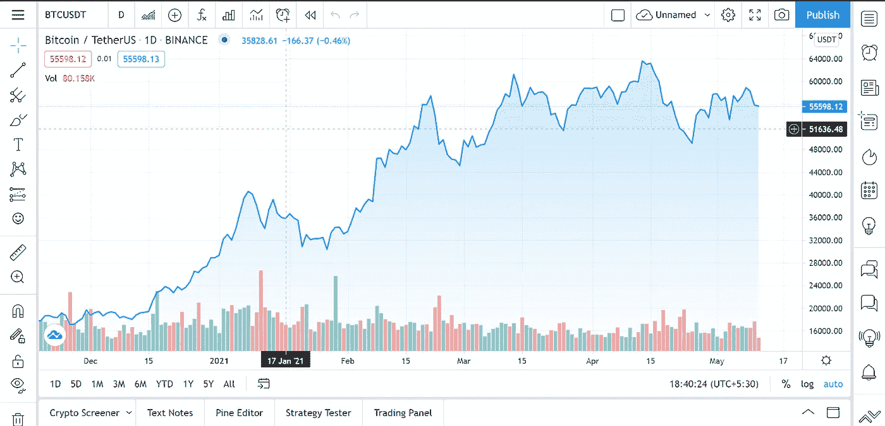
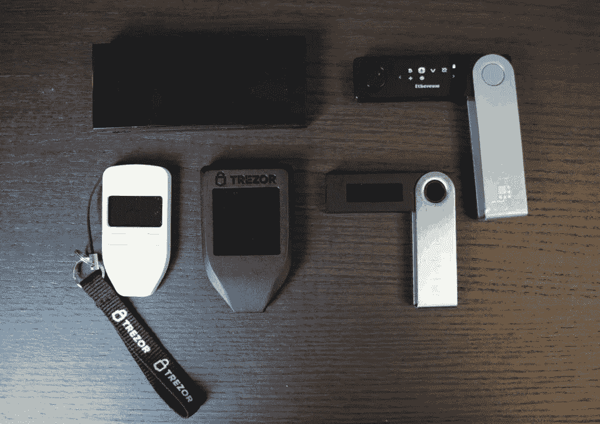
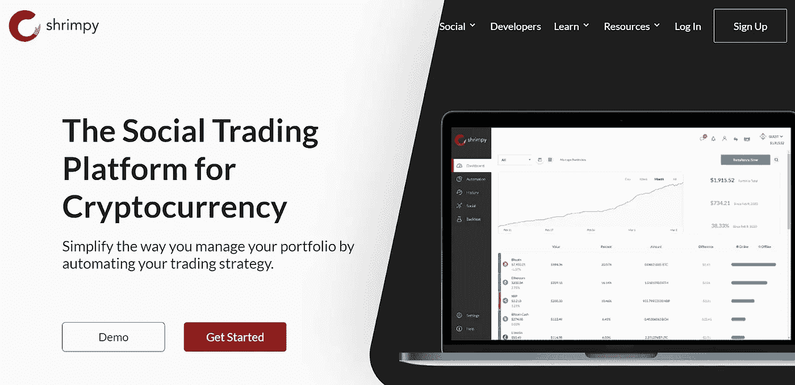
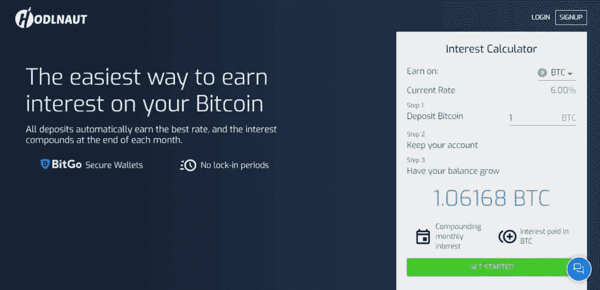

# 印度加密货币投资指南[2021]

> 原文：<https://medium.com/coinmonks/crypto-investing-guide-india-96a0a1515de9?source=collection_archive---------4----------------------->

您知道截至 2021 年市场上有超过 10，000 种加密货币吗？现在，如果你正试图投资其中一个，那么选择一个并开始投资可能会很乏味。因此，在本文中，我们将涵盖初学者在投资加密资产之前应该考虑和了解的几乎所有内容。

然而，在深入研究你应该交易哪种硬币/ HODL 之前，你必须了解加密货币的基础知识，以便成功地进行市场研究。

# 总结(TL；博士)

*   加密货币是一种可以用来购买/销售商品的数字货币。
*   [中本聪](https://en.wikipedia.org/wiki/Satoshi_Nakamoto)创造了一个名为[比特币](https://blog.coincodecap.com/a-candid-explanation-of-bitcoin)的点对点数字货币点对点系统。
*   区块链技术使我们能够建立去中心化的服务和产品。
*   这项技术可以彻底改变互联网和金融系统，最重要的是，它可以实现私人货币，这是民有、民治、民享的民主的真正定义。
*   没有人知道哪枚硬币去了月球，哪枚硬币进了垃圾箱；然而，你可以通过它的基本面分析来了解好的项目。
*   作为初学者，大多可以坚持使用[比特币](https://bitcoin.org/)和[以太坊](https://ethereum.org/en/)等热门币。
*   你应该采用一种交易策略，并不断从交易中学习。
*   学会在交易中使用技术指标会帮助你做出明智的决定，而不仅仅是猜测。
*   风险管理可以被认为是交易的一个重要部分，因为获得回报是好的，但失去你的资本是不好的。
*   你可以在任何本地交易所开始交易，并按照本文中的步骤开始。
*   如果你需要适当的安全措施，那就用硬件或离线钱包来存放你的资产。
*   你可以使用交易终端，通过 API 连接不同的交易所，在给定的时间全部交易。
*   加密税务软件让你毫不费力地计算出你所欠的金额。
*   除了储存你的资产，你还可以利用赌注或[加密贷款](https://blog.coincodecap.com/top-5-crypto-lending-platforms)来获得收益。

# 什么是加密货币？

加密货币是数字资产的一种形式。区块链技术有助于加密资产以分散的方式存在和存储所有信息。换句话说，网络中没有中心实体。要了解更多信息，请阅读我们关于什么是区块链的文章？

区块链由加密技术保护；使得更改区块链中的块和添加新块变得非常困难，从而使其高度安全。此外，作为一种分散的货币，没有中央机构能够控制加密资产。现在让我们来理解加密货币是如何产生的。

# 这一切是从哪里开始的？

2008 年 10 月 31 日，一位匿名开发者或一个被称为[中本聪](https://en.wikipedia.org/wiki/Satoshi_Nakamoto)的开发者团队发表了一篇名为[比特币:一种点对点电子现金系统](https://bitcoin.org/bitcoin.pdf)的论文，提到了一种新的去中心化货币及其应用。比特币最初的价值是 0.008 美元，十多年后，到 2021 年 4 月，它的价值已经达到 6 万美元。

比特币矿工解决复杂的数学难题，以处理比特币交易并为网络提供安全，作为回报，比特币区块链奖励他们比特币。要了解更多信息，请阅读我们对比特币的简单解释。

# 什么是区块链技术，它是如何工作的？

你知道区块链技术是从比特币中诞生的吗，而不是反过来？区块链技术允许我们以区块的形式存储数据。这些数据以分散的方式存储在互联网上运行区块链节点的所有设备上。并且当一个新的块出现在链中时，它被添加到所有节点。

区块链技术不仅支持一种新的去中心化货币，而且它还有许多其他应用，例如数字创作者的版权问题。由于侵犯版权，数字创作者损失了数百万美元，因为互联网上的任何人都可以很容易地复制他们的内容。当他们将他们的记录添加到区块链时，公开证明内容所有权是很容易的。

如果你想了解更多关于区块链的技术，你可以参考我们关于[顶级加密货币和区块链课程](https://blog.coincodecap.com/blockchain-courses)的文章。

# 区块链技术如何革新互联网？

因为我们知道区块链技术仍处于初级阶段，因此它的应用比我们今天意识到的要大得多。一系列的金融交易都可以在区块链进行。你可以取消许多不必要的文书工作，区块链也可以在选举期间进行网上投票。

区块链技术允许我们创建数字原生资产，因此，现在我们可以在数字服务中进行激励，并创建一种新型的数字资产。它将改变我们在互联网上货币化服务的方式，并将创造一个更加开放和包容的数字原生货币系统。

# 下一枚去月球的硬币是哪个？

Dogecoin。我打赌你想读这封信，但是等一下，这个星球上没有人能告诉你哪枚硬币会去月球。然而，比特币的数量被限制在 2100 万。因此，它的价值会随着时间的推移而上升。如果有人告诉你一种加密货币，并确信它将是下一个百万美元硬币。不要相信他/她，投资风险自担，因为他们可能是骗子。

# 那么，如何投资一项资产呢？

已知的加密货币有 10000 多种，其中超过四分之三是骗局。所以，老实说，如果你想知道在哪里投资，你需要对这种特殊的加密货币进行研究。

# 新手交易的资产

对于新手来说，我们建议以最小的量开始交易，所以如果你损失了那笔钱，也不会有太大的损失。如果你打算作为初学者投资，那就仅限于 ETH 和 BTC，因为它们是市场上最大的两种加密货币。

# 自己做研究(DYOR)

现在，假设你想投资一种除市值前十以外的加密货币。在这种情况下，你需要研究那个特定的项目。在做市场调查时，你可以记住以下几点:

*   第一步是检查项目的合法性，所以要检查团队、投资者和相关人员。
*   您还应该检查重要的指标，如总供应量、流通供应量、令牌组学、顶级持有者等。
*   你可以阅读互联网上的各种博客，观看 youtube 视频，阅读特定加密货币的白皮书。
*   关注与您感兴趣的加密货币相关的新闻。
*   您可以使用 [TradingView](https://blog.coincodecap.com/go/tradingview) 的各种工具来估计资产的市场走势。
*   最后，研究硬币的基本原理。大多数硬币都在试图提供硬币已经提供的东西。在这种情况下，新硬币可能不那么重要。所以，要一直寻找一个能提供独一无二且难以复制的东西的项目。

# 阅读和理解

投资加密货币最关键的部分是了解你投资的资产。您必须坚持阅读博客、新闻和任何可以增加您对加密资产的理解的相关内容。你可以从这里列出的[篇文章开始。](https://nakamotoinstitute.org/literature/)

关于投资的事情是，如果你通过对特定的加密资产进行适当的研究和分析来投资，那么这就是投资，否则就是赌博。

# 成为社区的一部分

加密社区正在不断发展，你必须成为投资者网络的一部分，才能与他们互动。在密码社区交朋友不仅仅是在 LinkedIn 上联系，然后忘记这个人。相反，社区要活跃得多。要了解更多关于社区的重要性，请阅读我们关于[网络和秘密交友](/coinmonks/how-to-network-and-make-friends-in-crypto-796e123e9584)的文章。

我们还有一个[电报组](https://t.me/joinchat/Trz8jaxd6xEsBI4p)，你也可以加入。

# 了解加密交易策略

交易策略对新手来说至关重要。它帮助你最小化你的风险，用预先计划的策略处理所有的情况，并且不做不必要的情绪化决定。主要有以下五种交易策略:

## 1.日间交易

日内交易是最受欢迎的交易策略，通常被专业交易者采用。日内交易包括在同一天开仓和平仓。

## 2.摇摆交易

波动交易介于日交易和趋势交易之间。它允许交易者在几周内买卖资产，这比日交易时间长，但比趋势交易时间短。摇摆交易者大多使用基本面分析来做交易。因此，他们的交易策略可能需要更长的时间才能发挥作用。

## 3.趋势交易

趋势交易者通常使用基本面分析，即研究硬币在区块链中的应用，因此至少持有几个月。交易者希望趋势继续朝着他们有利的方向发展；然而，趋势可能会逆转。因此，他们使用技术指标。

## 4.头皮

刷单是市场上最快的交易策略之一。使用这种策略的交易者甚至可能在一天内完成数千笔交易。然而，在倒票中使用杠杆更有利可图，让机器人来做艰苦的工作。在本文后面的部分，我们将会看到交易机器人如何减轻你的刷单行为。

## 5.指数投资

你在[加密交易所](https://blog.coincodecap.com/crypto-exchange)投资 ETF 和指数。指数投资允许交易者将赌注押在整个行业，而不是某个特定的令牌上。例如，你可以投资一个隐私硬币指数，并希望从整个行业而不是某个特定的令牌中获得回报。

# 使用技术指标

几乎所有的平台都提供有许多功能的图表。你可以使用[交易视图](https://blog.coincodecap.com/go/tradingview)中的一个来访问几乎所有可用的技术指标。五项基本技术指标如下:

1.  **相对强弱指数(RSI)** :资产的 RSI 显示资产在特定时刻是处于超买还是超卖状态。简单来说，RSI 值到 75 以上就该卖出，到 25 以下就该买入。然而，有时你不能只依赖 RSI。
2.  **均线(MA)** :均线帮助你确定趋势的方向。这取决于历史数据；因此，这是一个滞后指标。

1.  **移动平均线收敛发散(MACD)** : MACD 优选用于通过表示两个移动平均线之间的关系来观察资产的动量。它主要与 RSI 结合使用，因为两者都决定动量，但使用不同的因素。
2.  **stochasticsi(StochRSI)**:您可以通过将一个称为随机振荡器公式的公式应用于典型的 RSI 值来确定 StochRSI。然而，由于它比 RSI 更敏感，它往往会产生一些误导信号。
3.  **布林线(BB):** 布林线衡量市场的波动性以及超买和超卖的情况。

# 采用适当的风险管理

风险管理被认为是任何类型投资中最重要的部分。之所以如此，是因为在交易之前，最好是降低风险，减少损失。在一天结束时，你必须做比亏损更多的盈利交易。只有这样，你才能在密码交易市场上竞争。

# 印度最好的加密货币平台

对于初学者来说，许多流行的平台可能会让人不知所措。因此，你最好从你当地的一个可信任的交易平台开始，比如 [WazirX](https://blog.coincodecap.com/go/wazirx) 、 [Bitbns](https://blog.coincodecap.com/go/bitbns) 或 [CoinDCX](https://blog.coincodecap.com/go/coindcx) 。

一旦你习惯了观察图表和交易，你就可以慢慢转向币安。这种转变是值得推荐的，因为这些本地平台收取巨额交易费，你可能最终会用你的大量回报来支付交易费。你可以阅读我们关于[最佳加密交易所](https://blog.coincodecap.com/crypto-exchange)或[印度五大最佳比特币交易所](https://blog.coincodecap.com/bitcoin-exchange-in-india)的文章。

# 最佳加密交易移动应用

许多交易平台通过你的智能手机提供全球范围的交易服务。然而，如果你是一个试图查看价格的初学者，那么[币安手机应用](https://play.google.com/store/apps/details?id=com.binance.dev&hl=en_IN&gl=US)可能会让你不知所措。因此，使用 [Wazirx](https://blog.coincodecap.com/wazirx-review) 、 [CoinDCX](https://blog.coincodecap.com/coindcx-review) 、 [Bitbns](https://blog.coincodecap.com/bitbns-review) 等。，会是更好的选择。你可以阅读我们的指南[最佳加密交易移动应用](https://blog.coincodecap.com/buy-bitcoin-app-india)或[印度最佳比特币交易所](https://blog.coincodecap.com/bitcoin-exchange-in-india)来了解更多信息。

# 投资加密货币的步骤

一旦你决定在哪个平台上进行你的第一笔交易，你可以按照以下步骤在那个平台上开始交易:

*   首先，登陆平台官网，创建账号。
*   下一步是将资金存入你的账户。
*   去基金部，用可用的支付方式存一些法币。
*   现在，去兑换处选择你想买的资产。
*   最后，输入您希望购买的资产金额，然后点击购买按钮。

你也可以阅读我们关于[如何在印度购买比特币](https://blog.coincodecap.com/buy-bitcoin-india)或[如何在印度](https://blog.coincodecap.com/buy-ethereum-in-india)购买 ETH 的文章，以获得更好的理解。现在，当你买了一些比特币并希望持有更长时间时。那么知道一些好的钱包来保护你免受网络诈骗是至关重要的。

# 加密钱包

一旦你买了所有你能买到的东西，你会把你的加密资产存放在哪里？嗯，这就是[加密钱包](https://blog.coincodecap.com/best-crypto-wallets-app)的用武之地；它们为您提供了安全的在线/离线存储选项。主要有两种加密钱包；让我们谈一谈它们。

## 硬件加密钱包

这些设备可以将您的加密资产存储在离线安全驱动器中。这些钱包通常不直接连接互联网，也不能运行复杂的应用程序。市场上有许多硬件钱包，其中包括:

*   [n 归零](https://blog.coincodecap.com/ngrave-zero-review)
*   [总账](https://blog.coincodecap.com/ledger-nano-s-vs-x)
*   特雷佐

阅读我们关于[莱杰 Nano S vs. Trezor one vs. Trezor T vs .莱杰 Nano X](https://blog.coincodecap.com/ledger-nano-s-vs-trezor-one-ledger-nano-x-trezor-t) 的文章，可以帮助你决定选择哪个钱包。在使用[加密硬件钱包](https://blog.coincodecap.com/best-hardware-wallet-bitcoin)之前，你必须了解一切，这样你就不会丢失任何资产。

## 移动加密钱包

如果你是初学者，你可能不想买硬件钱包。它们很贵，主要用于长期持有你的资产。移动钱包允许您将资金存放在安全的钱包中。像比特币基地这样的平台为你提供了一个快速交易的热钱包和一个更安全存储资产的冷钱包。

市场上还有两种主要的加密钱包，其主要目的是为您提供一个安全的环境来存储您的资产。

*   **Metamask:** Metamask 是一款基于浏览器和移动设备的[加密钱包](https://blog.coincodecap.com/tag/crypto-wallet)，允许你连接区块链网络并与[以太坊 Dapps](https://blog.coincodecap.com/what-are-dapps-an-ultimate-guide) 互动。您可以从我们关于[为币安智能链](https://blog.coincodecap.com/metamask-for-binance-smart-chain)设置元掩码的文章中了解更多关于元掩码的信息。
*   **信托钱包:** [信托钱包](https://trustwallet.com/?utm_source=coincodecap.com)最近被[币安](https://blog.coincodecap.com/go/binance)收购，是一款多币种移动钱包。这是一款非保管钱包，支持[币安 Dex](https://www.binance.org/) 。你可以从我们关于[最佳加密钱包的文章中了解更多关于](https://blog.coincodecap.com/best-crypto-wallets-app#Trust_Wallet)[信任钱包](https://trustwallet.com/?utm_source=coincodecap.com)的信息。

您可以从我们的文章中了解更多关于[不同类型的加密钱包](https://blog.coincodecap.com/different-types-of-crypto-wallets)的信息，也可以从我们的文章中选择最适合您的钱包[最佳加密钱包](https://blog.coincodecap.com/best-crypto-wallets-app)。在处理在线手机或桌面钱包上的加密资产时，安全性是必须的；因此，你可以从我们关于[加密钱包最佳实践](https://blog.coincodecap.com/how-to-secure-your-crypto-wallet)的文章中了解一些安全措施。

# 使用交易终端

假设你无法在交易平台上使用某个特定的功能。因此，在这种情况下，交易终端允许您通过 API 连接交易所。交易终端可以作为一个单一的帮助，使您能够连接不同交易所的投资组合。

作为初学者，您可以使用 [Shrimpy](https://blog.coincodecap.com/shrimpy-crypto-trading-bot-review) 、 [Altrady](https://blog.coincodecap.com/altrady-reivew) 或 [Atani](https://blog.coincodecap.com/atani-review) ，因为它提供了一个简单的界面。也可以使用桌面交易终端 [HyperTrader](https://blog.coincodecap.com/hypertrader-review-an-ultimate-trading-experience) 。

# 密码信号

作为一个初学者，你很有可能无法弄清楚市场的事情。因此，有许多平台和有经验的交易者提供加密交易信号。这些信号为你提供细节，如开仓/平仓、止损、止盈等。他们在特定的交易中有预设的目标要实现，许多这些信号提供机器人代表你进行交易。

以下是加密交易信号的最佳电报通道:

*   [经核实的秘密交易商](https://blog.coincodecap.com/go/verifiedcryptonews)

你可以从我们关于[密码交易员三大电报渠道](/coinmonks/top-3-telegram-channels-for-crypto-traders-in-2021-8385f4411ff4)的文章中了解更多关于密码信号的信息。

# 最佳交易机器人

[加密交易机器人](/coinmonks/crypto-trading-bot-c2ffce8acb2a)帮助你自动化你的交易策略并代表你执行订单。大多数交易机器人都提供 [DCA](https://blog.coincodecap.com/dca) 和 [GRID](https://blog.coincodecap.com/grid-trading) 交易策略。一些最好的交易机器人由以下公司提供:

*   [数量](https://blog.coincodecap.com/quadency-review-a-crypto-trading-automation-platform)
*   [Bitsgap](https://blog.coincodecap.com/bitsgap-review)
*   [Pionex](https://blog.coincodecap.com/pionex-review-exchange-with-crypto-trading-bot)
*   [3 条消息](https://blog.coincodecap.com/3commas-review-an-excellent-crypto-trading-bot)
*   [隐漏斗](https://blog.coincodecap.com/cryptohopper-review)

如果你希望交易安全一点，那么你甚至可以使用 Pionex 的新[现货期货加密套利交易机器人](https://blog.coincodecap.com/pionex-arbitrage-bot)，获得高达 50%的相对较高回报。新 [Bitsgap 期货机器人](https://blog.coincodecap.com/bitsgap-futures-bot)还提供期货市场的独家服务。

# 加密卡

如果有一种方法可以使用借记卡来使用您的加密资产，会怎么样？加密借记卡为您提供了一个消费加密资产的机会，而无需手动将其转换为菲亚特。这些卡自动为你这样做，市场上有许多加密借记卡；其中一些是:

*   [区块卡](https://blog.coincodecap.com/blockfi-credit-card)
*   [比特币基地卡](https://blog.coincodecap.com/coinbase-card-review)
*   [Nexo 卡](https://blog.coincodecap.com/nexo-card-review)
*   [MCO 卡](https://blog.coincodecap.com/mco-card-review)

# 保证金或杠杆交易

强烈建议新手远离杠杆交易。但是知道和使用是两回事。[保证金交易](https://blog.coincodecap.com/go/margin-trading)允许你开立金额高于你实际资金的头寸。该平台会根据你的杠杆率借给你额外的硬币，而这是通过将你的资本作为抵押品来实现的。您可以尝试任何一个交易平台进行[融资融券交易](https://blog.coincodecap.com/go/margin-trading):

*   [币安](https://blog.coincodecap.com/binance-margin-trading)
*   [BitMEX](https://blog.coincodecap.com/bitmex-margin-trading)
*   [Bybit](https://blog.coincodecap.com/bybit-margin-trading)
*   [火币](https://blog.coincodecap.com/huobi-margin-trading)
*   比特亚德

你可以从我们关于[什么是融资融券交易](https://blog.coincodecap.com/margin-trading)的文章中了解更多关于[融资融券交易](https://blog.coincodecap.com/go/margin-trading)的内容。我们还可以帮助您从我们关于[最佳比特币保证金交易交易所](https://blog.coincodecap.com/bitcoin-margin-trading-exchange)和[前 5 名加密保证金交易交易所](https://blog.coincodecap.com/crypto-margin-trading-exchanges)的文章中选择最适合您的平台。

# 加密税务软件

一旦你开始交易并从交易中获得回报，你就必须向政府纳税。手工做你的加密税可以是一个地狱的工作，这就是加密税软件发挥作用的地方。

[加密税务软件](https://blog.coincodecap.com/crypto-tax-bitcoin-accounting-softwares)提供各种工具，自动从交易所下载你的交易，并生成一份易读的报告。市场上有许多高效的税务软件，其中一些是:

*   [硬币追踪](https://blog.coincodecap.com/cointracking-review-a-reliable-cryptocurrency-tax-software)
*   [会计](https://blog.coincodecap.com/accointing-review-a-complete-crypto-tax-solution)
*   [代金税](https://blog.coincodecap.com/tokentax-review-bitcoin-tax-software-and-accounting)

# 加密贷款

一旦你成功购买比特币，你可以把它储存在某个金库里，等待价格翻倍，或者你可以把你的资产借出去，获得利息。您可以使用以下任何平台进行加密贷款，并获得高达 12%的 APY:

*   [BlockFi](https://blog.coincodecap.com/top-5-crypto-lending-platforms#22cc)
*   [信用贷款](https://blog.coincodecap.com/coinloan-review)
*   [霍德瑙特](https://blog.coincodecap.com/top-5-crypto-lending-platforms#b21f)
*   [优霍德勒](https://blog.coincodecap.com/top-5-crypto-lending-platforms#eb1c)

你可以从我们关于[2021 年 6 大加密借贷平台](https://blog.coincodecap.com/top-5-crypto-lending-platforms)的文章中更好地了解加密借贷。你不会想使用一个平台只是为了贷款，因此这就是[Crypto.com](https://blog.coincodecap.com/crypto-com-review)的用武之地，它允许你执行许多其他任务，包括加密贷款。你可以从我们在[Crypto.com 评论](https://blog.coincodecap.com/crypto-com-review)上的文章中了解更多。

# 加密货币储蓄账户

你可能在当地银行有储蓄账户？但是你知道你也可以有一个你的加密资产吗？加密储蓄账户对你存储的加密资产的数量很感兴趣。这些储蓄账户没有存款手续费，也可以随时支取资金。你可以从我们关于[7 大加密货币储蓄账户](https://blog.coincodecap.com/mco-card-review)的文章中了解更多关于加密储蓄账户的信息。

# 加密标桩

你可以借出你的资产并从中获得利息，或者使用赌注。赌注允许你使用你在交易所持有的资产来支持区块链的运营。您可以在特定时期内使用锁定或解除锁定，并从您所投资的资产中获得利息。

你也可以随时提取资产；然而，在这种情况下，你将没有资格获得迄今为止获得的利息。[币安](https://blog.coincodecap.com/go/binance)提供 Locked、DeFi 和 ETH 2.0 staking，如果你正在使用[币安](https://blog.coincodecap.com/go/binance)来对你的资产进行 staging，那么你可以阅读我们关于[对币安](https://blog.coincodecap.com/staking-at-binance)进行 staging 的文章来更好地理解它。

# 作为密码交易的初学者，不要做的事情

我们所有人都会犯错误，我们会，但是如果你的血汗钱受到威胁，你应该小心你犯的错误。现在，让我们了解一下作为初学者不应该做的事情:

*   我们强烈建议**从较小的金额开始交易**，你应该专注于较小的回报。
*   你必须记住，加密市场是高度不稳定的，事情可能会在眨眼之间发生变化。
*   在投资之前，即使是很小的一部分，你也应该保持你的人类情感，比如贪婪、恐惧等。，退出您的交易。
*   如果你从现货交易开始，而不是进入杠杆交易，这是最好的。即使杠杆提供了更高的回报，你也可能在保证金交易中损失所有的资本。
*   你应该总是使用止损来最小化你的损失，并运用你所有的风险管理技巧。
*   作为初学者，你应该远离许多不和谐或电报频道上的泵或转储呼叫。
*   你应该在头脑中一直有一个交易计划，努力做更多的赚钱交易，而不是赔钱交易。
*   许多初学者会选择更便宜的硬币，并希望它们能够升值，但这不是加密货币的工作方式。为了更好地理解，你应该研究硬币的基本原理。

# 加密货币投资指南:结论

作为一个初学者，你可能会被加密交易吸引，犯一些错误，可能会结束你的交易生涯。所以你必须知道，几乎所有的交易者都失去了最初的交易，最初失败也没什么。但这并不意味着你不会从你的错误中吸取教训，因为如果你不这样做，你会一直亏损，很快就会被收回。

因此，理解加密货币和区块链本身的工作原理至关重要。到那时，您将确定哪些项目基本上是可靠的，哪些项目只是骗局。然后，您可以使用许多交易功能，如交易机器人、硬件/软件钱包、借贷、赌注等。然而，你应该始终有一个投资策略，并保持适当的风险管理。

# 常见问题

**如何进行加密货币的日交易？**

当使用日内交易策略时，你可以在一天内开仓和平仓。一天内开仓或平仓没有限制；然而，日内交易是一项艰苦的工作，因为你必须一整天都盯着屏幕。

**哪种加密货币会幸存？**

没有人知道哪种加密货币会随着时间的推移而生存或消亡，因为这完全取决于投资者的需求。如果明天人们停止购买比特币，那么它就没有价值了。如果突然有人买了市场上一半的比特币，它的价格会大幅上涨。

**如何做空比特币？**

如果你希望做空比特币，那么你必须使用保证金交易。在做空比特币时，你用自己的资本作为抵押品，从交易所借入资金，然后以更高的价格卖出。当价格下跌时，你回购比特币，并归还借入的金额，将差价作为你的利润。

**如何在印度** [**赚比特币**](https://blog.coincodecap.com/go/earn-bitcoin) **？**

你可以在网上做很多零工，拿比特币当报酬。你还可以通过许多其他方式获得免费的比特币。

*   [3Commas vs Coinrule |新手交易机器人](https://blog.coincodecap.com/3commas-vs-coinrule)
*   [什么是区块链？假人简单指南](https://blog.coincodecap.com/what-is-blockchain-a-simple-guide-for-dummies)
*   [Mudrex Invest——投资密码的简单方法](https://blog.coincodecap.com/mudrex-invest-review-the-best-way-to-invest-in-crypto)
*   交易还是投资:如何选择合适的策略？
*   押注币安:押注币安安全吗？【2021】

***包括的附属链接**

*原载于 2021 年 5 月 18 日 https://blog.coincodecap.com**的* [*。*](https://blog.coincodecap.com/crypto-investing-guide)