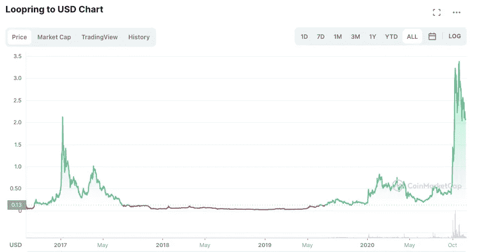
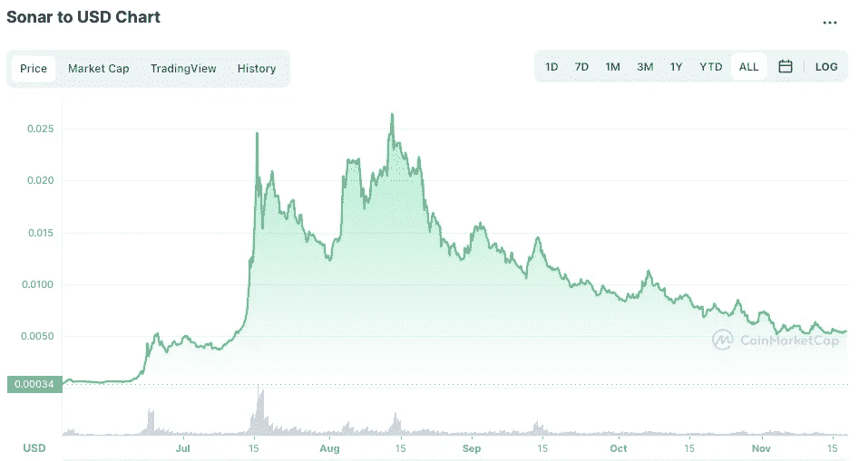
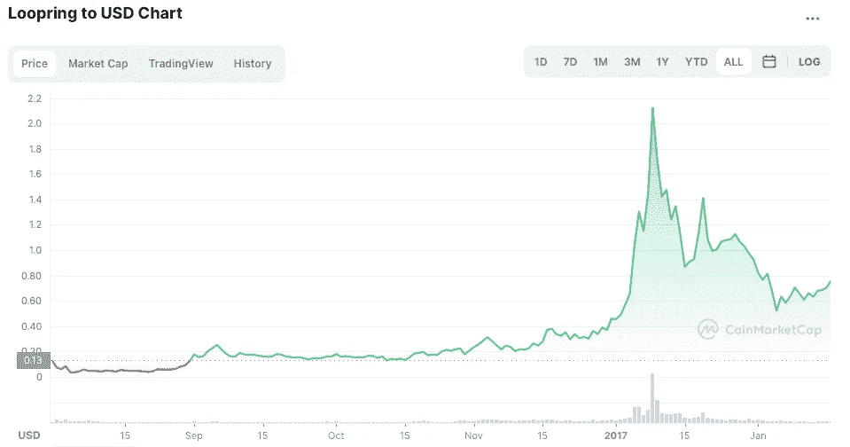
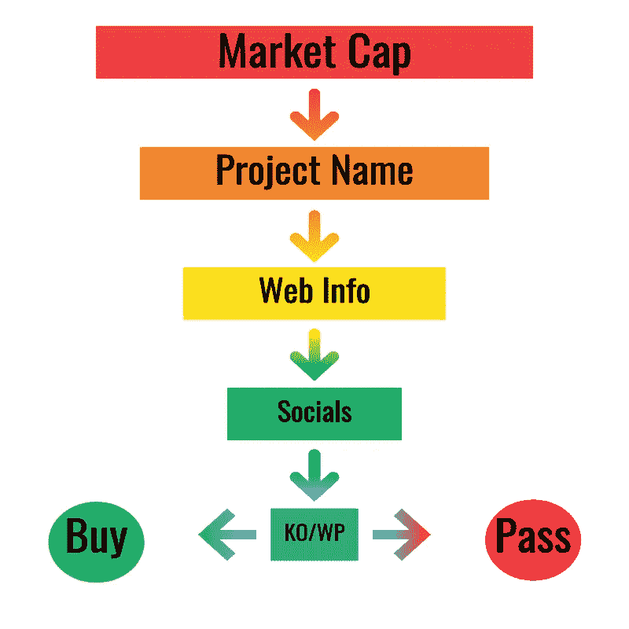

# 秘密投资:如何 DYOR

> 原文：<https://medium.com/coinmonks/crypto-investing-how-to-dyor-1e6dabdb1de9?source=collection_archive---------6----------------------->

## 你不需要一个物理学博士来发现和研究高质量的投资机会

Image: PixTeller

> 一项有 80%成功机会的投资听起来比一项有 20%失败机会的投资更有吸引力。头脑不容易认出他们是同一个人——丹尼尔·卡内曼

# 一种简单而明智的密码研究方法

自己做研究(DYOR)。这是众多 YouTube 名人散布在秘密空间的口头禅。但这意味着什么呢？你到底应该研究什么？

我的第一个想法是用我的研究方法进行一次模拟资产选择。然后我想到，简单地走一遍我已经拥有的加密资产的流程可能会更有帮助。所以，完全公开，我是我们将在本文中讨论的资产的持有人。然而，我们的目标是通过一个真实世界的例子来介绍选择要投资的加密项目的过程。

让我一开始就说，我不是建议你投资这个项目。我建议你把这些信息作为研究你喜欢的项目*的起点。接下来的一切都不是资产评估的全部。你可以用成千上万的指标来评估一项投资。对我来说，这种方法已经被证明是一种相当可靠的方式来寻找具有强大增长潜力的新项目。*

> 可以用成千上万的标准来评估一个项目

不保证(显然)，但我确实认为这种方法有助于减少混乱和简化研究过程。正如我在之前写的[，我认为加密投资就像是大众的风险投资。大量分散式交易所(DEX)上市正处于发展的早期种子和启动阶段。总的来说，这些是一个人可以投资的风险最高的资产。在美国，金融法规将这些类型的投资限制在](/coinmonks/crypto-risk-management-to-vc-or-not-to-vc-60dc3682a857)[合格投资者](https://www.investor.gov/introduction-investing/general-resources/news-alerts/alerts-bulletins/investor-bulletins/updated-3)是有原因的。

## 研究是伟大的，但你仍然需要运气

如果你曾经创业过，你就会知道有无数的事情会阻碍你的成功。有些事情你可以控制或减轻。有些事情你必须弄清楚，或者解决。有些事情就是凭空出现的。如果你幸运的话，你将避免灾难性的事情。如果你没有那么幸运，冒险可能会遭受挫折，甚至彻底失败。

重要的是，如果你想投资加密，要知道你投资的每一个项目都已经或将要遇到威胁这个行业的事情。在事情发生之前，地球上没有人能确切地告诉你一个企业是会成功还是会失败。所以当你听到一项投资可能会失去所有价值的警告时，认真对待它！你可能——很可能——在一个加密项目上投资会损失你的钱。有风险，相应投资。

> 地球上没有人能肯定地告诉你一个企业是否会成功

考虑到这一点，加密项目也可以有一些最高的潜在回报。如果你今天投资苹果或微软，该股明年升值 2000%的可能性几乎为零。但是这种回报在加密领域是非常可能的。同样，如果你现在投资苹果或微软，你损失全部投资的可能性也几乎为零。这就是坚果壳中的风险回报计算。

## 过滤掉 FUD、垃圾和无用的东西

在我们进入实际的资产评估之前，让我们先来看看如何开始寻找一个项目。我会尽量让事情简单。这种方法并非万无一失，但我认为它在花费的时间和承担的风险之间取得了良好的平衡。在寻找新项目时，我通常会以 Coinmarketcap.com(CMC)为起点。CMC 没什么特别的，只是刚好是我用的网站。

我试图将搜索范围限制在市值最高的 1000-1200 家公司。可以肯定的是，有一些很好的交易低于这个门槛。问题是，筛选前 1000 名已经花了很多时间。按市值再挖几千块比我想花的时间还多。此外，我认为拥有前 1000 名市值是一个优质项目的良好初始指标。粗略的想法是，如果他们在早期阶段努力寻找投资，我很少看到随着时间的推移有机地改善。

## 名称又能代表什么呢

在撰写本文时，CMC 上列出了 8555 个加密项目。将我们的搜索限制在前 1000 名，以很小的摩擦消除了很多噪音。一旦到了那里，我就用基于项目名称的“经验法则”来衡量。它不是科学的，也不是由数据驱动的，也不是研究。这只是根据我的个人品味/感受进行过滤。基本上，如果我觉得这个名字很蠢，我会直接忽略。

> …如果他们在早期阶段努力寻找投资，我很少看到这种情况会随着时间的推移而有所改善

例如，排在第 1062 位的是一个名为“埃隆之犬”的令牌。我对这个项目一无所知，可能永远也不会知道。我看到这样的名字，几乎忍不住忽略它。这可能是有史以来最大的加密项目，但我会错过这条船。光是名字就让我觉得不值得一看。

类似地，排名在 805 的是名为“SENSO”的令牌。名字没问题。我就是不喜欢。就是这样。没有火箭科学，没有深入研究市值，或白皮书，或任何东西。这是否意味着我可能会错过一个伟大项目的巨大回报？当然了。这让我很困扰吗？一点也不。

它确实有助于消除相当数量的低摩擦令牌。于是，我找到喜欢的名字后，就干脆看 CMC 上的描述。通常，在阅读第一两句话的时候，我已经知道我不感兴趣，于是我继续前进。但是如果这个描述引起了我的注意，我会去看看这个网站。如果这不是一个完整的垃圾袋乱七八糟，我会挖得更深。我的目标是理解并测试他们在网站上的声明。一点创造性的谷歌搜索在这里大有用武之地。

我试图回答的一些问题是:他们试图解决什么问题？其他人试过吗？团队看起来有能力吗？我明白他们在做什么吗？他们的解决方案有直观意义吗？他们的解决方案在技术上有意义吗？如果他们真的解决了问题，那会是一件大事吗？竞争对手是谁？提议的解决方案会比现在的好得多吗？是什么阻止了人们只是复制它，或者做得更便宜？

问这些问题的时候，你其实是想找理由*而不是*去投资。[确认偏差](https://journals.sagepub.com/doi/10.1037/1089-2680.2.2.175)是真实存在的。不要被困在信息泡沫中。如果你只看到鼓励你投资的东西，那你还不够努力。你要寻找的是足够多的积极答案，这些答案要多于消极答案，同时保持在你的[风险承受能力](/coinmonks/crypto-risk-management-to-vc-or-not-to-vc-60dc3682a857)之内。

如果这个项目在你谷歌死了之后仍然看起来不错，你已经准备好进入一些更深入的研究了。您可以将我将要概述的下一步应用到 CMC 上列出的每个项目中。这将花费大量的时间和精力去做。如果你是全职投资，那么研究就是你的工作，我建议你花时间去做。但是如果你像我一样，只是兼职做这个，它会很快变成一个负担，不值得。

# 今天的令牌是…

我们今天要评估的资产叫做 [Sonar Ping (PING)](https://www.sonarplatform.io/) 。有趣的是，我没有找到这个项目。一个朋友告诉我的。我的朋友在加密领域做得非常好，所以如果他推荐，我会注意。事实上，在我知道他告诉我的事情之前，我就去投钱了。这是一笔不算大的投资，但它几乎是秘密进行的。

这应该告诉你我在这里宣扬的不是规则。这是教育指导，你的里程可能会有所不同。然而，在我开始大量投资平安之前，我仍然遵循我的常规，现在我将概述一下。

## 一切都从图表开始

在我投资一个有趣的项目之前，我首先看的是图表。我一直放大到最长的时间段。我想看到的是资金流入和流出这个项目的总体情况。理想情况下，有证据表明有大规模的上涨和下跌。一张有许多小的锯齿状尖峰的图表向我表明[月球人](https://www.cryptoclopedia.com/terms/moonboy/)和[霍德勒人](https://www.investopedia.com/terms/h/hodl.asp)正在努力保持彼此的诚实。这与我有关，因为它表明价格正在持续、快速地受到考验。

另一个例子是，当我看到图表中的平线低点被相对平滑的短尖峰打断时。对我来说，它只是看起来像一个外部化的泵和转储。就像，公司外的某个人大肆宣传和推广，直到项目的购买者人数激增。炒作者抛售，然后项目进入核冬天，直到下一个 YouTube/Reddit 热潮出现。

Loopring (LRC)的图表就是一个很好的例子:

Image: CoinMarketCap.com screenshot

这并不是说 LRC 一定是一个糟糕的项目，但两年期持平是值得关注的事情，应该让你暂停一下。现在，有时大的价格变动可能与积极的消息或项目进展相关联。在 LRC 的例子中，右翼的巨大举动与 Reddit 和 YouTube 上的大肆宣传不谋而合。只有时间才能证明这是否只是 T4 的炒作，或者 LRC 是否真的在上涨。就我个人而言，我正和 LRC 的空头们坐在一起。

当然，LRC 是一个三年前的项目，而 PING 只有六个月大。因此，让我们将 LRC 放大到前六个月，并与 PING 进行比较:

**声纳乒今(半年):**

Image: CoinMarketCap.com screenshot

**六个月大的 LRC 在:**

Image: CoinMarketCap.com screenshot

你可以清楚地看到投资者的行为在两个项目之间有明显的不同。当然，这些是非常不同的项目，它们之间没有很好的比较。我只是用 LRC 作为图表说明。

然而，平的价格变动给我的印象是这个项目缺乏炒作。即使没有它，看起来也有很多的成交量，这可以从图表线看出。当我看到大量的客户流失和交易时，它告诉我价格存在很大的不确定性。反过来，我认为价格不确定性增加[羊群行为和锚定行为](https://www.sciencedirect.com/science/article/abs/pii/S2214635019301534)，这往往会吸引更多的人。随着参与者数量的增加，信息开始级联。当这种情况发生时，我认为这增加了价格大幅波动的可能性。

## 去参加社交活动

然而，在我的下一站，我粗略地将价格变动与该项目的社交媒体反馈联系起来。在 PING 的例子中，我主要关注电报，因为这是大部分通信发生的地方。我在寻找的是社交媒体反馈中似乎与价格变动相关的情感指标。这不是火箭科学，因为我不是在寻找*可操作的*信息。相反，我希望能感受到创始人和投资者对这个项目的热情/支持。

这就是社交媒体出现的地方。投资者主要是“月球人”吗？或者，投资者主要是长期持有人吗？频道是否每次下跌都有负面评论？或者，投资者在低迷时期保持乐观吗？我喜欢看到 moonbois，fudders 和 hodlers 之间的冲突。这些小小的争论增加了信息流，这可能导致信息级联。随着这些瀑布变得越来越大、越来越广，它们可能会引发价格波动。

社交活动也给你一个机会来衡量创始人的可靠性和诚意。创始人如何与社区互动？他们在场吗？他们是防御性的，不屑一顾的，还是吹牛的？它们能解释问题吗？他们会做出巨大的或者不切实际的承诺吗？他们关注的是短期价格变动吗？或者说，他们是否有韧性并专注于长期目标？

> 社交活动也给你一个机会来衡量创始人的可靠性和诚意

我鼓励你查看一下 [PING Telegram](https://t.me/sonar_official) feed。你可能会对这个项目有一个和我完全不同的理解。我看到的是人群中成群的 moonbois，但也有一致的声音显示出对该项目的坚定支持。我看到创始人参与到社区中，并且似乎有所回应。他们似乎也能很好地处理逆境。

我看到一个项目遇到了一些绊脚石，然后又恢复了。我看到一些创始人说了很多夸张的话，比如，“我们正在建立一家 10 亿美元的公司”，或者“我们将彻底改革加密交易”，或者“我们已经拥有了一些我们还不能谈论的惊人功能”。我还看到创始人通常都按时交付了路线图里程碑。基本上，我看到了我对一家运作良好的初创企业的期望。

其他人看到的电报提要可能会看到完全不同的东西。我们谁也不会是“正确的”。把这想象成社交媒体的“内脏检查”。在我看到一个打击的地方，你可能会看到一个信徒。在我看到机会的地方，你可能会看到失败。重点是，关注过程，而不是我的答案。你想学习如何识别适合你的项目，而不是我，也不是任何人。

> 把这想象成社交媒体的“内脏检查”

PING 团队能否提供一个“改变游戏规则”的加密分析跟踪平台以及其他“即将推出”的改变游戏规则的功能？也许吧。要确定这一点是很难的。看起来他们真的相信他们能成功。当然，他们可能是错的，或者误导大家，但是*和*在我看来不太一样。我可能错了吗？绝对的。

## 白皮书怎么样？

在我们继续之前，让我们回顾一下。到目前为止，我们已经:

1.  找到一个名字好听的项目
2.  了解更多信息
3.  努力理解他们在做什么
4.  粗略地比较了图表和社会
5.  花时间理解话语的语气和情绪

我想很多人会建议 T4 从白皮书开始。我认为这是一个错误。在加密领域,“白皮书”可以是任何内容，从技术文档到研究论文再到销售手册。他们中的许多人混合了这三者。我发现，如果你从那里开始研究，它们会成为很大的偏见来源。

白皮书本质上倾向于激励人心。他们提出了解决问题的建议，*和*他们正在论证为什么他们的特定想法是我们应该采用的。通过先阅读白皮书，你给了他们一个动摇你的机会，这可能导致确认偏差。相比之下，我想先了解问题，*和*他们的解决方案没有项目的输入。我需要能够评估白皮书，而不是依赖它。

这也是一个很好的时间来看看一个项目的 tokenomics。发行了多少代币？未来会发行多少代币？霍德林之外还有收入来源吗？有哪些税？有规律的烧伤吗？代币是通货膨胀还是通货紧缩？是否有充足的流动性？钱包有多集中？方正钱包是多重签名吗？

> 我想先在没有项目输入的情况下了解问题及其解决方案

契约分析的一个常用工具是 [TokenSniffer](https://tokensniffer.com/) 。它充当区块链合同的一种自动安全审计。如果你导航到那里，查找 PING 合同，它很难通过“嗅探测试”。我为什么要投资？白皮书和创始人似乎解决了 TokenSniffer 分析中的关注领域。

从某些标准来看，流动性有点低，但也不至于低得离谱。我也认识到，PING 首次公开募股(ICO)是该公司的一轮融资，因此主要目的是启动风险投资。我可以允许他们多提一点钱，以确保项目有足够的资金。

同样，合同也没有被放弃。创始人提出了这个问题，并给出了令人信服的理由来解释为什么这是可取的。事实上，在最近的一次活动中，该团队能够追回一个坏演员试图窃取的大量代币。他们修改合同的能力是经济复苏的一个重要因素。作为一名投资者，这也是一种风险，我很可能因此丢掉自己的袋子。根据我剩下的研究，我没意见。

关键是，这些对*我*来说都是可以接受的妥协，并且在*我*的风险承受范围之内。这并不意味着他们是对的，或者对你的风险承受能力是好的。这些对你来说可能是巨大的危险信号，这完全没问题！另一方面，许多人甚至没有意识到他们应该关注这些东西，并投资于各种愚蠢的东西。但是我从来没有被拉地毯(敲木头)，而实际上数以百万计的其他人有。

> 许多人甚至没有意识到他们应该看这些东西

关键是，如果事情让你对这个项目感到紧张，相信这种感觉。如果你认为你在项目合同或象征经济学中看到的问题没有得到充分的解释，你不应该在它们得到解释之前投入资金。如果他们在你的承受范围内无法和好，那就离远点。我或其他人怎么想并不重要。如果你不理解它，或者相信它，你为什么要投资它？

## 关于平，我的评估告诉了我什么？

时至今日，我仍然不知道声纳平台会是什么。我知道有钱包和资产追踪系统，但我还没见过。测试版将于 12 月 28 日推出，所以这将是有趣的，但它可能只是一坨屎。那么，我为什么投资呢？我认为声纳是 CEX y 型的

也就是说，我的分析让我相信这家公司已经做好了在主要的集中交易市场(CEX)上市的准备。反过来，有研究表明，在 CEX 上市通常会导致象征性价格大幅上涨。从本文的角度来看，思考过程是这样的:好名字，有趣的项目，社会支持信心，创始人打点一切，交易量和流动性良好，合同健全，象征经济学是通缩的，持有人积极，项目可能实际工作，可能迟早会在比特币基地或币安上市，低进入点，伪竞争对手享有更大的市场份额。

考虑到所有这些，我认为这种代币可能会上涨很多，因此我会购买。而且，我很可能错了！但我没关系，我明白风险。我也曾经每年租一辆全新的宝马。那是对金钱的巨大浪费。如果没有别的，声纳 PING 可能是一个更好的交易！如今，我宁愿把多余的钱投资出去，坚持用我的二手普锐斯。

## DYOR 滤波器

这总结了我在 DEX 上发现的新建立的代币的基本资产评估策略。我希望你能看到它的功能很像一系列的过滤器。这是一张图片:

Image: DLW

最后一个标有“KO/WP”的方框代表合同/白皮书。我希望这是一种合乎逻辑的方法。正如我在开始时所说的，这不是评估方法的全部。它是可访问的，并且实现起来相对简单。这种方法依赖于大量的主观解释。但我认为，即使是最热情的技术或基本面分析，仍然是高度主观的。不管你用的是什么方法，基本的目标是预测未来，还没有人发现这一点。

希望这种方法能给你信心，让你相信你投资的是你真正感兴趣、了解并相信的东西。问题是，你可能是错的，你必须接受这一点。换个角度看。CMC 上列出了 8555 个令牌。很有可能[其中只有大约 800 个](https://stumejournals.com/journals/i4/2017/5/238.full.pdf)是可行的长期项目。创业公司失败的原因数不胜数:缺钱；不需要该产品；成本问题；缺乏投资者；团队冲突；缺乏热情等。仅仅基于这些数字，你错过的会比你击中的多。

> 最基本的目标是预测未来，但是还没有人知道

不管你用的是我的方法，基本面的方法，技术面的方法，还是别的方法，你都会选火鸡。但是你可能会在这个过程中发现一些赢家。你发现越多让你放心投资的优质项目，你的投资就越有可能给你带来丰厚的回报。或者，你可以偷懒，去追人群。公平地说，这对很多人都有效。你也可能以那种方式得到[鱿鱼](https://www.bbc.com/news/business-59129466)。

在一天结束的时候，你应该像对待加密空间中的任何东西一样对待它——要小心。**我是平安**的实益持有人。我没有从他们那里得到报酬，也没有以任何其他方式与他们有联系。根据我的分析，我有信心这是一个值得我投资的项目。我不是向你或任何人推荐它。我正在展示我个人用来评估项目的方法，句号。**不是万无一失；它会导致糟糕的投资决策；跟随它可能会让你付出代价。**相应地使用这些信息。

然而，我发现这种研究方法很有用，我希望你也一样。至少，我希望它能给你一个研究的起点，尤其是如果你是加密投资的新手。这是一个相当狂野的世界，充满了风险和机遇。我希望你在你的努力中好运，我真心希望你能在那个改变人生的令牌上着陆。在那之前，请注意安全，放聪明点，一定要[绑好骆驼](https://www.carleton.edu/chaplain/news/trust-in-god-and-tie-your-camel/)。

> 加入 Coinmonks [电报频道](https://t.me/coincodecap)和 [Youtube 频道](https://www.youtube.com/c/coinmonks/videos)了解加密交易和投资

## 也阅读

 [## 杠杆代币[多头代币]终极指南

### 杠杆化令牌是具有杠杆化风险敞口的 ERC20 令牌，不考虑保证金、要求、管理…

medium.com](/coinmonks/leveraged-token-3f5257808b22)  [## 最佳加密交易所| 2021 年十大加密货币交易所

### 加密货币交易所的加密交易需要了解市场，这可以帮助你获得利润。之前…

blog.coincodecap.com](https://blog.coincodecap.com/crypto-exchange)  [## 2021 年最佳加密交换平台| CoinCodeCap

### 如果我们看看今天的场景，许多加密货币交换平台提供了广泛的功能和深度…

blog.coincodecap.com](https://blog.coincodecap.com/best-swap-platforms)  [## 2021 年最佳加密借贷平台| 6 大比特币借贷平台

### 获得比特币和其他加密货币的最佳贷款利率

medium.com](/coinmonks/top-5-crypto-lending-platforms-in-2020-that-you-need-to-know-a1b675cec3fa)  [## 2021 年 6 大最佳硬件钱包|顶级加密硬件钱包[更新]

### 最好的加密货币硬件钱包是绝对必要的。我们将在 NGRAVE、Ledger Nano X 和…

medium.com](/coinmonks/the-best-cryptocurrency-hardware-wallets-of-2020-e28b1c124069)  [## 2021 年最佳免费加密交易机器人

### 2021 年币安、比特币基地、库币和其他密码交易所的最佳密码交易机器人。四进制，位间隙…

medium.com](/coinmonks/crypto-trading-bot-c2ffce8acb2a)  [## 最佳 4 个加密交易信号电报通道

### 这是乏味的找到正确的加密交易信号提供商。因此，在本文中，我们将讨论最好的…

medium.com](/coinmonks/best-crypto-signals-telegram-5785cdbc4b2b)  [## 获取信号、交易机器人和套利

### 编辑描述

blog.coincodecap.com](https://blog.coincodecap.com/bitsgap-review)  [## 40 个最佳电报频道，用于加密、电影、表演和演讲| CoinCodeCap

### 编辑描述

blog.coincodecap.com](https://blog.coincodecap.com/best-telegram-channels)