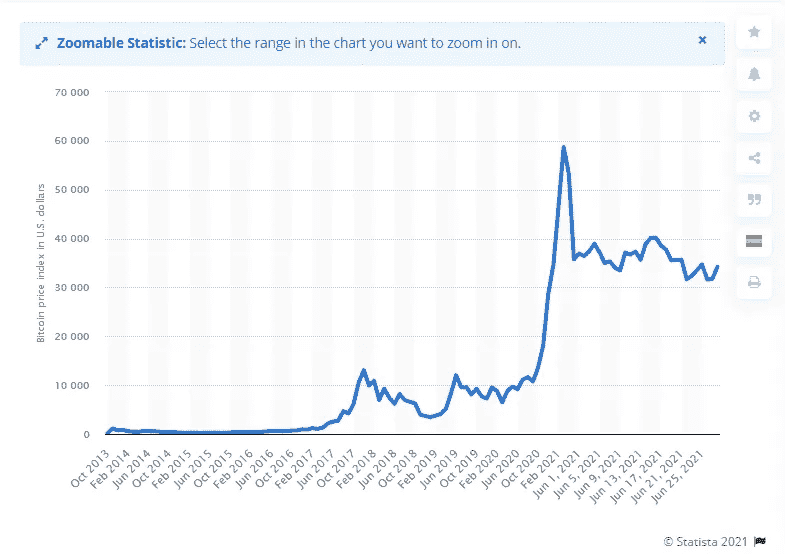

# Crypto:这个风险值得冒吗？？？

> 原文：<https://medium.com/coinmonks/crypto-is-the-risk-worth-taking-aa3d89e9656a?source=collection_archive---------5----------------------->

Photo by [Hans-Jurgen Mager](https://unsplash.com/@hansjurgen007?utm_source=unsplash&utm_medium=referral&utm_content=creditCopyText) on [Unsplash](https://unsplash.com/s/photos/polar-bear?utm_source=unsplash&utm_medium=referral&utm_content=creditCopyText)

风险是成长的重要组成部分。当尼尔·阿姆斯特朗和其他两人被选中去月球时，在有史以来的第一次月球任务中，他们有两个选择，要么冒险面对挑战，要么退出计划，过自己的生活，后悔错过了这个伟大的机会。

12 年前，整个人类处于同样的境地。中本聪在他的名为“比特币:一个点对点的电子现金系统”的白皮书中介绍了一种新的支付系统，这将彻底改变金融业。名为比特币的支付系统有很多优点，其中一些包括

1.  这是无法伪造的。
2.  与需要几天才能完成的国际银行交易不同，在比特币中，支付可以立即完成。
3.  没有停机时间。由于没有集中的系统，支付系统不会因为某个系统故障而面临任何停机。

那些早期采用比特币的人现在都是百万富翁了。

2009 年，1 BTC 一文不值，2010 年，1 BTC 还不到 0.1 美元。但是今天，1 BTC 价值超过 34，000 美元。

同样，去年 1 BNB 值 20 美元，今天 1 BNB 值 280 美元。以太坊、DogeCoin、EOS、ADA、Matic、XLM 以及几乎所有的加密货币也是如此。

由于硬币的高波动性和巨大的市场波动，人们担心投资加密。人们不敢把自己的血汗钱放在比特币上。你可能会在投资中看到潜在的短期损失。它们是短期的。加密货币正随着时间的推移而增长。加密不是让你一夜之间成为百万富翁的东西，而是你可以长期持有(HODL)以获得高回报的资产。为了理解这一点，让我们看看 2013 年以来比特币的季度价格图表。

Source: [Statista](http://www.statista.com)

正如你在图表中看到的，有起伏。然而，到了最后，它会上涨。

## 现在真正的问题来了，这个风险值得冒吗？

投资加密有两个基本规则。

1.  **DYOR(自己研究)**:除了比特币，市面上还有成千上万的山寨币。少数替代硬币是骗局。所以，你自己去研究硬币的可信度，令牌组学，历史数据，ATH，ATL，硬币背后的团队，等等。是重要的一部分。
2.  **只投资你能承受的损失**:不要把你一生的积蓄都投资在加密上。市场的方向可以随时改变。即使价格会逐渐上涨，有时你可能需要等待几个月或几年才能收回投资。如果你投资了一生的积蓄，后来不得不面对任何紧急情况，你可能会想亏本出售。

现在还为时尚早，我们有时间在加密上投资。不仅仅是比特币，还有很多廉价的硬币都有增长空间。其中包括 XRP、XLM、马蒂奇、阿达等。

不要把你所有的钱都放在一个硬币上，而是创建一个多样化的投资组合，包含不同数量的不同硬币。如果你愿意等至少 4-5 年，你会得到不错的回报。

## Alt 币和 Meme 币

没有任何一种硬币像比特币一样拥有如此巨大的市值。其他硬币被称为 Alt 硬币。以太坊，创网，多边形，BSC 等。允许人们通过智能合约创建自己的加密货币。这些硬币通常被称为迷因硬币或狗屎硬币。任何人都可以创建它们，并且创建它们不会花费太多时间。其中一些是骗子为了偷你的钱而创造的。迷因币非常不稳定，你可能损失高达 99%的钱，也可能获得高达数百万的利润。风险极大，投资时你应该非常小心。

同样，也不建议长期投资迷因币。迷因币会在短期内给你带来高额利润。你可以用它来交易。

简而言之，投资加密是有风险的，但值得一试。你可能会获得利润，或者你会学到一些教训，这将有助于你在未来赚得更多。从长期来看，投资于 BTC、瑞士联邦理工学院、BNB 等历史悠久的硬币。对于短期交易来说，投资迷因币。

## 也阅读

 [## 最佳免费加密交易机器人——前 16 名比特币交易机器人[2021]

### 2021 年币安、比特币基地、库币和其他密码交易所的最佳密码交易机器人。四进制，位间隙…

medium.com](/coinmonks/crypto-trading-bot-c2ffce8acb2a)