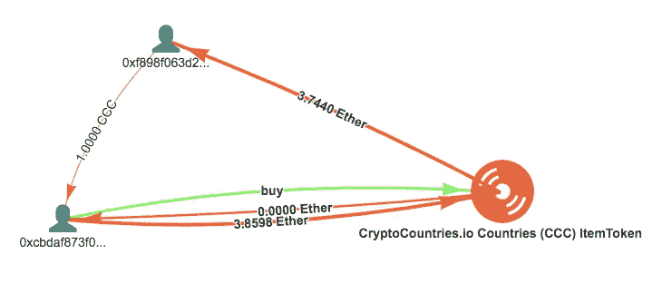
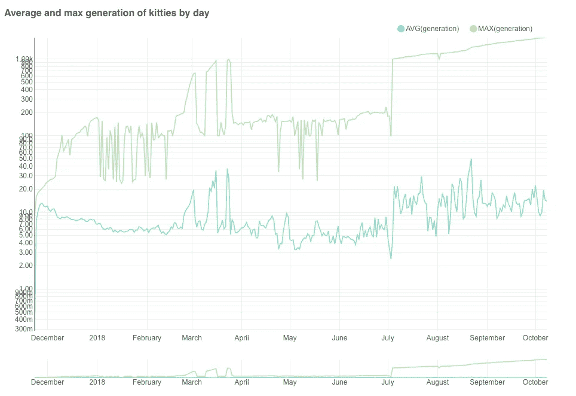
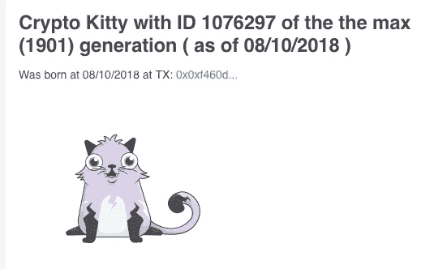

# 秘密猫咪:从饲养到近亲繁殖

> 原文：<https://medium.com/coinmonks/crypto-kitties-from-the-raise-to-inbreeding-4bed53600c26?source=collection_archive---------0----------------------->

## 在 Bloxy.info 平台上使用交易链数据分析对著名的基于以太坊的密码猫游戏进行了分析

rypto kitties 是我在区块链以太坊最喜欢的项目之一。不仅仅是因为它非常受欢迎，还因为它是如何实现的，以及它对区块链开发和采用的实际影响。

# 小猫大声的喵喵叫


The First Kitten with ID=1\. Meow!

11 月 23 日，一大早，世界上第一只真正的小猫出现了，在交易中[0x9e 8 f 42799d](https://bloxy.info/tx/0x9e8f42799dffe9f5700e1f871a20a9483e1c84db73c382c31a4412b9a2f83b2b)……看起来有点惊讶，我们也一样，看到区块链人忘记了他们的代币和 ICO，开始购买……*小猫*。

在一周内，几乎 1/3 的以太坊交易都是关于小猫的。


December, 2017\. Green are CK transactions, Yellow are all others. Gas price has a peak in the same time as CK. Source: [bloxy.info](https://stat.bloxy.info/superset/dashboard/cryptokitties/?standalone=true)

最高峰出现在 10 年 12 月，当时有 103000 只秘密小猫找到了它们快乐的主人。每天花费 200 万美元(12 月 4 日 4800 乙醚)。天然气价格在一周内迅速上涨了 5 倍。这是一个非常热情的时代，所有的东西都在增长，甚至以太币对美元的价格也在增长。

Crypto Kitties 对天然气价格、智能合约呼叫统计以及以太坊价格都有全球性影响。2017 年 11 月至 12 月，智能合约调用的词云发生了显著变化。区块链出现了新词，如 giveBirth 和 breedWithAuto。普通的转账、清仓和交易最终被从顶层移走。


Word cloud of smart contract calls as of December, 2017\. The more transaction, the bigger font

谁是主要的小猫买家？有趣的是，绝大多数买了小猫的钱包第一次在同一天收到了乙醚。那都是新的钱包！从这些新钱包中，很大一部分直接从交易所获得以太网。


Histogram of time from the first deposit on the wallet till the first CK buy. The area from 0 to 1 hour enlarged to find maximum. Source: [bloxy.info](https://stat.bloxy.info/superset/dashboard/cryptokitties/?standalone=true)

直方图显示了为新钱包购买一只新小猫所需的时间。钱包上的第一笔乙醚存款算作一个轴原点，豆子的高度就是钱包的个数，从第一笔存款开始 X 小时买了一只小猫。最大值在 0.1 小时左右，相当快，平均值在半小时左右。请注意，几个小时后，曲线迅速下降，人们不想等待购买新的小猫！

## 抒情题外话

你可能想知道，我们是如何获得这些信息、事实和结论的？允许进行这项研究的所有数据都取自以太坊网络中的区块链交易(除了小猫的照片)。数据从以太坊节点取出，存储在专门设计的数据存储器中(Yandex 的[*click house*](https://clickhouse.yandex/)*平台上的数据仓库)。之后，可以使用标准的 SQL 请求对其进行查询，其中一个示例如下所示。实际上所有的* [*仪表盘*](https://stat.bloxy.info/superset/dashboard/cryptokitties/?standalone=true) *和网站*[*bloxy . info*](https://bloxy.info)*都是建立在这种技术之上的，你看到的所有数据和图表都是直接从数据存储器中获取的，有些缓存在内存中，有些是在你打开页面时实时查询的。*


SQL Request to get statistics of the wallets, deposited to buy Crypto Kitties. Source: [bloxy.info](https://stat.bloxy.info/superset/dashboard/cryptokitties/?standalone=true)

# 小猫的生命作为一种象征

从技术上讲，每只小猫都被表示为没有名称的令牌，但有一个特定的 ID。这个模型被称为不可替换令牌(NFT ),在以太坊中有一个标准:ERC-721。Crypto kitties 是一种加密货币，符号为 CK，令牌地址为 [0x06012c8cf97…](https://bloxy.info/address/0x06012c8cf97bead5deae237070f9587f8e7a266d) 。非常有趣的是，Crypto Kitties 作为 ERC-721 的第一个实现从一开始就获得了成功。


Daily transfers and basic numbers for CK token. Source: [bloxy.info](https://stat.bloxy.info/superset/dashboard/cryptokitties/?standalone=true)

截至 2018 年 10 月，世界上有超过一百万只 crypto kitties，由超过 80，000 个钱包地址拥有。即使与顶级 ICO 相比，这也是一个相当大的数字。从这个角度来看，CK 是以太坊上最成功的 ICO 之一，重要的是，它真的有效！

# 小猫克隆和追随者

社区花了几个月的时间才理解 ERC-721 NFT 代币的潜力。加密游戏的浪潮淹没了网络，在 2018 年 2 月达到顶峰。大约有 50 个不同的 NFT 代币在日常运作，其中大多数只是为了游戏或娱乐的目的。然而，他们都没有像 CK 一样坐在同一个大礼堂里:


ERC721 tokens used actively and the graph of distinct daily active tokens. Source: [bloxy.info](https://stat.bloxy.info/superset/dashboard/erc721/?standalone=true)

有些克隆人很直接。如果我们以[出生](https://bloxy.info/events/0a5311bd2a6608f08a180df2ee7c5946819a649b204b554bb8e39825b2c50ad5)事件为例，这对于 crypto-kitties 来说是非常特殊的，看看还有哪些令牌契约发出了这个事件，我们每月大约得到 [10 个契约](https://bloxy.info/events/0a5311bd2a6608f08a180df2ee7c5946819a649b204b554bb8e39825b2c50ad5)。

除了直接克隆，还有几十个项目，利用 ERC-721 的能力来映射独特的对象与所有者的区块链记录。虚拟或物理空间中的任何可识别对象都可以映射到具有 ID 的令牌，并被授予、出售或交易到钱包中。

[ERC-721 令牌的完整列表](https://bloxy.info/list_tokens/ERC721)揭示了人们想象力的潜力。只有部分名字:[隐密棒球](https://bloxy.info/address/0x8c9b261faef3b3c2e64ab5e58e04615f8c788099)、[独角兽](https://bloxy.info/address/0xcf0010af06edff540af798d06e866d95cbdc8488)、[隐密名人](https://bloxy.info/address/0xbb5ed1edeb5149af3ab43ea9c7a6963b3c1374f7)、[隐密者](https://bloxy.info/address/0xa068345a625542fe49c299c8df309a920a184200)。

有人收藏了“全部”。最活跃的收集了数百个 ERC-721 不同的代币。地址: [0xa238122](https://bloxy.info/address/0xa2381223639181689cd6c46d38a1a4884bb6d83c) …是收集的冠军，拥有 110 个不同的代币。

你甚至可以用 [CCC(加密国家)令牌](https://bloxy.info/address/0x92cb5f1fbabbcbdd891b9cbd8e9a056c8c1eebef)购买整个国家！国家的数量是有限的，只有 247 个独一无二的代币由仅仅 134 个[独一无二的代币持有者](https://bloxy.info/token_holders/0x92cb5f1fbabbcbdd891b9cbd8e9a056c8c1eebef)拥有。现在，他们似乎开始了一个新的项目，即更具可扩展性的加密城市。

这是整个**国家交易情况的图表(！)**被卖:



Buy The whole country? In the blockchain it is easy. Source: [bloxy.info](https://bloxy.info/tx/0x0ad118ead54b030792b86afc39cfba29d4d286a3ff1e635e53f828b766ee1baf)

这种交易模式与我们在[令牌销售剖析](/@aleksey_80472/token-sales-anatomy-d22657a37853)中分析的非常相似，这实际上是 ERC-721 令牌上的 ICO。

最大的区别在于，ERC-721 令牌中的每一项都是唯一的，并且一般来说，可能无法相互比较。一只小猫可能只值一便士，而另一只则要几百美元，没有人事先知道。他们估计的方式是*拍卖*——智能合同，甚至是[现场拍卖](/cryptokitties/the-ethereal-summit-and-the-140k-cat-a3b561545a44)，价格由社区定义。除了常规的[拍卖](https://bloxy.info/address/0xb1690c08e213a35ed9bab7b318de14420fb57d8c)之外，Crypto Kitties 还有特殊的 [Siring 拍卖智能合同](https://bloxy.info/address/0xc7af99fe5513eb6710e6d5f44f9989da40f27f26)，任何人都可以为繁殖小猫创造一个 Siring。两方参与，一方接受乙醚，另一方是怀孕的小猫:


Example of the transaction on Siring Auction. Source: [bloxy.info](https://bloxy.info/tx/0x6cc11a7cc45d4e2f4b967417e1744ca7a7f7da25418b68f7018b96e682384557)

# 猫咪世代

显然，怀孕导致了新小猫的出生。新小猫“一代”是系谱树中的级别，从“零”级开始，最初由 Crypto Kitties 智能合约人工繁殖。有一些规则适用，禁止乱伦和直接近亲繁殖的第一层次。然而，小猫没有性别，它可以是一只小猫的警笛，也可以是另一只小猫的主妇。

在早期的 CK 时代，零代和第一代是最受欢迎的，但这迅速转移到更高的一代，因为人们喜欢繁殖新的小猫。很快就有了稳定的画面，小猫在 20 代之前或多或少是均匀分布的。


Share in percentage of kitten generations by months. Source: [bloxy.info](https://stat.bloxy.info/superset/dashboard/cryptokitties/?standalone=true)

目前小猫和种鸡的世代分布最多为 4 只小猫和 10 只种鸡:


Distribution of kittens and breeders (initial owners) by generations. Source [bloxy.info](https://stat.bloxy.info/superset/dashboard/cryptokitties/?standalone=true)

现在来看看极端的情况，最长的族谱树和最大的世代。图表的顶部显示了在特定日期出生的小猫的最大世代。这里值得注意的是，三月份有一些增长，然后人们对繁殖新一代失去了兴趣，然后兴趣又回来了。



Maximum (green) and average ( blue) generations of kittens daily born. Source: [bloxy.info](https://stat.bloxy.info/superset/dashboard/cryptokitties/?standalone=true)



从 2018 年夏天开始，直到现在，非常有限的一组地址继续繁殖越来越多代的小猫。截至今天(10 月 8 日)，他们[创造了一只 1901 代的小猫](https://bloxy.info/tx/0xf460df7795c62547b8561aacc70b0d4bc2f4253a30776156b68f5e9360116311)。看看这个小可爱！没什么特别的，但是它有世界上最长的祖先历史。

# 小猫的生殖问题

小猫的繁殖能力强烈依赖于一代。这张图显示了一代人的大小，与一代人的小猫数量成比例。横轴是一代中每只小猫的平均子女数。纵轴是以代为单位的平均小猫年龄(以天为单位)。所有有孩子的小猫都在这张图上，超过所有小猫总数的一半。


Generation diagram ( C-K diagram ). Source: [bloxy.info](https://stat.bloxy.info/superset/dashboard/cryptokitties/?standalone=true)

一代形成一条有序的“路径”，类似于[主序列](https://en.wikipedia.org/wiki/Main_sequence)，由[赫茨普龙和](https://en.wikipedia.org/wiki/Hertzsprung%E2%80%93Russell_diagram)罗素为我们宇宙中的恒星发明。它也被称为 H-R 图。这个我命名为 **C-K(密码猫)**图。区块链本身就是一个宇宙，它理应拥有自己的图表。

第 0 代小猫由 Crypto Kitties smart contract 创建。他们是最有生产力的，因为他们居住在水平轴上的最大值，也就是孩子的数量。所有其他世代的生产力都明显较低。值得注意的是，从第 2 代到第 25 代，各代并不是随机分布在图上，而是构成一条平滑的曲线。大多数猫有 4 到 13 代，它们居住在曲线的台阶上。

一代又一代，小猫的繁殖能力略有下降，从每只小猫生一个孩子下降到 25 只以上。这对人们来说是危险的。

物质自然中糟糕的生殖技能的原因之一是近亲繁殖，当父系和母系在谱系上有许多共同的亲戚时。我们分析了所有小猫的树，得出了令人失望的结论，这个问题确实存在于 CK，并且一代又一代地发展。没有 1 级的近亲结婚，当奶奶和爷爷是一样的。然而，在更高层次的亲属中有许多交集。

将近亲繁殖的比率作为幼猫的母猫和公猫的共同亲属的相对数量，用百分比表示，我们得到如下图表:


Inbreeding Ratio depending from Generation, %. Source: [bloxy.info](https://stat.bloxy.info/superset/dashboard/cryptokitties/?standalone=true)

从 0 到 13 代，近亲繁殖从 0 到 80%发展得相当快。然后，它保持稳定，但对于超高世代(高端世代小猫)，它似乎接近 100 %。大多数小猫都很年轻，但它们也有几乎所有相同的亲戚。在现实世界中，这些小猫会患有遗传疾病，甚至不能生育。我真诚地希望 CK 不会有这个问题，但高世代的人工繁殖可能会伤害小猫数量。

这里好消息是，大多数小猫数量属于 4 到 15 代，它们足够好。我们共同祝愿密码猫在社区中长寿和成长！

```
*This article was composed from the data and by analytical tools from* [*Bloxy.info*](https://bloxy.info) *analytical engine.* [*Bloxy.info*](https://bloxy.info) *web site provides a set of tools for analytics, traders, companies and crypto enthusiasts.

The tools include APIs, dashboards and search engine, all available on-site, providing accurate data, indexed directly from the blockchain live node.

Bloxy mission is to make blockchain more transparent and accessible to people and businesses.

Please, make a reference to the source of data when referencing this article.*
```

> [在您的收件箱中直接获得最佳软件交易](https://coincodecap.com/?utm_source=coinmonks)

[](https://coincodecap.com/?utm_source=coinmonks)