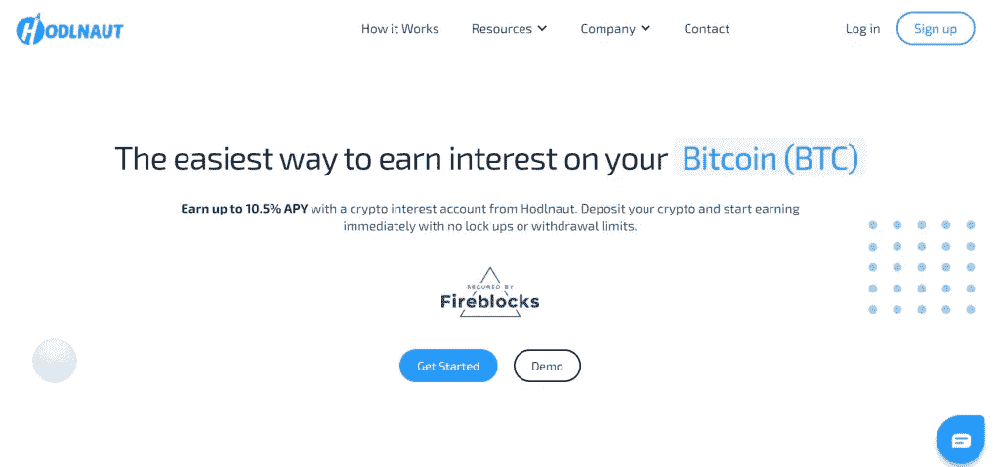

# 五大加密管理平台

> 原文：<https://medium.com/coinmonks/crypto-management-platforms-ceb969270cdc?source=collection_archive---------8----------------------->

Crypto Management Platforms

加密资产管理是通过网络维护分布式电子账本来管理数字资产以提供无缝服务的过程。包括加密货币、[区块链](https://coincodecap.com/what-is-blockchain-a-simple-guide-for-dummies)等等。随着加密货币市场的增长，对可靠的加密管理平台的需求也大幅增加。

此外，各种代币和新加密货币的涌入也促进了加密管理平台的激增。在本文中，我们为您带来了您可以担保的五大加密货币管理平台。

# 总结(TL；博士)

*   加密货币市场正在扩大，导致对可靠的加密管理平台的需求增加。
*   [**双子座**](https://gemini.sjv.io/gbP2q2) 是一个[加密货币交易所](https://coincodecap.com/crypto-exchange)和托管人，拥有 40+枚硬币和代币，用户可以存储、购买和出售。
*   Gemini today 成立于美国，业务遍及全球，支持从比特币到兰花的各种货币。
*   [**Crypto.com**](https://crypto.com/app/hmn6rxd646)允许用户在 150 个密码对之间交易。用户也可以在移动应用程序上用他们的借记卡/信用卡或 20 种法定货币购买 crypto。
*   Crypto.com 有 1000 万用户，拥有最安全的交易所之一和本地令牌 CRO。
*   [**Hodlnaut**](https://www.hodlnaut.com/hnap54) 是一家快速发展的加密贷款平台，总部位于新加坡。它为五种支持资产提供高达 10.5%的 APY:BTC、瑞士联邦理工学院、戴、和。
*   没有任何最低存款要求，获得的利息每周存入 Hodlnaut 利息账户。
*   [Bisq](https://bisq.network/?utm_source=coincodecap.com) 是一个分散的点对点加密交换，也可以作为软件下载。
*   Bisq 没有任何 KYC 或注册过程，对于那些没有政府颁发的身份证明的人来说，这是一个理想的平台。
*   [现金应用](https://cash.app/)允许顾客汇款、网上购物和付款。它还允许用户投资加密货币、股票和交易所交易基金。

# 加密管理平台:Gemini

[**双子座**](https://gemini.sjv.io/gbP2q2) 是一个加密货币交易所和托管机构，拥有 40+硬币和代币进行买卖和存储。Gemini 成立于美国，现已扩展到全球，尤其是欧洲和亚洲。这些硬币包括比特币和以太坊等重要的密码，以及 0x 和兰花等较小的替代硬币。Gemini 是一个加密管理平台，根据用户的技能水平为其提供多种选择。

例如，Gemini 的移动和网络应用程序的用户友好界面非常适合初学者，而高级投资者可能会发现 [ActiveTrader](https://www.gemini.com/activetrader) 产品的巨大价值。此外，除了大量的平台选择，Gemini 还提供了受保热钱包，用于存储令牌，同时防止数字盗窃。总而言之，Gemini 是寻找简单的移动和网络应用程序的新投资者的理想选择，并允许在同一平台下购买、出售和存储加密资产。

要了解哪个平台最适合您，请阅读我们的一篇比较文章。

***也读:*** [***双子座 vs 比特币基地|美国密码交易所哪个最好？***](https://blog.coincodecap.com/gemini-vs-coinbase)

## 双子座:利弊

**优点**

*   快速注册，几分钟内即可开始。
*   带保险的热门钱包，防止盗窃和黑客攻击。
*   适合不同技能投资者的多种产品。

**缺点**

*   向希望通过桌面或移动应用程序进行买卖的用户收取佣金和便利费。
*   对小生意来说很贵。

# 密码管理平台:Crypto.com

在 Crypto.com 的 [**上，用户可以在交易平台上交易超过 150 对加密货币。此外，他们可以使用他们的借记卡或信用卡或手机应用程序中的 20 多种法定货币购买加密。**](https://crypto.com/app/hmn6rxd646)

此外，对于已经完成高级验证要求的用户，交易所为已经完成高级验证要求的用户提供 3 倍的[保证金交易](https://coincodecap.com/bitcoin-margin-trading-exchange)杠杆，利率根据货币而变化。Crypto.com 也提供专属的 Visa 卡。要了解更多信息，请观看下面的视频或阅读 [MCO 卡评论](https://coincodecap.com/mco-card-review)。

MCO Visa card

此外，那些符合资格要求的人可以选择 VIP 计划，并获得额外的津贴。它在全球拥有超过 1000 万用户，是最安全的交易所之一，100%的资金存储在冷库中，有两个验证级别:基本和高级。Crypto.com 也有一个本地令牌 CRO，提供了良好的投资回报。

要了解更多，请阅读[Crypto.com 评论](https://coincodecap.com/crypto-com-review)。如果你正在寻找一个 NFT 平台，别忘了阅读我们的[Crypto.com NFT 平台评论](https://coincodecap.com/crypto-com-nft-platform)。

## Crypto.com:利弊

**优点**

*   高度安全
*   低费用
*   提供钱包、消费和交易等的单一平台
*   以多种方式赚取利息、回扣和奖励

**缺点**

*   该平台可以缩短客户支持响应时间
*   返现用 CRO 代币支付，而不是现金
*   缺乏透明度

# 加密管理平台:Hodlnaut

[**Hodlnaut**](https://www.hodlnaut.com/hnap54) 是一家新兴的[密码借贷平台](https://coincodecap.com/crypto-lending)总部位于新加坡。它是新加坡增长最快的 CeFi 平台之一，为加密货币提供丰厚的利率。用户可以通过 Hodlnaut 利息账户 HODL 他们的加密资产，该账户为五种受支持的资产提供高达 12.73%的 APY:BTC、瑞士联邦理工学院、戴、和。

Hodlnaut

存放的加密资产然后被借出给经过审查的机构。霍德瑙特还贷款给分散的协议，让客户赚取他们的资产的利息。没有任何最低存款要求，利息每周一打入用户账户。对于希望通过赚取利息来增加加密资产的客户来说，Hodlnaut 是理想的选择。

要了解更多信息，请阅读[霍德瑙特评论](https://coincodecap.com/hodlnaut-review)。

## 赞成和反对

**优点**

*   比特币的最高利率之一
*   用防火砖担保的资金
*   快速注册
*   [iOS](https://apps.apple.com/us/app/hodlnaut/id1564376022) app 现已上市。

**缺点**

*   仅支持五种资产
*   还没有移动应用
*   有限的功能

# 密码管理平台:Bisq

[Bisq](https://bisq.network/?utm_source=coincodecap.com) 是一个点对点的分散比特币和加密交换，也是一个可下载的软件。分散平台也是非托管的，这意味着只有用户可以控制他们的资金。这不同于集中交易，集中交易控制用户在保管账户中的资金，用户没有私钥。

Crypto Management Platform: Bisq

另一方面，Bisq 适用于任何拥有电脑或智能手机的人，不需要任何注册程序，甚至没有 KYC 要求。因此，对于那些没有政府颁发的身份证明的人来说，这是一个理想的平台。此外，Bisq 提供几种不同法定货币的交易，如比特币、美元和其他几种加密货币。

要了解更多信息，请阅读[Bisq——一个点对点比特币交易所](https://coincodecap.com/bisq-a-peer-to-peer-bitcoin-exchange)。

## Bisq:利弊

**优点**

*   一个不需要 KYC 的分散平台。
*   各种付款方式。
*   没有地域限制。

**缺点**

*   根据支付方式的不同，交易可能会很慢。
*   交易量低。
*   分散式平台可能并不适合所有人。

# 密码管理平台:现金应用

[Cash App](https://cash.app/) 是一个点对点的转账平台，允许用户分食、网上购物、支付等。它还可以充当银行账户，用户可以拥有他们的现金应用借记卡。除了这些功能，Cash App 还允许用户投资股票、加密货币和交易所交易基金。

Crypto Management Platform: Cash App

这是一个移动优先的界面，用户友好，是首次投资者的理想选择。此外，该平台允许用户将加密资产提取到他们的钱包中。在加密货币社区中，能够提取和使用密码是非常重要的。否则，如果您没有持有钱包的私钥，它们就不被有效地拥有。这个概念被普遍认为是“不是你的钥匙，不是你的硬币。”

## 现金应用:利弊

**优点**

*   [现金应用](https://blog.coincodecap.com/go/cash-app)允许点对点转账。
*   用户可以提现比特币。
*   简单的用户界面。

**缺点**

*   仅允许客户投资比特币，不允许投资其他加密资产。
*   通过关联信用卡汇款时收取费用。
*   交易是不可逆的；因此，付款一经处理，您就不能取消。

# 最佳加密货币管理平台:结论

最好的平台将取决于你居住的地区，你想买的硬币，以及你的长相。如上所述， [**双子座**](https://gemini.sjv.io/6bbqzb) 和[**Crypto.com**](https://crypto.com/app/hmn6rxd646)为各类投资者提供了丰富的功能。另一方面， [Bisq](https://blog.coincodecap.com/go/bisq) 是一个分散的平台，让你完全控制你的加密资产。

此外， [**Hodlnaut**](https://www.hodlnaut.com/hnap54) 可让您赚取加密资产的利息，充分利用您的加密货币。最后，**现金应用**帮助你投资加密货币。因此，您应该确定您的需求、期望和偏好，以决定最适合您的加密管理平台。

> 加入 Coinmonks [电报频道](https://t.me/coincodecap)和 [Youtube 频道](https://www.youtube.com/c/coinmonks/videos)了解加密交易和投资

## 另外，阅读

*   [AscendEx Staking](https://coincodecap.com/ascendex-staking)|[Bot Ocean Review](https://coincodecap.com/bot-ocean-review)|[最佳比特币钱包](https://coincodecap.com/bitcoin-wallets-india)
*   [霍比评论](https://coincodecap.com/huobi-review) | [OKEx 保证金交易](https://coincodecap.com/okex-margin-trading) | [期货交易](https://coincodecap.com/futures-trading)
*   [Cloudbet 赌场评论](https://coincodecap.com/cloudbet-casino-review) | [点火赌场评论](https://coincodecap.com/ignition-casino-review)
*   [Godex.io 审核](/coinmonks/godex-io-review-7366086519fb) | [邀请审核](/coinmonks/invity-review-70f3030c0502) | [BitForex 审核](https://coincodecap.com/bitforex-review)
*   [Crypto.com 费用](/coinmonks/binance-fees-8588ec17965) | [Botcrypto 审查](/coinmonks/botcrypto-review-2021-build-your-own-trading-bot-coincodecap-6b8332d736c7) | [替代方案](https://coincodecap.com/crypto-com-alternatives)
*   [如何在 Bitbns 上购买柴犬(SHIB)币？](https://coincodecap.com/buy-shiba-bitbns) | [印度币安](https://coincodecap.com/binance-in-india)
*   [币安 vs Bitstamp](https://coincodecap.com/binance-vs-bitstamp) | [比特熊猫 vs 比特币基地 vs Coinsbit](https://coincodecap.com/bitpanda-coinbase-coinsbit)
*   [如何购买 Ripple (XRP)](https://coincodecap.com/buy-ripple-india) | [非洲最好的加密交易所](https://coincodecap.com/crypto-exchange-africa)
*   [非洲最佳加密交易所](https://coincodecap.com/crypto-exchange-africa) | [胡交易所评论](https://coincodecap.com/hoo-exchange-review)
*   [eToro vs robin hood](https://coincodecap.com/etoro-robinhood)|[MoonXBT vs by bit vs Bityard](https://coincodecap.com/bybit-bityard-moonxbt)