# 五大加密保证金交易交易所 2021 |保证金交易

> 原文：<https://medium.com/coinmonks/crypto-margin-trading-exchanges-428b1f7ad108?source=collection_archive---------4----------------------->

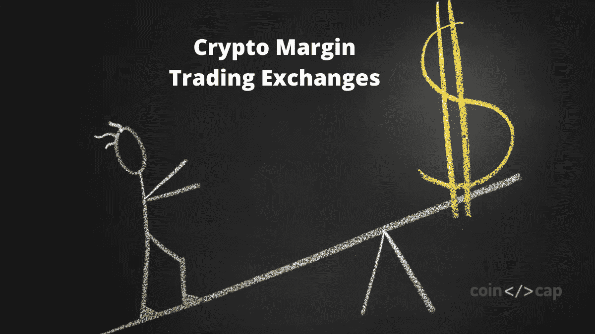

在这篇文章中，我们将讨论[保证金交易](https://blog.coincodecap.com/go/margin-trading)及其运作方式。我们还将考察允许你使用[保证金交易](https://blog.coincodecap.com/go/margin-trading)的不同交易所，以及它们提供的杠杆作用。结束时，你将学习[保证金交易](https://blog.coincodecap.com/go/margin-trading)以及如何在不同的交易所使用保证金交易。

# 什么是保证金交易？

简单来说，**融资融券交易允许你从第三方借入资金，以你的原始资本作为抵押进行交易**。

例如，一个[加密交易所](https://blog.coincodecap.com/go/crypto-exchange)可以用你的原始资本作为抵押，借给你高达 200 倍的原始资本。现在你可以交易借来的资金，你将获得基于你借来的资本的利润。然而，如果你的余额变成负数，等于你的原始资本，交易所将清算你的头寸，你将失去你的原始资本。

# 加密保证金交易是如何工作的？一个例子

让我们假设你的保证金交易账户里有 100 美元，作为交易加密的预算。现在，让我们考虑交换平台提供 5X 杠杆。因此，保持你的存款金额作为抵押，平台为你提供 500 美元进行交易。

现在假设你投资了比特币，它的价值上涨/下跌了 3%。在这种情况下，你会产生(5×3 = 15%)的利润/损失。如果不使用保证金交易，你投资 100 美元的盈利/亏损只有 3%。

但是，假设比特币价格下行 20%(20% * 5 = 100%)；这意味着你将失去所有的原始资本。

保证金交易增加你的回报；然而，你也可能在保证金交易中遭受巨大损失。加密市场是不稳定的，没有人能真正决定资产价格的涨跌。所以，不要投资自己输不起的东西。

# 总结(TL；博士)

*   保证金交易帮助你从加密交易平台借入资金进行交易。
*   你的原始资本作为抵押品，交易所根据你选择的杠杆借给你资本。
*   [币安](https://blog.coincodecap.com/go/binance)是全球交易量最大的加密交易平台，提供杠杆高达 125 倍的保证金交易。
*   Bityard 是一家[加密交易所](https://blog.coincodecap.com/go/crypto-exchange)，拥有来自四个不同国家的许可证，提供高达 200 倍的杠杆作用。
*   [Bybit](https://blog.coincodecap.com/go/bybit) 因其保证金交易服务而闻名，它向接受者收取回扣，并反过来向你支付做市商回扣。
*   [火币环球](https://blog.coincodecap.com/go/huobi)是最好的交流平台之一；然而，他们从低级交易者那里收取大量费用。
*   [PrimeXBT](https://blog.coincodecap.com/go/primexbt) 支持保证金交易的加密、外汇、商品、指数。它们提供高达 1000 倍的外汇杠杆。
*   你应该始终意识到保证金交易的风险。
*   如果你成功地确定了市场结果，你就能获得可观的回报。如果没有，那么你会损失相当大的一笔钱。

# 五大加密保证金交易平台

我们准备了一份 5 个保证金交易交易所的名单，允许你进行比特币和其他加密资产的保证金交易。让我们一个一个来看看。

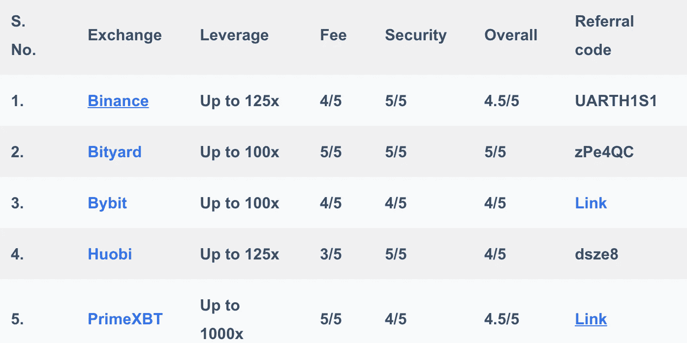

# 1.币安保证金交易

[币安](https://blog.coincodecap.com/go/binance)是[世界上交易量最大的加密交易所](https://blog.coincodecap.com/crypto-exchange)，拥有最多样化的加密资产。该交易所为您提供了更高的杠杆和市场上最高的流动性之一。

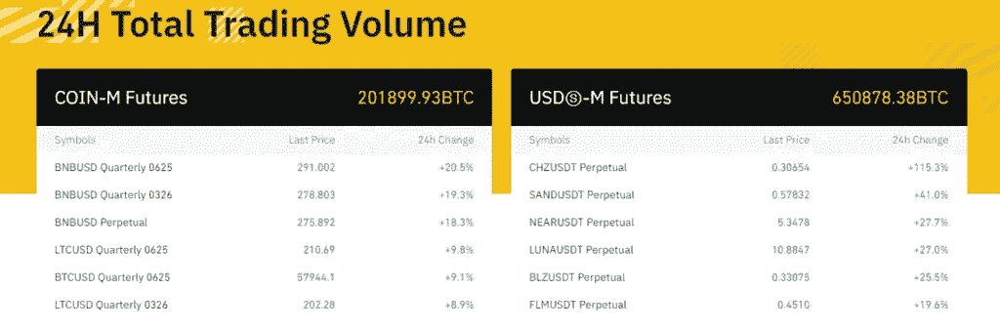

保证金交易本质上是带杠杆的现货交易，然而，[币安](https://blog.coincodecap.com/go/binance)期货市场提供了更高的杠杆。

## 杠杆作用

[币安](https://blog.coincodecap.com/go/binance)提供高达 10 倍的加密保证金交易杠杆。你可以利用的最大杠杆将取决于你头寸的名义价值。

币安在隔离保证金交易中有 10 倍的 10 级杠杆系统。与此同时，在交叉保证金交易期间，您可以在主账户和普通账户中分别获得 5 倍和 3 倍的最大杠杆。

## 隔离保证金交易

[币安](https://blog.coincodecap.com/go/binance)独立交易有一个与交易对相关联的特定账户。一个账户只能接受指定货币作为保证金。您不能在任何其他交叉保证金或独立账户中使用这些资产作为抵押品。

要了解更多关于独立保证金交易的信息，你可以访问币安或[点击这里](https://www.binance.com/en/support/faq/0135c8c00a4240f695ee71a0d18efb08)。

## 交叉保证金交易

你可以用交叉保证金账户中的资产作为抵押。在申请贷款时，你收到交叉保证金账户中的资产，然后用它们进行交叉保证金交易。

要进一步了解在[币安](https://blog.coincodecap.com/go/binance)的交叉保证金交易，你可以访问币安或者[点击这里](https://www.binance.com/en/support/faq/360041505471)。

## 币安的维护利润是多少？

这是你保持交易的最低抵押额或账户余额。如果你的信用在遭受损失时低于这个水平，那么要么你必须增加更多的资金，要么见证清算。

## 什么是币安利润水平？

在保证金交易中，你会在屏幕上看到一个仪表。它代表了你借钱所冒的风险。计量器根据市场变化，如果你的预测出现偏差，币安可以清算你的资金。

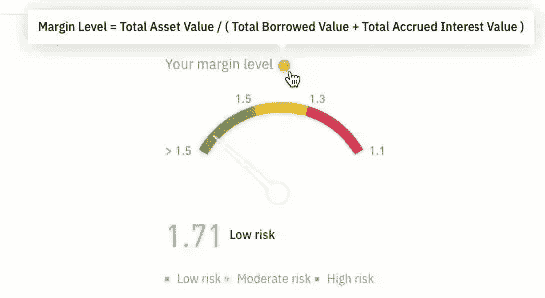

## 什么是币安保证金清算？

这是保证金水平指标上的点，即 1.1，低于该点[币安](https://blog.coincodecap.com/go/binance)将自动清算你的所有资产。

## 币安费用

[币安](https://blog.coincodecap.com/go/binance)有一个向接受者和制造者收费的等级系统，你可以在下表中观察到或者访问他们的[网站](https://www.binance.com/en/margin-fee)。

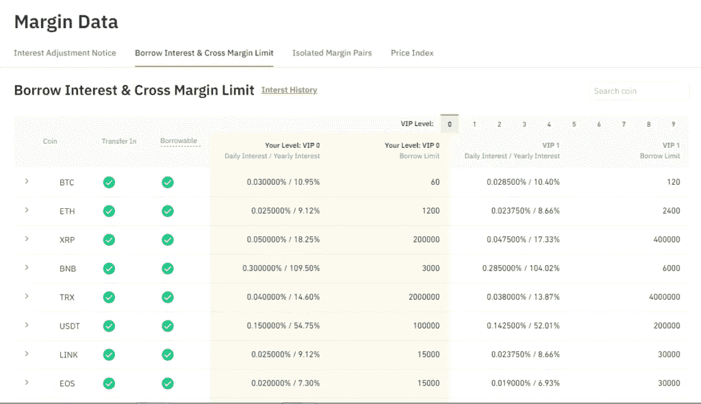

然而，[币安](https://blog.coincodecap.com/go/binance)隔离保证金用户使用 BNB 作为支付方式，利息可享受 25%的折扣。相比之下，交叉保证金交易用户使用 BNB 可以享受 5%的折扣。

**费用的计算**

您可以通过以下方式计算佣金

**佣金=费率 x 名义费用**

硬币保证金期货合同:

**(合约规模 x 合约数量)/开盘价**

USDT 保证金期货合约:

**名义价值=交易价格 x 合约数量**

## 币安保证金交易交易所入门

您可以按照以下步骤创建您的[币安保证金交易账户](https://blog.coincodecap.com/go/binance)并开始操作:

1.  创建一个帐户，并在币安完成您的 KYC。
2.  登录并点击您的个人资料选项卡，然后访问您的帐户仪表板。
3.  现在点击页边空白。
4.  仔细阅读所有政策，如果您同意，请点击“开立保证金账户”
5.  现在，通过点击钱包选项卡，然后在保证金转移资金。

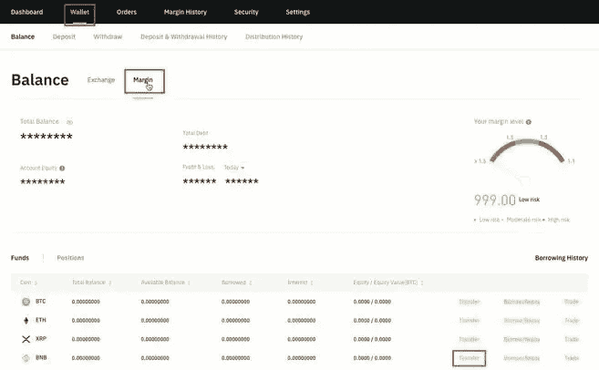

## 币安保证金交易:利与弊

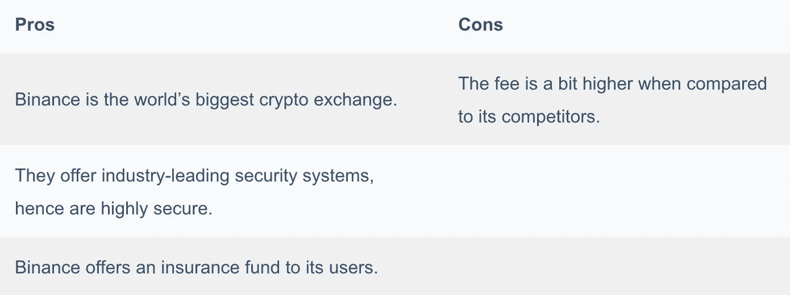

# 2.比特币保证金交易

[Bityard](https://blog.coincodecap.com/go/bityard) 是一个提供加密现货、保证金、[副本交易](https://blog.coincodecap.com/bityard-copy-trading)和合约交易选项的交易所。它们为保证金交易提供了最高的杠杆。Bityard 目前在 150 多个国家运作，并与 [CoinMarketCap](https://coinmarketcap.com/) 、[币安](https://blog.coincodecap.com/go/binance)和许多其他公司合作。

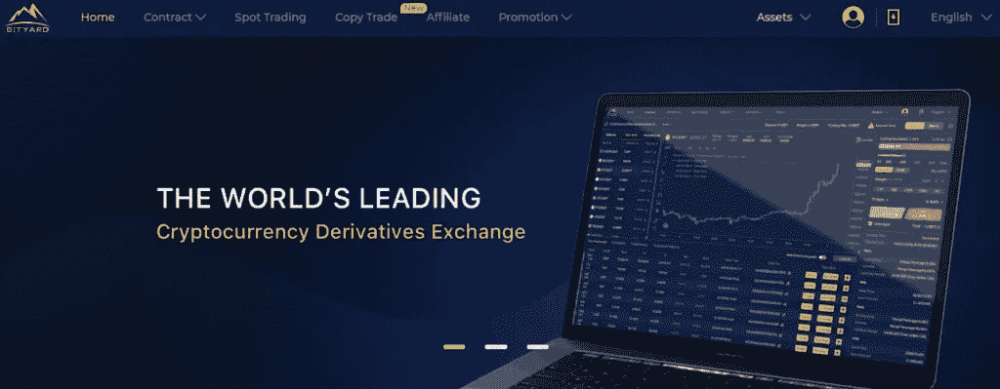

## Bityard 的杠杆作用

[Bityard](https://blog.coincodecap.com/go/bityard) 提供了高达 200 倍的 BTC 杠杆，即你可以用 1 BTC 的资本换取高达 200 BTC。 [Bityard](https://blog.coincodecap.com/go/bityard) 提供现货和衍生品市场(期货)的保证金交易。

## 你在 Bityard 的保证金账户是如何运作的？

在 [Bityard](https://blog.coincodecap.com/go/bityard) ，在你存入资金后，你可以简单地将鼠标悬停在合约上，点击 crypto 并投资保证金。在屏幕的右侧，你可以看到杠杆滑块和空间来输入做多或做空的数量。

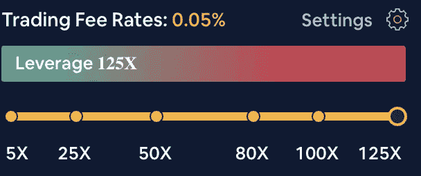

下单后，资金会自动转入您的保证金账户。现在你的头寸是未平仓的，直到你从屏幕底部手动平仓。

## 什么是浮动 P&L？

当你开始交易时，你会在 USDT 的保证金余额旁边看到不同的金额。如果是+ve，这个金额就是你的利润，如果是负的，就是亏损。但这不是你的实际利润/损失，因为你还没有结束交易。

借助浮动损益表，你可以跟踪你的头寸及其收益。

## 如何做多或做空 [Bityard](https://blog.coincodecap.com/go/bityard) ？

在访问加密选项卡时，您可以在右侧看到一个绿色和一个红色按钮。

现在，点击绿色按钮或购买，你就可以做多了。做多意味着你期望从资产价值的上涨中获得正回报。

点击红色按钮或卖出，你做空。做空意味着，你预计资产价值将下跌，并寻求从价值下跌中获得回报。

## [Bityard](https://blog.coincodecap.com/go/bityard) 的保证金交易规则

*   对于所有类型的杠杆，最低交易门槛为 5 USDT，最高限额为 20，000 USDT。
*   杠杆上限从 5 倍到 125 倍。
*   可以 24×7 交易；然而，所有头寸 au-to 在 05:55:00 SGT 平仓。
*   所有融资融券交易订单均收取(保证金*杠杆* 0.05%)的交易费。

## 比特币保证金交易费用

[Bityard](https://blog.coincodecap.com/go/bityard) 有 0.05%的交易费，他们按照公式收取开仓费和平仓费:

**(开平仓费=保证金*杠杆* 0.05%)**

交易所还收取衍生品手续费，我们可以这样计算:

**(开仓/平仓费=保证金*杠杆* 0.025%)**

Bityard 在开始交易时扣除所有费用，在结束交易时不收取任何费用。

## Bityard 保证金交易交易所入门

您可以按照以下步骤在 [Bityard](https://blog.coincodecap.com/go/bityard) 开始保证金交易:

1.  点击注册并在 bityard 上创建一个交易账户。
2.  完成您的 KYC 并存入资金。
3.  现在激活您的保证金交易账户并开始交易。

## 比特币保证金交易:利弊

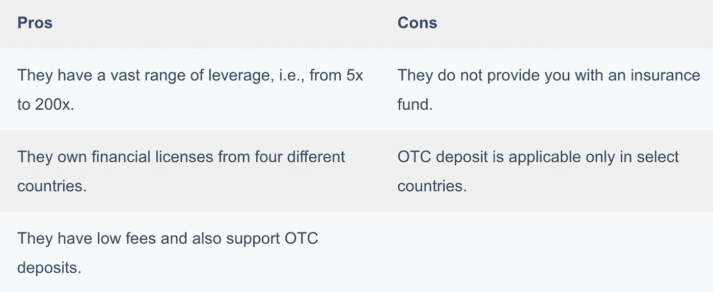

# 3.逐位保证金交易

[Bybit](https://blog.coincodecap.com/go/bybit) 是一个极其直观的平台，提供了一个优秀的用户界面。它提供保证金服务已经有很长时间了。因此，它们是可靠的，也是最安全的交易所之一。

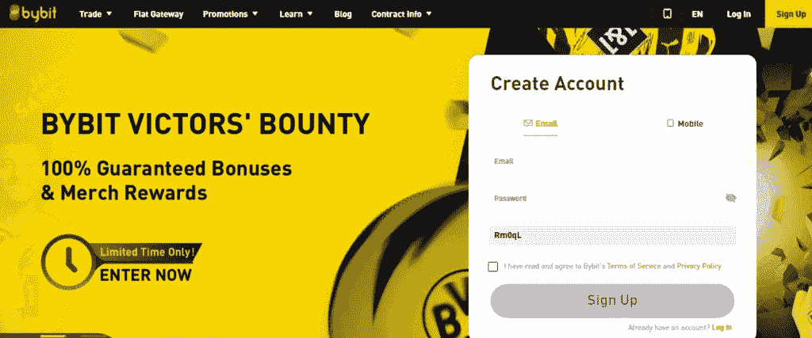

## 利用 Bybit

您可以通过屏幕右上方的位调整杠杆[。您可以通过钻头](https://blog.coincodecap.com/go/bybit)在[上获得 1 倍到 100 倍的杠杆作用。](https://blog.coincodecap.com/go/bybit)

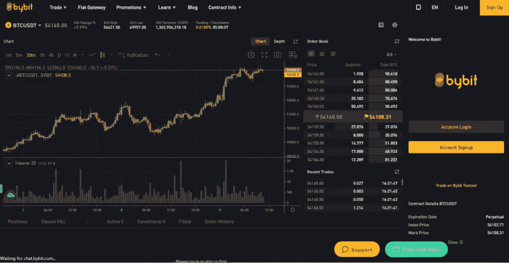

## 维护和初始利润

维持保证金决定了触发平仓的具体价格，同时参考了持有杠杆头寸所需的最低金额。

[Bybit](https://blog.coincodecap.com/go/bybit) 通过杠杆和持仓大小决定开仓所需的保证金。它被称为初始余量。

## 逐位隔离余量

如果单独的保证金头寸被清算， [Bybit](https://blog.coincodecap.com/go/bybit) 不再提取该头寸的保证金。您可以切换到独立边距模式，因为默认情况下，您使用交叉边距方法。

## 逐位交叉边距

在交叉保证金制度下，当资产价值低于止损限额时，头寸将被平仓。您不能在交叉保证金下选择您的杠杆，它是根据您当前的风险限额决定的。

点击[这里](https://help.bybit.com/hc/en-us/articles/360039749733)，你可以在 Bybit 了解更多关于独立交易和交叉保证金交易的信息。

## 逐位清算

该交易所尽其所能防止因市场操纵或低流动性而导致的清算。该交易所还利用部分清算来降低所需的维持保证金。

## Bybit 保险基金

Bybit 有保险基金以防清算发生。你可以点击查看他们每日的保险基金余额[。](https://www.bybit.com/data/basic/linear/insurance-fund?symbol=USDT)

## ADL 机制

假设不能以更好的价格平仓，保险基金无法弥补损失。在这种情况下， [ADL 机构](https://help.bybit.com/hc/en-us/articles/900000031623-What-is-Auto-Deleveraging-ADL-)就成了人们关注的焦点。

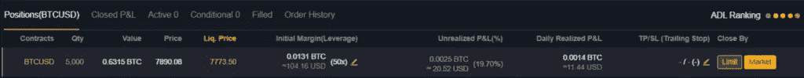

在这里，ADL 排名最高的交易者被选中，并交付你所有的资产。然后，该平台移动到队列中的下一个交易者，以此类推，直到它有效利用杠杆卖掉你的所有资产。

## 按位收费

[Bybit](https://blog.coincodecap.com/go/bybit) 收取的费用略有不同，也就是说，你要支付接受方回扣和制造商回扣的负费用。

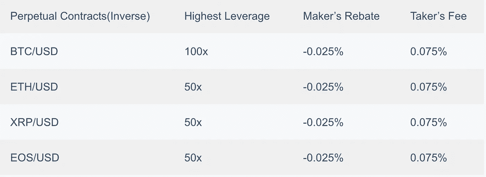

负费用意味着 [Bybit](https://blog.coincodecap.com/go/bybit) 向您支付一定金额作为制造商回扣，以增加订单的深度。

## Bybit 保证金交易交易所入门

您可以按照以下步骤通过 bit 开始在[上进行保证金交易:](https://blog.coincodecap.com/go/bybit)

1.  在 Bybit 上注册并创建一个帐户。
2.  然后，将鼠标悬停在“交易”选项卡上，点击“存款”，存入资金
3.  现在点击“市场”标签，设置你想要交易的杠杆和数量。
4.  执行您的市价单，并在 bybit 上开始保证金交易。

## Bybit:利弊

该交易所有一个简单易用的用户界面。美国公民不能在[交易 bit](https://www.bybit.com/en-US/) 。他们有保险基金。他们支持数量有限的硬币。他们用的是 100K TPS 匹配发动机。

# 4.货币保证金交易

[Huobi](https://blog.coincodecap.com/go/huobi) 是一个基于新加坡的加密交换平台，在塞舌尔工作。他们有一个初学者友好的移动应用程序和网站，并提供 180+硬币的交易。

## 杠杆上的火币

在 [Huobi](https://blog.coincodecap.com/go/huobi) ，你可以选择 1 倍到 125 倍之间的任何杠杆。然而，你不能改变杠杆，直到你不持有任何立场或有任何挂单。

## 霍比孤立边缘

一个独立的保证金账户有固定的抵押品和较高的清算风险。然而，在清算中，仅与该账户相关联的资产被清算。因此，损失仅限于特定的部分，这就是为什么初学者。

点击[这里](https://www.huobi.com/en-us/ladder-lending/margin)可以查看单独融资融券的分级贷款限额。

## 霍比交叉边缘

你可以用你所有的可交易余额作为保证金，从而降低平仓的风险。您的贷款金额取决于您的 BTC 等价交易量和您钱包中 HT holdings 的金额。

您可以通过[点击此处](https://www.huobi.com/en-us/ladder-lending/cross-margin)查看跨保证金交易的分级贷款限额。

## 快速利润

[火币](https://blog.coincodecap.com/go/huobi)提供独有的自动贷款和还款功能。通过激活快速保证金，你可以直接以高于你能力的价格交易。平台会自动为您提供超出部分的贷款，并分别收取利息。

要了解更多有关快速获利的信息，[请点击此处](https://huobiglobal.zendesk.com/hc/en-us/articles/900001657463-Announcement-on-the-Launch-of-Quick-Margin-Function-on-Huobi-Global)。

## 火币费

[火币](https://blog.coincodecap.com/go/huobi)有等级制收费。你可以看看下表中的费用。孤立保证金和交叉保证金有不同的利息等级，你可以通过[点击这里](https://www.huobi.com/en-us/ladder-lending/cross-margin/)查看。

**普通用户**

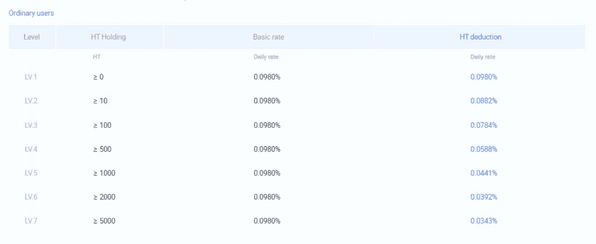

**专业用户**

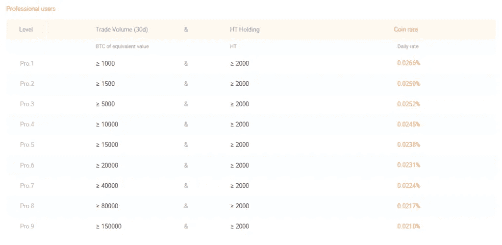

您也可以选择通过点卡支付费用，每张点卡价值 1 USDT。要了解更多关于点卡的信息，[点击此处](https://huobiglobal.zendesk.com/hc/en-us/articles/360000182831-Point-Card-Usage-Instructions)。

## 火币保证金交易入门

按照以下步骤在[火币](https://blog.coincodecap.com/go/huobi)上开始保证金交易:

1.  注册并创建您的帐户。
2.  然后把资金存入你的火币账户。
3.  要启用保证金交易，请转到“保证金交易”选项卡。
4.  转到“转入”选项卡，将资金从您的普通钱包存入您的保证金交易钱包。
5.  现在你可以开始保证金交易了。

## 火币:利弊

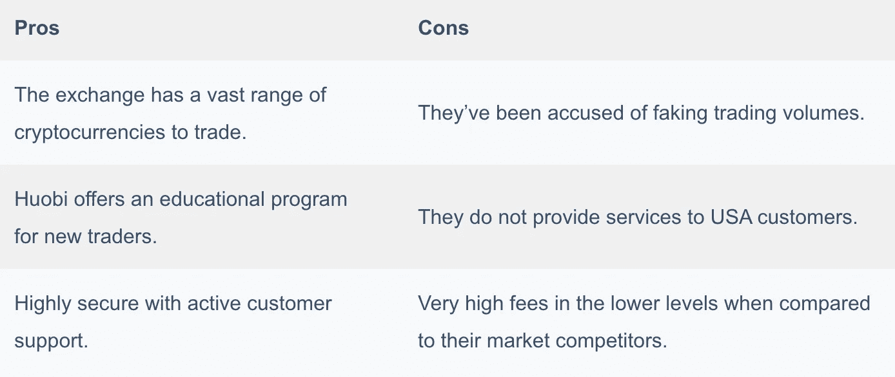

# 5.PrimeXBT 保证金交易

PrimeXBT 提供了一个完全可定制的平台，你可以在这里移动图表、市场窗口等。，根据您的要求。他们为初学者提供了一个简单的用户界面和视频教程，并内置了技术分析工具。

## 利用 PrimeXBT

有超过 50 种不同杠杆的期权可供交易。PrimeXBT 在加密、索引和商品方面提供最大 100 倍的杠杆作用。

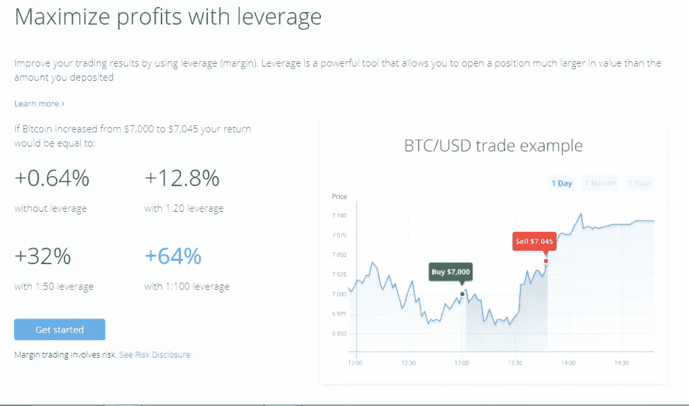

## PrimeXBT 交叉保证金

PrimeXBT 只提供交叉保证金交易服务。交叉保证金让你使用你所有的资金，并可能导致你在清算时损失所有的资产。由于其复杂的特点，有经验的交易者更喜欢交叉保证金交易。

## PrimeXBT 费用

你可以在下表中查看加密保证金交易的利息，以及其他人访问他们的[网站](https://primexbt.com/fees)的费用。

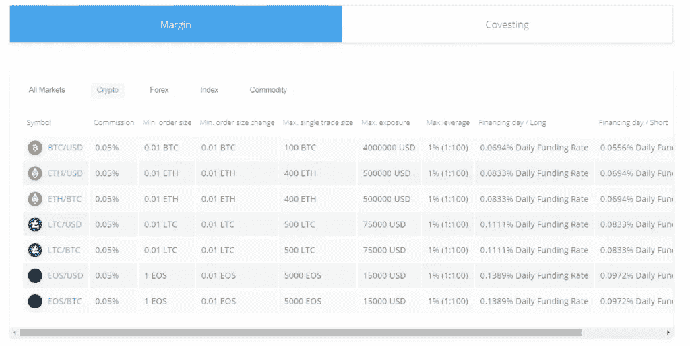

## PrimeXBT 保证金交易交易所入门

PrimeXBT 是一个初学者友好的平台；因此你可以很快开始保证金交易。但是，您也可以遵循以下步骤:

1.  在 PrimeXBT 上创建一个帐户。
2.  现在把比特币存入你的账户钱包。
3.  点击保证金交易，然后激活您的保证金交易账户。
4.  将资金转入您的保证金账户并开始交易。

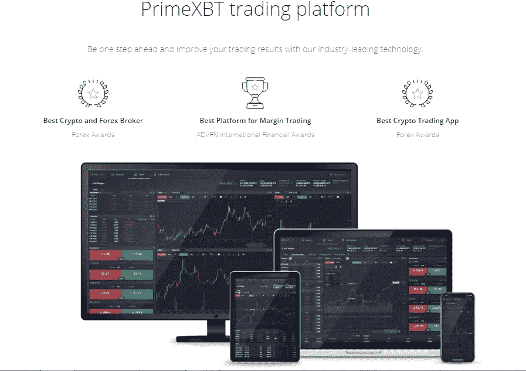

## PrimeXBT:利弊

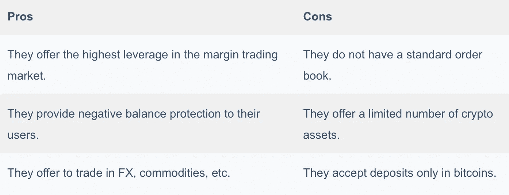

# 保证金交易:交易前先了解

在你决定进入市场之前，你应该牢记保证金交易的风险。以下几点可能有助于你理解保证金交易的风险:

1.  由于加密市场波动很大，你永远无法完全预测市场的走向，也无法预测你会获利还是亏损。
2.  即使是价格的小幅下跌也会让你遭受严重的损失。
3.  还有其他风险，比如你的互联网连接或平台的市场连接。如果你的网络连接很弱，当交易所收到你的订单时，资产的价格可能已经改变了。
4.  我们建议新手远离保证金交易。他们没有太多的经验，最终很可能会失去所有的资本。
5.  你应该格外小心你的保证金账户的安全。

# 结论:加密保证金交易交易所

保证金交易可以帮助你用最少的资金获得可观的回报。然而，如果市场横盘，你也可能遭受损失。许多交易所提供保证金交易服务，然而，[币安](https://blog.coincodecap.com/go/binance)、 [Bybit](https://blog.coincodecap.com/go/bybit) 或 [Bityard](https://blog.coincodecap.com/go/bityard) 可能是你在业内的最佳选择。它们提供完美的杠杆作用，具有高效的安全性和有竞争力的费用。

# 常见问题

你可以用保证金交易密码吗？

你可以用保证金交易密码。有许多交易所提供加密保证金交易，如[币安](https://blog.coincodecap.com/go/binance)、[比特币](https://blog.coincodecap.com/go/bityard)、[比特币](https://blog.coincodecap.com/go/huobi)等。

保证金交易是个好主意吗？

保证金交易可以帮助你以最小的资本投入获得高回报。但是，你必须记住，如果价格下降，你可能会遭受重大损失。

**什么时候 5x 在币安意味着什么？**

5x 表示你愿意投资的资产的杠杆作用。例如，选择 5 倍的杠杆。交易将为你提供 5 USDT 兑换 1 USDT 你的原始资本。

**融资融券交易和现货交易有什么区别？**

现货交易涉及加密资产的传统买卖。同时，保证金交易包括用交易所根据你选择的杠杆提供的资金投资一项资产。

什么是追缴保证金？

当投资者借入的资金遭受损失时，交易所将要求投资者要么存入更多资金，要么出售投资者的抵押品来弥补损失。

*   [eToro vs PrimeXBT vs Capital.com vs AvaTrade](https://blog.coincodecap.com/cfd-trading-software-etoro-avatrade-primexbt-capital-com)
*   [Pionex 评论——被动交易者的简单交易机器人](https://blog.coincodecap.com/pionex-review-exchange-with-crypto-trading-bot)
*   [什么是比特币 CFD 交易？](https://blog.coincodecap.com/what-is-bitcoin-cfd-trading)
*   [什么是比特币交易机器人？2021 年完整指南](https://blog.coincodecap.com/a-guide-to-cryptocurrency-trading-bots)
*   [2021 年国际税务评论|终极加密交易所](https://blog.coincodecap.com/interdax-review)

> 加入 coin monks[Telegram group](https://t.me/joinchat/EPmjKpNYwRMsBI4p)并了解加密交易和投资

## 另外，阅读

*   最好的[密码交易机器人](/coinmonks/crypto-trading-bot-c2ffce8acb2a) | [网格交易](https://blog.coincodecap.com/grid-trading)
*   [3 商业评论](/coinmonks/3commas-review-an-excellent-crypto-trading-bot-2020-1313a58bec92) | [Pionex 评论](/coinmonks/pionex-review-exchange-with-crypto-trading-bot-1e459d0191ea) | [Coinrule 评论](/coinmonks/coinrule-review-2021-a-beginner-friendly-crypto-trading-bot-daf0504848ba)
*   [AAX 交易所评论](/coinmonks/aax-exchange-review-2021-67c5ea09330c) | [德里比特评论](/coinmonks/deribit-review-options-fees-apis-and-testnet-2ca16c4bbdb2) | [FTX 交易所评论](/coinmonks/ftx-crypto-exchange-review-53664ac1198f)
*   [n 零审核](/coinmonks/ngrave-zero-review-c465cf8307fc) | [Phemex 审核](/coinmonks/phemex-review-4cfba0b49e28) | [PrimeXBT 审核](/coinmonks/primexbt-review-88e0815be858)
*   [Bybit 交易所评论](/coinmonks/bybit-exchange-review-dbd570019b71) | [Bityard 评论](/coinmonks/bityard-review-7d104239be35) | [CoinSpot 评论](https://blog.coincodecap.com/coinspot-review)
*   [3 commas vs crypto hopper](/coinmonks/3commas-vs-pionex-vs-cryptohopper-best-crypto-bot-6a98d2baa203)|[赚取加密利息](/coinmonks/earn-crypto-interest-b10b810fdda3)
*   最好的比特币[硬件钱包](/coinmonks/the-best-cryptocurrency-hardware-wallets-of-2020-e28b1c124069?source=friends_link&sk=324dd9ff8556ab578d71e7ad7658ad7c) | [BitBox02 回顾](/coinmonks/bitbox02-review-your-swiss-bitcoin-hardware-wallet-c36c88fff29)
*   [总帐 vs n 平均](/coinmonks/ledger-vs-ngrave-zero-7e40f0c1d694) | [总帐 nano s vs x](/coinmonks/ledger-nano-s-vs-x-battery-hardware-price-storage-59a6663fe3b0)
*   [密码本交易平台](/coinmonks/top-10-crypto-copy-trading-platforms-for-beginners-d0c37c7d698c)
*   [沃德评论](/coinmonks/vauld-review-2021-lend-trade-and-buy-bitcoin-in-india-e37a96374961) | [尤霍德勒评论](/coinmonks/youhodler-4-easy-ways-to-make-money-98969b9689f2) | [区块链评论](/coinmonks/blockfi-review-53096053c097)
*   最好的[加密税务软件](/coinmonks/best-crypto-tax-tool-for-my-money-72d4b430816b) | [硬币追踪评论](/coinmonks/cointracking-review-a-reliable-cryptocurrency-tax-software-5114e3eb5737)
*   最佳[加密借贷平台](/coinmonks/top-5-crypto-lending-platforms-in-2020-that-you-need-to-know-a1b675cec3fa) | [杠杆令牌](/coinmonks/leveraged-token-3f5257808b22)
*   [block fi vs Celsius](/coinmonks/blockfi-vs-celsius-vs-hodlnaut-8a1cc8c26630)|[Hodlnaut Review](/coinmonks/hodlnaut-review-best-way-to-hodl-is-to-earn-interest-on-your-bitcoin-6658a8c19edf)
*   [Bitsgap 审查](/coinmonks/bitsgap-review-a-crypto-trading-bot-that-makes-easy-money-a5d88a336df2) | [Quadency 审查](/coinmonks/quadency-review-a-crypto-trading-automation-platform-3068eaa374e1) | [Bitbns 审查](/coinmonks/bitbns-review-38256a07e161)
*   [埃利帕尔泰坦评论](/coinmonks/ellipal-titan-review-85e9071dd029) | [赛克斯斯通评论](/coinmonks/secux-stone-hardware-wallet-review-15-discount-coupon-2020-7577032faa6e)
*   [本地比特币评论](/coinmonks/localbitcoins-review-6cc001c6ed56)
*   最佳[区块链分析](https://bitquery.io/blog/best-blockchain-analysis-tools-and-software)工具| [赚比特币](/coinmonks/earn-bitcoin-6e8bd3c592d9)
*   [加密套利](/coinmonks/crypto-arbitrage-guide-how-to-make-money-as-a-beginner-62bfe5c868f6)指南| [如何做空比特币](/coinmonks/how-to-short-bitcoin-568a2d0b4ae5)
*   最佳[加密制图工具](/coinmonks/what-are-the-best-charting-platforms-for-cryptocurrency-trading-85aade584d80) | [最佳加密交易所](/coinmonks/crypto-exchange-dd2f9d6f3769)
*   [如何在印度购买比特币？](/coinmonks/buy-bitcoin-in-india-feb50ddfef94) | [瓦济克斯评论](/coinmonks/wazirx-review-5c811b074f5b)
*   [印度比特币交易所](/coinmonks/bitcoin-exchange-in-india-7f1fe79715c9) | [比特币储蓄账户](/coinmonks/bitcoin-savings-account-e65b13f92451)
*   [CoinDCX 评论](/coinmonks/coindcx-review-8444db3621a2)

> [直接在您的收件箱中获得最佳软件交易](/coinmonks/newsletters/coinmonks)

*原载于 2021 年 3 月 13 日 https://blog.coincodecap.com***。**