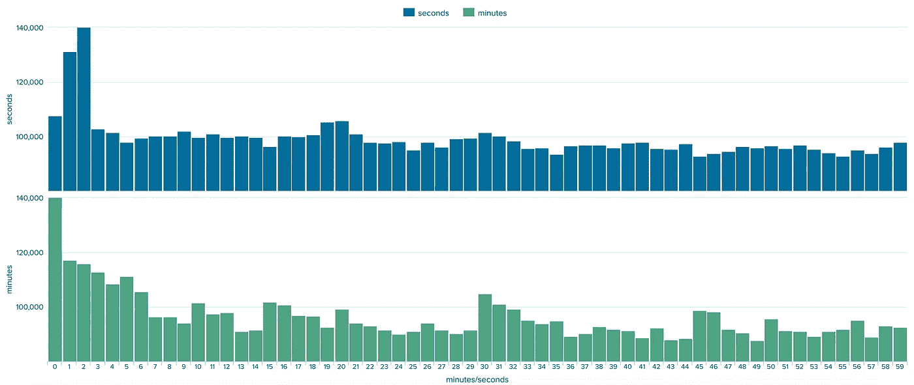
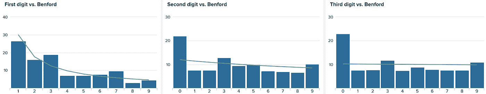
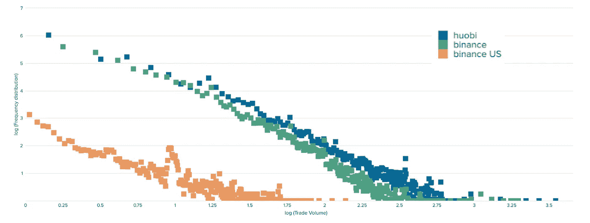
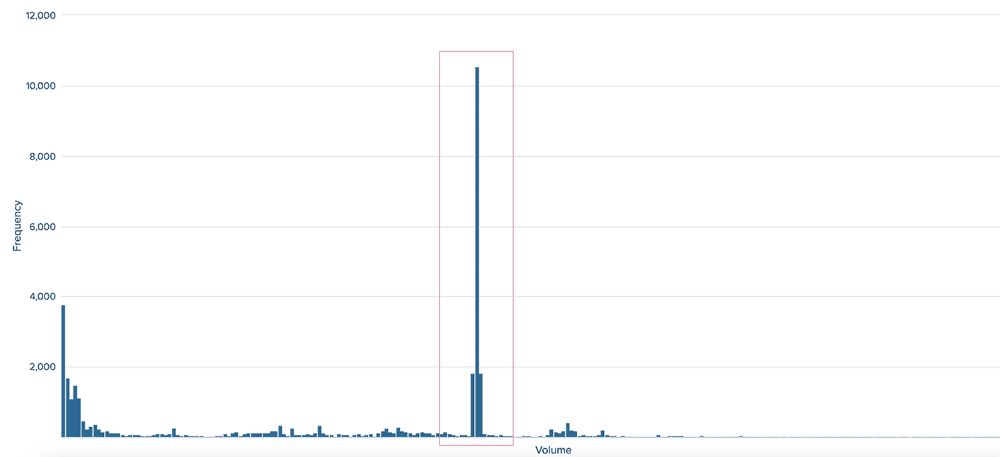
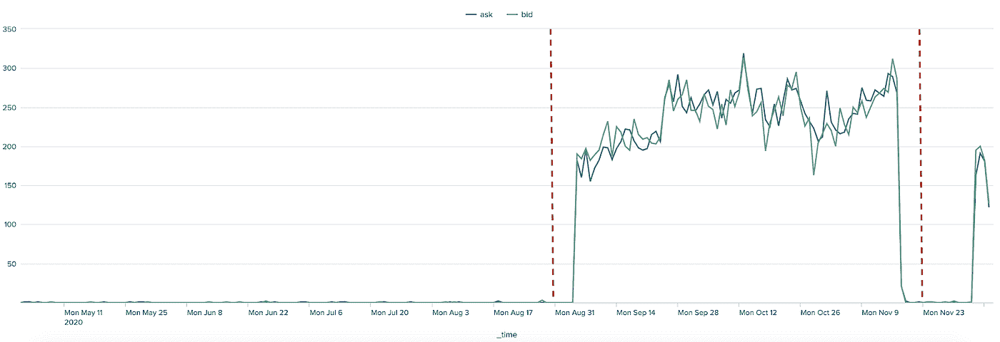
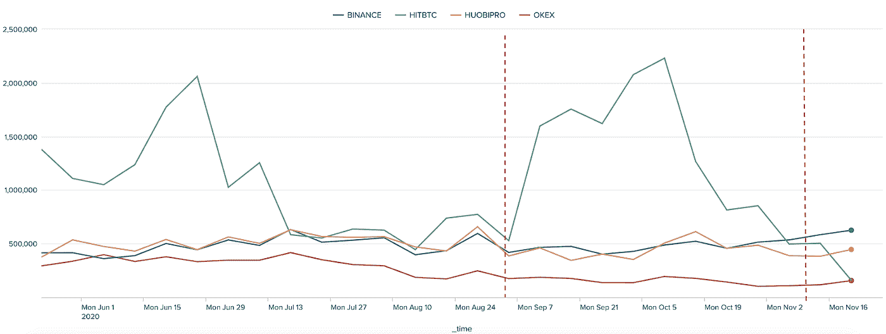
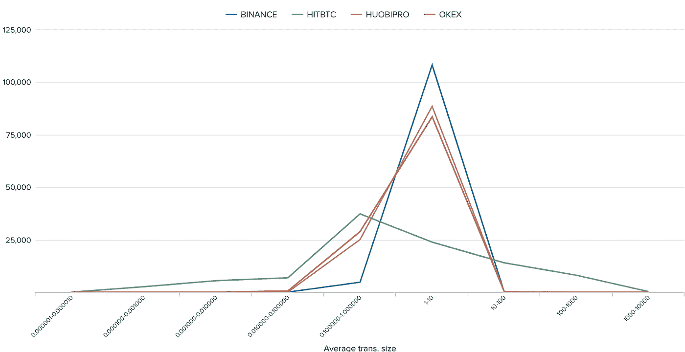
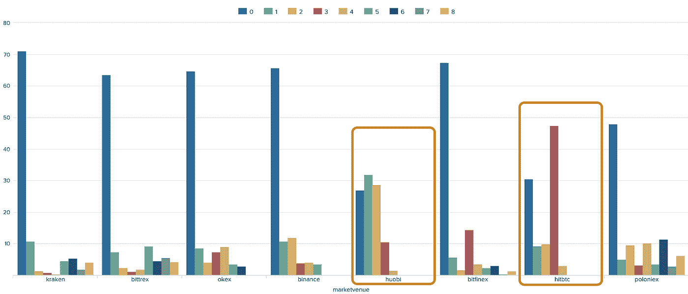

# 2020 年 12 月加密市场异常

> 原文：<https://medium.com/coinmonks/crypto-market-anomalies-december-2020-aa0f8287d88a?source=collection_archive---------7----------------------->

*   北海巨妖可预测的交易模式
*   Poloniex 上欺诈性市场活动报告的迹象
*   美国币安的 BCH 交易量不符合预期的分布模式
*   HitBTC 上的异常交易模式
*   火币上的可疑圆形交易

# 北海巨妖可预测的交易模式

北海巨妖的 BTC-美元永久掉期交易有明显的自动化活动。分钟和第二时间的交易分布显示交易计数在可预测的时间间隔内出现峰值。

*Number of executed trades* ***by seconds and minutes****. Futures market on Kraken, BTC/USD, Dec’19-Dec’20\. Source:* [*N​Terminal​*](https://inca.digital/nterminal/)

# Poloniex 上欺诈性市场活动报告的迹象

DASH/USDT 现货市场上的交易有伪造数字的迹象。在 Poloniex 上已经观察到过度使用 3s 作为第一个数字。下面是与[本福德定律](https://en.wikipedia.org/wiki/Benford%27s_law)预期分布相比，交易规模的第一位、第二位和第三位的分布。

*First, second, third digit distribution of size of trades executed on Poloniex exchange, DASH–USDT, Sept–Dec, 2020 Source:* [*N​Terminal​*](https://inca.digital/nterminal/)

根据 [ACFE](https://en.wikipedia.org/wiki/Association_of_Certified_Fraud_Examiners) 欺诈审查员的文件，“欺诈审查员担心数字的过度使用，因为欺诈者在发明数字时，倾向于过度使用某些数字模式。出现次数比本福特定律预测的要少的数字主要是因为过度使用了 3。

# 美国币安的 BCH 交易量不符合预期的分布模式

对 3 家交易所的原始交易规模分布分析显示，币安美国公布的交易量与预期的[幂律分布](https://image.tokeninsight.com/upload/levelPdf/2019-Q3-Crypto-Exchange-Wash-Trading-Research.pdf)存在显著偏差。

通常，记录交易量的频率分布与负斜率和长尾(在交易规模的高端)呈近似线性关系。例如，在比较 BCH 的交易活动时，与币安和霍比相比，在币安美国的分布是突出的。

*Frequency distribution of trading volumes of Bitcoin Cash (BCH) on Binance, Binance US, Huobi exchange, Aug–Nov, 2020\. Source:* [*N​Terminal​*](https://inca.digital/nterminal/)

# HitBTC 上的异常交易模式

HitBTC 上的异常交易模式似乎是经常发生的事情，该交易所经常报告与其他市场明显不同的交易模式。几个月来，ETH-USDT 现货市场上的 0.4 ETH 交易在 HitBTC 上表现强劲。

*Trading volume distribution on HitBTC exchange, ETH–USDT, 1 Dec — 15 Dec 2020\. Source:* [*N​Terminal​*](https://inca.digital/nterminal/)

在我们分析交易量时，0.4 ETH 在汇率上并不等同于任何便于存款和交易的整数。仅这一点就使得人为因素不太可能是显著峰值的原因。

*Bid-ask offers of 0.4 size, 1min order book snapshot on HitBTC, ETH–USDT, May-Dec, 2020\. Source:* [*N​Terminal​*](https://inca.digital/nterminal/)

随后的分析发现，恰好 0.4 ETH 的出价和要价同时公布。这种交易模式持续了 3 个月左右，以大幅上涨开始，以瞬间下跌结束。

这种洗盘交易假说也得到平均交易规模偏差和[最终夸大交易量得分](https://incasec.gitlab.io/websites/nterminal-documentation/information-types/financial/financial-analysis/#market-surveillance)峰值的支持，它们显示了在波动性可疑的低时期执行的突出交易量。这是一个常见的场景，描述了[交易所展示虚假交易的方式](https://youtu.be/I-Um62NPm0A?t=330)。

*NTerminal Inflated Volume Score: HitBTC, Binance, Huobi, OKEx, ETH–USDT, May-Dec, 2020\. Source:* [*N​Terminal​*](https://inca.digital/nterminal/)

以上都证明了 HitBTC 交易所平均交易规模偏差的操纵性质。

*Average transaction size on HitBTC, Binance, OKEx, Huobi, ETH–USDT, May-Dec, 2020\. Source:* [*N​Terminal​*](https://inca.digital/nterminal/)

# 火币上的可疑圆形交易

霍比交易所通过交易的舍入程度来显示可疑的交易分布。最多两位有效数字的交易盛行可疑，与其他交易所的普遍趋势相矛盾。HitBTC 也是如此——异常尖峰出现在 4 个有效数字内。

*Percentage of trades by degree of rounding, ETH–USDT, 7 days. Source:* [*N​Terminal​*](https://inca.digital/nterminal/)

## 另外，阅读

*   [了解以太坊和网络 3](https://blog.coincodecap.com/go/learn)
*   [密码交易机器人](/coinmonks/crypto-trading-bot-c2ffce8acb2a)
*   [3 商业评论](/coinmonks/3commas-review-an-excellent-crypto-trading-bot-2020-1313a58bec92)
*   [AAX 交易所评论](/coinmonks/aax-exchange-review-2021-67c5ea09330c) |推荐代码、交易费用、利弊
*   [Deribit 审查](/coinmonks/deribit-review-options-fees-apis-and-testnet-2ca16c4bbdb2) |选项、费用、API 和 Testnet
*   [FTX 密码交易所评论](/coinmonks/ftx-crypto-exchange-review-53664ac1198f)
*   [n 零审核](/coinmonks/ngrave-zero-review-c465cf8307fc)
*   [Bybit 交换审查](/coinmonks/bybit-exchange-review-dbd570019b71)
*   3Commas vs Cryptohopper
*   最好的比特币[硬件钱包](/coinmonks/the-best-cryptocurrency-hardware-wallets-of-2020-e28b1c124069?source=friends_link&sk=324dd9ff8556ab578d71e7ad7658ad7c)
*   [密码本交易平台](/coinmonks/top-10-crypto-copy-trading-platforms-for-beginners-d0c37c7d698c)
*   最佳 [monero 钱包](https://blog.coincodecap.com/best-monero-wallets)
*   [莱杰纳米 s vs x](https://blog.coincodecap.com/ledger-nano-s-vs-x)
*   [bits gap vs 3 commas vs quad ency](https://blog.coincodecap.com/bitsgap-3commas-quadency)
*   最好的[加密税务软件](/coinmonks/best-crypto-tax-tool-for-my-money-72d4b430816b)
*   [最佳加密交易平台](/coinmonks/the-best-crypto-trading-platforms-in-2020-the-definitive-guide-updated-c72f8b874555)
*   最佳[密码借贷平台](/coinmonks/top-5-crypto-lending-platforms-in-2020-that-you-need-to-know-a1b675cec3fa)
*   [莱杰 Nano S vs 特雷佐 one vs 特雷佐 T vs 莱杰 Nano X](https://blog.coincodecap.com/ledger-nano-s-vs-trezor-one-ledger-nano-x-trezor-t)
*   [block fi vs Celsius](/coinmonks/blockfi-vs-celsius-vs-hodlnaut-8a1cc8c26630)vs Hodlnaut
*   [bits gap review](/coinmonks/bitsgap-review-a-crypto-trading-bot-that-makes-easy-money-a5d88a336df2)——一个轻松赚钱的加密交易机器人
*   为专业人士设计的加密交易机器人
*   [PrimeXBT 审查](/coinmonks/primexbt-review-88e0815be858) |杠杆交易、费用和交易
*   [其他准备审核](https://blog.coincodecap.com/altrady-reivew)
*   [埃利帕尔泰坦评论](/coinmonks/ellipal-titan-review-85e9071dd029)
*   [赛克斯·斯通评论](https://blog.coincodecap.com/secux-stone-hardware-wallet-review)
*   [BlockFi 评论](/coinmonks/blockfi-review-53096053c097) |赚取高达 8.6%的加密利息
*   开发人员的最佳加密 API
*   [最佳区块链分析工具](https://bitquery.io/blog/best-blockchain-analysis-tools-and-software)
*   [加密套利](/coinmonks/crypto-arbitrage-guide-how-to-make-money-as-a-beginner-62bfe5c868f6)指南:新手如何赚钱
*   最佳[加密制图工具](/coinmonks/what-are-the-best-charting-platforms-for-cryptocurrency-trading-85aade584d80)
*   了解比特币最好的[书籍有哪些？](/coinmonks/what-are-the-best-books-to-learn-bitcoin-409aeb9aff4b)

> [直接在您的收件箱中获得最佳软件交易](/coinmonks/newsletters/coinmonks)

