# 2021 年 1 月加密市场异常

> 原文：<https://medium.com/coinmonks/crypto-market-anomalies-january-2021-40b71ea6aec?source=collection_archive---------5----------------------->

## 这是我们的数字资产领域最令人好奇的事情月度摘要。

## [OKEx 交易时间分布异常](https://inca.digital/intelligence/monero-zcash-okex/)

虽然许多交易所最近开始从 T2 退市隐私币，但 OKEx 的 Monero (XMR)和 ZCash (ZEC)市场仍然活跃，交易模式异常。XMR 在 OKEx 上的交易时间分布明显偏离了在币安和 Huobi 上观察到的常见交易流程。

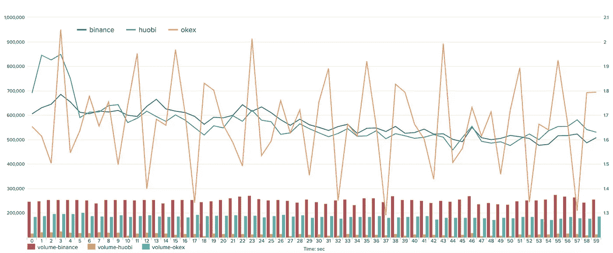

*2020 年，币安 OKEx，Huobi，按秒执行的 XMR 现货交易的百分比。来源:* [*终端*](https://inca.digital/nterminal/)

XMR 和 ZEC 秒交易图都显示异常分布，表明最活跃的交易每 5 秒发生一次。值得注意的是，观察到的交易量大幅波动并不是由这些市场的流动性短缺引起的。

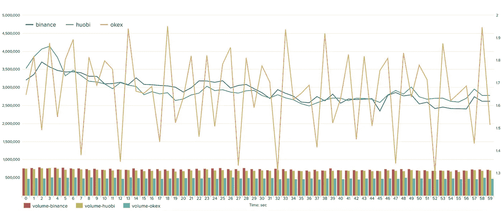

*2020 年，币安 OKEx，Huobi，以秒为单位执行的 ZEC 现货交易百分比。来源:* [*终端*](https://inca.digital/nterminal/)

隐私币因其匿名所有权能力和随后在暗网市场的使用而引起了极大的关注。上述图表中的明显激增不仅显示了交易机器人的主导趋势，还显示了与犯罪活动相关的潜在交易模式。因此，OKEx 等交易所可能被用作掩盖非法交易的平台。洗盘交易也可以很好地解释这种交易模式。

# [SENSO Token —顶级交易所的虚假交易活动](https://inca.digital/intelligence/senso-fake-activity/)

SENSO token 在 Bittrex、KuCoin 和 Poloniex 上表现出可疑的高而稳定的交易量。观察到的交易模式与洗盘交易一致。

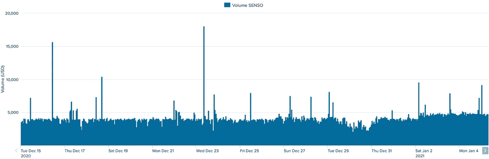

*2021 年 12 月，SENSO token 上 Bittrex 的小时交易量。来源:* [*国际*](https://inca.digital/nterminal/)

新项目获得用户认可和采纳的方法之一是提高在 CoinMarketCap 等网站上的排名。项目团队通常会寻求做市商的服务，这些做市商在交易所制造虚假活动，以提高他们代币的排名。

下图揭示了这种捏造交易量的常用伎俩。通常这种活动出现在有一个实体在市场两边活动的场所——在他们之间来回低价买入和高价卖出相同的资产。

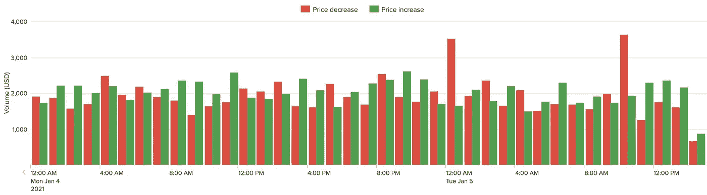

【2021 年 1 月 SENSO token 上 KuCoin 按价格变化的小时交易量。来源:[国际 ](https://inca.digital/nterminal/)

这表明上市 SENSO token 的三家交易所的平均交易规模具有操纵性质。

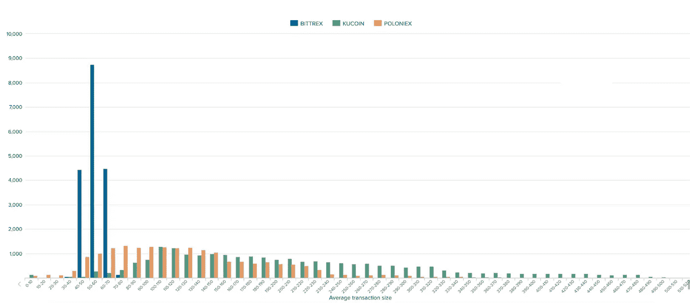

【2021 年 1 月，Poloniex、Bittrex、KuCoin、SENSO token 的平均交易规模。来源: [*终端*](https://inca.digital/nterminal/)

# [FTX 异常交易量](https://inca.digital/intelligence/abnormal-volumes-ftx/)

我们的调查团队持续监控多个市场场所发生的异常活动。下图显示了在低波动时期 FTX 异常的比特币交易量。值得注意的是，1 分钟交易量的峰值很容易识别，不会显著影响价格本身(开盘价和收盘价之间的差异)。

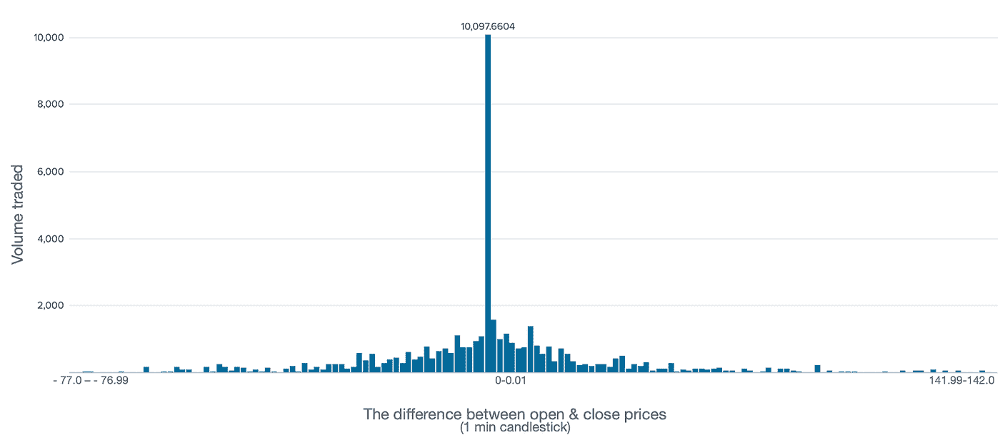

*按 1 分钟价格变化统计的交易量分布，BTC FTX-美元，3 月 20 日。来源:* [*终端*](https://inca.digital/nterminal/)

2020 年 3 月，FTX 异常的比特币交易量大大超过了哪怕是微小的价格变动。这种与价格变动不相关的成交量峰值通常表明未知实体递归地买卖资产。

作为比较，这里是同一时期(2020 年 3 月)币安的 BTC-USDT 卷的分布。

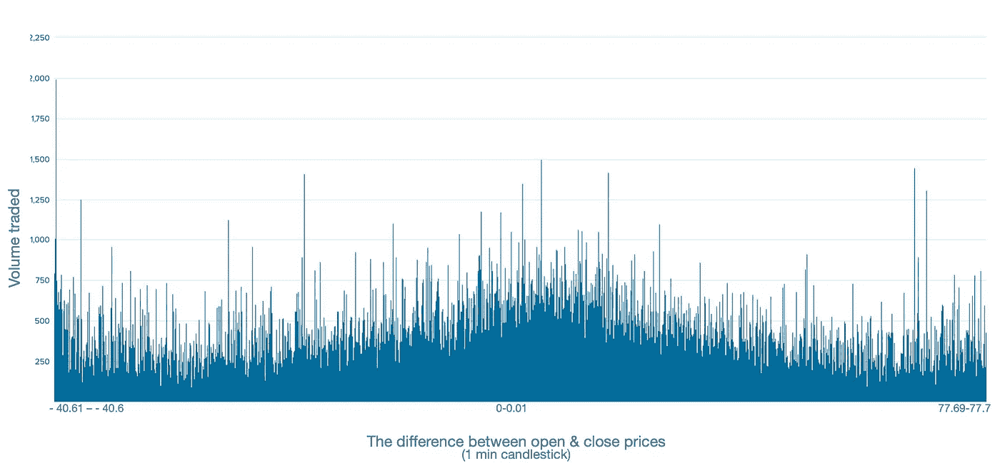

*按 1 分钟价格变化统计的交易量分布，BTC 币安-美元，3 月 20 日。来源:* [*终端*](https://inca.digital/nterminal/)

# [预定交易活动主导 Huobi 和 OKEx](https://inca.digital/intelligence/scheduled-trading-activity-dominates-huobi-okex/)

我们关注的市场操纵指标之一是交易分布的时间。Huobi 和 OKEx 都显示了交易二分钟和交易分钟图的异常分布。

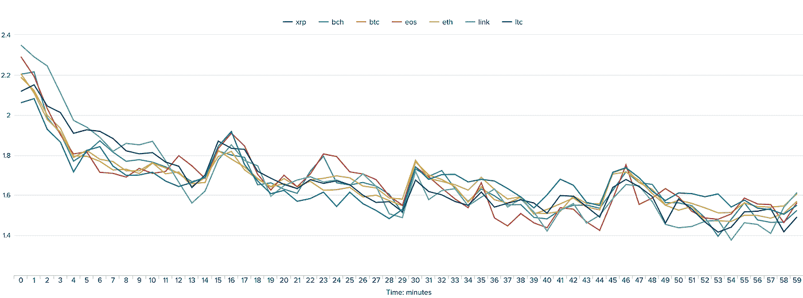

*2011 年 1 月 21 日火币现货成交笔数。来源:* [*终端*](https://inca.digital/nterminal/)

在 Huobi 上，现货市场图形显示了各种资产在同一时间段(15、30、45 分钟)的汇聚情况。

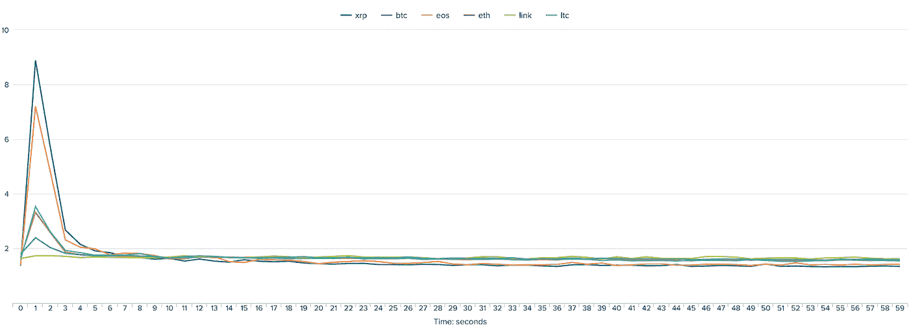

*2011 年 1 月 21 日 OKEx 日***秒执行现货交易数量。来源:* [*终端*](https://inca.digital/nterminal/)*

*OKEx 上的绝大多数交易都是在一分钟的前几秒(1-4 秒)执行的。图表上这种明显的飙升可能是交易所参与 wash 交易或寻找其他方式允许少数交易账户主导其订单簿的证据。*

# *[gate . io 异常交易](https://inca.digital/intelligence/gateio-benfords-law/)*

*Gate.io 上的现货市场交易显示出伪造数字的迹象。以下是与[本福德定律](https://en.wikipedia.org/wiki/Benford%27s_law)预期分布相比，已执行交易规模的第一、第二和第三位数的分布。基于本福德定律的证据已经被 ACFE 用来辨别自然发生的统计偏差。*

*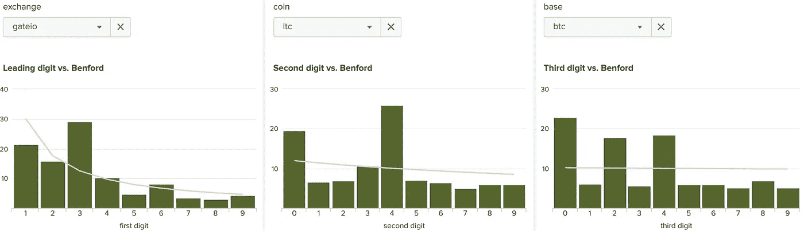*

**2021 年 1 月，LTC 现货市场 Gate.io 上已执行交易规模的第一、第二、第三位数分布。来源:* [*国际*](https://inca.digital/nterminal/)*

*Gate.io 显示了某些数字的明显过度使用，这可能表明该交易所的交易活动不规范。各种硬币最近的订单大小分布偏离了其他市场，违背了本福特定律。值得一提的是，在本交易所上市的交易对中都观察到了这些异常交易模式。*

*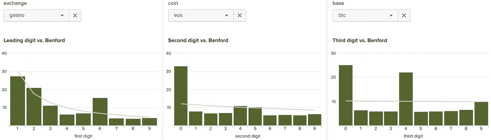*

**2021 年 1 月 EOS 现货市场 Gate.io 上已执行交易规模的第一、第二、第三位数分布。来源:* [*终端*](https://inca.digital/nterminal/)*

*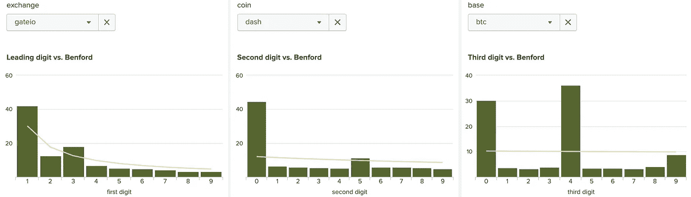*

**2021 年 1 月 DASH 现货市场 Gate.io 上已执行交易规模的第一、第二、第三位数分布。来源:* [*终端*](https://inca.digital/nterminal/)*

> *加入 coin monks[Telegram group](https://t.me/joinchat/EPmjKpNYwRMsBI4p)学习加密交易和投资*

## *另外，阅读*

*   *什么是[闪贷](https://blog.coincodecap.com/what-are-flash-loans-on-ethereum)？*
*   *最好的[密码交易机器人](/coinmonks/crypto-trading-bot-c2ffce8acb2a) | [网格交易](https://blog.coincodecap.com/grid-trading)*
*   *[3 商业评论](/coinmonks/3commas-review-an-excellent-crypto-trading-bot-2020-1313a58bec92) | [Pionex 评论](/coinmonks/pionex-review-exchange-with-crypto-trading-bot-1e459d0191ea) | [Coinrule 评论](https://blog.coincodecap.com/coinrule-review-a-perfect-trading-bot)*
*   *[AAX 交易所评论](/coinmonks/aax-exchange-review-2021-67c5ea09330c) | [德里比特评论](/coinmonks/deribit-review-options-fees-apis-and-testnet-2ca16c4bbdb2) | [FTX 交易所评论](/coinmonks/ftx-crypto-exchange-review-53664ac1198f)*
*   *[n 平均零点评审](/coinmonks/ngrave-zero-review-c465cf8307fc) | [Phemex 评审](/coinmonks/phemex-review-4cfba0b49e28)*
*   *[Bybit 交易所评论](/coinmonks/bybit-exchange-review-dbd570019b71) | [Bityard 评论](https://blog.coincodecap.com/bityard-reivew) | [CoinSpot 评论](https://blog.coincodecap.com/coinspot-review)*
*   *[3Commas vs Cryptohopper](/coinmonks/3commas-vs-pionex-vs-cryptohopper-best-crypto-bot-6a98d2baa203)*
*   *最好的比特币[硬件钱包](/coinmonks/the-best-cryptocurrency-hardware-wallets-of-2020-e28b1c124069?source=friends_link&sk=324dd9ff8556ab578d71e7ad7658ad7c) | [BitBox02 回顾](/coinmonks/bitbox02-review-your-swiss-bitcoin-hardware-wallet-c36c88fff29)*
*   *[莱杰 vs n rave](https://blog.coincodecap.com/ngrave-vs-ledger)|[莱杰 nano s vs x](https://blog.coincodecap.com/ledger-nano-s-vs-x)*
*   *[密码拷贝交易平台](/coinmonks/top-10-crypto-copy-trading-platforms-for-beginners-d0c37c7d698c) | [比特码拷贝交易](https://blog.coincodecap.com/bityard-copy-trading)*
*   *[Vauld Review](https://blog.coincodecap.com/vauld-review)|[you hodler Review](/coinmonks/youhodler-4-easy-ways-to-make-money-98969b9689f2)|[BlockFi Review](/coinmonks/blockfi-review-53096053c097)*
*   *最好的[加密税务软件](/coinmonks/best-crypto-tax-tool-for-my-money-72d4b430816b) | [硬币追踪评论](/coinmonks/cointracking-review-a-reliable-cryptocurrency-tax-software-5114e3eb5737)*
*   *最佳[密码借贷平台](/coinmonks/top-5-crypto-lending-platforms-in-2020-that-you-need-to-know-a1b675cec3fa) | [杠杆令牌](/coinmonks/leveraged-token-3f5257808b22)*
*   *[莱杰 Nano S vs 特雷佐 one vs 特雷佐 T vs 莱杰 Nano X](https://blog.coincodecap.com/ledger-nano-s-vs-trezor-one-ledger-nano-x-trezor-t)*
*   *[block fi vs Celsius](/coinmonks/blockfi-vs-celsius-vs-hodlnaut-8a1cc8c26630)|[Hodlnaut 审查](https://blog.coincodecap.com/hodlnaut-review)*
*   *[Bitsgap 审查](/coinmonks/bitsgap-review-a-crypto-trading-bot-that-makes-easy-money-a5d88a336df2) | [Quadency 审查](/coinmonks/quadency-review-a-crypto-trading-automation-platform-3068eaa374e1)*
*   *[埃利帕尔泰坦评论](/coinmonks/ellipal-titan-review-85e9071dd029) | [赛克斯斯通评论](https://blog.coincodecap.com/secux-stone-hardware-wallet-review)*
*   *[DEX Explorer](https://explorer.bitquery.io/ethereum/dex) | [区块链 API](https://explorer.bitquery.io/graphql)|[local bitcoins 评论](https://blog.coincodecap.com/localbitcoins-review)*
*   *最佳[区块链分析](https://bitquery.io/blog/best-blockchain-analysis-tools-and-software)工具| [赚比特币](https://blog.coincodecap.com/earn-bitcoin)*
*   *[加密套利](/coinmonks/crypto-arbitrage-guide-how-to-make-money-as-a-beginner-62bfe5c868f6)指南:新手如何赚钱*
*   *最佳[加密制图工具](/coinmonks/what-are-the-best-charting-platforms-for-cryptocurrency-trading-85aade584d80) | [最佳加密交易所](/coinmonks/crypto-exchange-dd2f9d6f3769)*
*   *了解比特币最好的[书籍有哪些？](/coinmonks/what-are-the-best-books-to-learn-bitcoin-409aeb9aff4b)*

> *[直接在您的收件箱中获得最佳软件交易](/coinmonks/newsletters/coinmonks)*

**