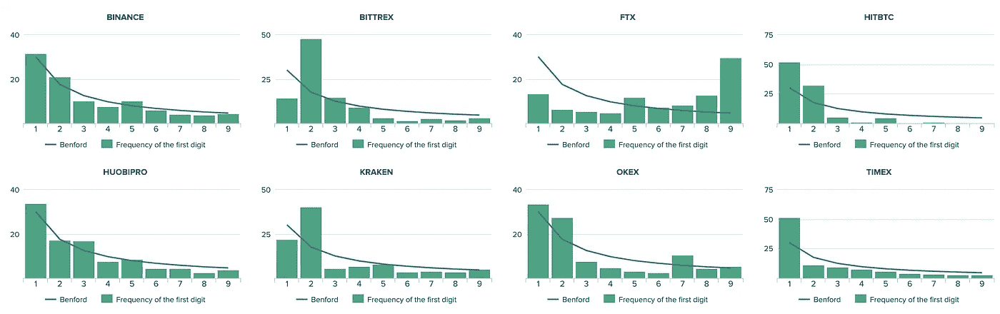
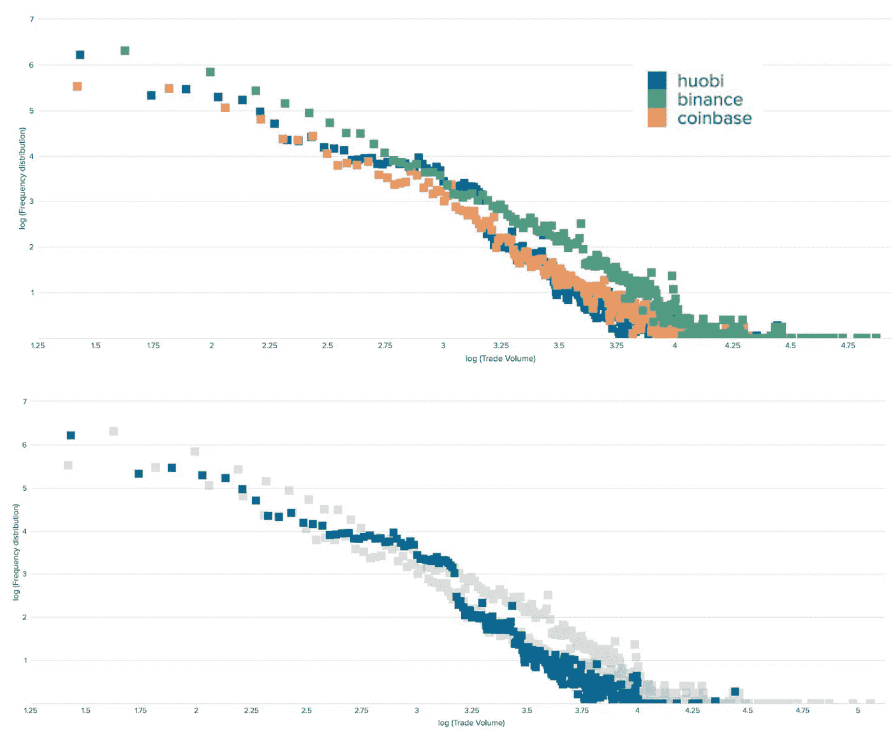
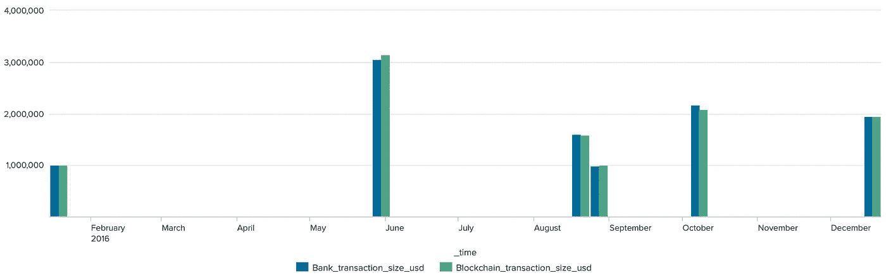
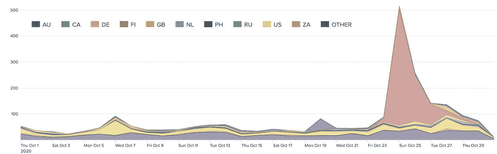

# 加密市场异常 2020 年 11 月

> 原文：<https://medium.com/coinmonks/crypto-market-anomalies-november-2020-c23f5bdeb0f3?source=collection_archive---------6----------------------->

## 目录

*   FTX 的异常交易
*   链接 Huobi 上的交易量偏差
*   FinCEN 泄密事件中的密码
*   10 月加密诈骗活动激增—芬兰

# FTX 的异常交易

FTX 表现出明显的前导数字尖峰，可能表明交易所的非标准交易活动。COMP (Compound)最近的订单分布规模偏离了其他市场，并违反了[本福特定律](https://en.wikipedia.org/wiki/Benford%27s_law)。

Frequency distribution of leading digits. Spot market COMP token order size Nov 8–10, 2020 (~500,000 events used)

## 本福德定律在欺诈检测中的应用

ACFE 发表了一篇[文章](https://www.acfe.com/uploadedFiles/Shared_Content/Products/Self-Study_CPE/UsingBenfordsLaw_2018_final_extract.pdf)，讲述了如何使用尼格里尼的测试来辨别自然发生的统计偏差。基于本福德定律的证据已被用于联邦和州的刑事和监管案件中。

# 链接 Huobi 上的交易量偏差

通常，记录交易量的频率分布与负斜率和长尾(在交易规模的高端)呈近似线性关系。例如，在比较 LINK 交易活动时，与其他高流动性交易所相比，Huobi 上的分布非常突出。

Frequency distribution of trading volumes of LINK token on Coinbase, Binance, Huobi exchange Oct 10 — Nov 10, 2020\. Source: [NTerminal](https://www.nterminal.com/) data in Splunk

交易所或代币创建者可以使用增加交易量的交易算法来创造一个更加活跃的市场的印象。许多更简单和标准化的异常检测方法，如总原始交易规模分布分析，可能会因更复杂的 wash 交易方案而失效。公布的贸易量与理论上的[幂律分布](https://image.tokeninsight.com/upload/levelPdf/2019-Q3-Crypto-Exchange-Wash-Trading-Research.pdf)的显著偏离可能是更仔细检查的一个原因。

# FinCEN 泄密事件中的密码

我们的调查团队仔细检查了 FinCEN 的泄密事件，并在比特币区块链上发现了一些可疑的类似交易。通过查看交易规模和时间戳，NTerminal 将可疑活动报告(sar)中提到的发件人(发起银行)和收件人(受益银行)与特定的区块链地址和商业实体进行匹配:

Blockchain and flagged bank transaction volume (USD) streams overlapped in the common time period, Jan — Dec, 2016\. Source: [NTerminal](https://www.nterminal.com/) data in Splunk

在最近的[印加调查小组帖子](/incas/crypto-in-the-fincen-leak-66ab105a16d)中，可以找到更多有确凿证据的案例，表明被标记的参与者可能使用比特币。这些结果强调了在进行欺诈分析时，能够关联大型数据集的公开可用数据和系统的重要性。

# 10 月加密诈骗活动激增—芬兰

传统上，美国和俄罗斯在报告的加密诈骗活动中处于领先地位。然而，最近针对芬兰的诈骗案激增。

The number of reported abuse cases by country. Source: bitcoinabuse.com, tracks bitcoin addresses used by ransomware, blackmailers, fraudsters. Source: [NTerminal](https://www.nterminal.com/) data in Splunk

最近芬兰精神健康服务提供商 Vastaamo 的 50，000 名患者的数据泄露可以解释这种激增。数据泄露是在许多患者收到威胁要公布个人数据的消息后发现的，除非支付比特币赎金。 [Vastaamo 承认两周前丢失了患者的数据](https://www.theguardian.com/world/2020/oct/26/tens-of-thousands-psychotherapy-records-hacked-in-finland)。这导致数千份诈骗报告提交到【bitcoinabuse.com】*的[，至少 6 笔赎金交易总计 0.467 BTC 支付给骗子。](https://www.bitcoinabuse.com/)*

*这些报告中有许多都与协调一致的努力有关。勒索攻击是通过电子邮件“no-reply@smileup.site”进行的，该邮件威胁要发布患者记录、治疗记录和个人数据。勒索者发送芬兰电子邮件，要求支付“前 24 小时 200 欧元或 48 小时 500 欧元，以破坏我们的数据。”*

## *另外，阅读*

*   *最好的[密码交易机器人](/coinmonks/crypto-trading-bot-c2ffce8acb2a)*
*   *[Deribit 审查](/coinmonks/deribit-review-options-fees-apis-and-testnet-2ca16c4bbdb2) |选项、费用、API 和 Testnet*
*   *[FTX 密码交易所评论](/coinmonks/ftx-crypto-exchange-review-53664ac1198f)*
*   *最好的比特币[硬件钱包](/coinmonks/the-best-cryptocurrency-hardware-wallets-of-2020-e28b1c124069?source=friends_link&sk=324dd9ff8556ab578d71e7ad7658ad7c)*
*   *[密码本交易平台](/coinmonks/top-10-crypto-copy-trading-platforms-for-beginners-d0c37c7d698c)*
*   *最好的[加密税务软件](/coinmonks/best-crypto-tax-tool-for-my-money-72d4b430816b)*
*   *[最佳加密交易平台](/coinmonks/the-best-crypto-trading-platforms-in-2020-the-definitive-guide-updated-c72f8b874555)*
*   *最佳加密贷款平台*
*   *[block fi vs Celsius](/coinmonks/blockfi-vs-celsius-vs-hodlnaut-8a1cc8c26630)vs Hodlnaut*
*   *[莱杰 vs 特雷佐](/coinmonks/ledger-vs-trezor-best-hardware-wallet-to-secure-cryptocurrency-22c7a3fd391e)*
*   *Bitsgap 评论——一个轻松赚钱的加密交易机器人*
*   *为专业人士设计的加密交易机器人*
*   *[3 商业评论](https://blog.coincodecap.com/3commas-review-an-excellent-crypto-trading-bot) |一款优秀的密码交易机器人*
*   *[PrimeXBT 评论](/coinmonks/primexbt-review-88e0815be858) |杠杆交易、费用和交易*
*   *Bitmex 的[保证金交易指南](/coinmonks/the-idiots-guide-to-margin-trading-on-bitmex-dbbd7742c6fc?source=friends_link&sk=7bfa99d2a181142510c8442c8ddb0786)*
*   *[加密摇摆交易权威指南](/coinmonks/the-definitive-guide-to-crypto-swing-trading-7e4af6496d4d?source=friends_link&sk=70448050bd9323b42f63bfc0bb1e60d1)*
*   *[Bitmex 高级保证金交易指南](/coinmonks/bitmex-advanced-margin-trading-guide-2270c195ce25?source=friends_link&sk=1d986cca731f5084b9a2db4a4bc4a7ad)*
*   *[面向开发人员的最佳加密 API](/coinmonks/best-crypto-apis-for-developers-5efe3a597a9f)*
*   *[加密套利](/coinmonks/crypto-arbitrage-guide-how-to-make-money-as-a-beginner-62bfe5c868f6)指南:新手如何赚钱*
*   *顶级[比特币节点](https://blog.coincodecap.com/bitcoin-node-solutions)提供商*
*   *最佳[加密制图工具](/coinmonks/what-are-the-best-charting-platforms-for-cryptocurrency-trading-85aade584d80)*
*   *了解比特币的[最佳书籍有哪些？](/coinmonks/what-are-the-best-books-to-learn-bitcoin-409aeb9aff4b)*

> *[直接在您的收件箱中获得最佳软件交易](https://coincodecap.com?utm_source=coinmonks)*

**