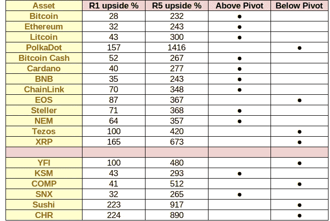
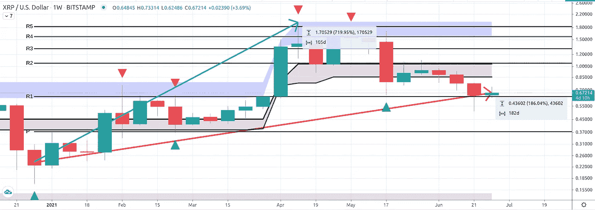
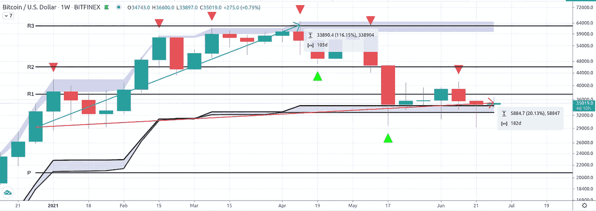
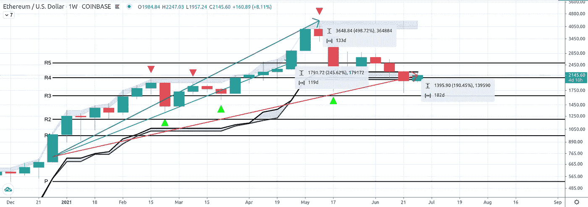
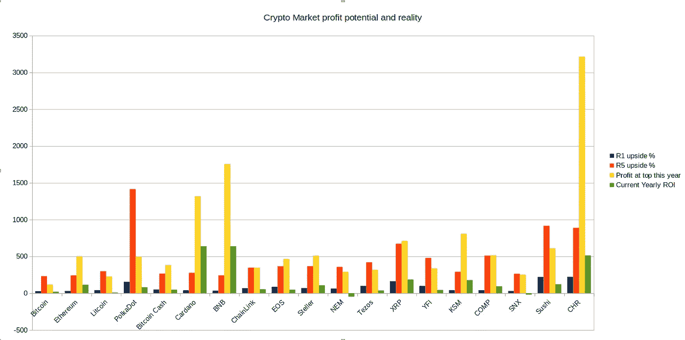
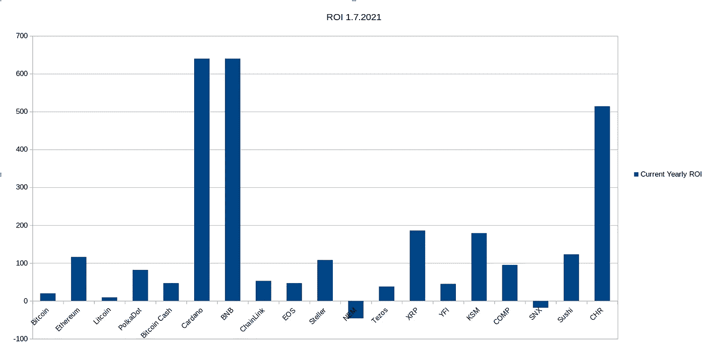
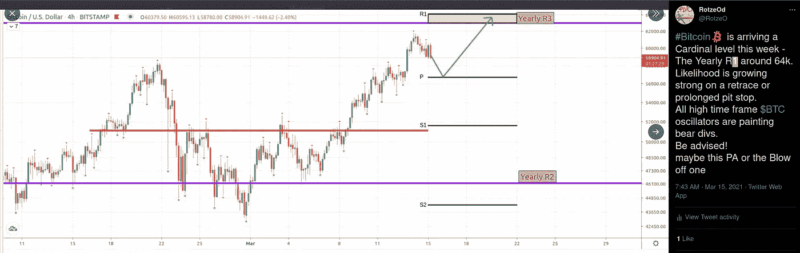

# 密码市场半年度枢轴回顾与分析

> 原文：<https://medium.com/coinmonks/crypto-market-half-yearly-pivots-review-analysis-b532a5a7f002?source=collection_archive---------8----------------------->

2021 年初，我发表了一份基于年度支点的潜在利润分析，半年后，是时候回顾一下了:情况如何？谁是赢家和输家？谁仍有扩张的潜力，哪些资产像放了屁的气球一样在移动？

早在一月份，我发表了这张图表，这是新创造的年度支点提供的最小和最大潜在利润的底线。

这是图表:

它描述了一项资产在每年的 R1、每年的 R5 上有多少利润，以及该资产在低于支点(被认为不太乐观)或高于支点(被认为乐观)的年份开始时有多少利润。为什么我把支点以下的资产称为“不那么看涨”，而不是支点定律所认为的“看跌”？我这样做是因为在那个时候，市场似乎有很高的确定性，处于看涨趋势。即使是那些表现出优柔寡断和疲软的资产，也具有看涨的潜力，在某些情况下，比那些以明显的实力开启 2021 年的资产提供了更有利可图的上行空间。

我想从分析结束的地方开始:

> 最后，如果你相信奇迹，XRP 是保守派中最大的赢家。但是祝你好运…

XRP/USD 1W Bitstamp

谁说奇迹不会发生？你想比较一下 XRP 今年 720%的表现和比特币和以太坊的惊人表现吗？可以肯定的是，比特币今年的利润达到了“惊人的”116%:

BTC/USD 1W Bitfinex

这是更乐观的以太坊，它的 245%移动到每年的 R5，但到目前为止，全年的顶部几乎是 500%:

ETH/USD 1W Coinbase

那么，这三种交易中哪一种是今年迄今为止最好的交易呢？从表面上看，XRP 的交易，对于那些训练有素的交易者来说，是很特别的。在年初，风险是交易低于年度支点，在年度 R5 以 720%轻松退出，相比之下，在 R3 和 R5 以低得多的回报退出比特币和以太坊的纪律交易。

但是等等，在这些交易中有一些警告。首先，自从比特币在 4 月 12 日的周线蜡烛上创下年度高点以来，它已经从 5 月下旬的高点回撤了 45%，而以太网从 5 月下旬的高点回撤了 60%，XRP 下跌了-70%，跌幅有点大，这表明了极端的波动性，并散发出强烈的骗局气味，无论对错，这总是与它联系在一起。但是，今年上半年，它目前提供了 186%的回报率，相比之下，ETH 提供了约 200%的投资回报率，而比特币迄今为止的投资回报率仅为 20%!！！

正如上面的图表所示，一些资产尊重今年的支点，而其他显示出额外的牛市刚刚以令人难以置信的力量突破它们。以比特币为例，它今年在支点上方开盘，一路运行到年度 R3，在那里遇到了对手，现在几乎已经回调了整个年度运行，返还了利润。

另一方面，ETH 也以高于支点的价格开局，一路攀升至 2500 美元左右的年度 R5，并突破 4380 美元，现在已经将 60%的利润返还给市场。

XRP 在今年上半年展示了一次完美的支点交易。这一年的开门红大大低于提供有意义上涨的支点，一路走到年度 R5 提供了一个完美的出口，并已回馈给市场 70%的今年的利润，但它仍然是显着上升！

上述资产分别属于不同的 Pivot 系列。XRP、竞争对手、SNX、林克，你可能还会加上 XLM 和长期资本公司，它们都在 R5 上提供了几乎完美的支点交易。你也可以在下面的图表中看到这一点，该图表将今年迄今为止的最高水平与年初以来 R5 的潜在上涨进行了比较。黄色和红色强烈相关。

第二组是那些突破 R5 的资产，显示出较高的看涨，黄色>红色。这并不总是意味着它们比上面的资产家族提供了更多的 ROI，但是在大多数情况下，它们确实提供了更多的 ROI。在这个组中，你可以找到像 ETH，ADA，BNB，Steller，KSM 和 CHR。有人可能会说，这些硬币显示了额外的牛市以及良好的基本面，如果市场开始另一个牛市周期，它们可能是值得关注的有趣品种。如果波浪理论提供了比今年记录的更高的高点，想象一下 Cardano 或 CHR 的**潜力**上升。

此外，还有未达标组，黄色组

你可以宣称，今年表现不佳的最后一组仍然有潜力达到 R5 及以上，以防出现另一波牛市。是的，这是很有可能的，但在某些情况下，你可能会清除掉那些今年表现极度疲软的硬币，他们几乎放弃了整个半年的利润，在某些情况下甚至出现了年度亏损。下面的图表有助于更好地理解谁表现最好，谁表现最差:

ROI from beginning of year in %

那么我能从这一切中得到什么呢？嗯，有几件事:首先也是最重要的——枢轴工作！好好工作！从年初开始，没有一项资产没有达到其最低预计目标。在这 19 个硬币中，13 个至少达到了 R5 的最大预期目标，其余的也在从 R1 到 R3 的不同支点水平上发现了阻力。如果你知道如何关注市场结构，你可能会把事情做对:

In the tweet i meant offcourse the Yearly R3 and not the R1

分析上半年还能得出什么？我要说的是，那些表现出看涨/特别看涨，并且在上半年运行和回撤中成功保持了相当一部分利润的资产，可以作为下一个周期的有趣组合，如果下一个周期到来的话。看涨+保持强势和一些/强劲的基本面，确实可以作为一个指标，但市场并不符合逻辑，它很少这样做。所以，请不要轻信这篇文章，记住这绝不是交易建议。

> 加入 [Coinmonks 电报频道](https://t.me/coincodecap)，了解加密交易和投资

## 也阅读

 [## 最佳免费加密交易机器人——前 16 名比特币交易机器人[2021]

### 2021 年币安、比特币基地、库币和其他密码交易所的最佳密码交易机器人。四进制，位间隙…

medium.com](/coinmonks/crypto-trading-bot-c2ffce8acb2a) 

## 另外，阅读

*   [什么是保证金交易](https://blog.coincodecap.com/margin-trading) | [美元成本平均法](https://blog.coincodecap.com/dca)
*   [BigONE 交易所评论](/coinmonks/bigone-exchange-review-64705d85a1d4) | [电网交易机器人](https://blog.coincodecap.com/grid-trading)
*   [3 商业评论](/coinmonks/3commas-review-an-excellent-crypto-trading-bot-2020-1313a58bec92) | [Pionex 评论](/coinmonks/pionex-review-exchange-with-crypto-trading-bot-1e459d0191ea) | [Coinrule 评论](/coinmonks/coinrule-review-2021-a-beginner-friendly-crypto-trading-bot-daf0504848ba)
*   [莱杰 vs Ngrave](/coinmonks/ledger-vs-ngrave-zero-7e40f0c1d694) | [莱杰 nano s vs x](/coinmonks/ledger-nano-s-vs-x-battery-hardware-price-storage-59a6663fe3b0) | [币安评论](/coinmonks/binance-review-ee10d3bf3b6e)