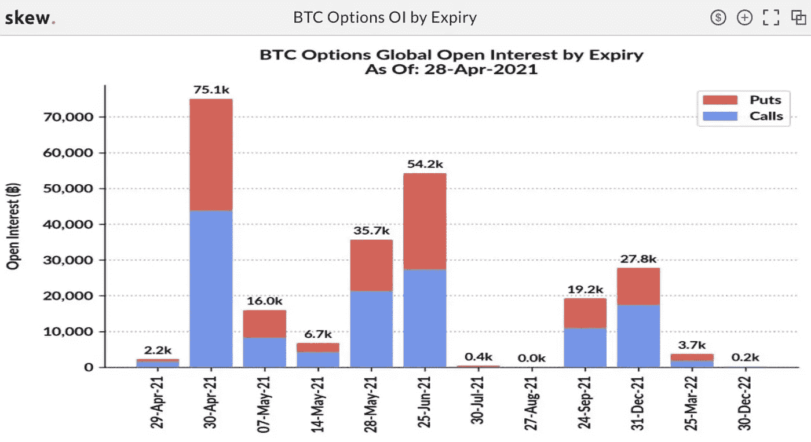
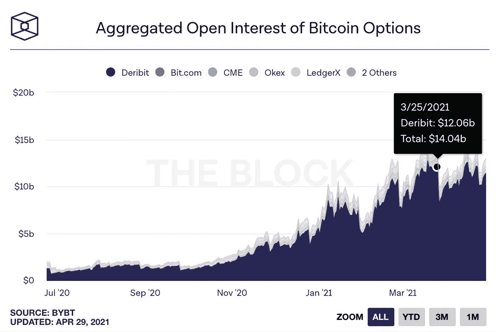
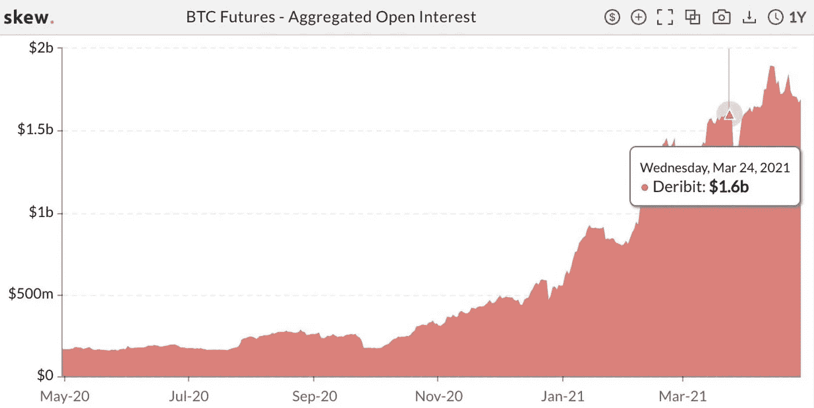
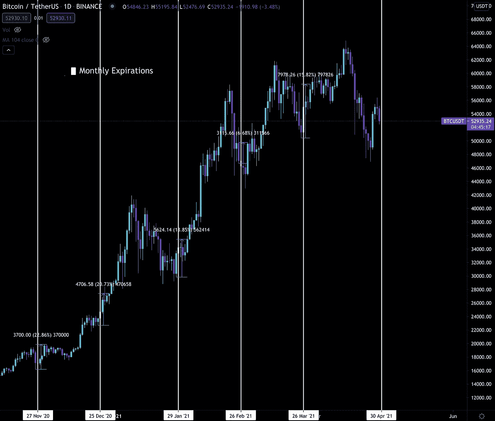

# 加密市场同步

> 原文：<https://medium.com/coinmonks/crypto-market-synchronization-3313e5e4f80f?source=collection_archive---------2----------------------->

明天为我们提供了另一个价格催化剂。

一个是润滑轮子，为下一次更高的推动。

你可能还记得上个月我们解释了 3 月底的期权到期日将是一个看涨事件。如果你错过了，这是 3 月 22 日的本周图表。

在数十亿份期权合约到期后，价格在接下来的几周内上涨了 25%以上。

这一次很可能会以类似的方式展开。唯一的不同是这个月的到期正好与[灰度效应“不成功便成仁](https://jarvislabs.substack.com/p/grayscale-effect-update)”的时间框架吻合。

如果灰度效果保持不变，那么这两者将在市场上形成强大的合力。

由于我们最近发现了灰度效应，以及如果这种效应持续下去，未来几个月可能会产生难以置信的购买压力，让我们看看月底期权到期的情况。

重要的是要知道期权的到期日可以分为季度、月、周和日。兴趣和成交量往往就是按照这个顺序展开的。这意味着季度期权比日期权更活跃。

星期五是每月一次的选择。

目前约有 75，100 份未平仓合约即将到期。

这相当于近 40 亿美元。

上个月，这是一个季度，看到约 50 亿美元的滚下。

虽然数量不多，但仍然很重要。

现在，期权市场到期后影响价格的原因之一是到期后资本如何流动。

一旦过期，就会发生两件事。

首先，由于资本被释放出来供未来使用，新的头寸被打开。

第二，老仓位平仓。

就第一个而言，我不确定明天之后会发生什么…

但对于第二种情况……做市商正在期货市场展开他们的对冲头寸。

你可以通过观察 Deribit 在期货市场的公开兴趣来了解这一点。它在每月的到期日有明显的下降。我突出了上个月，所以你可以看到下降。

这种下降可能表明空头头寸在那段时间被平仓。

就这一次而言…

我目前没有伽马射线在以前的到期中是什么样子的数据，但是伽马射线现在的状态是非常负面的。

> *回想一下，负伽马就像动能。随着价格的变动，做市商也在同一个方向对冲。这造成了更多的波动。这就是我们今天的处境。*

事实上，我们正处于一个期权高度波动的时刻，这意味着这些期货的“平仓”也可能是不稳定的。

因此，我将关注的一件事是德里比特在期货市场的未平仓头寸。我想看看下降的幅度有多大，以及发生这种情况时价格会受到怎样的影响

总成交量可能会很小，但其影响可能会在未来几天波及整个市场。

一定要注意变化。

就到期后的情况而言，从每月到期前一天到到期后四天，价格平均上涨 17%。

如果这种趋势继续下去…并且足够强劲，我们将克服我们昨天讨论的 55–57k 美元的[链上阻力…](https://jarvislabs.substack.com/p/not-as-steady-as-it-looks)

然后，我们将进入下周，就像可能真正点燃市场的潜在灰度效应部分开始一样。

与此同时，交易所缺乏 BTC 和瑞士联邦交易所，机构需求升温，通货膨胀的力量，以及其他看涨的原因…

我们得到了*自发市场同步* …持续数周的可能性。

激动人心的时刻。

你启动密码，

B

又及——本杰明还在战斗。高烧不退。他发高烧已经 11 天了，祈祷他的烧快点退。

> 加入 [Coinmonks 电报小组](https://t.me/joinchat/uiLERCQL1fQ5ZjA1)，了解加密交易和投资

## 另外，阅读

*   [什么是融资融券交易](https://blog.coincodecap.com/margin-trading) | [成本平均法](https://blog.coincodecap.com/dca)
*   最好的[加密交易机器人](/coinmonks/crypto-trading-bot-c2ffce8acb2a) | [网格交易机器人](https://blog.coincodecap.com/grid-trading)
*   [3 商业评论](/coinmonks/3commas-review-an-excellent-crypto-trading-bot-2020-1313a58bec92) | [Pionex 评论](/coinmonks/pionex-review-exchange-with-crypto-trading-bot-1e459d0191ea) | [Coinrule 评论](/coinmonks/coinrule-review-2021-a-beginner-friendly-crypto-trading-bot-daf0504848ba)
*   [AAX 交易所评论](/coinmonks/aax-exchange-review-2021-67c5ea09330c) | [德里比特评论](/coinmonks/deribit-review-options-fees-apis-and-testnet-2ca16c4bbdb2) | [FTX 交易所评论](/coinmonks/ftx-crypto-exchange-review-53664ac1198f)
*   [n rave 零点回顾](/coinmonks/ngrave-zero-review-c465cf8307fc) | [Phemex 回顾](/coinmonks/phemex-review-4cfba0b49e28) | [PrimeXBT 回顾](/coinmonks/primexbt-review-88e0815be858)
*   [Bybit Exchange 审查](/coinmonks/bybit-exchange-review-dbd570019b71) | [Bityard 审查](/coinmonks/bityard-review-7d104239be35) | [CoinSpot 审查](https://blog.coincodecap.com/coinspot-review)
*   [3 commas vs crypto hopper](/coinmonks/3commas-vs-pionex-vs-cryptohopper-best-crypto-bot-6a98d2baa203)|[赚取加密利息](/coinmonks/earn-crypto-interest-b10b810fdda3)
*   最好的比特币[硬件钱包](/coinmonks/the-best-cryptocurrency-hardware-wallets-of-2020-e28b1c124069?source=friends_link&sk=324dd9ff8556ab578d71e7ad7658ad7c) | [BitBox02 回顾](/coinmonks/bitbox02-review-your-swiss-bitcoin-hardware-wallet-c36c88fff29)
*   [莱杰 vs n 格拉夫](/coinmonks/ledger-vs-ngrave-zero-7e40f0c1d694) | [莱杰纳诺 s vs x](/coinmonks/ledger-nano-s-vs-x-battery-hardware-price-storage-59a6663fe3b0) | [币安评论](/coinmonks/binance-review-ee10d3bf3b6e)
*   [加密复制交易平台](/coinmonks/top-10-crypto-copy-trading-platforms-for-beginners-d0c37c7d698c) | [Coinmama 评论](/coinmonks/coinmama-review-ace5641bde6e)
*   [CoinLoan 审核](/coinmonks/coinloan-review-18128b9badc4) | [YouHodler 审核](/coinmonks/youhodler-4-easy-ways-to-make-money-98969b9689f2) | [BlockFi 审核](/coinmonks/blockfi-review-53096053c097)
*   最好的[加密税务软件](/coinmonks/best-crypto-tax-tool-for-my-money-72d4b430816b) | [硬币追踪评论](/coinmonks/cointracking-review-a-reliable-cryptocurrency-tax-software-5114e3eb5737)
*   最佳[加密借贷平台](/coinmonks/top-5-crypto-lending-platforms-in-2020-that-you-need-to-know-a1b675cec3fa) | [杠杆代币](/coinmonks/leveraged-token-3f5257808b22)
*   [BlockFi vs Celsius](/coinmonks/blockfi-vs-celsius-vs-hodlnaut-8a1cc8c26630)|[Hodlnaut 点评](/coinmonks/hodlnaut-review-best-way-to-hodl-is-to-earn-interest-on-your-bitcoin-6658a8c19edf) | [KuCoin 点评](https://blog.coincodecap.com/kucoin-review)
*   [Bitsgap 审查](/coinmonks/bitsgap-review-a-crypto-trading-bot-that-makes-easy-money-a5d88a336df2) | [Quadency 审查](/coinmonks/quadency-review-a-crypto-trading-automation-platform-3068eaa374e1) | [Bitbns 审查](/coinmonks/bitbns-review-38256a07e161)
*   [埃利帕尔泰坦评论](/coinmonks/ellipal-titan-review-85e9071dd029) | [赛克斯斯通评论](/coinmonks/secux-stone-hardware-wallet-review-15-discount-coupon-2020-7577032faa6e)
*   [本地比特币审核](/coinmonks/localbitcoins-review-6cc001c6ed56) | [加密货币储蓄账户](https://blog.coincodecap.com/cryptocurrency-savings-accounts)
*   最佳[区块链分析](https://bitquery.io/blog/best-blockchain-analysis-tools-and-software)工具| [赚比特币](/coinmonks/earn-bitcoin-6e8bd3c592d9)
*   [加密套利](/coinmonks/crypto-arbitrage-guide-how-to-make-money-as-a-beginner-62bfe5c868f6)指南| [如何做空比特币](/coinmonks/how-to-short-bitcoin-568a2d0b4ae5)
*   最佳[加密制图工具](/coinmonks/what-are-the-best-charting-platforms-for-cryptocurrency-trading-85aade584d80) | [最佳加密交易所](/coinmonks/crypto-exchange-dd2f9d6f3769)
*   [如何在印度购买比特币？](/coinmonks/buy-bitcoin-in-india-feb50ddfef94) | [瓦济克斯审查](/coinmonks/wazirx-review-5c811b074f5b)
*   [印度比特币交易所](/coinmonks/bitcoin-exchange-in-india-7f1fe79715c9) | [比特币储蓄账户](/coinmonks/bitcoin-savings-account-e65b13f92451)
*   [CoinDCX 评论](/coinmonks/coindcx-review-8444db3621a2) | [加密保证金交易交易所](https://blog.coincodecap.com/crypto-margin-trading-exchanges)