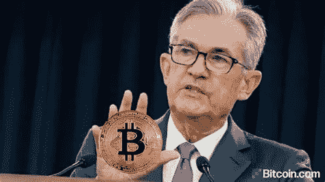
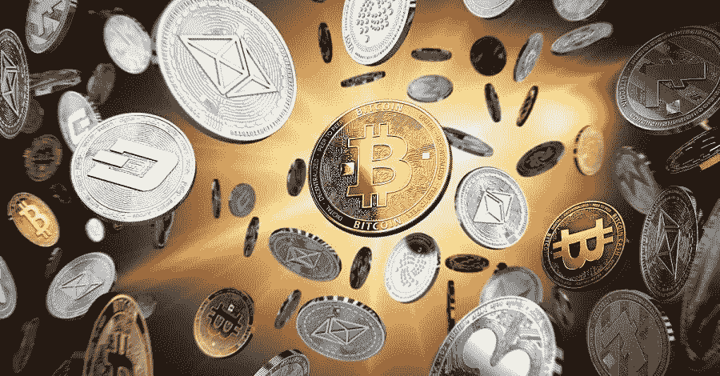

# 加密市场更新 12.15:美联储公告及其对加密的意义

> 原文：<https://medium.com/coinmonks/crypto-market-update-12-15-the-fed-announcement-and-what-it-means-for-crypto-8ad2abb17c87?source=collection_archive---------5----------------------->

## 每日加密更新和投资报告 12.15

## 美联储公告|市场更新|主要新闻|新手:杠杆对加密市场的影响

Photo by [Fabian Blank](https://unsplash.com/@blankerwahnsinn?utm_source=medium&utm_medium=referral) on [Unsplash](https://unsplash.com?utm_source=medium&utm_medium=referral)

# 概观

*   市场观察:美联储声明
*   加密市场更新
*   今日主要加密新闻
*   新手的每日一课:杠杆对加密市场的影响

# Crypto Insight:美联储公告

Photo by [Joshua Woroniecki](https://unsplash.com/@joshua_j_woroniecki?utm_source=medium&utm_medium=referral) on [Unsplash](https://unsplash.com?utm_source=medium&utm_medium=referral)

美联储宣布缩减激进的货币政策，该政策始于疫情之前，是对通胀上升的直接回应。这份过去的报告涵盖了 12 月初公布的 6.8%的 CPI。美联储表示，他们将开始缩减 30%的债券购买量，随后预计将于 2022 年初开始加息。美联储预测，随着经济数据的改善，到明年年底，通货膨胀率将下降 50%。Omnicron 被认为是可变的。

**这对加密意味着什么**

加息有可能引发加密牛市的终结。他们的延迟将是最好的情况。利率可能会在 3 月或 5 月之前保持在 0.0%，但一些因素如糟糕的经济结果或 Omnicron 可能会改变这一立场。

> 加息有可能引发加密牛市的终结。

较低的利率允许市场参与者获得更多的债务。更多的债务相当于市场上更多的钱，这允许交易者承担更大的风险。如果货币供应量减少，交易者将倾向于降低风险。加密是一种高风险资产，因为它的高波动性，将受到加息的高度影响。三月和五月的 FOMC 会议对 crypto 来说至关重要。

***FOMC 预定会议:***

*1 月 25 日至 26 日(债券购买量可能再减少 30%)*

*3 月 15 日至 16 日(可能完成债券购买，可能加息)*

*5 月 3 日至 4 日(可能加息)*

比特币的下跌与美联储在 CPI 通胀关口后的鹰派立场有关。 **Crypto 现在有更高的修正概率，因为一个不那么激进的政策变化已经被吸收。**

总而言之，这对 crypto 来说是最好的消息。在高通胀数据和政治审查之间，美联储可能会加大缩减规模。加密市场将包含有利的 2-3 个月的 0.0%利率，这可能预示着一月份的强劲走势和可能的 EOY 运行**。**

> 加密市场将包含有利的 2-3 个月的 0.0%利率，这可能预示着一月份的强劲势头和可能的 EOY 运行**。**

# 加密市场更新

**所有价格都是在 FOMC 发布后收集的*

比特币(BTC)今天上涨了 1.08% ,显示出强劲的迹象

稳定的统治地位(USDT。D) 在 **3.42%并在下降**。基数为 2.7%，表明有大量稳定的玉米

**比特币霸主地位(BTC。D)** 下跌**1.48%**随着资金重新进入市场，寻找风险更高的 alts *以下值得注意的收益者

**总市值(TOTAL)** 大涨 **+2.55%**

**显著的收益者:**

*   平均增长率+16%
*   MATIC +9%
*   经济增长+16.6%
*   HBAR +9.4%
*   一个+9.8%
*   溶胶+9.9%
*   金融交易+11%

> 比特币恐惧和贪婪指数 29
> 
> 谷歌趋势 31
> 
> 最大疼痛(12 月 30 日选项)48k

[*如何利用恐惧和贪婪指数进行投资*](/@TraderGabi/when-can-we-start-buying-again-c3ffc2a1cd3b)

# 主要加密新闻 12.15

*   [比特币基地 CoinMarketCap 的一个小故障显示了惊人的账面收益。](https://cointelegraph.com/news/only-a-paper-moon-bitcoin-price-briefly-shows-870b-on-coinmarketcap)
*   [瓦尔基里推出 ETF 追踪比特币资产负债表](https://www.coindesk.com/business/2021/12/15/valkyrie-launches-etf-to-track-bitcoin-balance-sheet-stocks/)。这是比看起来更大的新闻。这将给数百万散户投资者提供投资比特币股票的多元化敞口选择。贝莱德、Microstrategy、特斯拉、万事达、罗宾汉、贝宝、比特币基地都是较大的持股。ETF 的交易量将有助于洞察消费者对比特币的兴趣。
*   [加密支付服务提供商收购了 fintech Sutor Bank，以扩大在欧盟的业务。](https://www.coindesk.com/business/2021/12/15/bcb-group-expands-in-europe-with-the-acquisition-of-a-100-year-old-german-bank/)
*   [美国银行发布了一份研究报告，称智能合约平台 Avalanche 是以太坊的可靠替代品，因为它能够在保持安全的同时进行扩展。BOA 的这一“发现”并非巧合，该声明背后可能隐藏着不可告人的动机。](https://www.coindesk.com/business/2021/12/15/bofa-says-avalanches-scaling-capability-offers-viable-alternative-to-ethereum/)

*   2021 年，百年艺术拍卖行苏富比从 NFT 的拍卖中获利 1 亿美元。
*   加密风险投资公司 Ventures 及其联合创始人凯文·杜兰特宣布与比特币基地合作。
*   [加密贷款公司 Ledn 在新一轮融资中筹集了 7000 万美元，随着该公司宣布推出比特币支持的抵押贷款产品以提供住房贷款，该公司目前的估值为 5.4 亿美元](https://www.theblockcrypto.com/post/127592/crypto-ledn-series-b-funding-bitcoin-backed-mortgage-product?utm_source=rss&utm_medium=rss)。这是我第一次听说比特币支持的抵押贷款，预计从明年开始会有类似的公告，因为许多行业将开始尝试招募加密资金。
*   [加密托管和银行安克雷奇已经筹集了 3 . 5 亿美元，现在价值超过 3B。投资者包括 KKR、高盛、阿拉米达研究公司、Paypal Ventures 和 a16z](https://www.theblockcrypto.com/post/127579/crypto-bank-anchorage-series-d-funding-kkr-goldman-sachs-others?utm_source=rss&utm_medium=rss) 。大公司和知名企业开始大举投资加密技术。

# 新手的每日一课

**杠杆对加密市场的影响**

本课与昨天的 [*报告结合在一起。*](/coinmonks/crypto-market-update-and-investing-report-12-14-bitcoin-on-chain-metrics-15a01d2c932e)

杠杆头寸对加密市场有很大的影响。杠杆越多，波动性就越大。波动性是价格上下波动的速度。

如果一个交易者持有 10:1 的杠杆头寸，他实际上是建立了 10 个头寸。这是任何可以访问交易所的人都可以使用的一种常见手段。杠杆在一些交易平台上可以高达 150:1。也就是说你可以用一块钱开 5.5 个点的仓位！如果这看起来很荒谬和冒险，那是因为它确实如此。交易所从杠杆交易费用中赚取可观的利润，而且由于机器人控制止损，它们对交易所构成的风险很小。

杠杆头寸的止损通常接近任何资产的当前价格。如果价格朝一个方向剧烈波动，许多杠杆头寸往往会被止损。如果 100 个 100:1 杠杆(100x100)的未平仓交易被止损，也就是说有 10，000 个头寸被立即平仓。这给试图平仓的价格带来了巨大的快速波动压力。

风险是双向的，而杠杆头寸可以是多头也可以是空头。多头是希望市场上涨的买家，空头是希望市场下跌的卖家。

大多数持有人不希望市场上有过多的杠杆。持有者更喜欢现货驱动的市场，而不是杠杆驱动的市场。杠杆驱动市场的波动性导致许多交易员卖出被杠杆夸大的下跌。

*   *杠杆头寸增加了市场的波动性*
*   *杠杆头寸持有风险很大*
*   *杠杆平仓在当前价格附近*
*   *当有大量方向头寸时，风险就在那个方向*
*   *当市场朝着一个方向快速移动时，杠杆头寸会加剧这种情况*

既然你对杠杆有了更好的理解，明天我将向你展示如何在市场中发现杠杆。这将是另一个有价值的工具，帮助你在这些野生密码市场的未来决策。

我希望昨晚在 CoinMarketCap 故障期间，每个人都喜欢做几个小时的亿万富翁。如果我们坚持得够久，也许有一天会实现！

感谢阅读 fam！

# ***TraderGabi***

*关注我上* [*推特*](https://twitter.com/TraderGabi) *和* [*中*](/@TraderGabi) *或订阅本刊快讯上* [*子栈*](https://tradergabi.substack.com/)

*为了从这份简讯中获益，建议每天阅读，以跟上加密市场的步伐。它将把读者放在消息灵通的 2%的市场参与者中。读者将开始看到对大多数人来说不明显的机会，并将打开更多的机会。时事通讯由许多小时的每日图表研究、链上指标、新闻和发展叙述组成，浓缩为 5 分钟的更新。这是我对一个对我贡献良多的密码社区的贡献。*

> 加入 Coinmonks [电报频道](https://t.me/coincodecap)和 [Youtube 频道](https://www.youtube.com/c/coinmonks/videos)了解加密交易和投资

## 也阅读

 [## 杠杆代币[多头代币]终极指南

### 杠杆化令牌是具有杠杆化风险敞口的 ERC20 令牌，不考虑保证金、要求、管理…

medium.com](/coinmonks/leveraged-token-3f5257808b22)  [## 最佳加密交易所| 2021 年十大加密货币交易所

### 加密货币交易所的加密交易需要了解市场，这可以帮助你获得利润。之前…

blog.coincodecap.com](https://blog.coincodecap.com/crypto-exchange)  [## 2021 年最佳加密交换平台| CoinCodeCap

### 如果我们看看今天的场景，许多加密货币交换平台提供了广泛的功能和深度…

blog.coincodecap.com](https://blog.coincodecap.com/best-swap-platforms)  [## 2021 年最佳加密借贷平台| 6 大比特币借贷平台

### 获得比特币和其他加密货币的最佳贷款利率

medium.com](/coinmonks/top-5-crypto-lending-platforms-in-2020-that-you-need-to-know-a1b675cec3fa)  [## 2021 年最佳免费加密交易机器人

### 2021 年币安、比特币基地、库币和其他密码交易所的最佳密码交易机器人。四进制，位间隙…

medium.com](/coinmonks/crypto-trading-bot-c2ffce8acb2a)  [## 天秤座货币——脸书的加密货币

### 自 2018 年马克·扎克伯格决定致力于改善区块链以来，关于天秤座货币的传言就一直存在…

blog.coincodecap.com](https://blog.coincodecap.com/libra-currency-a-cryptocurrency-by-facebook)