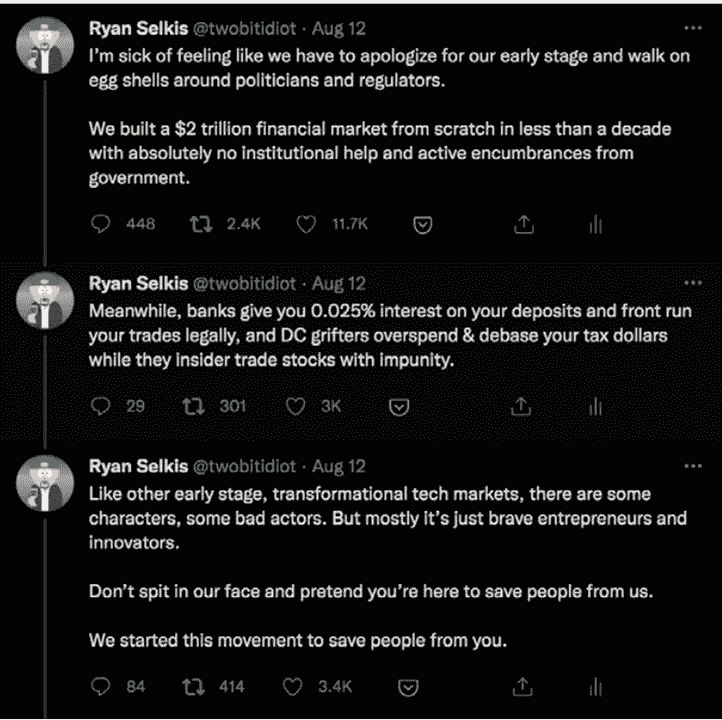
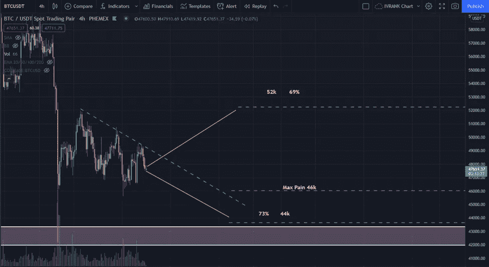
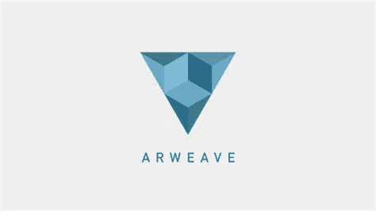
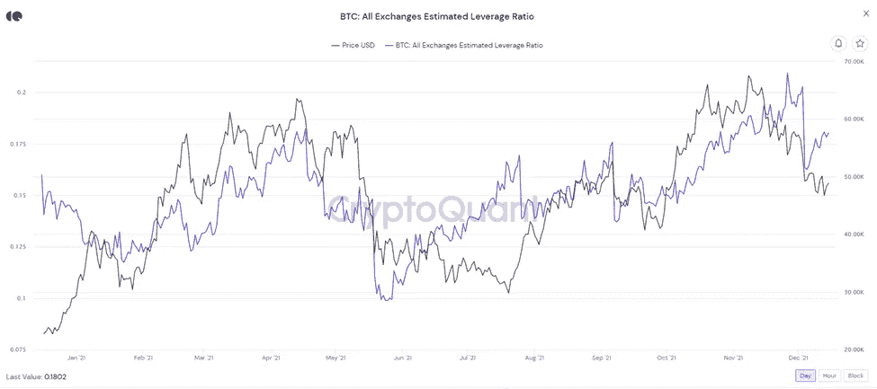
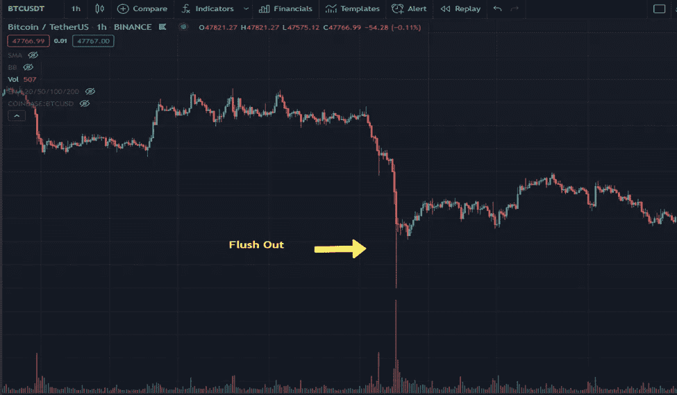

# EOY 比特币价格概率|加密市场更新 12.16

> 原文：<https://medium.com/coinmonks/crypto-market-update-12-16-eoy-bitcoin-price-probabilities-926aa05acfc?source=collection_archive---------12----------------------->

## 价格概率|市场更新|主要新闻|新手:当市场中存在杠杆时该做什么

Photo by [Naser Tamimi](https://unsplash.com/@tamiminaser?utm_source=medium&utm_medium=referral) on [Unsplash](https://unsplash.com?utm_source=medium&utm_medium=referral)

下面是 Ryan Selkis 的一条推文，它有助于表达我加入 crypto 的几个原因。

Ryan Selkis 是 Messari 的创始人，他最近发布了题为“2022 年的加密论文”的年度出版物。我正在阅读这份 165 页的信息丰富的智慧金块，其中包含对 2022 年 crypto 的预测、趋势和主题。我确实希望写点什么，所以请继续关注。如果您想下载它，请点击这里的链接。向前看。

# 市场洞察:比特币 EOY 价格概率

Photo by [Crissy Jarvis](https://unsplash.com/@crissyjarvis?utm_source=medium&utm_medium=referral) on [Unsplash](https://unsplash.com?utm_source=medium&utm_medium=referral)

我有期权交易的背景，整个游戏是基于概率的。外面的扑克玩家会感同身受。在我向买家出售期权之前，我会预测股票价格的可能情况，并根据价格的未来概率进行权衡。然后我会决定期权的价格是否高到足以承担风险。

我继续在加密领域使用这些技能，主要是在比特币领域。其他加密技术几乎没有可供选择的数据，比特币仍然是这艘船的舵手。我只是通过分析来了解未来的价格走势，我不参与比特币期权。我更像是一个长期持有人，偶尔会有一些交易让我开心。

下面是我如何分析价格概率。请记住，我会在几秒钟之内在脑海中完成这一切。我不是在吹牛，但如果数据杂乱无章，请原谅我。然而，我会尽我所能把它呈现出来。

我相信没有什么是确定的，根据历史趋势和数学设计的概率是为结果做准备的最好机会。

[*选项 11.19*](/@TraderGabi/when-can-we-start-buying-again-c3ffc2a1cd3b) 报告

如果你不喜欢技术类的东西，可以直接下结论。

使用 12 月 30 日到期的比特币期权:

*   52k 看跌期权的 delta 为 0.69，或者 BTC 的 **69%** 在 **52k** 以上到期
*   44k 看涨期权的 delta 为 0 . 73 或**73%**BTC 在 **44k** 以上到期
*   最大痛苦是 **46k** (交易者最高金额的损失)

表达这些标记的图表:

市场告诉我们，2021 年 12 月 30 日，比特币有 71%的可能性在 43k 和 52k(T21)之间结束交易。

普莱斯有 **62%** 的几率碰到 **52K** 和 **54%** 的几率碰到 **44k** 。可抢性 BTC 触摸两个价格都很高。

让我们探讨其他技术因素。

*   比特币处于短期下跌趋势，并有望达到 44k。(蓝色)
*   价格将被拉到 46K 的最大痛苦。
*   40–42k(白色)时的强力支撑。
*   在 52.5–54k 有很强的阻力。(未标记)

## 快速结论

下跌趋势没有被打破，交易者昨天似乎有点过于乐观。最大痛苦也将影响价格下降到 46k。触及 44k 看起来是一个可能的场景。

42–44k 的有效支撑位对监控很重要。然而，除非利空消息通过恒大局势或其他宏观 FUD 进入市场，否则这种情况可能会持续。

我仍然乐观地认为，如果价格达到 44k 的支撑，价格将会反弹。最大痛苦可能会在那时变成一个更高的数字。然后，价格有很大的机会恢复 EOY 到 50-52000。

乐观概率:50–52k BTC EOY

悲观概率:45–47k BTC EOY

最坏的情况(~15%):价格低于 42K

最佳情况( *2%* ): 75K

# 密码市场

**比特币(BTC)** 下跌 **-2.52%** 在市场平静的一天之后

**总市值(TOTAL)** 下跌- **1.77%**

**显著的收益者:**

*   **Arweave (AR) +7.4%**
*   塞洛(CELO) +15%
*   **泰拉(露娜)+ 7%**
*   嘉手纳(KDA) +6%
*   不明飞行物游戏(UFO) + 25%

> *比特币恐惧和贪婪指数:* 23 极度恐惧
> 
> 谷歌趋势:31
> 
> *最大疼痛(12 月 30 日选项):* 46k

[*如何利用恐惧和贪婪指数进行投资*](/@TraderGabi/when-can-we-start-buying-again-c3ffc2a1cd3b)

# 主要加密新闻 12.16

*   美国参议院两党小组呼吁财政部长珍妮特·耶伦澄清基础设施法案中的措辞。这个问题源于“代理”的定义太模糊，包括了开发人员、验证人员和节点操作人员。

*   [**coin FLEX****(FLEX)**成为首家推出 DAO 并向用户分配收入和利润的集中交易所。他们将把每日收入的 10%和季度利润的 10%分配给他们的赌注者。用户只需 1 枚弹性硬币就可以参与，并选择在 2 周到 4 年内下注。FLEX 在过去 30 天上涨了 101%。](https://www.theblockcrypto.com/post/127617/coinflex-becomes-the-first-cex-to-launch-a-dao-and-distribute-revenue-and-profits-to-users?utm_source=rss&utm_medium=rss)
*   包括伯克利、麻省理工和哈佛在内的六所著名大学将组成 EduDAO 来促进 Web 3 创新，BitDAO 将为其提供资金。很高兴看到知名大学进入 DAOs。DAOs 可能是未来为各种事物提供资金的一种创新方法。
*   专注于比特币金融服务的金融机构纽约数字投资集团 NYDIG 宣布，它获得了 10 亿美元的股权投资，其估值为 70 亿美元。

# 值得注意的事件

[**沙盒(SAND)【从世界协调时 12 月 17 日下午 5 点开始，在他们的市场上投放一批名为“缺失零件”的 NFT。**](/sandbox-game/the-missing-parts-nft-drop-8025792b6229)

**[Block research 发布了“2022 年数字资产展望”。它涵盖了 2022 年加密货币行业的八个领域。它是免费下载的。](https://www.theblockcrypto.com/post/127723/the-block-research-2021-digital-asset-outlook-report?utm_source=rss&utm_medium=rss)**

****Terra(露娜)**今日在北海巨妖交易所上市**

**明天结束的下一次波尔卡多众筹贷款很可能是赢家。今天是分配 DOT 的最后一天。**

****秘密网络(SCRT)** 明天将推出它的 Stashh NFT 市场。**

# **新手的每日一课**

## **当市场中存在杠杆时，应该期待什么。**

**把市场想象成一个平衡游戏。当杠杆等特定力量变得太有影响力时，市场就会回归均衡。**

**大多数杠杆头寸是多头的；随着市场开始攀升，乐观情绪和杠杆将随之攀升。你可以从图表中看出这一趋势。**

****

**如果市场变得过度杠杆化，预计会有人试图将杠杆冲掉。最有效的策略很简单:快速降价。**

**此时，杠杆头寸将开始被止损，通常是由迫使市场下跌的同一批参与者买入的。记住，每个卖家都有一个买家，反之亦然。**

**资金迅速易手，循环重新开始。**

**12 月 4 日是杠杆冲出的一个很好的例子。**

**在不到一个小时的时间里，价格从 50.5 千涨到 42 万，然后又回到 47.5 千。如果你问我，我会说这是不正常的活动。这些巨大的极端价格在一天之内冲走了价值约 50 亿美元的杠杆，并且大多数发生在一个小时内——50 亿美元是操纵的大量激励。**

****

**那么，当杠杆率很高时，最好怎么做呢？**

**除非你正在运行一个非常积极的策略，否则在高杠杆期间最好持有，不要进入任何新的头寸。就像我过去说过的，等待杠杆下降，价格下跌，害怕冲击市场来开仓。(上面的恐惧和贪婪指数)**

**我知道，我知道，我想要一个 100k 的比特币来结束这一年，但这似乎是不可能的，至少在数学上是不可能的。但谁知道呢，也许明年会批准一个比特币 ETF，我们又可以庆祝圣诞节了。**

**今天的简讯有点技术性，不适合所有人。不过，我喜欢保持事物的多样性，所以明天再来，很可能会是其他的东西。**

**祝你有个愉快的夜晚！**

## **加比**

***在* [*上关注我【推特】*](https://twitter.com/TraderGabi) *和* [*中*](/@TraderGabi) *或在* [*上订阅本刊快讯*](https://tradergabi.substack.com/)**

***为了从这份简讯中获益，建议每天阅读，以便与加密市场保持同步。它将把读者放在消息灵通的 2%的市场参与者中。读者将开始看到对大多数人来说不明显的机会，并将打开更多的机会。时事通讯由许多小时的每日图表研究、链上指标、新闻和发展叙述组成，浓缩为 5 分钟的更新。这是我对一个对我贡献良多的密码社区的贡献。***

> **加入 Coinmonks [电报频道](https://t.me/coincodecap)和 [Youtube 频道](https://www.youtube.com/c/coinmonks/videos)了解加密交易和投资**

## **也阅读**

** [## 杠杆代币[多头代币]终极指南

### 杠杆化令牌是具有杠杆化风险敞口的 ERC20 令牌，不考虑保证金、要求、管理…

medium.com](/coinmonks/leveraged-token-3f5257808b22)  [## 最佳加密交易所| 2021 年十大加密货币交易所

### 加密货币交易所的加密交易需要了解市场，这可以帮助你获得利润。之前…

blog.coincodecap.com](https://blog.coincodecap.com/crypto-exchange)  [## 2021 年最佳加密交换平台| CoinCodeCap

### 如果我们看看今天的场景，许多加密货币交换平台提供了广泛的功能和深度…

blog.coincodecap.com](https://blog.coincodecap.com/best-swap-platforms)  [## 2021 年最佳加密借贷平台| 6 大比特币借贷平台

### 获得比特币和其他加密货币的最佳贷款利率

medium.com](/coinmonks/top-5-crypto-lending-platforms-in-2020-that-you-need-to-know-a1b675cec3fa)  [## 2021 年 6 大最佳硬件钱包|顶级加密硬件钱包[更新]

### 最好的加密货币硬件钱包是绝对必要的。我们将在 NGRAVE、Ledger Nano X 和…

medium.com](/coinmonks/the-best-cryptocurrency-hardware-wallets-of-2020-e28b1c124069)  [## 2021 年最佳免费加密交易机器人

### 2021 年币安、比特币基地、库币和其他密码交易所的最佳密码交易机器人。四进制，位间隙…

medium.com](/coinmonks/crypto-trading-bot-c2ffce8acb2a)**