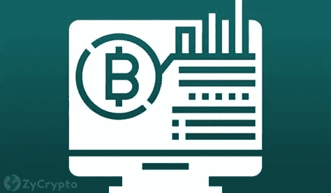
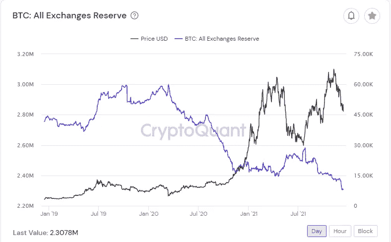
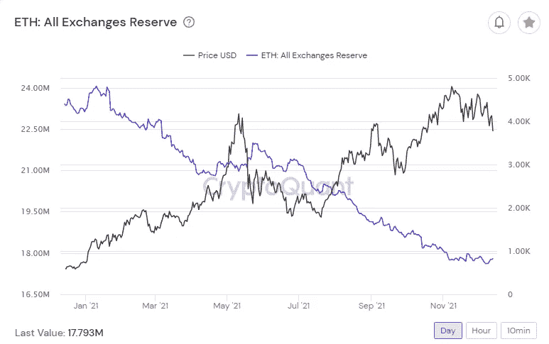
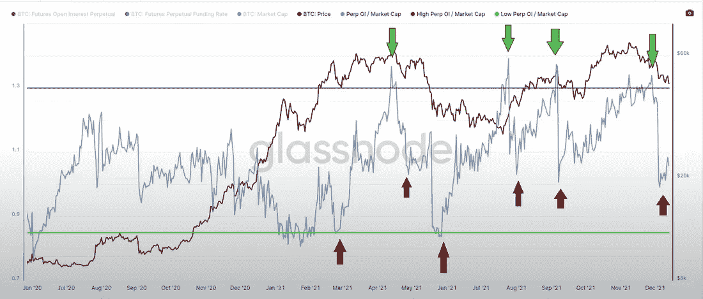
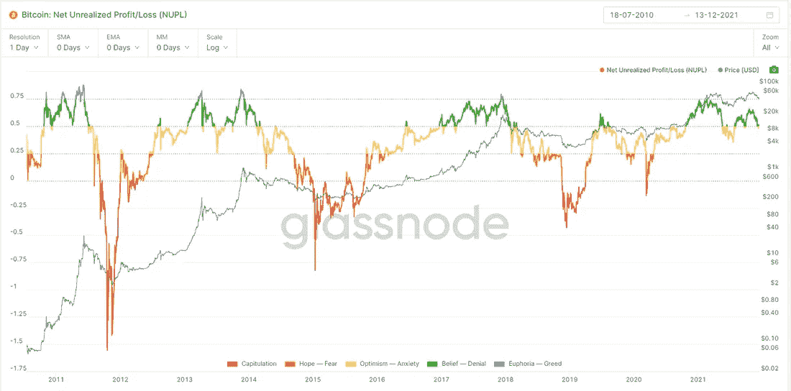
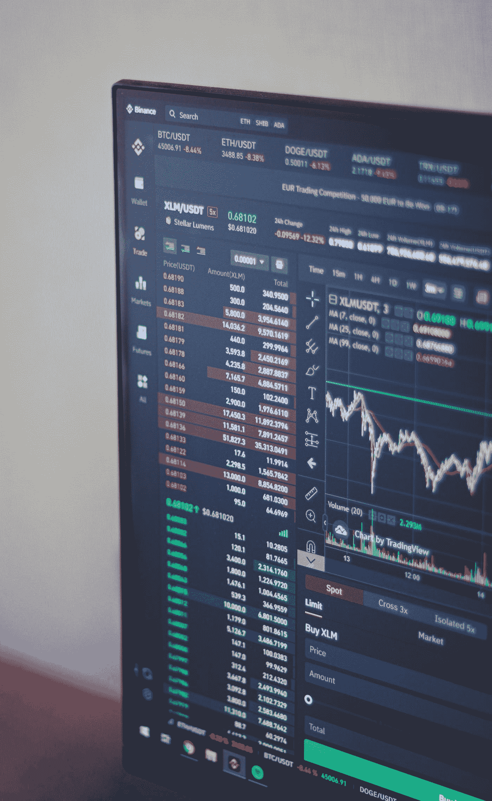

# 加密市场更新与投资报告 12.14:链度量上的比特币

> 原文：<https://medium.com/coinmonks/crypto-market-update-and-investing-report-12-14-bitcoin-on-chain-metrics-15a01d2c932e?source=collection_archive---------2----------------------->

## 关于链度量|主要加密新闻|新手每日一课:什么是杠杆？

Photo by [Thought Catalog](https://unsplash.com/@thoughtcatalog?utm_source=medium&utm_medium=referral) on [Unsplash](https://unsplash.com?utm_source=medium&utm_medium=referral)

# 概观

*   加密市场洞察:比特币链上指标
*   加密市场更新
*   重大新闻 12.14
*   新手们的今日教训:什么是**杠杆**？

# 加密市场洞察:链上指标

比特币和以太坊交易所的供应量处于 3 年来的低点。这表明交易者将 BTC/联邦理工学院从交易所中取出，放在冰冷的钱包里长期持有。最近价格的下降对强劲的供应下降趋势几乎没有影响。交易所里还有 230 万 BTC 和 1719 万瑞士法郎。低供应量增加了供应冲击的可能性，如果未来几个月发行比特币现货 ETF，我们可能会看到供应冲击的发生。

下图直接来自玻璃节点每周更新。该图表涵盖了对比特币的永久未平仓权益。我添加了箭头来突出永久兴趣达到高峰和低谷的地方。永久资产是杠杆头寸，在价格低点开始攀升，在价格高点达到顶峰，然后被平仓或平仓。BTC 价格往往会在永久利息见顶后大幅下跌。这张图表突显出，比特币最近的价格下跌在很大程度上受到了最近被清空的大量杠杆头寸的影响。自下跌以来，市场将更多地由现货驱动。

下图是未实现净损益(NUPL)，由著名的比特币交易商 [CRYPTOBIRB](https://twitter.com/crypto_birb) 使用。他用这个图表来发现市场顶部和市场情绪。过去的高峰充满了兴奋，而这个周期还没有表现出强烈的兴奋。

图表显示，尽管我们最近抛售，目前的周期仍然强劲。建议跟踪市场指标的长期趋势。短期价格变化是任何波动市场的典型特征，但基本面往往更稳定。相信基本面，价格可能很有欺骗性。因此，抛售是廉价增仓的好时机。有证据表明，长期持有人倾向于在这些下跌中积累。短期持有人倾向于在第一个信号或市场恐慌时买入并卖出。最好像长期持有人一样交易。利用工具，如下面的比特币恐惧和贪婪指数。

# 加密市场更新

Photo by [Behnam Norouzi](https://unsplash.com/@behy_studio?utm_source=medium&utm_medium=referral) on [Unsplash](https://unsplash.com?utm_source=medium&utm_medium=referral)

**比特币(BTC)** 当日价格持平-0.04%

**总市值(Total)，**在很大程度上受 BTC 影响也持平-.42%

**总市值减去 ETH/BTC(总计 3)** 有趣的是上涨了 1.75%，因为重新进入 crypto 的资金正在进入 altcoins。这可能是买家信心的一个小指标。

随着 altcoin 价格从 57 美元支撑区域反弹，Terra (LUNA)上涨 7.93% 。红热，Defi 集中，第一层可能是设置为另一个运行。

**埃隆马斯克暗示特斯拉接受 Dogecoin 作为支付方式后，dogecoin 上涨 14.50%** 。DOGE 高达+33%，但交易者开始获利回吐。

> 比特币恐惧和贪婪指数 21 极度恐惧
> 
> 谷歌趋势 38
> 
> 最大疼痛(12 月 30 日选项)48k

[*如何利用恐惧和贪婪指数进行投资*](/@TraderGabi/when-can-we-start-buying-again-c3ffc2a1cd3b)

# 主要加密新闻 12.14

*   [美国证券交易委员会专员赫斯特·普莱斯(Hester Price)反对监管机构的议程，不包括对数字资产的澄清](https://cointelegraph.com/news/sec-chair-s-regulatory-agenda-fails-to-include-clarity-on-crypto-says-hester-peirce)。随着美国证券交易委员会(SEC)继续对加密货币一无所知，与监管有关的故事继续变得越来越多。
*   [收购 RTFKT](https://cointelegraph.com/news/just-did-it-nike-enters-the-metaverse-game-following-rtfkt-acquisition) ，耐克在进入数字领域方面迈出了一大步。RTFKT 品牌专注于 metaverses 的 NFT 市场。耐克最近申请了一项专利，以保护其在网络世界中的标识和短语“只管做”。
*   [**保护伞网络(UMB)启动了一项价值 1500 万美元的甲骨文加速器计划。在我的雷达上，UMB 是为数不多的链环竞争对手之一。它开始在这个领域做出重大举动，与 Chainlink 的 83 亿美元相比，它的市值为 3200 万美元，有很大的增长空间。**](https://cointelegraph.com/news/umbrella-network-launches-15m-oracle-accelerator-program)
*   [乌克兰银行正通过 **Stellar (XLM)与当地银行合作推出 CBDC 试点项目。**](https://cointelegraph.com/news/ukrainian-bank-uses-stellar-to-launch-electronic-hryvnia-pilot)
*   FTX (FTT)已经与金州勇士队签署了合作协议，将于 2022 年初推出 NFTs。这是一条凸显 NFT 市场趋势的小新闻。
*   随着看跌情绪笼罩市场，比特币 CME 期货已陷入“现货升水”状态。当产品面临较大的卖出压力，并且产品开始以低于现货价格的价格出售时，现货溢价就开始出现了。市场往往不会长期处于现货溢价状态。
*   [**【TeraWulf(WULF)**绿色比特币矿工，在股票市场交易首日交易首日下跌 24%。](https://www.coindesk.com/business/2021/12/14/bitcoin-miner-terawulf-tumbles-in-trading-debut/)
*   埃隆·马斯克表示特斯拉将开始接受 Dogecoin 付款后，Dogecoin (DOGE)价格飙升。

# 新手的每日一课

**什么是杠杆？**

杠杆是最近几周的一个突出话题，如果你是这个游戏的新手，你可能会有点困惑。“摆脱杠杆率”、“杠杆率太高”和“杠杆率必须先降下来，我们才能上升”是你最近可能听说过的一些短语。因此，今天我们将探讨杠杆的定义，明天我们将讨论它在加密市场中的影响。理解杠杆的五分钟是值得的。

杠杆就是利用债务来扩大投资头寸。

如果一个人直接买一些比特币，你不是在使用杠杆。那个人持有相当于 1:1(仓位:价格)的比例。比特币价格每上涨/下跌 1 个点，持有者就获得/损失 1 个点。很简单。即使比特币涨到 0.01 美元或 100 万美元，交易员也可以无限期持有这一头寸。

从某种意义上说，杠杆交易者会“借入”资金来建立一个有可能成倍增加收益或亏损的头寸。

一个例子。一个交易者有 100 美元，想要 ABC 公司的两只股票，价值 100 美元。交易者可以从交易公司“借”100 美元来购买两只股票。这个交易者的比例是 2:1(仓位:价格)。价格每涨/跌一美元，交易者就赚/亏两美元。交易者承担了双倍的风险和双倍的回报。

交易公司将在这笔交易中有 50 美元的止损，这样公司就不会因为借钱而亏损。

2:1 的杠杆头寸承担了双倍的风险。现在想象一下，你持有 10:1 的杠杆头寸！100 美元的头寸会在 90 美元止损。这正是许多交易者每天在比特币中做的事情。这是有风险的，当这些头寸开始被止损时，会对市场产生强烈影响。

加密市场非常不稳定(价格上涨/下跌)，杠杆头寸给交易者带来非常大的风险。除非你非常有经验，否则不建议你冒这个险。你被止损出局，损失所有资本的可能性非常高。坚持长线投资，你将从市场的高波动性中获益。

[*这里有一个视频可以帮助你更好的理解杠杆。*](https://www.investopedia.com/terms/l/leverage.asp)

# 每周硬币观察列表

*   比特币(BTC)
*   近似协议(Near)
*   寿司
*   多边形(MATIC)

**明天应该是有趣的一天，美联储将在早上发布公告。预计市场会有一些波动。**

保持耐心。基本面在我们这边。

感谢阅读 fam！

# -TraderGabi

*关注我的* [*推特*](https://twitter.com/TraderGabi) *和* [*中的*](/@TraderGabi) *或者订阅本日报的* [*子栈*](https://tradergabi.substack.com/)

*为了从这份简讯中获益，我们建议您每天阅读它，以便与加密市场保持同步。它将把读者放在消息灵通的 2%的市场参与者中。读者将开始看到对大多数人来说不明显的机会，并将打开更多的机会。时事通讯由许多小时的每日图表研究、链上指标、新闻和发展叙述组成，浓缩为 5 分钟的更新。这是我对一个对我贡献良多的密码社区的贡献。*

> 加入 Coinmonks [电报频道](https://t.me/coincodecap)和 [Youtube 频道](https://www.youtube.com/c/coinmonks/videos)了解加密交易和投资

## 另外，阅读

*   [MXC 交易所评论](/coinmonks/mxc-exchange-review-3af0ec1cba8c) | [Pionex vs 币安](https://blog.coincodecap.com/pionex-vs-binance) | [Pionex 套利机器人](https://blog.coincodecap.com/pionex-arbitrage-bot)
*   [我的加密副本交易经历](/coinmonks/my-experience-with-crypto-copy-trading-d6feb2ce3ac5) | [比特币基地评论](/coinmonks/coinbase-review-6ef4e0f56064)
*   [CoinFLEX 评论](https://blog.coincodecap.com/coinflex-review) | [AEX 交易所评论](https://blog.coincodecap.com/aex-exchange-review) | [UPbit 评论](https://blog.coincodecap.com/upbit-review)
*   [AscendEx 保证金交易](https://blog.coincodecap.com/ascendex-margin-trading) | [Bitfinex 赌注](https://blog.coincodecap.com/bitfinex-staking) | [bitFlyer 评论](https://blog.coincodecap.com/bitflyer-review)
*   [麻雀交换评论](https://blog.coincodecap.com/sparrow-exchange-review) | [纳什交换评论](https://blog.coincodecap.com/nash-exchange-review)
*   [支持卡审核](https://blog.coincodecap.com/uphold-card-review) | [信任钱包 vs 元掩码](https://blog.coincodecap.com/trust-wallet-vs-metamask)
*   [Exness 点评](https://blog.coincodecap.com/exness-review)|[moon xbt Vs bit get Vs Bingbon](https://blog.coincodecap.com/bingbon-vs-bitget-vs-moonxbt)
*   [如何开始通过加密贷款赚取被动收入](https://blog.coincodecap.com/passive-income-crypto-lending)
*   [加密货币储蓄账户](/coinmonks/cryptocurrency-savings-accounts-be3bc0feffbf) | [加密交易机器人](https://blog.coincodecap.com/best-crypto-trading-bots)
*   [BigONE 交易所评论](/coinmonks/bigone-exchange-review-64705d85a1d4) | [CEX。IO 审查](https://blog.coincodecap.com/cex-io-review) | [交换区审查](/coinmonks/swapzone-review-crypto-exchange-data-aggregator-e0ad78e55ed7)
*   [最佳比特币保证金交易](/coinmonks/bitcoin-margin-trading-exchange-bcbfcbf7b8e3) | [比特币保证金交易](https://blog.coincodecap.com/bityard-margin-trading)