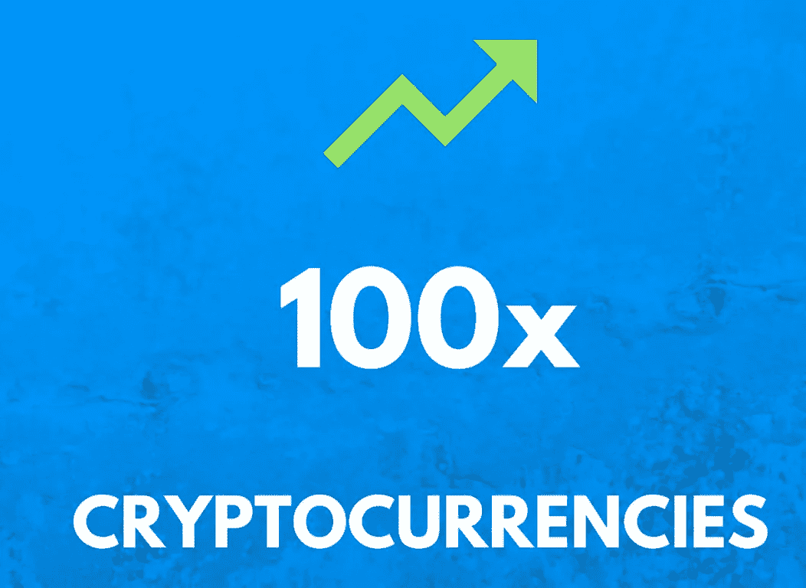

# 加密采矿股票将增长 100 倍

> 原文：<https://medium.com/coinmonks/crypto-mining-stocks-that-will-100x-feb1b5841e48?source=collection_archive---------0----------------------->

你认为比特币会在年底前升值吗？那些与其业绩直接挂钩的矿业股呢？在监控加密世界方面，NASDQ 完全是另一个怪物。

说到比特币和其他加密货币，加密交易所并不是唯一快速致富的地方。没有多少人知道已经存在好几年的矿业股票，这些股票直接与加密空间联系在一起。这些矿业股票的伟大之处在于，它们的杠杆率已经很高，因此当比特币价格上涨时，它们的涨幅会更大。

它们是什么？给我看看票！好吧，好吧，好吧，以下是值得你认真研究的最佳杠杆和业绩最佳股票的股票代码: [$HUT](https://finance.yahoo.com/quote/HUT?p=HUT&.tsrc=fin-srch) 、[、【马拉】、](https://finance.yahoo.com/quote/MARA/?guccounter=1&guce_referrer=aHR0cHM6Ly93d3cuZ29vZ2xlLmNvbS8&guce_referrer_sig=AQAAAFs3q4tpvgk2hEQ1c674nzfFkBJ2OzxMjBbFJTZL95wFnObOivblHb2imT13upt1yYyIoqFELLOx3yQ8KQOhiNQt1NoUCnuiUgGgOB7bZ7HAbnO-3InX0uJ8wcOoxlbR0YUsNwCx5exTFNHGMQYG9KiVyugrL84rcYP5bZJO0v6E)[、](https://finance.yahoo.com/quote/BITF?p=BITF&.tsrc=fin-srch)和 [$RIOT](https://finance.yahoo.com/quote/RIOT?p=RIOT&.tsrc=fin-srch) 。我会让你谷歌一下过去几个月的情况，这样你就能看到我们这轮牛市的%涨幅。如果你留意任何有头脑的人，并回顾比特币周期，你会发现这波牛市远未结束。

我想补充的是，这不是财务建议，请自担风险投资，这种股票游戏很像投资比特币。随着加密市场陷入不可避免的牛市周期，你可能会看到这些股票随之下跌。它们只是利用比特币牛市的一种方式，随着比特币一路攀升至 10 万美元，它们可以赚取 100 倍的利润。哦，你也可以更冒险一点，获得看涨期权或策略，以进一步利用牛市。

> 加入 Coinmonks [电报频道](https://t.me/coincodecap)和 [Youtube 频道](https://www.youtube.com/c/coinmonks/videos)了解加密交易和投资

## 另外，阅读

*   [支持卡审核](https://blog.coincodecap.com/uphold-card-review) | [信任钱包 vs 元掩码](https://blog.coincodecap.com/trust-wallet-vs-metamask)
*   [Exness 回顾](https://blog.coincodecap.com/exness-review)|[moon xbt Vs bit get Vs Bingbon](https://blog.coincodecap.com/bingbon-vs-bitget-vs-moonxbt)
*   [如何开始用加密贷款赚取被动收入](https://blog.coincodecap.com/passive-income-crypto-lending)
*   [加密货币储蓄账户](/coinmonks/cryptocurrency-savings-accounts-be3bc0feffbf) | [加密交易机器人](https://blog.coincodecap.com/best-crypto-trading-bots)
*   [BigONE 交易所评论](/coinmonks/bigone-exchange-review-64705d85a1d4) | [CEX。IO 审查](https://blog.coincodecap.com/cex-io-review) | [交换区审查](/coinmonks/swapzone-review-crypto-exchange-data-aggregator-e0ad78e55ed7)
*   [最佳比特币保证金交易](/coinmonks/bitcoin-margin-trading-exchange-bcbfcbf7b8e3) | [比特币保证金交易](https://blog.coincodecap.com/bityard-margin-trading)
*   [加密保证金交易交易所](/coinmonks/crypto-margin-trading-exchanges-428b1f7ad108) | [赚取比特币](/coinmonks/earn-bitcoin-6e8bd3c592d9)
*   [WazirX vs CoinDCX vs bit bns](/coinmonks/wazirx-vs-coindcx-vs-bitbns-149f4f19a2f1)|[block fi vs coin loan vs Nexo](/coinmonks/blockfi-vs-coinloan-vs-nexo-cb624635230d)
*   [BlockFi 信用卡](https://blog.coincodecap.com/blockfi-credit-card) | [如何在币安购买比特币](https://blog.coincodecap.com/buy-bitcoin-binance)
*   [火币交易机器人](https://blog.coincodecap.com/huobi-trading-bot) | [如何购买 ADA](https://blog.coincodecap.com/buy-ada-cardano) | [Geco？一次审查](https://blog.coincodecap.com/geco-one-review)