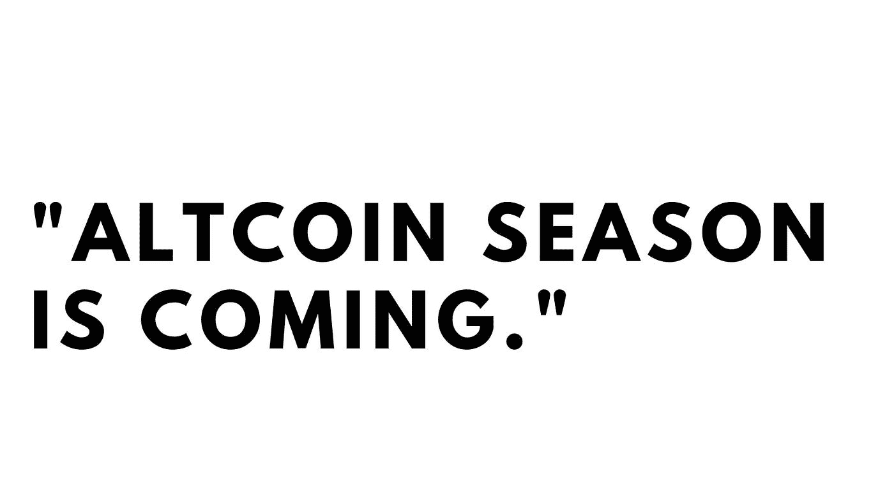

# 揭秘流言:比特币大幅波动后，替代币真的会上涨吗？

> 原文：<https://medium.com/coinmonks/crypto-mythbusting-do-altcoins-really-pump-after-big-bitcoin-moves-49c1486fb4b3?source=collection_archive---------1----------------------->

或者，至少，网上是这么说的。在比特币出现抛物线运动后，常识告诉我们，比特币不久后会出现波动。

紧随这一最新的比特币历史新高之后，它会再次发生吗？我们永远无法确定，但我们可以利用过去的数据来更好地指导我们的投资决策。

​

# 数据

今天，我们将看看比特币暴涨的四个时间段，然后看看替代币是否沿着它的路径发展。无可否认，这并不是很多数据——你甚至可以说这仅仅是轶事。但是，如果我们看到替代硬币每次都表现良好，那么，将一些资本重新分配到替代投资组合可能就足够了。确保我们有良好的敞口，以防万一。

为了将替代硬币作为一个篮子来分析，我们将看两个图表。首先是 [Total 2 指数](https://es.tradingview.com/symbols/CRYPTOCAP-TOTAL2/)，它显示了不包括 BTC 在内的前 125 名 cryptos 的总市值。这个指数不是静态的，这意味着替代硬币不断进入和退出名单。

第二，我们来看看[的比特币统治](https://www.tradingview.com/symbols/CRYPTOCAP-BTC.D/)，如果替代硬币增加，但比特币的统治地位保持不变，你的钱最好投资于比特币(风险较低的资产)。

​

# 动作

我们将关注的四个比特币动向如下。我在牛市中选择了三个比特币泵，因为我们肯定处于牛市时期，但我也选择了 2018 年+80%的走势，以观察 altcoins 在熊市中的表现。

由于加密市场似乎有一个近期偏差(今天的价格运动倾向于跟踪最近的模式，而不是几年前的模式)，其中两个时间段将取自“当前的牛市”，我认为这是从 2020 年 3 月的本地低点开始的延续运动。

1.  **2017 年牛市结束:2017 年 11 月 13 日–2017 年 12 月 16 日，+242%，6，000 美元至 20，000 美元**
2.  **熊市行情:2019 年 6 月 10 日至 2016 年 6 月 26 日，上涨 82%，7500 美元至 13000 美元**
3.  **新 ATH:2011 年 12 月 12 日至 2011 年 8 月 1 日，涨幅 134%，1.8 万美元至 4.5 万美元**
4.  **2021 年夏季泵:2021 年 7 月 21 日至 2021 年 7 月 30 日，+44%，29000 美元至 42000 美元**

****

# 2017 年牛市结束

*   **2017 年 11 月 13 日–2017 年 12 月 16 日**
*   **+242%**
*   **、6000 美元到 20000 美元**

大约 33 天内 242%的涨幅可能再也不会发生在比特币身上，但如果你足够早到达那里，这是令人震惊的。这是一个无限乐观的时代，也许这就是为什么在 ATH 之后 alt 激增。

在长达一个月的比特币热潮中，前 125 种替代币的市值上升了 184%，这意味着比特币的主导地位上升了，你的钱在比特币中更好。

尽管如此，对于一个月的投资来说，这个结果还是不错的。但随着比特币从 12 月 16 日到 1 月 4 日下跌 23%，altcoins 继续上涨 123%，在 54 天内总涨幅为 544%:平均每天超过 10%。这是一个方便的小收获。

**结果:**替代硬币与比特币一起上涨，然后在比特币回撤时继续上涨 123%。

​

# 熊市泵

*   6/10/2019–6/26/2016
*   +82%
*   $7500 — $13000

这一举措与其他举措略有不同，它发生在一个相当严重的熊市之中。尽管如此，从 2019 年 4 月到 6 月，比特币的价格上涨了两倍，最后 16 天的高潮将在初夏到来。比特币的涨幅接近 2 倍，距离历史高点只有一步之遥。

在比特币上涨 82%的同时，Altcoins 上涨了约 45%，但之后呢？一大堆什么都没有。在接下来的 22 天里，比特币抹去了 50%的涨幅，而替代硬币也受到了影响，下跌了 80%。虽然 6 月 26 日，前 125 个替代硬币的总市值达到了约 1400 亿美元的当地高点，但要在 2020 年 8 月 26 日再次达到这一水平，需要一年多的时间。

**结果:**在这段时间里，你的钱在比特币上涨的时候更好**和下跌的时候**。除了一些小的下滑，比特币的主导地位从总加密市值的约 50%上升到近 75%。BTC 公牛队大获全胜。

​

# 2020 年第四季度创历史新高

*   12/12/21–1/08/21
*   +134%
*   $18,000 — $45,000

在这一令人兴奋的 134%的 27 天走势中，比特币仅用五个红色交易日就将之前的 ATH 翻倍。这是比特币人士最疯狂的梦想，也是自那以来所有人都关注的第四季度走势。看涨比特币的人喜欢这一举动，因为在 1 月份经历了 18 天-28%的回撤后，比特币在 1 月底和 2 月初又飙升了 41%。

但是在泵送期间和之后 alts 发生了什么？在 BTC 加油期间，排名前 125 位的 alt 上涨了 74%。因此，比特币的主导地位上升了，但幅度不大。

正是在比特币下跌期间，altcoins 飞了起来。比特币在 1 月 8 日达到当地高点后，暴跌了 15%，altcoins 以 20%的跌幅做出了负面回应。但是，虽然比特币继续下跌，从 14 日到 28 日又下跌了 25%，但 alts 上涨了 33%。之后，到 5 月 12 日为止，altcoins 经历了 100 天 349%的上涨。比特币的主导地位下降了 33%，从 60%降至 40%，接近历史最低水平。这是 altcoin 的旺季。

让我们记住，尽管比特币在此期间创下了历史新高，但其主导地位却越来越低。无论如何，比特币都不是一个糟糕的投资，但 alts 的表现非常出色。

**结果:**一个月的兴奋期使比特币的前 ATH 翻了一番，并导致许多非常高兴的比特币投资者。尽管价格呈上升趋势，但比特币的主导地位稳步下降。

​

# 2021 年夏季泵

*   7/21/21–7/30/21
*   +44%
*   $29,000 — $42,000

这一为期九天的举动将市场从三个月的流血中拉了出来，将比特币的价格推高了 44%。这是我们报道的最小的比特币泵，但也是最近的，这可能会给我们今天的市场行为提供线索。

​

尽管比特币价格呈上升趋势，但在此期间，比特币的主导地位下降了约 20%。Altcoins 爆炸式增长，市值排名前 125 位的公司总共增长了 134%。人们将其作为缓慢而稳定攀升的比特币力量的例子。水涨船高。根据记录，比特币在此期间上涨了约 50%。

**结果:**稳定增长的比特币带来了大量的替代币。所有人都很高兴，但不是极度兴奋，比特币的统治地位下降了。

​

# 这对今天意味着什么？

说“事情必须这样发生”是危险的，会让你犯一些严重的错误。然而，虽然我不能保证这些都会发生，但我认为如果你是一名替代硬币投资者，有几个可能性值得关注。

首先，让我们看看今天(10 月 21 日)的图表:在经历了 21 天 60%的下跌后，我们正在经历第一个真正的下跌日，推动 ATH，但似乎遭到拒绝。一个月来，比特币的主导地位一直呈上升趋势，达到自去年 8 月以来的最高水平。

​

*   **ATH 拒绝，然后爆发**:ATH 拒绝，然后爆发，这很可能会暂停“替代硬币季”，但对替代硬币来说仍然是个好消息。正如我们所见，当比特币上涨时，替代币也会上涨，只是幅度没有那么大。也许在一次大的波动和回撤之后，我们最终会看到一个真正的替代硬币季节。与历史水平相比，比特币的主导地位仍然很低，所以我们可能需要看到它在替代硬币运行之前收回一些市场份额。
*   **比特币的稳定性:**如果比特币的价格与今天的价格相差不到 5000 美元，那么山寨币很可能会出现。该图表看起来与我们 2017 年末/2018 年初的 altcoin 季节非常相似，但可能标志着牛市的结束。
*   **比特币下跌:**比特币仍可能下跌，这可能意味着谁知道替代比特币会发生什么。2019 年，对 alts 不利，2020/2021 年冬天，对 alts 有利。从好的方面来看，这可能意味着一轮长期的牛市，因为几乎每次 BTC 创下历史新高后，都会出现更高水平的爆发。

如果历史告诉我们什么的话，那就是替代比特币几乎总是跟随比特币的大波动:至于这些波动有多大，以及新的比特币价格出现后多久，这是任何人的猜测。这些是我认为很有可能的几种可能性，我就在储备代用币。

正常的建议仍然有效:保持多元化，拥有比特币作为备份，并制定获利计划。

[**点击这里**](http://cryptopragmatist.com/sign-up/) **每周从 Crypto Pragmatist 获取内容，绝对免费。**

> 加入 Coinmonks [电报频道](https://t.me/coincodecap)和 [Youtube 频道](https://www.youtube.com/c/coinmonks/videos)了解加密交易和投资

## 也阅读

 [## 最佳加密交易所| 2021 年十大加密货币交易所

### ICON _ PLACEHOLDEREstimated 预计阅读时间:28 分钟加密货币交易所的加密交易需要知识…

blog.coincodecap.com](https://blog.coincodecap.com/crypto-exchange)  [## 2021 年 10 大最佳加密贷款平台| CoinCodeCap

### 当谈到加密货币贷款时，大量因素等同于良好的收入状况。此外，借款的一部分…

blog.coincodecap.com](https://blog.coincodecap.com/crypto-lending)  [## 2021 年最佳免费加密交易机器人

### 2021 年币安、比特币基地、库币和其他密码交易所的最佳密码交易机器人。四进制，位间隙…

medium.com](/coinmonks/crypto-trading-bot-c2ffce8acb2a)  [## 最佳 4 个加密交易信号电报通道

### 这是乏味的找到正确的加密交易信号提供商。因此，在本文中，我们将讨论最好的…

medium.com](/coinmonks/best-crypto-signals-telegram-5785cdbc4b2b)  [## BlockFi 评论 2021:利弊和利率| CoinCodeCap

### 今天，我们提出了一个全面的 BlockFi 评论，这是一个成立于 2017 年的加密贷款平台，拥有其…

blog.coincodecap.com](https://blog.coincodecap.com/blockfi-review)  [## 如何在印度购买比特币？2021 年购买比特币的 7 款最佳应用[手机版]

### 如何使用移动应用程序购买比特币印度

medium.com](/coinmonks/buy-bitcoin-in-india-feb50ddfef94)  [## 加密税务软件——五大最佳比特币税务计算器[2021]

### 不管你是刚接触加密还是已经在这个领域呆了一段时间，你都需要交税。

medium.com](/coinmonks/best-crypto-tax-tool-for-my-money-72d4b430816b)