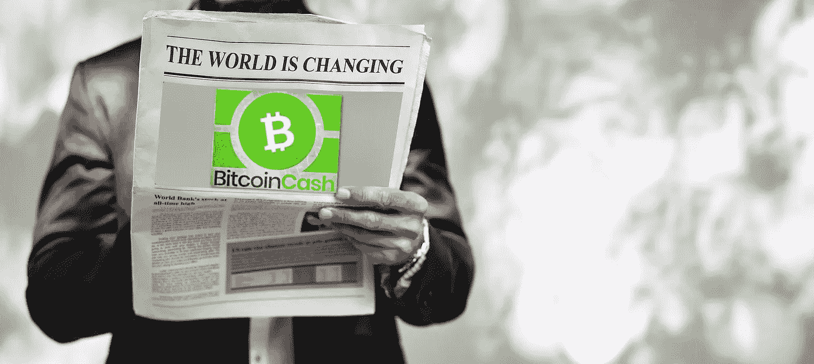
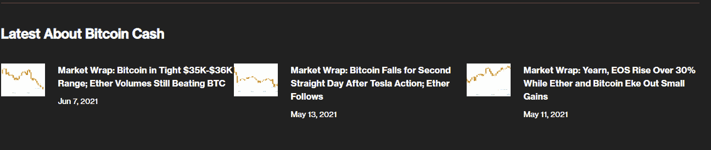
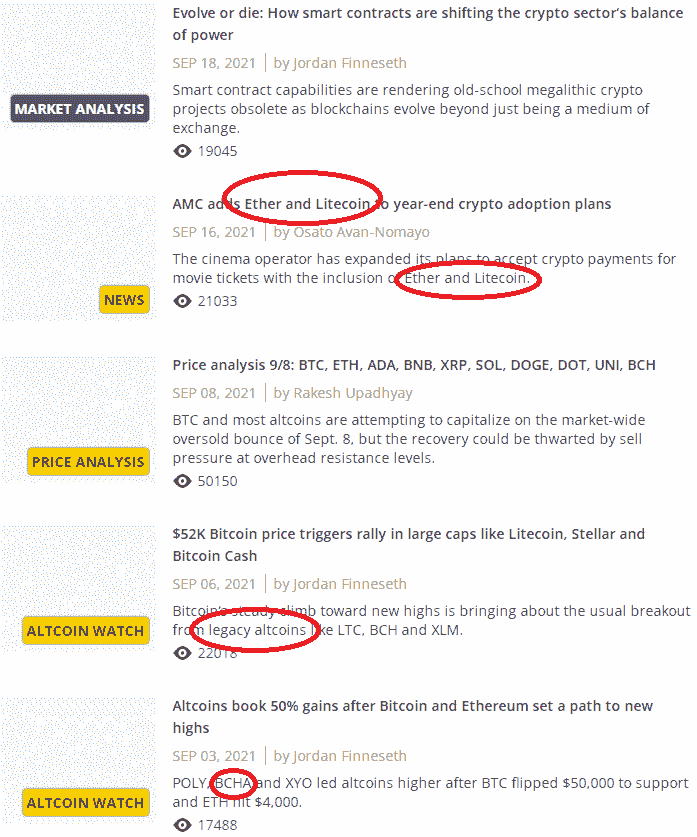
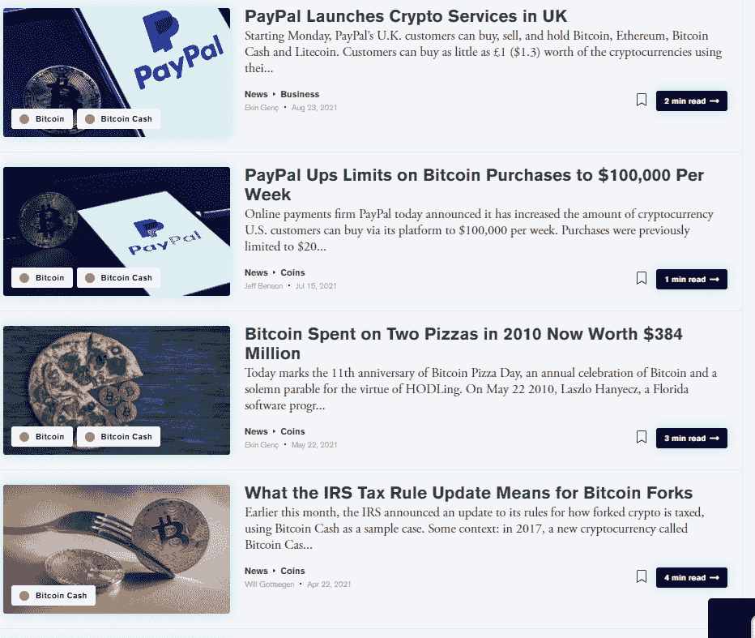
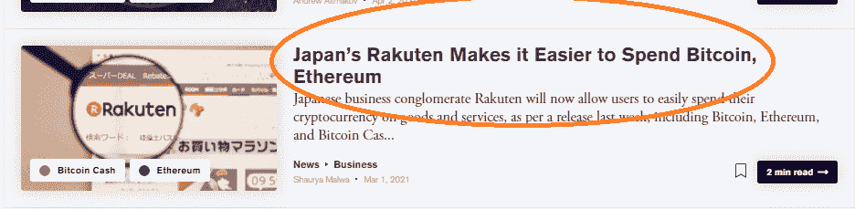
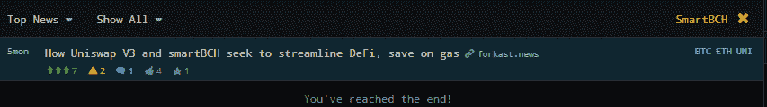

# 秘密新闻网站:对比特币现金的大规模操纵、宣传和审查

> 原文：<https://medium.com/coinmonks/crypto-news-websites-massive-manipulation-propaganda-censorship-of-bitcoin-cash-ad9de3d56b4f?source=collection_archive---------14----------------------->

我在 2017 年(3 月)加入了加密世界，从那以后没有一天不阅读和(后来)写关于加密货币的文章。

自从我开始密切关注加密新闻媒体，我立即注意到比特币现金受到的虐待。

大多数文章都深受区块流叙事的影响，反对比特币现金。BTC 最大化主义者使用一切可能的手段禁止信息网络上有关比特币现金的讨论。

我甚至不会提到 Bitcointalk 论坛或 r/比特币。每个人都在几分钟内发现他们没有提供建设性的对话和思想交流。这些地方充满狂热，需要对 BTC 最高主义事业的奉献和承诺。尽管这两个网络对比特币现金有过度的仇恨，但其他任何东西都不会受到虐待，不仅仅是比特币现金。

**Coindesk** ， **Cointelegraph** ，**解密**，剩下的大部分都是**骗人的**在他们关于比特币现金的报道中，只急切地挖掘可能有损其声誉的新闻(即 BCHABC fork)。

似乎审查来自秘密新闻网站的比特币现金已经成为一种习惯。也许 BTC 最大化主义者仍然害怕如果他们让世界知道比特币现金规模巨大会发生什么。

此外，SmartBCH 是最少推广或讨论的侧链，在大多数加密媒体中绝对没有引用。我觉得对秘密新闻隐瞒如此重要的项目是非常不合理的，除非这是经过深思熟虑和有组织的。

# 加密媒体审查——排除比特币现金新闻(除非是负面新闻)

最典型的例子是几个月前发布 mainnet 的 SmartBCH sidechain，而 crypto news 几乎没有报道过它。只有 Bitcoin.com 和一些媒体报道了 SmartBCH，其余的完全忽略了它的存在和动态。

维基百科从其来源中排除任何加密货币媒体有一个很好的理由。没有一个被认为是可靠的信息来源。所有的秘密媒体都有偏见，而且很少不这样报道新闻。

因此，任何独立公正的分析师都不会考虑来自 Coindesk、Cointelegraph 等的任何信息。

让我们来看看现有的加密媒体是如何对待比特币现金的。

# 硬币台

Source: Coindesk

Coindesk 上一次提到比特币现金这个名字，不是在关于比特币现金的文章里，而是在关于交易的文章里。这是在六月和五月。这是五个月前的**，参考资料只是关于价格的图表和技术分析…**

**它已经不再报道比特币现金(Bitcoin Cash)网络上的任何活动，不过我甚至不确定，除了宣传以及与 BSV 和 BCHABC 发生连锁拆分的“坏”消息，它是否还报道过其他任何事情。**

**不过，我建议大家在 Coindesk 上观看罗杰·弗的采访，我只在弗的 YouTube 上找到了这篇文章，但在 Coindesk 上找不到。(我不确定 Coindesk 是否曾在其 YouTube 频道上发布过这篇采访)。**

**我更希望马克西观察并尝试反驳这些观点:**

**这种审查方式对 BTC 最大主义者有效，因为这是反驳比特币现金观点的唯一有效方法。**

****

# **CoinTelegraph**

****

**Source: Cointelegraph**

**这显然不是新闻业，而是存在偏见的观点、对舆论的操纵以及对新闻中比特币现金的明显审查。**

**CoinTelegraph 从未提到过 SmartBCH。**

**Cointelegraph 正在暗中禁止所有与比特币现金相关的信息或新闻。它把比特币现金(Bitcoin Cash)隐藏在重要新闻之外，比如 AMC 的公告，这里说的是严肃的媒体报道股票，它甚至可能让股东提起诉讼。**

**标题遵循的逻辑是不包括比特币现金。**

****

# **解释**

********

**Source: Decrypt.co**

**该网站遵循与 Coindesk 和 Cointelegraph 相同的逻辑，完全忽略了比特币现金的新闻和动态。**

**同时，该公司不再将比特币命名为 Cash，这表明加密媒体已经对比特币进行了审查，目的是掩盖这样一个事实，即比特币的可扩展性和 L2 的可扩展性解决方案只是试图操纵公众，把他们变成集中的金融中心。**

**标题中将包含任何其他内容，但不包含比特币现金。报道不足的策略。**

****

# **加密恐慌:**

****

**You’ve reached the end… SmartBCH search only brings one result!**

**crypto cruise 是一项新闻聚合服务，它汇集了热门加密网站的大部分新闻，还经常包含一些 Twitter 账户。**

**然而，在这幅图中，我们可以看到它是如何将有关 SmartBCH 的新闻排除在 Bitcoin.com 之外的。**

**crypto cruise 也有偏颇，而且由于它在审查比特币现金(Bitcoin Cash)上的新闻，因此其提供的新闻源不可靠。证据是搜索结果排除了以下有关 SmartBCH 的 Bitcoin.com 文章:**

> **[TPS 最大化:Smartbch 开发者阐释项目潜力，野外见到的元蒙版能力](https://news.bitcoin.com/maximizing-tps-smartbch-developer-explains-projects-potential-metamask-capabilities-seen-in-the-wild/)**
> 
> **[以太坊与比特币现金耦合的好处:Smartbch Sidechain Testnet 现已上市](https://news.bitcoin.com/the-benefits-of-coupling-ethereum-with-bitcoin-cash-smartbch-sidechain-testnet-is-now-public/)**

**它所做的就是向“头条新闻”选项(这是标准选项)隐藏新闻。这样做是为了降低可见度，因为这个网站的 99.99%的页面都没有使用“All news”选项，因为这个页面上只有一些不太有趣的推文。**

**Crypto Panic 没有收到很多关于比特币现金的新闻，然而，它也在通过上述方法尽自己的一份力量来降低比特币现金的可见性。**

****

# **符合 BTC 最大主义**

**几年前我就会退出加密行业，除非我发现一些加密货币对未来有着令人兴奋的前景。**

**我也可以像 90%的新人一样，把 crypto 留在后面。我也在比特币现金上迷茫误传。**

**一方面，我听过罗杰·弗(我跟踪的 BCH 的主要支持者)的观点，觉得很有道理，但作为当时知识有限的人，我也觉得自己掉进了“社会从众”的陷阱。**

**这是新来 BTC 的人学会的行为方式，否则，他们就会被排斥在外:**

**标准是效仿 BTC，把它当成真正的比特币，把其他所有东西都称为骗局。对于那些没有时间和心情进行研究的人来说，成为一名 BTC 最大化主义者是一条简单的出路。那些懒得做研究的人仍然认为 BTC 是比特币，尽管有些问题他们仍然不敢在公共场合问。**

**这是一个普遍的规律，所有的加密媒体都压倒性地支持 BTC 的区块流版本，并低估了比特币现金。**

****

# **最后**

**这是一个普遍的规律，所有的加密媒体都压倒性地支持 BTC 的区块流版本，并低估了比特币现金。**

**2017 年分叉后，比特币是比特币现金，而不是 BTC。BTC 是一个古老的，不发达的版本，已经失去了它的目的。**

**BTC 背后的压倒性资源已经把它变成了一个严重的金字塔计划。这就是我觉得 BTC 回到了 2017 年，当时 BTC 的费用突然达到 50 美元甚至更高。它不起作用。这是简单明了的。**

**比特币现金是升级版，它按计划运行。**

**像 Coindesk 和 Cointelegraph 这样不可靠的加密新闻网站正在操纵试图了解加密货币但无处可看的公众。**

**最终，我期待这些新闻媒体将 Strike 和其他托管服务称赞为顶级金融创新，并继续在文章中解释如何需要更多的监管。这些网站削弱了创新和金融自由。他们不宣传加密货币，而只是宣传记者和他们的雇主拿着的包。**

**秘密新闻网站和报道的状态是可耻的。**

****图片:** ***如果你喜欢这篇文章，别忘了订阅并点赞！*****

****

**Follow me on: ● [ReadCash](https://read.cash/@Pantera) ● [NoiseCash](https://noise.cash/u/Pantera99) ● [Medium](/@panterabch) ● [Hive](https://hive.blog/@pantera1) ● [Steemit](https://steemit.com/@pantera1) ●[Vocal](https://vocal.media/authors/pantera) ● [Minds](https://www.minds.com/pantera99/) ● [Twitter](https://twitter.com/Panterabch) ● [LinkedIn](https://www.linkedin.com/in/panterabch/) ●[Reddit](https://www.reddit.com/user/PanteraBCH) ● [email](https://read.cash/@Pantera/localcryptos-p2p-exchange-is-now-offering-bitcoin-cash-trading-06637230#bad-link)**

*****支持内容创作者——订阅和点赞！*****

> **加入 Coinmonks [电报频道](https://t.me/coincodecap)和 [Youtube 频道](https://www.youtube.com/c/coinmonks/videos)了解加密交易和投资**

## **另外，阅读**

*   **[什么是融资融券交易](https://blog.coincodecap.com/margin-trading) | [美元成本平均法](https://blog.coincodecap.com/dca)**
*   **[拥护卡审核](https://blog.coincodecap.com/uphold-card-review) | [信任钱包 vs MetaMask](https://blog.coincodecap.com/trust-wallet-vs-metamask)**
*   **[Exness 评测](https://blog.coincodecap.com/exness-review)|[moon xbt Vs bit get Vs Bingbon](https://blog.coincodecap.com/bingbon-vs-bitget-vs-moonxbt)**
*   **[如何开始通过加密贷款赚取被动收入](https://blog.coincodecap.com/passive-income-crypto-lending)**
*   **[BigONE 交易所评论](/coinmonks/bigone-exchange-review-64705d85a1d4) | [电网交易机器人](https://blog.coincodecap.com/grid-trading)**
*   **[新加坡十大最佳加密交易所](https://blog.coincodecap.com/crypto-exchange-in-singapore) | [购买 AXS](https://blog.coincodecap.com/buy-axs-token)**
*   **[投资印度的最佳加密软件](https://blog.coincodecap.com/best-crypto-to-invest-in-india-in-2021) | [WazirX P2P](https://blog.coincodecap.com/wazirx-p2p)**
*   **[7 个最佳零费用加密交易平台](https://blog.coincodecap.com/zero-fee-crypto-exchanges)**
*   **[分散交易所](https://blog.coincodecap.com/what-are-decentralized-exchanges) | [比特 FIP](https://blog.coincodecap.com/bitbns-fip)**
*   **[用信用卡购买密码的 10 个最佳地点](https://blog.coincodecap.com/buy-crypto-with-credit-card)**
*   **[加拿大最佳加密交易机器人](https://blog.coincodecap.com/5-best-crypto-trading-bots-in-canada) | [Bybit vs 币安](https://blog.coincodecap.com/bybit-binance-moonxbt)**
*   **[火币的加密交易信号](https://blog.coincodecap.com/huobi-crypto-trading-signals) | [Swapzone 审查](/coinmonks/swapzone-review-crypto-exchange-data-aggregator-e0ad78e55ed7)**