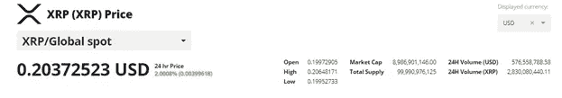
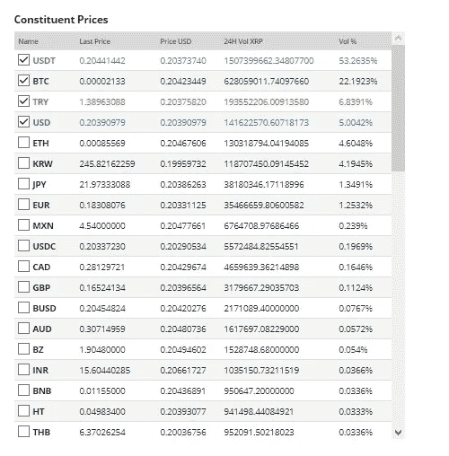
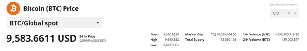
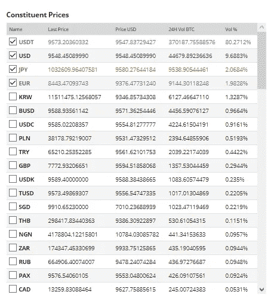
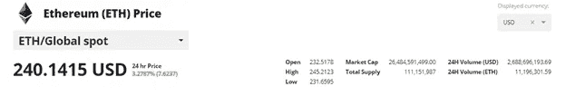
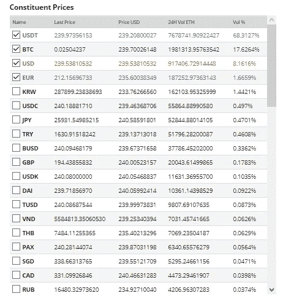
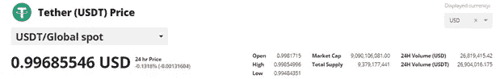
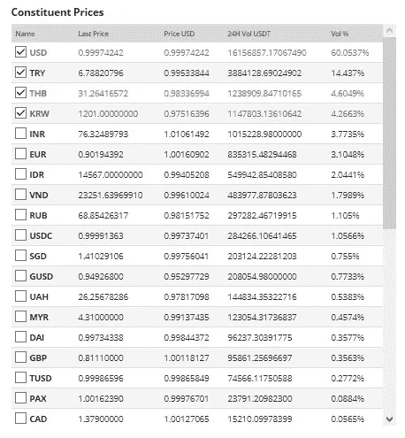

# 加密链上传输和这些传输的组成部分

> 原文：<https://medium.com/coinmonks/crypto-on-chain-transfers-and-constituent-parts-of-these-transfers-cf2f48d61df?source=collection_archive---------2----------------------->

Photo by [Austin Distel](https://unsplash.com/@austindistel?utm_source=medium&utm_medium=referral) on [Unsplash](https://unsplash.com?utm_source=medium&utm_medium=referral)

大多数密码观察者习惯于看密码资产的价格。比特币的价格是 9000 美元还是 4500 美元，即使对那些没有持有比特币的人来说也是一个值得关注的问题。更复杂的说法是替代加密资产，即替代硬币，也就是比特币原件的替代硬币。对于这样的人来说，XRP 联邦理工学院 BCH USDT 分校以及更多的边缘资产有一些价格参考。甚至更老练的人对这些资产之间的配对和交叉也略知一二。

同样，大多数专家和观察家都有一个市场资本化的概念，业内人士称之为网络价值，即资产价格乘以其供应量。因此，当比特币的 NV 超过 1000 亿美元时，这是一个新闻，尽管其程度低于价格本身。然而，还有一个热衷者和外行人都很少谈论的指标，即转移的组成部分。

每一枚硬币，暂时都有流通供给。例如，截至 2020 年 5 月，Ripple 的 XRP 硬币有大约 440 亿枚硬币在流通。因此，其网络价值约为 89 亿美元。等式是一个简单的供应 x 价格= NV 操作。然而，每天都有一部分供应在交易所交易，一部分在区块链交易。所以对 XRP 来说，过去 24 小时的连锁活动大约是 28 亿个硬币。有趣的部分来了——这些交易中只有一小部分是以美元结算的。这是来自 bravenewcoin.com([https://bravenewcoin.com/data-and-charts/assets/XRP/price](https://bravenewcoin.com/data-and-charts/assets/XRP/price))的表格:

正如你在这里看到的，当天土耳其里拉的直接法定转账利率为 6.8%，美元为 5%，韩元为 4%，日元为 1.3%。大部分交易是在与美元挂钩的稳定硬币中进行的，占 53.2%，其次是 BTC，占 22.2%。

这告诉我们，约 80%的 XRP 日报上链量有密码组成部分。虽然 USDT 类似于美元，但这仍然意味着 XRP 的交易员希望留在加密领域，而不是转移到法定美元。这种 USDT 流行是贸易相关因素还是资金转移相关因素，我更倾向于后者。更有趣的是 BTC 交易量，这可能表明套利交易或更有可能的转移便利 XRP 和转换到 BTC 保管。让我们继续看看其他一些主要硬币的日常贸易的组成部分。

…

这是来自 bravenewcoin.com([https://bravenewcoin.com/data-and-charts/assets/BTC/price](https://bravenewcoin.com/data-and-charts/assets/BTC/price))的比特币表格:

比特币的组成部分是 80%的 USDT 和 10%的美元。这清楚地告诉我们，BTC 充当价值储存手段。这是投资者停车或离开的最后去处。交易者不直接用代用币或法币兑换 BTC。取而代之的是，他们为了交易前停车或为了转让的目的而转向 USDT。

…

对于以太坊 ETH，来自 bravenewcoin.com(【https://bravenewcoin.com/data-and-charts/assets/ETH/price】T2)的表看起来像:

ETH 在连锁转让中的固定部分被限制在 13%左右，其中美元占了大部分。菲亚特在瑞士联邦理工学院的普及率略高于 BTC，这可能强调了菲亚特的“gas ”,即智能合约的使用率高于储值组件。与 BTC 类似，USDT 以 68%的股份占据了交易的最大份额，并可能充当转会推动者的角色。同样有趣的是，17.6%的 ETH 交易最终在 BTC 完成，而 BTC 的情况正好相反(即，BTC 持有者不会以任何有意义的数量直接转向 ETH)。我倾向于认为，这是因为更便宜、更快捷的转账便利。如果是出于交易目的，那么我们会在 BTC/ETH 交易中看到镜像。

…

最后，让我们来看看来自 bravenewcoin.com 的泰瑟·USDT():

系绳部分对理解全貌极其重要。让我提醒你，我们不是在看交易量，而是在看连锁转账。正如我们所见，USDT 与 BTC 联邦理工学院和 XRP 之间的连锁交易非常普遍，显然，在 coinmarketcap.com([https://coinmarketcap.com](https://coinmarketcap.com))等网站上，你可以追踪到很多 USDT 交易所的交易。在这张桌子上，我们看到了第一个非常有趣的事实。USDT 连锁转让总额仅为 2700 万美元。与 USDT 超过 40 亿美元的链式传输相关密码对相比，这个数字微不足道。这意味着 USDT 的大部分加密交易都停留在加密领域，只有极少量通过 USDT 菲亚特路线离开。换句话说，USDT 通过像稳定硬币一样的行动来促进和监管加密交易，而不是作为一个法定的退出路径结束。请注意，虽然这超出了本文的范围，但 USDT 及其健康运行是加密货币有序运行的关键因素。

这张表还向我们展示了什么？美元占 60%的绝对优势是可以预期的。TRY 的 14%很高，可能表明菲亚特持有人更喜欢停在 USDT，而不是在他们没有持有加密硬币时完全退出市场。泰铢、韩元、印度卢比和欧元是其他货币，各占 3-4%的份额。THB 和 KRW 相对较高的份额可能表明个人对未能适当满足当地银行对加密网关需求的国家感兴趣。但是，最能说明问题的一点是，这些是位于微小链上 USDT 卷之上的微小卷，因此此分析受到此图相关性的限制。然而，我要重申，最有趣的信息是链转移量巨大的加密到 USDT，这是没有满足 USDT 菲亚特部分，我在上一段解释。

…

这是一个简短的研究，揭示了一些硬币链转移的组成部分。通过使用更大的历史数据集，包括更多的硬币，并考虑到交易所级别的交易统计数据，可以对加密前景进行彻底的分析。鉴于有大量的高智能加密爱好者，我希望很快看到这一点。

Photo by [NASA](https://unsplash.com/@nasa?utm_source=medium&utm_medium=referral) on [Unsplash](https://unsplash.com?utm_source=medium&utm_medium=referral)

至于我们的目的，我们已经看到 **Tether 在促进贸易方面发挥了至关重要的作用，它既是一个停车点，也是一种转移工具**，**比特币是价值选择的明确存储**， **ETH 和 XRP 有更多智能合约和转移的实际使用案例**，并且**USDT 的绝大部分不会通过菲亚特网关离开市场。**

2020 年 5 月 31 日

> [直接在您的收件箱中获得最佳软件交易](https://coincodecap.com/?utm_source=coinmonks)

