# Crypto:反弹还是拐点？

> 原文：<https://medium.com/coinmonks/crypto-rally-or-inflection-point-b9379cae2bfa?source=collection_archive---------1----------------------->

过去的 12 个月引发了一系列非常奇怪的事件，这些事件将在未来几年被讨论。这些事件也为 crypto 的真实世界价值在所有主要叙事中同时展现创造了条件。叙事(或迷因)对新技术的采用至关重要，因为它们不仅解释了如何使用新技术，还解释了为什么使用新技术。

> “购买比特币来对冲通货膨胀，……，但也是为了告诉你的政府滚蛋。购买以太坊来保护羽翼未丰的去中心化金融系统，…，还要告诉你的银行滚蛋。”——瑞安·塞尔基斯，梅萨里·⁹的创始人

比特币和以太网以及其他加密货币的价格和链上活动已经超过了以前的历史高点。现在，加密技术的总市值超过了 1 万亿美元。因此，许多人一直在问，“这次反弹有多真实？这只是另一个炒作周期吗？”为了回答这些问题，我必须通过支持加密的四个不同的叙述来分解它:

1.  **音钱**
2.  **DeFi**
3.  **金融包容性**
4.  **Web 3.0**

我持怀疑态度，但在评估了每个秘密叙述的驱动因素后，我得出结论，这不仅仅是另一场反弹。这是一个拐点。

# 1.健全货币

[*稳健的货币*](/galaxy-digital-research/on-sound-money-afc0619697b3) *创造成本很高，要维持可靠的机制来限制供给增长，使其更少受到货币贬值的影响。这种说法认为，供应量有限的比特币是一种价值储存手段和通胀对冲手段。*

**Tl；dr:机构对比特币的接受度正处于拐点。**

比特币占据了大约 60%的加密市场份额，其主要叙事是“[数字黄金](https://www.amazon.com/Digital-Gold-Bitcoin-Millionaires-Reinvent/dp/006236250X)”比特币是一种算法上稀缺的价值储存手段，应该受益于黄金传统上拥有的相同驱动因素；也就是说，作为一种通货膨胀对冲。

> “比特币相当于法定货币体系中的美元。这是一个非常崇高的角色。”——凯西·伍德，ARKinvest ⁴公司创始人

## [halve ning](https://www.coindesk.com/bitcoin-halving-explainer)

鉴于比特币的固定供应量为 2100 万枚，halvenings(矿工集体奖励减半的程序化活动)被认为将推动需求。虽然在 2020 年 5 月的最近一次减半后，价格几乎没有变动，但潘迪拉资本发现，市场在减半后 1.2 年见顶。⁵ 潘泰拉的分析表明，比特币可能在 2021 年 8 月达到峰值，约为 11.5 万美元。⁵我很难接受“halvening”是一个真正的驱动因素，因为它是一个预期的事件，分析只在两个历史数据点上进行。也就是说，归根结底是供求关系。理由是 halvening 让人们想起了 bitcon 的固定供应，增加了需求。

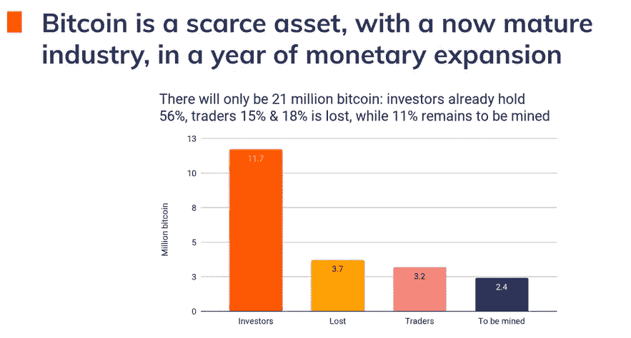

[Chainalysis](https://go.chainalysis.com/virtual-event-what-you-wish-you-knew.html)

## [U**n 前所未有的印钞**](https://www.cnbc.com/2020/08/05/the-ballooning-money-supply-may-be-the-key-to-unlocking-inflation-in-the-us.html)

> “公平地说，我们从未观察到像今天这样高的货币供应增长。”— Mike Wilson，摩根士丹利⁷公司美国首席股票策略师

我听到的主要论点是，由于数万亿美元的刺激支出引发的通胀担忧，比特币(具有可核实的固定供应，不在全球货币政策范围内)等资产的吸引力有所增加。我仍然怀疑这是一个很大的驱动因素(市场不会这么快吸收这种类型的信息，与我交谈过的经济学家实际上并不担心通货膨胀。)然而，比特币流入似乎确实与疫情(以及相应的刺激)的进展相吻合，主要是由投资者而非交易者推动的。

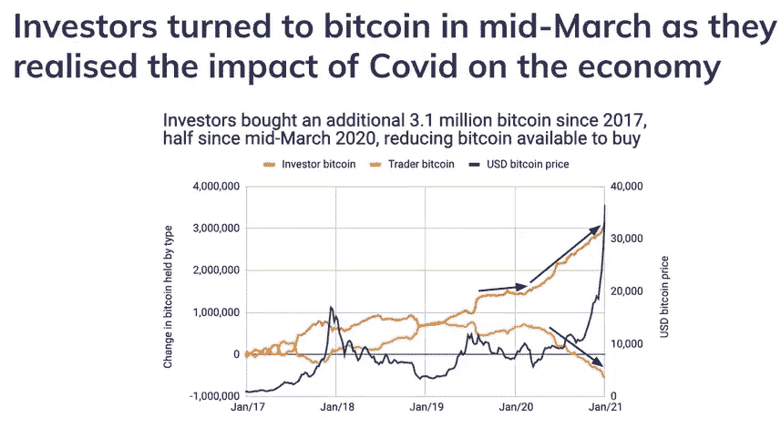

[Chainalysis](https://go.chainalysis.com/virtual-event-what-you-wish-you-knew.html)

## 相对吸引力

著名投资者[保罗·都铎·琼斯](https://www.forbes.com/profile/paul-tudor-jones-ii/?sh=68403dd8719c)在 5 月份写了一封[信](https://www.coindesk.com/hedge-fund-pioneer-turns-bullish-on-bitcoin-amid-unprecedented-monetary-inflation)表达了这样的观点:如果在特定的经济环境下，人们会购买黄金，就上涨潜力而言，比特币是一个相对更有吸引力的选择。他没有说他认为比特币是一种更好的价值或资产储存手段。相反，他指出，相对于市值约为比特币 50 倍的替代品，比特币被低估了。其他投资者也对比特币的流动性相对于其上行潜力的吸引力发表了类似的评论。即使在今天的水平上，与其他感知价值储存相比，比特币的市值也只相当于私人部门黄金投资(2.7 万亿美元)的 33%、M2 货币存量(19.1 万亿美元)的 5%和全球机构级房地产(45.3 万亿美元)的 2%。⁴一些人认为，比特币的市值应该大于黄金，因为它拥有更优越的属性。一步一步来。

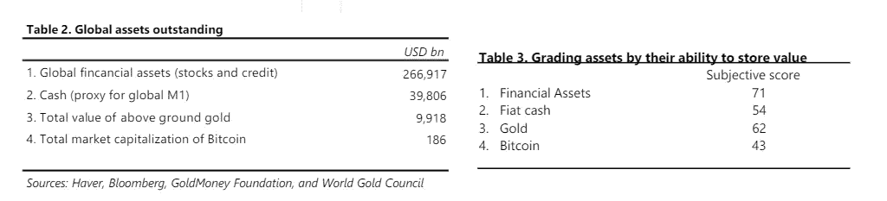

[Coindesk](https://www.coindesk.com/hedge-fund-pioneer-turns-bullish-on-bitcoin-amid-unprecedented-monetary-inflation) (May 2020)

保罗都铎的琼斯评论也很重要，因为它实际上允许其他华尔街投资者持有类似的头寸。从那以后，斯坦利·德鲁肯米勒 ⁸和比尔·米勒[⁹也对比特币投资直言不讳。即使是长期持怀疑态度的雷伊·达里奥最近也采取了更加积极的态度，尽管仍然很谨慎。⁰](https://en.wikipedia.org/wiki/Bill_Miller_(investor))

## 制度需求

在多年的激烈批评之后，金融机构开始加入进来。摩根大通(JP Morgan)、花旗(Citi)和古根海姆(Guggenheim)都涉及比特币，并预测了六位数的价格目标。⁴ [纽约梅隆银行](https://www.bloomberg.com/news/articles/2021-02-10/mastercard-to-allow-some-cryptocurrencies-in-digital-asset-boom?cmpid=BBD021121_MKT&utm_medium=email&utm_source=newsletter&utm_term=210211&utm_campaign=markets)表示将持有和转让加密货币。[高盛](https://www.nasdaq.com/articles/goldman-sachs-to-enter-crypto-market-soon-with-custody-play%3A-source-2021-01-15)预计将宣布推出托管服务的计划。贝莱德已经授予至少两家基金投资比特币期货的资格。 [CME](https://finance.yahoo.com/news/cme-registers-33m-worth-ethereum-013302511.html) 最近推出了现金结算的 ETH 期货。 [Mass Mutual](https://www.bloomberg.com/news/articles/2020-12-10/169-year-old-insurer-massmutual-invests-100-million-in-bitcoin) 购买了 1 亿美元的比特币，并收购了 NYDIG 股权。[古根海姆](https://markets.businessinsider.com/currencies/news/guggenheim-fund-bitcoin-investment-cryptocurrency-market-rally-grayscale-trust-btc-2020-11-1029849060)披露，它有权向[灰度比特币信托](https://grayscale.co/bitcoin-trust/)投资至多 5 . 3 亿美元。这不只是说说而已。大型投资者从 10 月至 1 月 26 日购买了 100 万比特币(约占供应量的 5%)，比特币基地机构在 2020 年下半年帮助“许多捐赠基金、机构家族办公室和领先的财富管理平台购买和存储加密资产，用于他们的投资组合”。⁴ [哈佛、耶鲁、布朗和密执安大学](https://www.bloomberg.com/news/articles/2021-01-26/harvard-and-yale-endowments-among-those-reportedly-buying-crypto)都披露他们已经为他们数十亿美元的捐赠基金购买了密码。[据报道，1 月 15 日至 21 日期间，gray 的比特币信托(GBTC)](https://www.sec.gov/Archives/edgar/data/1588489/000156459021001769/gbtc-8k_20210115.htm) 获得了 12 亿美元的新投资者资金，而[计划再推出 5 只信托](https://www.theblockcrypto.com/linked/92191/grayscale-trust-incorporation-chainlink-tezos)。为机构、私人客户和银行管理比特币的 NYDIG 预计，到今年年底，机构客户将持有 250 亿美元的比特币，高于 60 亿美元。

没错，这些流入资金中有一部分是由鲸鱼和矿工向新手投资者抛售而获得的。在 BTC 触及 40，000 美元后，一些基金降低了一些风险。但从对冲基金到风险基金，越来越多的传统金融(TradFi)机构正在开发加密策略，并计划向比特币投入大量资金。我知道，因为我和他们谈过了。我们甚至还没有看到这些资金流入。

> 一个基金不能决定通宵持有密码。他们必须改变授权，召开董事会，并获得有限合伙人的批准。那需要大约四分之一。

全球机构管理的 90 多亿美元中，有多少可以流入比特币？比特币基地的有效前沿计算表明，10%左右的比特币配置是最优的。arkinvest 进行的一项类似的分析发现，当回报最大化和波动性最小化时，2.55%的配置是最佳的，而 6.55%是最大化夏普比率的最佳配置，夏普比率是一种风险调整后回报的衡量标准。比特币基地计算出 2020 年的滚动年化夏普比率为 2.54，即在最近的熊市中，五年内为 1.54。

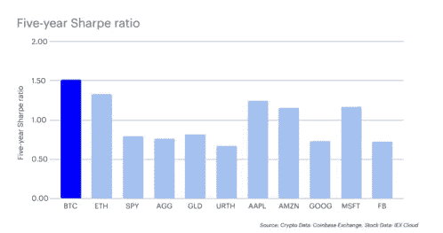

Coinbase Institutional: 2020 in Review

企业国债也在购买比特币。支付公司 [Square](https://www.coindesk.com/first-mover-bitcoin-11k-square-corporate-money-pot) 宣布将向比特币投入 5000 万美元，或其资产的 1%。 [Microstrategy](https://www.microstrategy.com/en/company/company-videos/microstrategy-announces-over-1b-in-total-bitcoin-purchases-in-2020#:~:text=%E2%80%9CThe%20Company%20continues%20to%20operate,Saylor%2C%20CEO%2C%20MicroStrategy%20Incorporated.) 在其公司金库中持有> 70，000 BTC，[摩根士丹利](https://www.bloomberg.com/news/articles/2021-01-09/morgan-stanley-unit-boosts-stake-in-bitcoin-loving-microstrategy)持有 Microstrategy 10%的股份以获得间接敞口。[特斯拉](https://www.cnbc.com/2021/02/08/tesla-buys-1point5-billion-in-bitcoin.html)购买了 15 亿美元的比特币，并将接受支付。加拿大皇家银行认为，苹果可能是下一个做出类似配置的财富 500 强。即使你相信[系绳](https://crypto-anonymous-2021.medium.com/the-bit-short-inside-cryptos-doomsday-machine-f8dcf78a64d3)一直在人为抬高比特币的价格，这些都是从美元兑换而来的真实流入。系绳可能是一个[骗局](https://www.bloomberg.com/opinion/articles/2019-04-26/things-got-weird-for-stablecoin-tether)，但如果是这样，它也创造了一个自我实现的预言。

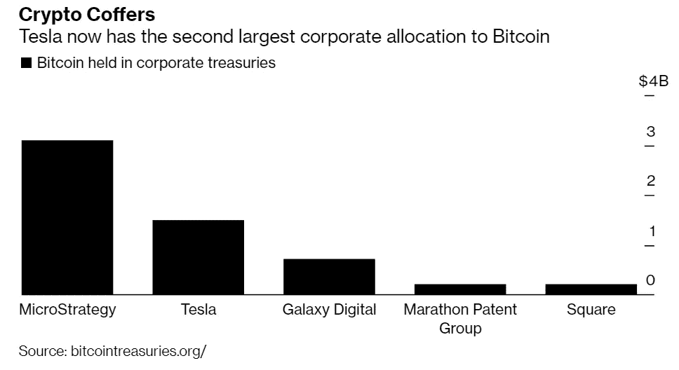

[Bloomberg](https://www.bloomberg.com/news/articles/2021-02-08/tesla-trails-only-microstrategy-in-treasury-bitcoin-allocation) (February 2021)

> 无论哪种潜在驱动因素占主导地位，我们都处于比特币在机构中的采用的初始拐点。

# 2.分散融资

[*DeFi*](/coinmonks/defi-what-it-is-and-isnt-part-1-f7d7e7afee16) *旨在创建一个高度可互操作的金融系统，具有更高的透明度、平等的访问权限，并且几乎不需要中介，因为这些角色由智能合约承担。这种叙述假设 DeFi 是一种替代(开放、透明和自动化)的金融系统。*

**Tl；dr:DeFi 的上涨看起来更像是一次反弹，但有迹象表明，它将与传统金融体系整合，或者取代传统金融体系的某些元素。这最终将是一个巨大的转折点。**

集中化的金融市场阻碍了公平准入，容易受到交易对手风险、审查、缺乏透明度和操纵的影响。最近关于 [$GME 和罗宾汉](https://www.cnbc.com/2021/01/28/robinhood-interactive-brokers-restrict-trading-in-gamestop-s.html)的事件，虽然最终是由[监管要求](https://www.cnbc.com/2021/02/03/why-investors-were-willing-to-write-robinhood-a-3-billion-check-during-the-gamestop-chaos-.html)驱动的，却深刻地说明了这些缺陷。远在$GME 之前，DeFi 就出现了，试图纠正这些缺陷，确保支持可编程资产市场的基础设施就像它们的底层技术一样分散。成立仅两年多的分散交易所(dex)在 2010 年第四季度的总交易量达到 600 亿美元，而未偿还的 DeFi 贷款达到 45 亿美元。2020 年，以太坊网络上交易的 stablecoins 和 ETH 接近 1.6 万亿美元。这是不容忽视的。

## 产量

整个夏天流动性激励措施的实施，带动了一场以投机为主的狂潮完成了[产量](https://www.coindesk.com/defi-yield-farming-comp-token-explained)****[粮食代币](https://cointelegraph.com/news/dinner-is-served-here-s-what-defi-s-food-meme-tokens-bring-to-the-table) **。“德根资本”蜂拥而至，寻找更高收益的资产。虽然投机可能是主要驱动力，但它也导致了生产性使用和技术进步。DeFi 的重点已经从获得流动性转移到保持流动性。有人说要将空投与授权时间表或关键绩效指标挂钩。超额抵押要求依然存在，但有所创新([智能合同契约](https://twitter.com/AlphaKetchum/status/1351766590761668608) **、** zk 核保凭证**、**和[社会信用委托](https://messari.io/article/aave-announces-credit-delegation-enabling-uncollateralized-lending))。)由于几乎整个 DeFi 生态系统都在争夺以太坊上的资源，天然气费用已经失控，推动了第二层 R & D(国家频道、[零知识汇总](https://docs.ethhub.io/ethereum-roadmap/layer-2-scaling/zk-rollups/)和[乐观汇总](https://optimism.io/)。)尽管如此，随着更多的流动性进入市场，风险降低，很难相信当前的利率是可持续的。******

> **正如将互操作性引入技术往往会导致基础层协议的商品化，随着时间的推移，更高效/更灵活的市场也会导致更窄的差价和更低的收益率。**

**DeFi 也不能幸免于再现 TradFi 弱点(再抵押、过度杠杆、[分段贷款](https://www.coindesk.com/collateralized-debt-obligations-cdos-defi-lending)等)。)可组合性导致依赖性，根据定义，依赖性会导致系统性风险。然而，DeFi 提供的透明度改变了风险等式。TradFi 市场的系统性崩溃在一定程度上是不透明的结果(在 2008 年，没有人真正知道谁持有何种风险。)相反，DeFi 的透明度允许实时风险定价和可审计的担保跟踪。协议也是社区所有和运营的，这意味着费用在用户而不是对冲基金经理之间分摊。这些都是即使在产量正常化后使用 DeFi 的有意义的理由。**

## **新的金融基础设施**

**比特币是 2009 年发明的。DeFi 于 2018 年末应运而生。它仍然是实验性的，用户或多或少都是 beta 测试者。虽然它的潜力巨大，越来越多的投资者开始意识到这一点，但它还没有完全成为主流。除了一些精选的风险投资基金和家族理财室，2020 年，比特币基地没有看到机构客户对 DeFi 资产的大量投资。⁴目前，DeFi 仍然主要由零售驱动。⁴:这并不是说没有机构的兴趣。[圣路易斯联邦储备银行](https://research.stlouisfed.org/publications/review/2021/02/05/decentralized-finance-on-blockchain-and-smart-contract-based-financial-markets?utm_source=twitter&utm_medium=SM&utm_content=stlouisfed&utm_campaign=f0e83c05-c5ab-4e46-b80d-b70fcf0c0a27)最近发表了一篇关于 DeFi 的研究论文[国际货币基金组织高级金融经济学家曼莫汉·辛格博士](https://www.youtube.com/watch?v=UJsVYOfrc3M)承认了 DeFi 的潜在好处。虽然有人说 DeFi 将取代传统的金融系统，但我认为 DeFi 更有可能与 TradFi 整合，而不是取代它。需要新的金融基础设施(例如，多日结算)的许多常见原因实际上并不是技术问题。24/7 市场现在是可能的；阻碍创新的是惯例，而不是技术限制。一个更引人注目的价值主张是新的金融工具或功能，如果没有公共区块链，这些工具或功能就无法实现，如原子互换、自主流动性池、分散稳定信用和快速贷款。别忘了透明度。**

> **DeFi 仍处于相对早期的发展阶段，主要由对产量的追求所驱动。然而，DeFi 在透明度、价值累积和新颖的金融功能方面提供了超越传统金融系统的真正改进。现在还没有到拐点，但绝对不容忽视。**

# **3.金融包容性**

**加密货币无需许可，比传统货币成本更低，为全球约 17 亿没有银行账户的人、⁴人和无数更多银行服务不足的人消除了准入障碍。这种叙述集中在较低的汇款费用、“无银行银行”和主流采用。1.1b 人之所以没有银行账户，至少部分是因为他们缺乏合法形式的身份证明，因此这种叙述依赖于 [*数字身份*](/blockchain-at-berkeley/the-impact-of-digital-identity-9eed5b0c3016) *。***

****Tl；dr:主流的采用正走向一个拐点。这种技术是否能提高金融包容性，在这一轮中还没有答案。****

**从降低汇款费用开始，虽然已经取得了令人兴奋的进步，但它们仍然很棘手，因为监管壁垒、资本管制和银行系统以外的因素造成了跨境支付中的许多摩擦和成本。谈到没有银行账户的人口，虽然这部分人口被排除在金融系统之外已有几十年，但疫情表明迫切需要包容。虽然很大一部分美国人可以通过直接存款获得资金，但仍有相当一部分没有银行账户的人不能。对这些人来说，刺激计划的支票是通过邮件寄出的，这加剧了不平等。向中小企业提供资金也很困难，部分原因是贷款实践需要贷款官员、亲自确认和传真。虽然最初的刺激法案中包含了“数字美元”的提议，但更好的数字身份和数字发行渠道仍然是迫切需要的。**

**值得注意的是，数字货币可能会降低金融包容性，这取决于它们的设计。天秤座[最初的声明](https://justine-humenansky.medium.com/blinded-by-the-hype-what-people-are-missing-about-libra-366213fcb19c)(现在的 [Diem](https://www.diem.com/en-us/) )引发了发展中国家对国家主权的担忧，考虑到类似于不可避免的美元化的风险。它似乎还创建了一个非常类似于储备银行的机构，为全球金融稳定敲响了警钟。此后不久，中国人民银行试点发行 DCEP 引发了对现有储备货币威胁的担忧。不管这些担忧是否有根据，其结果是央行数字货币研发的大幅增加。**

## ****零售央行数字货币(CBDC)****

**根据国际清算银行 2021 年 1 月的一项调查，86%的央行正在研究 CBD。巴哈马的 Sand Dollar 已经上线，PBOC 已经在大湾区、京津冀开展 DCEP 试验。值得注意的是，欧洲央行[宣布](https://www.ecb.europa.eu/euro/html/digitaleuro.en.html)将决定是否在 2021 年中期推出数字欧元试点。私营部门也在为 CBDCs 做准备。[万事达卡](https://www.bloomberg.com/news/articles/2021-02-10/mastercard-to-allow-some-cryptocurrencies-in-digital-asset-boom?cmpid=BBD021121_MKT&utm_medium=email&utm_source=newsletter&utm_term=210211&utm_campaign=markets)宣布了一个专有的虚拟测试环境，供中央银行评估 CBDC 用例。 [Visa](https://www.forbes.com/sites/billybambrough/2020/10/23/paypal-just-gave-346-million-people-a-new-way-to-buy-bitcoin-but-theres-a-nasty-catch/?sh=34437f8b2b61) 公布了一项离线支付系统(OPS)协议提案，该协议将使 CBDC 拥有类似现金的财产。Diem 和 PayPal 都提议与 CBDCs 兼容。如果设计得好**，** CBDCs 也会与以太坊和 DeFi 生态系统整合。**

**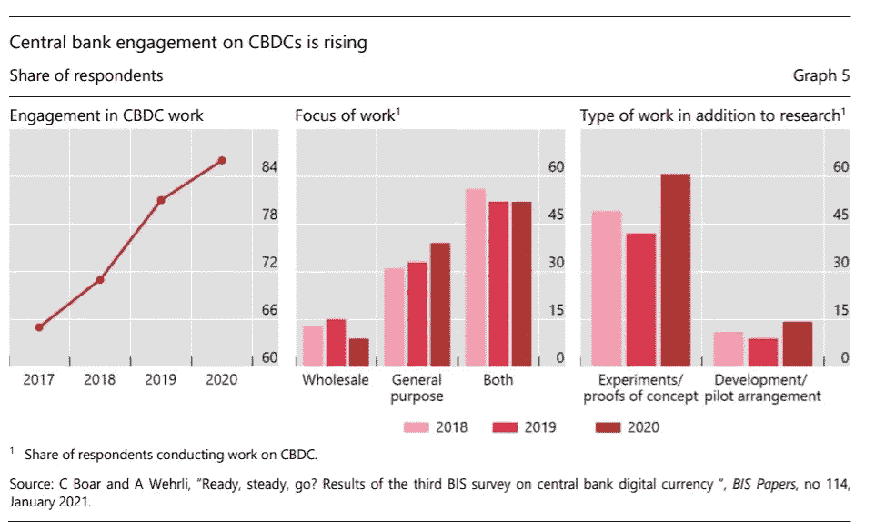**

**[BIS](https://www.bis.org/speeches/sp210127.pdf) (Jan 2021)**

**在我看来，CDBCs 迫在眉睫，唯一的问题是它们的设计。WEF 的 [CBDC 决策者工具包](http://www3.weforum.org/docs/WEF_CBDC_Policymaker_Toolkit.pdf\)概述了主要的设计选择和政策问题。这两个因素对于 CBD 能否提高金融包容性都至关重要。**

## ****主流采用****

**随着加密支付被更广泛地接受，主流分发已经有了显著的发展。PayPal 推出新功能，允许用户购买、持有和出售加密货币。也就是 3.46 亿用户和 2600 万商家。⁵ [Visa](https://www.forbes.com/sites/michaeldelcastillo/2020/12/02/visa-partners-with-ethereum-digital-dollar-startup-that-raised-271-million/?sh=de7b9e4b1f52) 宣布将其 6000 万商户网络连接到 USDC。[万事达卡](https://www.bloomberg.com/news/articles/2021-02-10/mastercard-to-allow-some-cryptocurrencies-in-digital-asset-boom)将开始允许持卡人在其网络上用某些加密货币进行交易。Square 每季度的比特币收入超过 100 亿 1B。⁴ Coinbase 拥有逾 4300 万用户。⁴的 BlockFi 已经创造了超过 50 亿美元的零售贷款。这不是边缘技术。**

> **“从长远来看，我非常看好各种数字货币。”—⁸贝宝公司首席执行官丹·舒尔曼**

**公开市场流动性事件正在发生，预计比特币基地上市时的估值将使其跻身美国 10 大金融机构之列。其他交易所可能会效仿，可能通过特殊目的收购公司，然后是“CeFi”贷款机构。随着机构收养的增加，我们可能会看到托管提供商的整合。**

**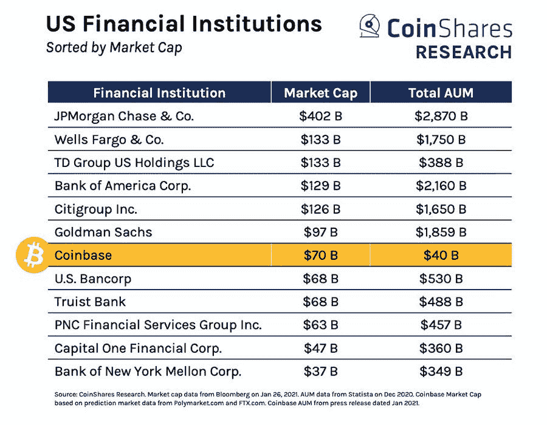**

**CoinShares**

**当然，一些主流的采用是由投机驱动的。)PayPal 首席执行官丹尼尔·舒尔曼(Daniel Schulman)指出，“每个注册了 crypto 的人，他们的应用开放程度是以前的两倍。”那是关于价格的。在任何情况下，随着消费金融科技 CAC 的持续增长，大量金融科技公司正在寻找为客户提供更高收益率的方法，加密集成看起来越来越有吸引力。**

> **随着主要私营部门参与者以及潜在的中央银行推出新的加密产品和服务，主流采用正走向拐点。这是否能改善金融包容性是一个政策和设计问题。**

# **4.Web 3.0**

***Web 3.0 指的是使用区块链技术来创建我们当前互联网的替代方案，由大型、集中的平台主导，由* [*提取商业模式*](/dorm-room-fund/rethinking-the-internet-a-new-model-part-1-207dca550aaf) *支持。该叙述假设 Web 3.0 允许用户访问有状态的 Web，从而降低平台风险，赋予用户权力，实现新的商业模式，并调整网络参与者之间的激励。***

****Tl；dr:虽然 Web 3.0 有巨大的潜力，但我们可能必须等待另一个周期，直到我们开始看到一个拐点。****

**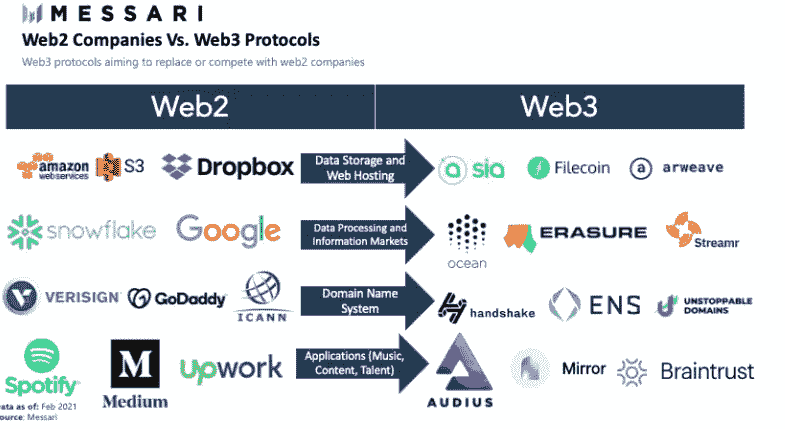**

**Messari**

**Web 2.0 是无状态的，这种架构导致了提取业务模型和充当集中看门人的 megacap 平台。所有网络参与者都面临平台风险。我很了解这一点，因为作为巴克莱银行的股票研究分析师，我曾经报道过 megacap Web 2.0 公司。监管机构正试图纠正这种情况，但监管很少是解决之道。重新架构呢？**

**Web 3.0 提出了新的互联网架构；它在区块链基础设施上运行，支持本地身份和支付层，具有本地治理机制，并允许隐私保护。加密网络及其参与者之间的契约通过开放源代码来执行。声音(治理)和退出(分叉)有内置的机制。)⁶ Web 3.0 允许基于稀缺性而非普遍性的新商业模式。Web 3.0 也创造了与数据的不同关系。人们可以想象这样一个世界:Web 3.0 基础设施提供商创造的价值等同于他们的 Web 2.0 同类产品，如 AWS(计算和存储)、Google(索引和搜索)和 Okta(身份识别)。)Web 3.0 由几个子叙述组成，概述如下。**

**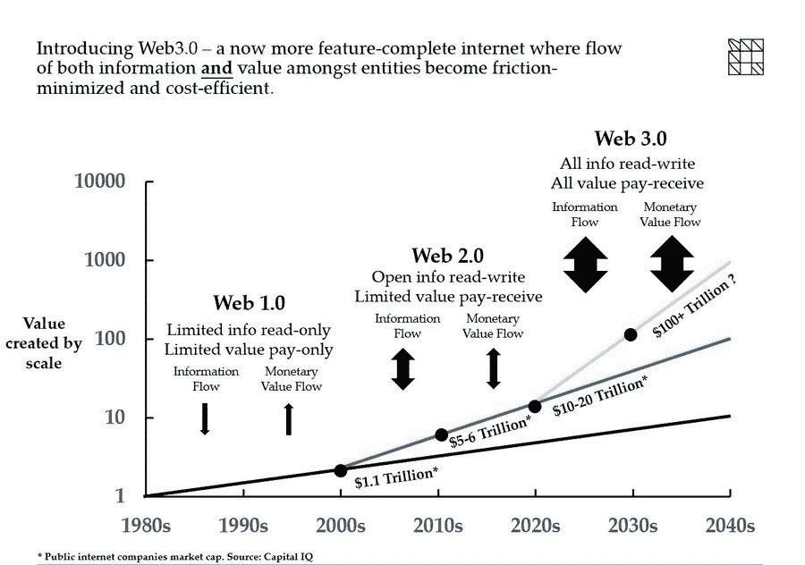**

**[Maple Leaf Capital](https://twitter.com/MapleLeafCap/status/1356839675806244865)**

## **抵制审查:D 的应用程序**

**最近的事件将平台风险置于前沿和中心，尽管它一直存在( [Zynga](https://venturebeat.com/2016/06/30/facebook-kicked-zynga-to-the-curb-publishers-are-next/) 、[易贝](http://rch-rankings/371536/)等)。)虽然我不宽恕这些平台上发生的活动，但 [AWS、苹果、谷歌](https://www.nytimes.com/2021/01/09/technology/apple-google-parler.html)、 [Twitter、脸书](https://www.usatoday.com/story/tech/2021/01/15/censorship-trump-extremists-facebook-twitter-social-media-capitol-riot/4178737001/)和 [Discord](https://newyork.cbslocal.com/2021/01/31/texas-ag-ken-paxton-launches-investigation-discord-robinhood-companies-suspended-stock-trading/) 所采取的行动都凸显了集中式 Web 2.0 平台的力量。相比之下，D'Apps 不能被单一实体关闭或审查。最近的事件会大幅增加 D'Apps 的使用吗？我认为这需要更多的时间。**

## **隐私:ZK 证明、自我**主权**身份和个人数据存储**

**最近蜂拥而至的[信号](https://www.nytimes.com/2021/01/13/technology/telegram-signal-apps-big-tech.html)，以及在较小程度上，Telegram、Horizon 和 Zcash 都表明了一种新的高度的隐私意识。Web 3.0 架构允许用户通过隐私保护基础设施和个人数据存储拥有和控制他们的数据，并通过 [SSI](https://sovrin.org/faq/what-is-self-sovereign-identity/) 控制他们的身份。Zk 证明是一项关键的使能技术，它们正在规模化运营。隐私一直是一个很难推销的东西，但是相关的权衡正在减少。**

## **数字稀缺:不可替代的代币(NFTs)**

**可互换资产的单个单位，如 ETH 或 USD，是无法区分的。相比之下，每个不可替换的令牌都是唯一的。这种数字稀缺性使得 NFT 特别适合代表可收藏的物品或艺术。 [Dapper Labs](https://www.dapperlabs.com/) 随着 [NBA Top Shot](https://www.forbes.com/sites/tommybeer/2021/01/23/how-did-a-lebron-james-video-highlight-sell-for-71455-a-look-at-a-burgeoning-product-called-nba-top-shot/?sh=6555f8c6184b) 和[微软](https://www.coindesk.com/minecraft-enjin-microsoft-nfts\)最近推出了一款浏览器游戏，奖励玩家在《我的世界》使用 NFT。非功能性测试无疑正在获得动力，但在它们成为主流之前，可能还需要一个周期。有人可能会说，非功能性测试并不是 Web 3.0 特有的。**

> **虽然我坚信 Web 3.0 的重要性，但我认为我们必须等待另一个周期，直到这种叙事获得足够的动力，变成一场运动。**

# **监管:反叙事**

**雷伊·达里奥一直直言不讳地表示监管对加密技术构成了生存威胁。监管仍然是一个不小的风险，但它似乎正在一天天减少。OCC 澄清了联邦特许银行可以合法提供加密资产的托管权，从而成为了[的头条新闻](https://www.occ.gov/news-issuances/news-releases/2020/nr-occ-2020-98.html#:~:text=WASHINGTON%E2%80%94The%20Office%20of%20the,cryptocurrency%20custody%20services%20for%20customers.&text=Crypto%20custody%20services%20may%20extend%20beyond%20passively%20holding%20%22keys.%22)。他们还发布了一封[信](https://www.occ.gov/news-issuances/news-releases/2021/nr-occ-2021-2.html)澄清国家银行和联邦储蓄协会被允许运营区块链节点并使用稳定的货币进行支付。这些决定似乎与央行数字货币的潜在推出有关，但它们有利于整个生态系统。欧盟最近关于 DeFi 的监管提案，即加密资产监管市场( [MiCA](https://eur-lex.europa.eu/legal-content/EN/TXT/?uri=CELEX%3A52020PC0593) )，被普遍认为是积极的，因为它为 EU-范围内的加密监管开辟了一条道路。这似乎比在目前遍布 27 个不同国家的监管迷宫中穿行更可取。DeFi 带来了独特的监管挑战，因为监管通常适用于中介，而 DeFi 的目的是消除这些挑战。**

**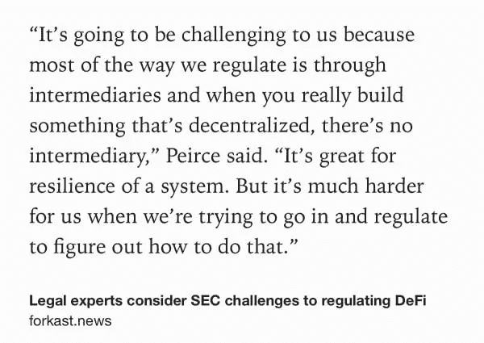**

**这并不是说监管风险不复存在。确实如此。要求稳定硬币发行者注册为银行的监管提案和 FinCEN 制定的午夜规则证明了这一点。然而，加密技术被越广泛地采用，它为私人公司创造的收入越多，就越难监管它的存在。**

# **接下来的叙述？**

**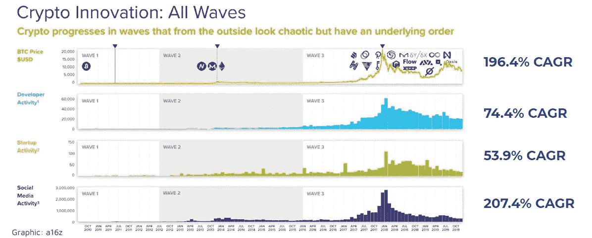**

**[a16z crypto startup school](https://a16z.com/crypto-startup-school/)**

**价格会回落。[转型技术的采用路径](https://justine-humenansky.medium.com/emerging-c9b15eb657e)是非线性的。然而，在每个周期中，开发者活动、启动活动、创新和采用都在增加。世界级的研究机构将继续推动这项技术向前发展。随着更广泛的采用降低了职业风险，顶级人才正在重新进入该行业。**

**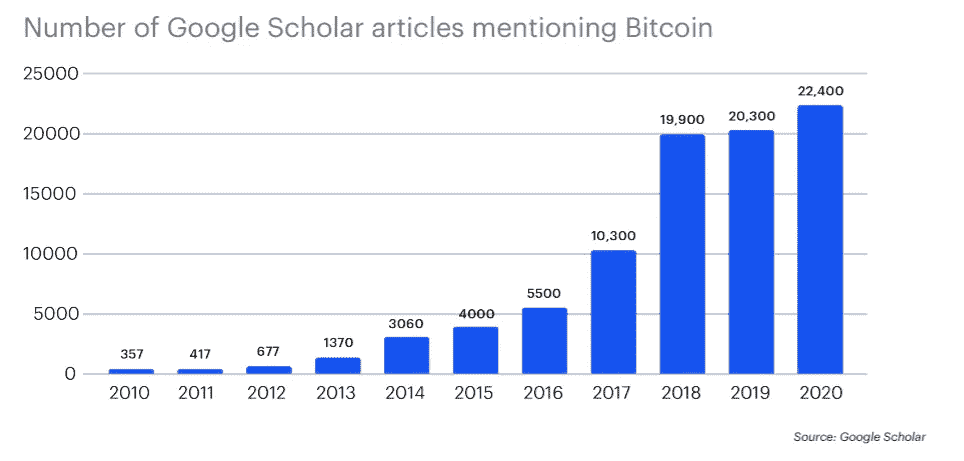**

**Coinbase Institutional: 2020 in Review**

**我们正处在一个最初的转折点。虽然并非所有的叙事都在这一点上，但一旦最初的拐点出现(比特币的机构采用推动了稳健的货币)，其余的将更快跟上。由于“冲击后”拐点和支持生态系统的发展，在最初的拐点之后的 10-20 年内可以产生巨大的价值。⁶值得注意的是，健全的货币拐点得益于独特的动力。比特币被认为风险较低，价格越高，被采用的范围就越广。它的稀缺性随着需求而增加。**

> **“价格越高，风险就越小……这与大多数股票的情况相反。”——比尔·米勒，米勒价值合伙人⁷公司创始人**

**读完这篇文章后，想象一下加密并不重要。想象一下，认为它会逐渐消失或变为零。想象一下，认为这不是一个拐点。是啊…我也不能。**

****观点是我自己的。感谢* [*【孙波】*](https://medium.com/u/34783c25bf4e?source=post_page-----b9379cae2bfa--------------------------------)*[*肖希尼【古普塔】*](https://medium.com/u/2778271b0ba3?source=post_page-----b9379cae2bfa--------------------------------)*[*卢卡·科森蒂诺*](https://medium.com/u/effdd16050cd?source=post_page-----b9379cae2bfa--------------------------------) *的反馈。如果你正在研究什么东西在加密，* [*请联系*](https://twitter.com/j_humenansky) *。******

******参考文献:******

1.  ****[被解开的](https://unchainedpodcast.com/25-billion-in-institutional-bitcoin-by-eoy/)****
2.  ****[ConsenSys Codefi](https://consensys.net/insights/q4-2020-defi-report/)****
3.  ****[链条分析](https://go.chainalysis.com/virtual-event-what-you-wish-you-knew.html)****
4.  ****[比特币基地机构](https://primebroker.coinbase.com/2020-in-review)****
5.  ****[潘迪拉资本](https://panteracapital.medium.com/bitcoin-rally-2017-vs-today-ba1fe9d7ac79)****
6.  ****[CME 集团](https://www.cmegroup.com/media-room/press-releases/2020/12/16/cme_group_to_launchetherfuturesonfebruary82021.html)****
7.  ****[美国消费者新闻与商业频道](https://www.cnbc.com/2021/01/08/bill-miller-says-bitcoin-becomes-less-risky-the-higher-the-price-goes-.html)****
8.  ****[福布斯](https://www.forbes.com/sites/billybambrough/2020/11/12/a-legendary-hedge-fund-billionaire-just-flipped-to-bitcoin-calling-it-better-than-gold/?sh=d3c7f66222f0)****
9.  ****[米勒价值合伙人](https://millervalue.com/4q20-income-strategy-letter/)****

****10.[布里奇沃特](https://www.bridgewater.com/research-and-insights/ray-dalio-what-i-think-of-bitcoin)****

****11.[卡介苗](https://www.bcg.com/en-us/publications/2020/global-asset-management-protect-adapt-innovate)****

****12. [ARKinvest](https://research.ark-invest.com/hubfs/1_Download_Files_ARK-Invest/White_Papers/ARKinvest_091729_Whitepaper_Bitcoin_II_An%20Investment.pdf?hsCtaTracking=71be7529-9a39-404e-97b3-04fd4ccf80ec%7C07365ce1-0ed3-4835-9c3c-ac33c030cd70)****

****13.[圣卢瓦联邦储备银行](https://research.stlouisfed.org/publications/review/2021/02/05/decentralized-finance-on-blockchain-and-smart-contract-based-financial-markets?utm_source=twitter&utm_medium=SM&utm_content=stlouisfed&utm_campaign=f0e83c05-c5ab-4e46-b80d-b70fcf0c0a27)****

****14.[世界银行(无银行账户](https://www.worldbank.org/en/news/press-release/2018/04/19/financial-inclusion-on-the-rise-but-gaps-remain-global-findex-database-shows))；[世界银行(身份](https://www.worldbank.org/en/news/press-release/2017/10/12/11-billion-invisible-people-without-id-are-priority-for-new-high-level-advisory-council-on-identification-for-development))****

****15.[福布斯](https://www.forbes.com/sites/billybambrough/2020/10/23/paypal-just-gave-346-million-people-a-new-way-to-buy-bitcoin-but-theres-a-nasty-catch/?sh=34437f8b2b61)****

****16.[巴拉吉·斯里尼瓦桑](https://www.youtube.com/watch?v=cOubCHLXT6A&feature=emb_logo)****

****17.[美国消费者新闻与商业频道](https://www.cnbc.com/2020/08/05/the-ballooning-money-supply-may-be-the-key-to-unlocking-inflation-in-the-us.html)****

****18. [PRN 通讯社:网络峰会](https://www.prnewswire.com/news-releases/dan-schulman-digital-currencies-are-going-to-come-into-the-mainstream-the-time-is-now-301183164.html)****

****19.梅萨里****

********

****Photo by [George Drachas](https://unsplash.com/@georgedrachas?utm_source=medium&utm_medium=referral) on [Unsplash](https://unsplash.com?utm_source=medium&utm_medium=referral)****

## ****另外，阅读****

*   ****什么是[闪贷](https://blog.coincodecap.com/what-are-flash-loans-on-ethereum)？****
*   ****最好的[密码交易机器人](/coinmonks/crypto-trading-bot-c2ffce8acb2a) | [网格交易](https://blog.coincodecap.com/grid-trading)****
*   ****[3 商业评论](/coinmonks/3commas-review-an-excellent-crypto-trading-bot-2020-1313a58bec92) | [Pionex 评论](/coinmonks/pionex-review-exchange-with-crypto-trading-bot-1e459d0191ea) | [Coinrule 评论](https://blog.coincodecap.com/coinrule-review-a-perfect-trading-bot)****
*   ****[AAX 交易所评论](/coinmonks/aax-exchange-review-2021-67c5ea09330c) | [德里比特评论](/coinmonks/deribit-review-options-fees-apis-and-testnet-2ca16c4bbdb2) | [FTX 交易所评论](/coinmonks/ftx-crypto-exchange-review-53664ac1198f)****
*   ****[n ave 零点回顾](/coinmonks/ngrave-zero-review-c465cf8307fc) | [Phemex 回顾](/coinmonks/phemex-review-4cfba0b49e28) | [PrimeXBT 回顾](/coinmonks/primexbt-review-88e0815be858)****
*   ****[Bybit Exchange 审查](/coinmonks/bybit-exchange-review-dbd570019b71) | [Bityard 审查](https://blog.coincodecap.com/bityard-reivew) | [CoinSpot 审查](https://blog.coincodecap.com/coinspot-review)****
*   ****[3 commas vs crypto hopper](/coinmonks/3commas-vs-pionex-vs-cryptohopper-best-crypto-bot-6a98d2baa203)|[赚取加密利息](/coinmonks/earn-crypto-interest-b10b810fdda3)****
*   ****最好的比特币[硬件钱包](/coinmonks/the-best-cryptocurrency-hardware-wallets-of-2020-e28b1c124069?source=friends_link&sk=324dd9ff8556ab578d71e7ad7658ad7c) | [BitBox02 回顾](/coinmonks/bitbox02-review-your-swiss-bitcoin-hardware-wallet-c36c88fff29)****
*   ****[总帐 vs n 平均](https://blog.coincodecap.com/ngrave-vs-ledger) | [总帐 nano s vs x](https://blog.coincodecap.com/ledger-nano-s-vs-x)****
*   ****[加密复制交易平台](/coinmonks/top-10-crypto-copy-trading-platforms-for-beginners-d0c37c7d698c) | [比特码复制交易](https://blog.coincodecap.com/bityard-copy-trading)****
*   ****[Vauld 评论](https://blog.coincodecap.com/vauld-review) | [YouHodler 评论](/coinmonks/youhodler-4-easy-ways-to-make-money-98969b9689f2) | [BlockFi 评论](/coinmonks/blockfi-review-53096053c097)****
*   ****最好的[加密税务软件](/coinmonks/best-crypto-tax-tool-for-my-money-72d4b430816b) | [CoinTracking 评论](/coinmonks/cointracking-review-a-reliable-cryptocurrency-tax-software-5114e3eb5737)****
*   ****最佳[加密借贷平台](/coinmonks/top-5-crypto-lending-platforms-in-2020-that-you-need-to-know-a1b675cec3fa) | [杠杆代币](/coinmonks/leveraged-token-3f5257808b22)****
*   ****[莱杰纳米 S vs 特雷佐 one vs 特雷佐 T vs 莱杰纳米 X](https://blog.coincodecap.com/ledger-nano-s-vs-trezor-one-ledger-nano-x-trezor-t)****
*   ****[block fi vs Celsius](/coinmonks/blockfi-vs-celsius-vs-hodlnaut-8a1cc8c26630)|[Hodlnaut 评论](https://blog.coincodecap.com/hodlnaut-review)****
*   ****[Bitsgap 审查](/coinmonks/bitsgap-review-a-crypto-trading-bot-that-makes-easy-money-a5d88a336df2) | [Quadency 审查](/coinmonks/quadency-review-a-crypto-trading-automation-platform-3068eaa374e1)****
*   ****[埃利帕尔泰坦评论](/coinmonks/ellipal-titan-review-85e9071dd029) | [赛克斯斯通评论](https://blog.coincodecap.com/secux-stone-hardware-wallet-review)****
*   ****[DEX Explorer](https://explorer.bitquery.io/ethereum/dex)|[w](https://explorer.bitquery.io/graphql)|[local bitcoins 评论](https://blog.coincodecap.com/localbitcoins-review)****
*   ****最佳[区块链分析](https://bitquery.io/blog/best-blockchain-analysis-tools-and-software)工具| [赚比特币](https://blog.coincodecap.com/earn-bitcoin)****
*   ****[加密套利](/coinmonks/crypto-arbitrage-guide-how-to-make-money-as-a-beginner-62bfe5c868f6)指南:新手如何赚钱****
*   ****最佳[加密制图工具](/coinmonks/what-are-the-best-charting-platforms-for-cryptocurrency-trading-85aade584d80) | [最佳加密交易所](/coinmonks/crypto-exchange-dd2f9d6f3769)****
*   ****[如何在印度购买比特币](https://blog.coincodecap.com/buy-bitcoin-app-india)？****
*   ****[印度比特币交易所](/coinmonks/bitcoin-exchange-in-india-7f1fe79715c9) | [比特币储蓄账户](https://blog.coincodecap.com/bitcoin-savings-account)****
*   ****了解比特币的[最佳书籍有哪些？](/coinmonks/what-are-the-best-books-to-learn-bitcoin-409aeb9aff4b)****

> ****[直接在您的收件箱中获得最佳软件交易](/coinmonks/newsletters/coinmonks)****

********