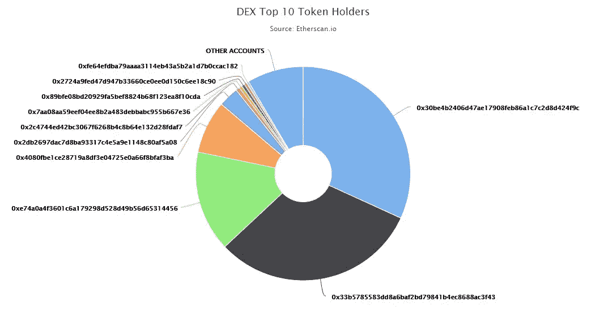
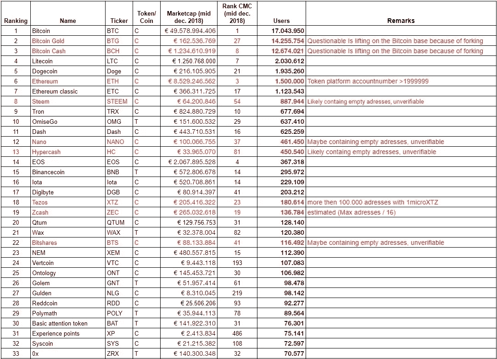
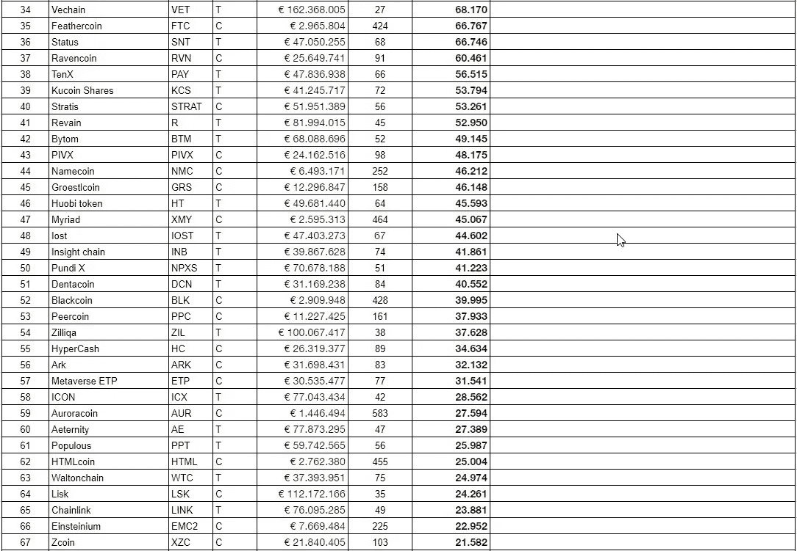
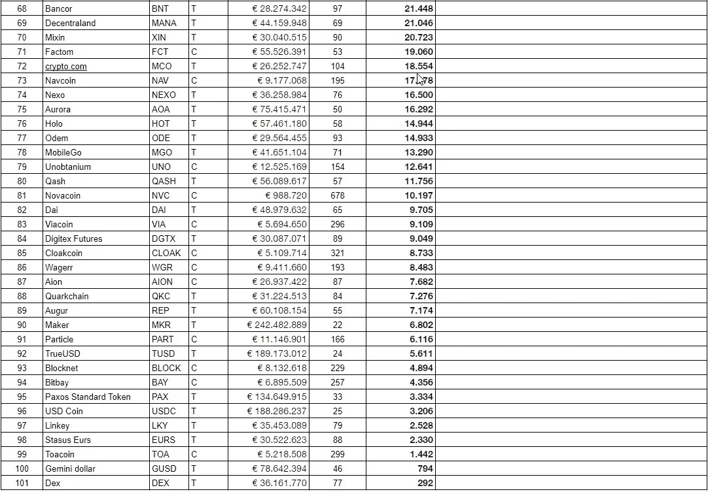

# 按用户数量排列的加密

> 原文：<https://medium.com/coinmonks/crypto-ranked-by-numbers-of-users-c736d1543d8c?source=collection_archive---------0----------------------->

[(荷兰版)](/@aat.de.kwaasteniet/crypto-gerangschikt-naar-aantallen-gebruikers-3fcf10e1cff1)
早期的研究表明，以 Marketcap 为标准，加密货币排名在[的重要性，产生了一个几乎没有或根本没有用处的列表，实际上只是说了一些关于营销工作和相关硬币的流通供应量在多大程度上被操纵的信息。针对上述研究，最常被问到的问题是:有没有另一种更好的方式来展示加密硬币的重要性？](/altcoin-magazine/the-nonsense-of-marketcap-8a2bacb70757)

# 其他方法

是的，有。但是对硬币的深入研究是需要的，并且它也有缺点，它们总是研究者和他的方法的解释。例如，作者之前进行了一项研究，其中 [crypto 最有可能成为新的支付系统](/coinmonks/which-crypto-becomes-the-new-payment-system-69f95b2d2ec3)。后来，人们试图对硬币进行分类。这两种尝试都得到了很多人的赞赏，但也有批评者想知道为什么一个方面被认为比另一个更重要。
另外，如此广泛的研究当然不容易开展。

在上述两项研究中，没有对加密货币的用户数量做任何事情。虽然用户数量确实说明了公众对一枚硬币的欣赏程度，以及这些特征对特定人群的吸引力。毕竟没有用户的硬币不是硬币。
这就是为什么这里要对加密硬币的用户数量进行一项小型研究。但要记住，用户数量最多的币不一定是最好的。
打个比方:尽管大众汽车是全球销量最大的汽车，但你不能说大众生产的汽车是最好的。但显然是这个汽车品牌吸引了最多的人，他们在可靠性、性价比、安全性等方面认为大众汽车品牌好。当然，加密硬币也是如此。

# 确定用户数量。

找出一种加密货币的用户数量也不容易。没有一枚硬币在他们的网站上列出这个数字，这也很困难，因为加密是分散的。没有机构来记录一枚硬币有多少用户。然而，关于这一点还是有话要说的。

> 用户实际上是一个错误的词，因为用户意味着人们“使用”产品。但是在密码世界里，事实并非如此。最多，他们买卖硬币，并可能持有它们，即所谓的“霍德伦”。但是很少使用。谁曾经用比特币、莱特币或 Dash 购买或支付过东西？
> Crypto owner 可能是一个更好的名字，但我们在故事的其余部分继续使用“用户”一词。

几乎所有的区块链加密硬币都是公开的，我们可以计算其中的地址数量。包含内容的已用地址的数量可以作为用户数量的衡量标准。我们将用我最喜欢的硬币[居尔登(NLG)](https://gulden.com/) 对此进行测试，因为我可以访问那里的数据。

# 控制

通过居尔登的 block explorer[d actual](https://www.dactual.com/index.php)我们可以发现现在已经使用了 210 万个唯一地址，其中超过 131，000 个居尔登地址现在有一个 content > 0。根据这个计数，我们可以推断出最多有 131，000 个用户，因为用户不能超过包含内容的地址的数量。但是可能有更少的用户，因为许多用户将有多个地址。现代钱包在每次交易发生时都会创建新的地址，但也会清空其他地址。一般来说，你可以说那些做很多交易的人很快就会有十个二十个地址，里面有一些硬币。但是绝大多数用户只拥有一两个地址。如果我们看一下分布情况，我们会发现最多的地址(大约 70%)具有 10–10，000 个居尔登。这些用户曾经购买了一些硬币，希望他们会变得富有，但没有用钱包做任何事情，现在正在等待更好的时机。

# 下载

我们还从下载数据中得知，居尔登钱包软件的独立下载次数超过了 175，000 次。下载次数超过了最大用户数。但这并不奇怪，可能有许多用户同时运行着移动钱包和桌面钱包。很多人也下载但是决定不投资任何东西。我们还知道，大约 30%的下载来自国外，70%来自荷兰。

# 研究

Kantar TNS (仅荷兰)对 35040 名消费者进行的[调查显示，2018 年 8 月至 9 月，有+/- 10 万荷兰家庭拥有居尔登。这个数字不包括外国用户，因为调查只覆盖了荷兰领土。](http://www.tns-nipo.com/nieuws/persberichten/aantal-crypto-investeerders-met-100-000-afgenomen)

考虑到所有数据，我们可以说，目前居尔登用户的数量约为 100，000，这相当于居尔登地址的数量 100，000 : 131，000。因此，我们可以说，用户数量是有内容的居尔登地址数量的+/-75%。

# 等级

有了这个知识，我们检查每个加密硬币是否有可用的块浏览器，该浏览器以分布概览或甚至 richlist 等形式给出使用的地址数量。如果是，地址数乘以 0.75，以过滤出多地址帐户和交换地址，并得出用户数。

对于以太坊区块链上的代币，持有人的数量清楚地显示在 Etherscan.io 中。这个数字乘以 0.98 以过滤掉交易所的地址等。

不幸的是，不是所有的探索者都能找到用户的数量，所以不是所有的硬币都能被评估。但是那些可用的确实给出了一幅非凡的画面。比特币将成为最大的可能不会让任何人感到惊讶，但例如市值 1.12 亿美元的 LSK 公司(Lisk)只有 24000 名用户，或者市值 5 亿美元的 NEM 也不超过 112000 名用户，这让作者感到惊讶。

也有很小的硬币可以找到。以 USD coin 为例，它在 CMC 27 上的市值为 1.88 亿美元，但只有 3206 个用户。Dex (DEX)仅拥有 286 个用户，其中前 10 个地址也拥有 91.6%的令牌数。但在 Coinmarketcap 排名第 77 位，市值 3600 万美元。换句话说，炸空气！

同样令人高兴的是，“较小”的硬币，如 Vertcoin (VTC)和居尔登(NLG)，其 CMC 在 10 万用户中排名约为 200 位，得分相当高。

[**Click to read today’s top story**](http://bit.ly/2G71Sp7)

> [在您的收件箱中直接获得最佳软件交易](https://coincodecap.com/?utm_source=coinmonks)

