# 加密法规/ Eth 升级/ 12 岁的“怪鲸”Nft

> 原文：<https://medium.com/coinmonks/crypto-regulation-eth-upgrade-12-year-old-weird-whale-nft-849073965d68?source=collection_archive---------2----------------------->

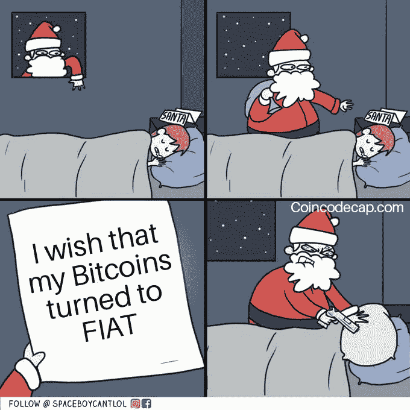

Follow us on [Instagram](https://www.instagram.com/coincodecap/)

## 美国政府的新基础设施法案可以迫使每个加密服务(甚至 DeFi)为他们的用户提供 KYC。

比特币再次突破 40K 美元，以太坊升级定于 8 月 5 日。大量风险投资资金流入加密公司。这是一个极好的迹象，表明聪明的投资者仍然看好加密技术及其未来。

与此同时，新的基础设施法案中增加了一项新条款，扩大了税法对“经纪人”的定义，以捕捉加密中的几乎所有人，包括矿工等非托管行为者，迫使他们都成为 KYC 用户。不要让这种事情发生。 [***采取行动***](https://twitter.com/jchervinsky/status/1421150344051048451) 。

如果你想获得每日加密更新，你可以在世界协调时下午 4:30[**加入我们的电报**](https://t.me/coincodecap1) 。

现在，让我们看看上周在 Crypto 发生了什么。

## 1.美国银行全球研究团队发表了一篇文章，概述了在萨尔瓦多使比特币成为法定货币的优势

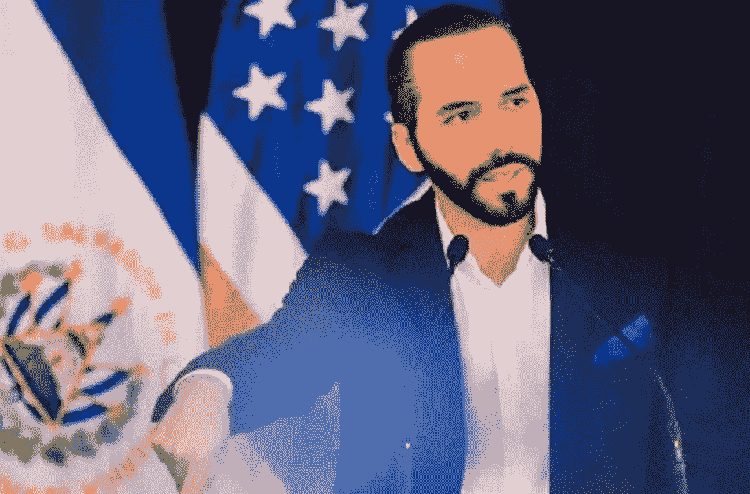

Nayib Bukele, President of El Salvador; Source : [Click here](https://elsalvadorinfo.net/)

6 月 5 日，在比特币 2021 会议期间，总统纳伊布·布克勒发表了一份预先录制的公告:萨尔瓦多将成为世界上第一个接受比特币作为法定现金的国家。

6 月 8 日，在该声明发布后仅仅三天，立法议会就批准了比特币法案，这表明萨尔瓦多将在大约三个月后实施这一提案。

今天凌晨，美国银行全球研究团队发布了一篇文章，概述了在萨尔瓦多使比特币成为法定货币的优势。

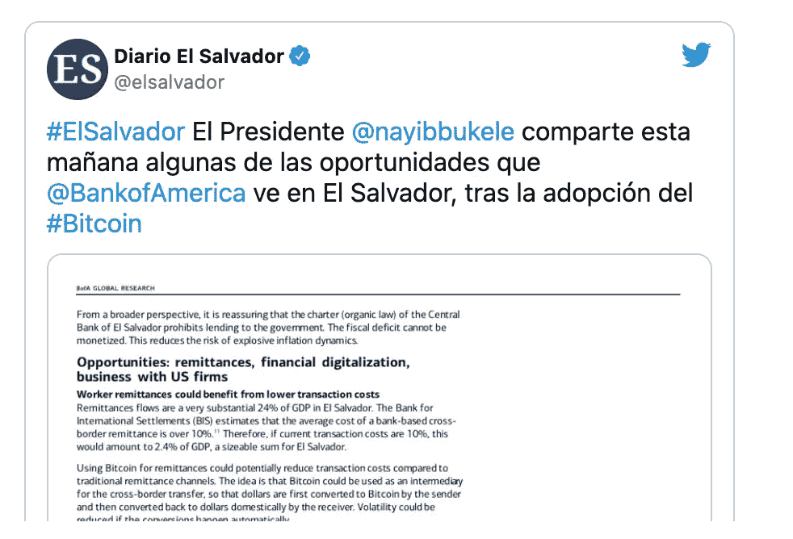

Source: [Click here](https://twitter.com/elsalvador/status/1421860784217509889?ref_src=twsrc%5Etfw%7Ctwcamp%5Etweetembed%7Ctwterm%5E1421860784217509889%7Ctwgr%5E%7Ctwcon%5Es1_&ref_url=https%3A%2F%2Fcointelegraph.com%2Fnews%2Fbank-of-america-outlines-4-potential-benefits-of-el-salvador-s-bitcoin-strategy)

## 2.比特币价格超过 41000 美元，经历了 8 年来最长的连续上涨

在经历了八年来最长的 10 天连胜之后，这种最大的加密货币的价格徘徊在 41，000 美元以上，是自 5 月以来的最高水平。(在我写这篇文章的时候，价格已经跌到了 40，000 美元。)

来源:交易观点

4 月中旬，随着市场热情达到顶峰，以及美国交易所比特币基地通过直接股票上市上市，比特币达到了近 64，400 美元的历史高点。然而，随着中国打击加密货币开采和交易所，以及世界各地的监管机构收紧行业限制，价格在接下来的几个月里下跌。

## 3.拜登将加强加密税的执行，以帮助资助美国 1 万亿美元的基础设施计划

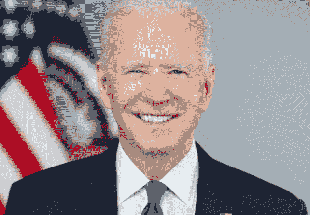

Image Source: White House

美国总统乔·拜登和国会就一项 1 万亿美元的两党基础设施一揽子计划的大纲达成协议，其中包括加强加密资产税收执法的措施。

*对加密货币交易征税以资助美国的基础设施计划*

*   白宫表示，乔·拜登总统和一个两党参议员小组已就美国基础设施“一代人一次的投资”的细节达成一致。
*   加强加密资产税收执法的措施在最后一刻被添加到基础设施法中，以便获得收入来支持发展计划。
*   根据白宫的说法，该提案/法案将由参议院审议，白宫补充说，“该计划总共涉及 5500 亿美元的新公共/联邦投资，用于美国的基础设施。”
*   未来八年，这 5500 亿美元将用于道路、桥梁、高速互联网、公共交通、电动汽车、机场和海港等领域。
*   由于这些规定，加密货币交易估计将增加 280 亿美元。

## 4.比特币已经被添加到 GoldenTree 的资产负债表中

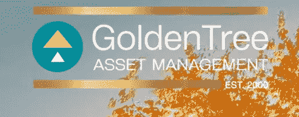

Image source: Golden Tree

据《华尔街日报》报道，总部位于纽约、管理着 450 亿美元资产的 GoldenTree 资产管理公司(GoldenTree Asset Management)一直在向其资产负债表中添加比特币，具体金额未披露。

通过投资/购买，这家专注于信贷的公司成为最新一家投资最大加密货币的华尔街机构。

由创始人兼首席投资官史蒂文·塔南鲍姆(Steven Tananbaum)领导的 GoldenTree 正在考虑采用加密货币投资专业知识，将其重点转移到市场上。

## 5.在过去的四天里，超过 43 亿美元的比特币被从交易所撤出！

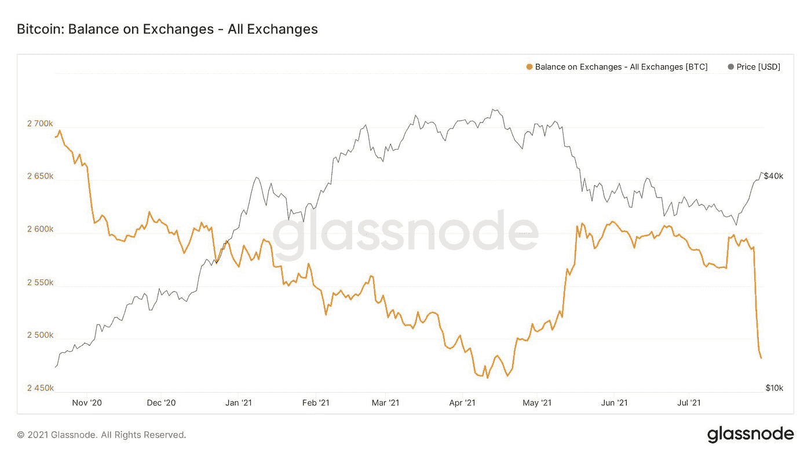

Source: Glass node

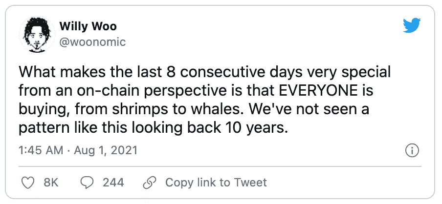

Source: [Click here](https://twitter.com/woonomic/status/1421565118047920128)

## 6.以太坊伦敦升级—2021 年 8 月 5 日

随着以太坊升级计划于 8 月 5 日凌晨进行，很多焦点都集中在 EIP-1559 上，这是一项关键的代码修改，将消耗交易费用，从流通中移除一些以太坊。

GST2 和 CHI 等气体令牌将被淘汰，开发人员在部署智能合约时利用这些令牌来获得较低的费率。

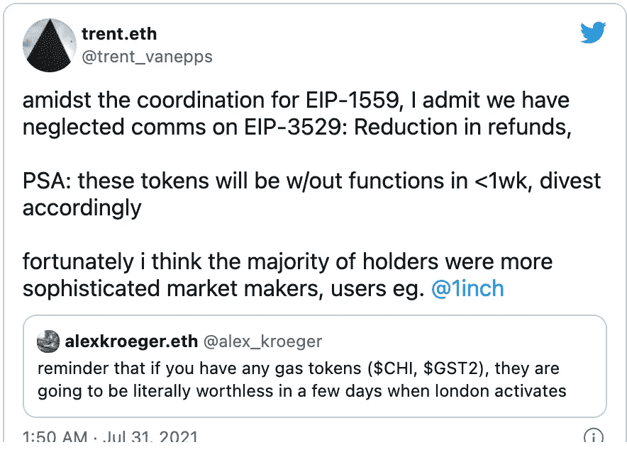

Source: [Click here](https://twitter.com/trent_vanepps/status/1421203979942367236?ref_src=twsrc%5Etfw%7Ctwcamp%5Etweetembed%7Ctwterm%5E1421203979942367236%7Ctwgr%5E%7Ctwcon%5Es1_&ref_url=https%3A%2F%2Fdecrypt.co%2F77345%2Fethereum-london-hard-fork-make-some-tokens-worthless)

## 7.密码朋克卖 2250 Eth

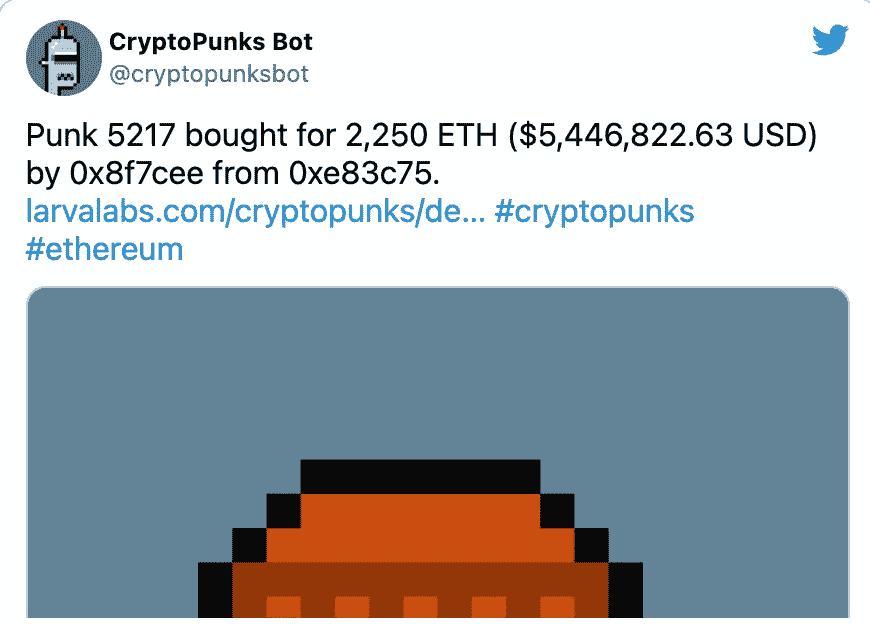

Source: [Crypto punks](https://twitter.com/cryptopunksbot/status/1421220531873931264?ref_src=twsrc%5Etfw%7Ctwcamp%5Etweetembed%7Ctwterm%5E1421220531873931264%7Ctwgr%5E%7Ctwcon%5Es1_&ref_url=https%3A%2F%2Fdecrypt.co%2F77328%2Fgary-vaynerchuk-cryptopunk-ethereum-nft)

Vaynerchuk 出价 1600 ETH 购买 2140 号密码朋克，这是迄今为止支付给密码朋克的第四高价格。仅仅几个小时后，第三高的支付额出现了 CryptoPunk # 5217 获得了 2250 ETH(540 万美元)的高价。

## 8.Wealthfront 增加了加密功能，增加了比特币、以太坊信托

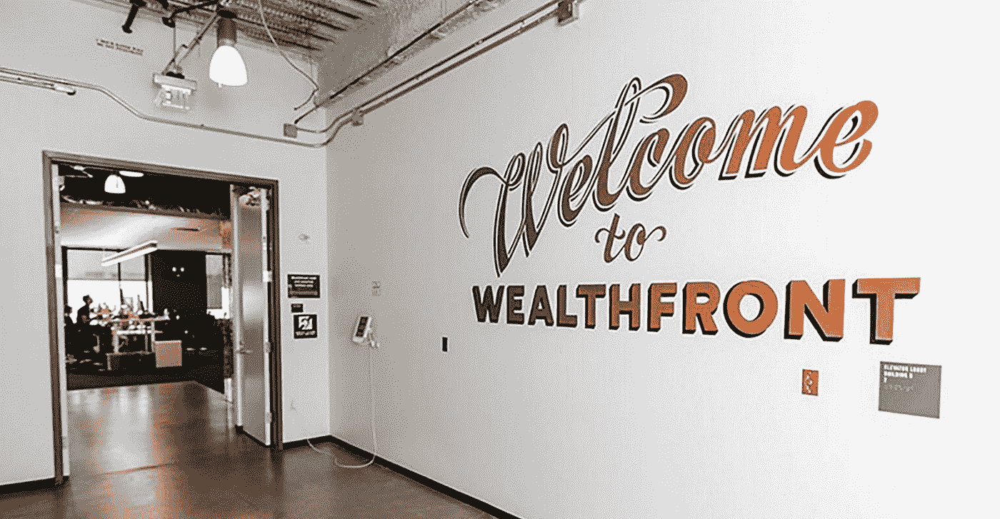

Source: Wealthfront

Wealthfront 对投资组合定制的重新兴趣导致该公司现在提供以 CoinDesk 指数为基准的比特币和以太坊信托。

根据 Wealthfront 的博客文章，新的投资选项旨在使“在你的 Wealthfront 投资组合中轻松获得比特币和以太坊，不需要钱包。”这些信托提供了“对加密货币的间接敞口”，购买单位的投资者将被限制只能将不超过 10%的投资组合分配给信托。

“我们将你的配置限制在(加密信托)范围内，因为作为受托人，我们总是从你的最佳利益出发，而这些资产可能比大多数 ETF 风险更大、波动更大。”

投资者也将无法使用 robo 的投资组合信用额度以他们的加密资产为抵押借款。风险平价基金同样不符合 PLOC 产品的资格，该产品面向拥有至少 2.5 万美元应税投资账户的客户。

**9。为了补偿汽油费用，1 英寸基金会打算赠送 1000 万代币**

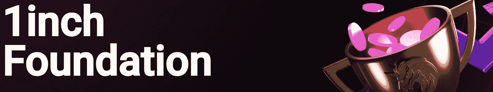

Image Source: [Click here](https://1inch.io/foundation/)

只有支付 100，000 1 英寸或以上的用户才能获得全额天然气价格退款。

从 9 月 1 日开始，去中心化交易聚合器 1inch 的非营利部门承诺向客户分发超过 2300 万美元。

1 英寸基金会将开始发行 1000 万枚原生 1 英寸代币，以补偿用代币支付汽油费用的客户。该基金会打算每月向在每月第一次交换和分发 1 英寸之间持有代币的人支付退款。

根据该基金会的说法，它将继续按照建议的参数向消费者退还汽油费，直到它分发了 1000 万个 1 英寸的代币。根据该倡议，此类计划的想法是由机构群体成员通过 1inch 网络的治理论坛提出的。

## 10.德国将允许机构基金持有高达 20%的加密货币资产

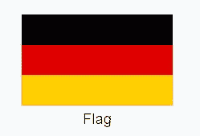

Source: Wiki

周一生效的[新法律](https://www.bundesfinanzministerium.de/Content/DE/Gesetzestexte/Gesetze_Gesetzesvorhaben/Abteilungen/Abteilung_VII/19_Legislaturperiode/2021-06-10-FoStoG/0-Gesetz.html)将允许有特定投资限制的所谓 Spezialfonds 将其高达 20%的资产投资于比特币和其他加密资产。

这些基金只对养老基金和保险公司等机构投资者开放，目前管理着超过 1.8 万亿欧元(合 2.1 万亿美元)的资金。

## 11.以太坊鲸鱼购买了所有加密朋克 NFT 的 1 %

Crypto Punks : Source SOTHEBY’S/CRYPTOPUNKS

周五晚上，一个钱包以 24 到 29 瑞士法郎的价格购买了大约 100 个。这要花费 600 多万美元。

密码朋克是不可替代的令牌(NFT)，这是一种基于区块链的附属物品的所有权，在这种情况下，一万个看起来像朋克的人物的像素化图像，每个都有自己的独特特征。朋克分为外星人、猿类、僵尸或人类，非人类是最常见的。

## 12.购买 NFT 股票的对冲基金

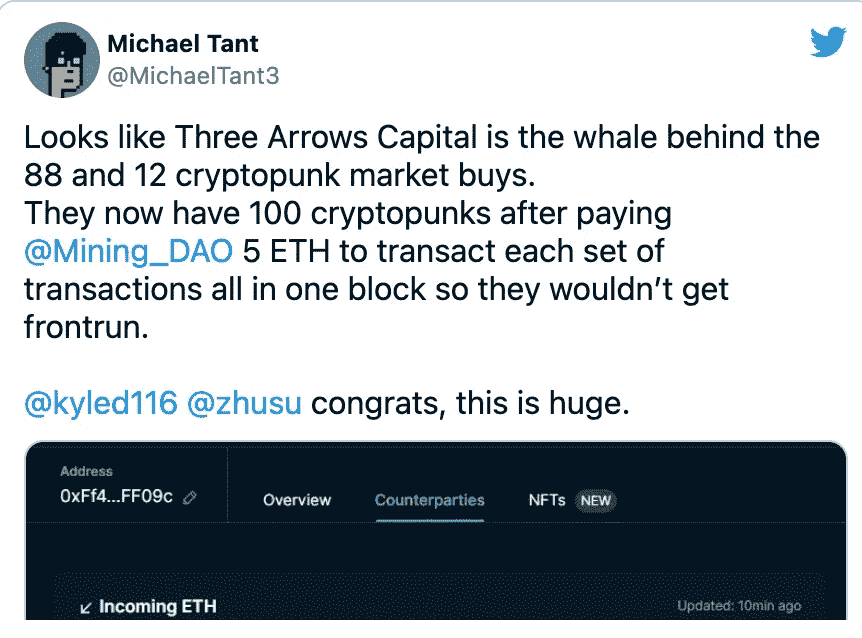

Source: [Click here](https://twitter.com/MichaelTant3/status/1421487429815611392)

## 13.币安关闭了德、意、荷用户的加密衍生品交易

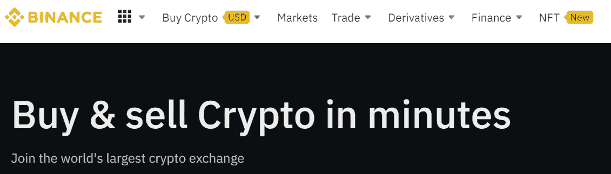

Binance

币安关闭了德、意、荷用户的加密衍生品交易。币安打算在不久的将来停止在欧盟提供加密期货交易。

这些国家的新用户将不再被允许在币安开设账户，进行加密衍生品交易。币安表示，它将在晚些时候为现有客户公布一个日期，这些国家的用户从该日期起将有 90 天的时间来平仓。

## 14.币安已经完成了多边形钱包的整合

[币安已经将](https://www.binance.com/en/support/announcement/4515e97c82d64189885da7cd7d606b86)Polygon(MATIC)mainnet 完全纳入其平台。币安交易员现在可以使用他们的币安账户存取 MATIC，同时还可以与 Sushiswap、Balancer、Aave 等分散式应用程序(DApps)进行交互。

这种连接旨在确保贸易商能够以经济高效的方式使用 DApps，而无需依赖现有的多边形桥。

根据业务，交易现在应该比使用标准的多边形以太坊桥更便宜。

虽然此次宣布的重点是 MATIC mainnet 硬币，但币安还计划提供与 MATIC 相关的 ERC20、BEP2 和 BEP20 代币。

## 15.比特币基地风险投资公司投资了一个基于以太坊的流媒体网络。

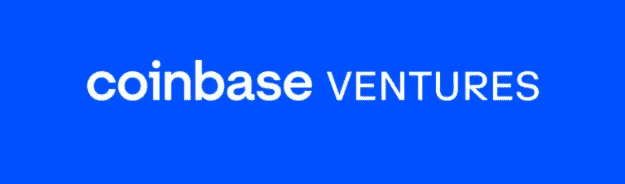

Source: Coinbase

总部位于以太坊的视频流媒体网络宣布了一轮 2000 万美元的 B 轮融资。

Livepeer 的筹资由数字货币集团牵头，包括大型风险投资家，如比特币基地风险投资公司、CoinFund、Northzone、第六人风险投资公司和动物风险投资公司。根据声明，Livepeer 最近的资金将用于开发一个内部协议，以测试广播用例，如场景分类，对象识别，歌曲标题检测和视频指纹。

## 16.Avalanche 推出新的桥梁，为 DApps 的广泛使用做准备

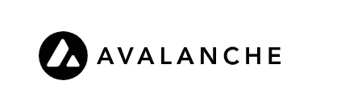

Image source: Avalanche

根据该公司的一份中帖称，雪崩公司(AVAX)正在用名副其实的雪崩桥(简称 AB)取代其已存在数月之久的雪崩-埃瑟伦桥(简称 AEB)。据说这座现代桥梁比前一座便宜五倍，将成为项目未来的“增长引擎”。

据说新桥比前一座桥便宜五倍、更快、更安全。据该公司称，它旨在作为未来扩张的“增长引擎”。

AB 现在可供开发者和用户使用，所有旧的 AEB 资产都应该结转。这一升级与网络钱包和浏览器的升级同步进行，以便为网络的所有元素提供“下一代的进步”。

艾娃实验室首席执行官 Emin Gün Sirer 表示:

> *“新的雪崩桥是桥接技术的一次飞跃，但最重要的是，它极大地改善了雪崩社区的用户和开发人员的体验。它将成为雪崩公司下一个发展阶段的增长引擎，并为安全高效的跨链互操作性树立了新的标准。”*

## 17.贝宝宣布计划通过“超级应用”扩大密码货币服务

Image Source: PayPal

在贝宝周三举行的第二季度盈利电话会议上，首席执行官丹·舒尔曼(Dan Schulman)讨论了该公司的加密雄心计划以及即将推出的“超级应用”的进展情况

“我很高兴地报告，我们新的消费者钱包超级应用程序的初始版本是代码完成，我们现在开始慢慢增加，”舒尔曼说:

> 新功能将包括高收益储蓄、提前获得直接存款、新的和改进的账单支付功能、支持家庭和朋友通信的 P2P 之外的消息传递功能，以及额外的加密功能和定制交易和报价。

“每个钱包都将由我们先进的人工智能和机器学习能力驱动，以增强每个客户的体验和机会，”他补充道。

丹·舒尔曼进一步补充道:

> 我们正处于一些开放银行整合的中间阶段，这将提高完全整合到 ACH 中并更快付款的能力。我们将满怀希望地推出，甚至可能下个月在英国，开放交易。我们现在正致力于向第三方钱包转账，我们非常希望确保为纳税和纳税申报创建一个非常无缝的流程。

## 18.从来没有熊市的迹象——威利·吴

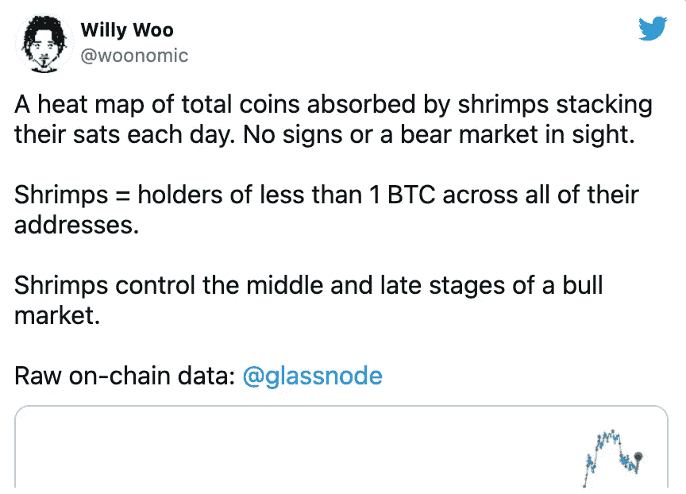

Source : [click here](https://twitter.com/woonomic/status/1420799415481036801/photo/1)

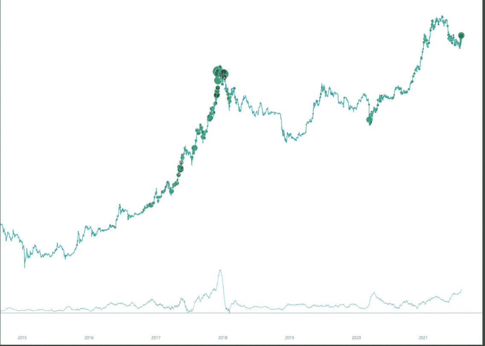

Image Source: Glassnode

仔细观察指示跑步的绿色圆点。绿点越亮越大，我们就越接近顶端。如果与上次牛市相比，这次牛市才刚刚开始。

## 19.美国银行、比特币基地和 FTX 都参与了 Paxos 的 D 系列融资回合

Image Source: Paxos

总部位于纽约的区块链基础设施公司 Paxos 专注于为其他传统公司提供清算和令牌化服务，已经获得了两家主要加密货币交易所和美国第二大银行的投资。美国银行、FTX 和比特币基地都作为“战略投资者”参与了该公司最近的 D 轮投资，该轮投资始于 4 月。

Paxos 首席执行官 Charles Cascarilla 表示:

> Paxos 采用创新技术构建受监管的基础设施，以促进开放、无障碍的数字经济。我们正在定义这一领域，除了这些市场领导者之外，我们也很高兴能够发展我们的企业解决方案。

## 20.根据一段泄露的视频，Uniswap 正在与 PayPal 和 Robinhood 进行谈判

在海登的要求下，这段视频被删除了，他的理由如下:

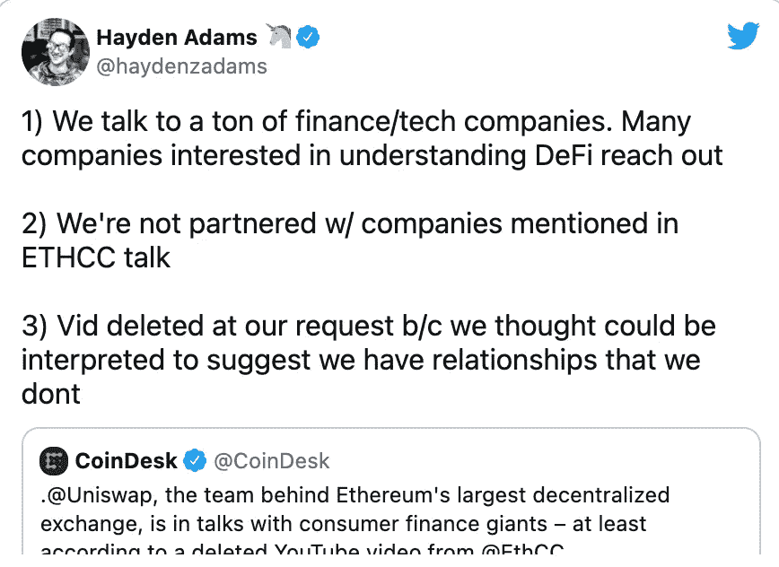

Source: [Click here](https://twitter.com/haydenzadams/status/1420482163791835141?ref_src=twsrc%5Etfw%7Ctwcamp%5Etweetembed%7Ctwterm%5E1420482163791835141%7Ctwgr%5E%7Ctwcon%5Es1_&ref_url=https%3A%2F%2Fthecryptobasic.com%2F2021%2F07%2F29%2Funiswap-news-according-to-a-leaked-video-uniswap-in-talks-with-paypal-and-robinhood-but-uniswap-inventor-has-other-view%2F)

## 21.一个 12 岁的男孩通过出售 8 位鲸鱼启发的 NFT 收藏赚了超过 16 万美元

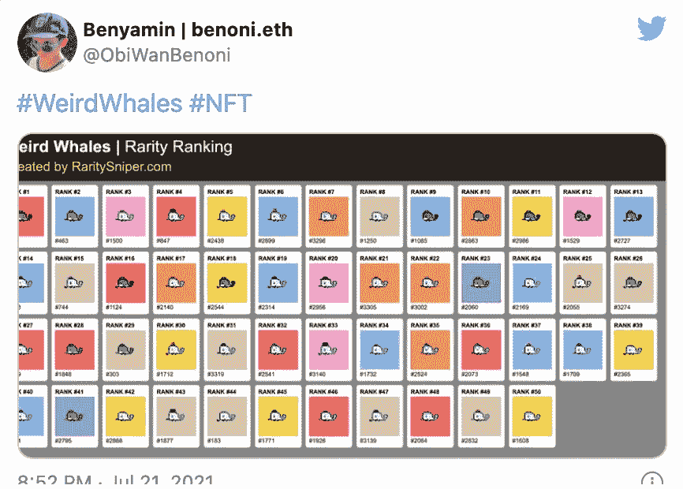

Wiered Whale : Source [Click here](https://twitter.com/ObiWanBenoni/status/1417867633131757570?ref_src=twsrc%5Etfw%7Ctwcamp%5Etweetembed%7Ctwterm%5E1417867633131757570%7Ctwgr%5E%7Ctwcon%5Es1_&ref_url=https%3A%2F%2Fd-27871329641670418230.ampproject.net%2F2107170150000%2Fframe.html)

来自伦敦郊区的 12 岁少年便雅悯·艾哈迈德通过出售 NFT 的收藏品赚了 16 万多美元。NFT 收藏基于一只蓝鲸的 8 位库存图像。

每张怪异的鲸鱼图片都有独特的特征，这使得它比收藏中的其他图片更加稀有和昂贵。收藏品中的第 120 张照片拍出了 6000 美元。

根据[解密](https://decrypt-co.cdn.ampproject.org/c/s/decrypt.co/76759/weird-whales-nfts-12-year-old-ethereum?amp=1)，那张图片也是总数为 3350 张的 NFT 中第六稀有的怪异鲸鱼。

***作者* : Eth！c@l 又名库马尔**

## 另外，阅读

*   [最佳加密贷款平台](https://blog.coincodecap.com/crypto-lending)
*   [最佳加密交易机器人](/coinmonks/crypto-trading-bot-c2ffce8acb2a)
*   [最佳密码电报信号](/coinmonks/best-crypto-signals-telegram-5785cdbc4b2b)
*   [最佳加密税务软件](/coinmonks/best-crypto-tax-tool-for-my-money-72d4b430816b)
*   [最佳硬件钱包](https://blog.coincodecap.com/best-hardware-wallet-bitcoin)