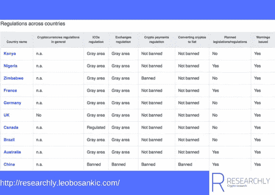
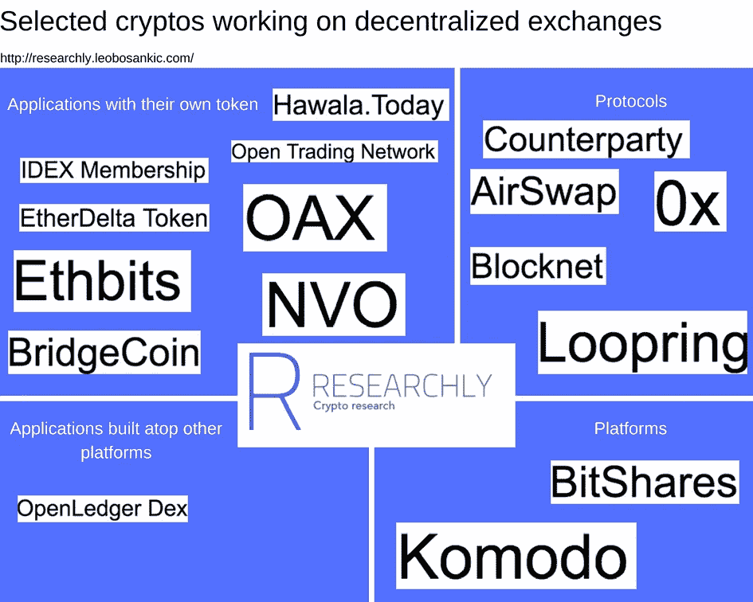

# 密码规则和分散交易

> 原文：<https://medium.com/coinmonks/crypto-regulations-and-decentralized-exchanges-e2a29e023a5e?source=collection_archive---------8----------------------->

正如我在“[对 Centra 的指控及其对自治的影响](http://researchly.leobosankic.com/2018/04/08/allegations-centra-implications-self-governance/)中提到的那样，法规仍然是/目前密码界的热门话题。 [Researchly 的《国家洞察》概述](http://researchly.leobosankic.com/insights-countries)显示，这些法规是所有主题和国家的热门话题:

1.  印度人对政府“禁止”加密感到不满
2.  “巴基斯坦中央银行禁止与一份通知进行加密交易”，Bitcoin.com 报道[4]
3.  此外，Bitcoin.com 报告了“丹斯克银行禁止投资加密货币相关工具”[6]
4.  在《 [Ripple 想要付费在双子星和比特币基地上市](http://researchly.leobosankic.com/2018/04/06/ripple-wanted-pay-get-listed-gemini-coinbase/)》一文中，我引用了美国证券交易委员会(SEC)3 月份的声明，该声明涉及的交易所——取决于它们提供的密码——必须在 SEC 注册，或者——如果适用的话——免于注册。
5.  此外，“韩国第五大加密货币交易所 Coinnest 的首席执行官 Kim Ik-hwan”几天前被拘留。[7]
6.  总部位于东京的 GateWay 和总部位于福冈的 Exchange 在被日本监管机构要求提高安全性后关闭。

摘自 Researchly 的《国家洞察》中的全球加密法规

## 完整概述可在 [Researchly](http://researchly.leobosankic.com/insights-countries) 上找到

除了 SEC 关于韩国交易所和拘留事件的声明，过去几个月还发生了几起黑客攻击事件(想想 Bitgrail)。基于这些攻击和关闭，许多人认为分散的交易所可以帮助解决这个领域的一些问题。尽管我确实相信去中心化的交易所有助于推动这个行业，但我不确定时间范围(他们是否会很快——今年——或在接下来的一到三年内——进入密码市场)。然而，特别是在这种不确定性的背景下，这种不确定性将包括大量的试验和错误，我非常兴奋地看到，有不同的项目以不同的方式处理分散的交换。

使用来自研究性的数据，我分析了在分散交易所工作的项目。显而易见的是，并没有那么多——只有大约 20 家(见下面一张精选分散交易所的地图)。

Overview of selected cryptos working on decentralized exchanges (From: [Researchly](http://researchly.leobosankic.com/))

可以进一步看到的是，这些项目以多种方式接近分散式交易所:

## 具有自己令牌的应用程序

这些密码正在构建最终产品，即直接分散的交易所，并且拥有自己的令牌。例子包括 IDEX 和以太三角洲

*   IDEX 会员简介[此处](http://researchly.leobosankic.com/cryptos/idex-membership/)
*   以太网令牌配置文件[此处](http://researchly.leobosankic.com/cryptos/etherdelta-token/)

## 构建在其他平台之上的应用程序

指的是同样致力于最终产品，DEX 本身，但是建立在其他平台之上的项目。一个例子是 OpenLedger Dex，它建立在 Bitshares 之上。

*   Bitshares 简介[此处](http://researchly.leobosankic.com/cryptos/bitshares/)

## 平台

这些平台被其他项目用作他们分散交换的主干。除了上面提到的 Bithshares，还有例如 Komodo。

*   科莫多外形[这里](http://researchly.leobosankic.com/cryptos/komodo/)

## 协议

指的是类似于平台的项目，可以被其他人用来建立分散的交易所。例如 0x 和 Loopring。

*   0x 配置文件[此处](http://researchly.leobosankic.com/cryptos/0x/)
*   此处为活套轮廓

就个人而言，我仍然不确定在何种程度上哪种方法是最好的，但我确信这种关于分散交换的不确定性是普通最终用户还没有准备好加密的另一个例子。

# 更多像这样的分析在[研究上](http://researchly.leobosankic.com/)

# 笔记

[1][https://bitcoinmagazine . com/articles/monero-just-hard-forked-and-it-resulted-four-new-projects/](https://bitcoinmagazine.com/articles/monero-just-hard-forked-and-it-resulted-four-new-projects/)

[2][https://www . Reddit . com/r/ether eum/comments/8 B1 NHK/vitalik _ buter in _ ethash _ ASICs _ not _ a _ threat _ to/](https://www.reddit.com/r/ethereum/comments/8b1nhk/vitalik_buterin_ethash_asics_not_a_threat_to/)

[3][https://news . bit coin . com/over-16000-印度人-签名-请愿-反对非理性-RBI-镇压/](https://news.bitcoin.com/over-16000-indians-sign-petition-against-irrational-rbi-crackdown/)

[4][https://news . bit coin . com/pakistans-central-bank-prohibited-crypto-dealing-with-a-circular/](https://news.bitcoin.com/pakistans-central-bank-prohibits-crypto-dealings-with-a-circular/)

[6][https://news . bit coin . com/danske-bank-bans-investments-cryptocurrency-related-instruments/](https://news.bitcoin.com/danske-bank-bans-investments-cryptocurrency-related-instruments/)

[7][https://www . Reuters . com/article/us-crypto-currency-south Korea-inhibitors/south-Korean-crypto-currency-executives-detached-over-accumulation-iduskcn 1 HC 07d](https://www.reuters.com/article/us-crypto-currencies-southkorea-arrests/south-korean-cryptocurrency-executives-detained-over-alleged-embezzlement-idUSKCN1HC07D)

[8][http://bitcoinist . com/two-more-Japanese-cryptocurrency-exchange-shut-down/](http://bitcoinist.com/two-more-japanese-cryptocurrency-exchanges-shut-down/)

*原载于 2018 年 4 月 11 日*[*researchly.leobosankic.com*](http://researchly.leobosankic.com/2018/04/11/crypto-regulations-and-decentralized-exchanges/)*。*