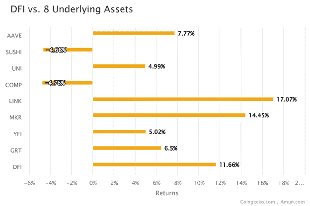

# 加密风险管理——投资组合多样化方法

> 原文：<https://medium.com/coinmonks/crypto-risk-management-portfolio-diversification-approach-7cd1441f0829?source=collection_archive---------6----------------------->

像其他任何形式的投资一样，投资加密货币也存在一定程度的风险。糟糕的风险管理实践可能会给投资者带来严重后果。

实际上，每个投资者都应该意识到两种类型的风险:系统风险和非系统风险。系统风险是不可控变量的结果，这些不可控变量不是特定资产的，并影响整个市场，导致所有资产的价格波动。另一方面，非系统风险也称为分散风险，是指一项资产特有的风险。这些风险来自已知的变量。

谈到投资风险，真的没有灵丹妙药。因此，对不同形式的风险的深刻理解对于帮助投资者更好地理解不同投资机会的机会、权衡和成本是必要的。在各种风险管理策略中，投资组合多样化是投资者和资产管理者最喜欢的策略之一。多元化投资组合基本上包含不同资产类型的组合，以试图限制对任何单一资产或风险的暴露。

## **投资组合多样化的基础知识**

投资组合多样化有许多复杂的迭代，但其核心是，多样化背后的逻辑是相同的。从本质上说，投资组合多样化是投资者确保不把所有鸡蛋放在一个篮子里的一种方式。其目的是消除非系统风险。多元化资产的投资组合仍然无法规避所有风险，也无法确保盈利或避免损失。投资组合仍将面临系统性风险，系统性风险是指整个市场面临的风险。

对于任何给定的投资组合策略，在投资的风险和预期回报之间总是存在某种权衡。简单地说，这意味着风险和回报特征会随着投资组合的构成而变化。

通常对于一个投资组合来说，所选择的一篮子资产都符合一定的标准。对于管理良好的投资组合，投资组合的组成部分会不断调整，以便投资组合只持有符合其设定标准的资产，同时确保以适当的权重持有资产。随着资产的涨跌，它们在投资组合中的权重也会发生变化。存在处理投资组合再平衡的策略，但这超出了本文的范围。

## **实践中的投资组合多元化**

对于新投资者来说，参与加密市场最安全的选择之一是分散投资。唯一选择的一篮子同等权重的令牌代表了一个这样的选项。这种策略是建立在指数投资的传统金融模式之上的。从历史上看，从长期来看，指数基金在风险调整的基础上表现优于个人投资工具。

这种策略的一个简单迭代是投资一篮子加密货币令牌，如 Amun 的 DeFi 指数令牌(DFI)。Amun 的 DFI 代币代表了对 DeFi 生态系统蓝筹代币的多样化投资。由以太坊生态圈市值排名前八的 DeFi 代币组成。

举例来说，下面的样本时间框架显示了 DFI 对其成分的表现。

如您所见，篮子中 2 项资产(寿司和公司)的负面表现被篮子中其他 6 项资产的正面表现所弥补。

更多关于阿蒙的 DFI 令牌可以在阿蒙的[网站](https://bit.ly/3yV3lFe)和 [gitbook](https://bit.ly/3BJxHw5) 中找到。

**最终想法** 风险与回报密不可分。普遍接受的观点是，风险的增加是以波动性增加的形式出现的。投资者应该接受多大的波动，完全取决于投资者对风险的承受能力。此外，知道何时退出投资非常重要。如果你投资的一篮子资产长期表现不佳，或者投资组合的基础结构发生了一些变化，与你的投资目标或风险偏好不符，那么你可能会考虑退出投资。

给你一个建议，在将你的资金投入任何投资之前，一定要做好自己的研究。此处表达的观点仅用于一般信息目的，并非旨在为任何特定投资产品提供建议或推荐。

> 加入 Coinmonks [电报频道](https://t.me/coincodecap)和 [Youtube 频道](https://www.youtube.com/c/coinmonks/videos)了解加密交易和投资

## 另外，阅读

*   [尤霍德勒 vs 科恩洛 vs 霍德诺特](/coinmonks/youhodler-vs-coinloan-vs-hodlnaut-b1050acde55a) | [Cryptohopper vs 哈斯博特](https://blog.coincodecap.com/cryptohopper-vs-haasbot)
*   [币安 vs 北海巨妖](https://blog.coincodecap.com/binance-vs-kraken) | [美元成本平均交易机器人](https://blog.coincodecap.com/pionex-dca-bot)
*   [新加坡十大最佳加密交易所](https://blog.coincodecap.com/crypto-exchange-in-singapore) | [购买 AXS](https://blog.coincodecap.com/buy-axs-token)
*   [投资印度的最佳密码](https://blog.coincodecap.com/best-crypto-to-invest-in-india-in-2021) | [HitBTC 评论](/coinmonks/hitbtc-review-c5143c5d53c2)
*   [加拿大最好的加密交易机器人](https://blog.coincodecap.com/5-best-crypto-trading-bots-in-canada) | [赌注加密](https://blog.coincodecap.com/staking-crypto)
*   [如何在印度购买比特币？](/coinmonks/buy-bitcoin-in-india-feb50ddfef94) | [WazirX 评论](/coinmonks/wazirx-review-5c811b074f5b)
*   [比特币主根](https://blog.coincodecap.com/bitcoin-taproot) | [Bitso 评论](https://blog.coincodecap.com/bitso-review) | [排名前 6 的比特币信用卡](/coinmonks/bitcoin-credit-card-bc8ab6f377c6)
*   [最佳免费加密信号](https://blog.coincodecap.com/free-crypto-signals) | [YoBit 评论](/coinmonks/yobit-review-175464162c62) | [Bitbns 评论](/coinmonks/bitbns-review-38256a07e161)
*   [huo bi 的加密交易信号](https://blog.coincodecap.com/huobi-crypto-trading-signals) | [BitMEX 评论](https://blog.coincodecap.com/bitmex-review)
*   [7 个最佳零费用加密交易平台](https://blog.coincodecap.com/zero-fee-crypto-exchanges)
*   [分散交易所](https://blog.coincodecap.com/what-are-decentralized-exchanges) | [比特 FIP](https://blog.coincodecap.com/bitbns-fip) | [Pionex 审查](https://blog.coincodecap.com/pionex-review-exchange-with-crypto-trading-bot)
*   [用信用卡购买密码的 10 个最佳地点](https://blog.coincodecap.com/buy-crypto-with-credit-card)
*   [OKEx 评论](/coinmonks/okex-review-6b369304110f) | [Kucoin 交易机器人](/coinmonks/kucoin-trading-bot-automate-your-trades-8cf0ca2138e0) | [期货交易机器人](/coinmonks/futures-trading-bots-5a282ccee3f5)
*   [AscendEx Staking](https://blog.coincodecap.com/ascendex-staking)|[Bot Ocean Review](https://blog.coincodecap.com/bot-ocean-review)|[最佳比特币钱包](https://blog.coincodecap.com/bitcoin-wallets-india)
*   [霍比审核](https://blog.coincodecap.com/huobi-review) | [OKEx 保证金交易](https://blog.coincodecap.com/okex-margin-trading) | [期货交易](https://blog.coincodecap.com/futures-trading)
*   [Godex.io 审核](/coinmonks/godex-io-review-7366086519fb) | [邀请审核](/coinmonks/invity-review-70f3030c0502) | [BitForex 审核](https://blog.coincodecap.com/bitforex-review)
*   [Crypto.com 费用](/coinmonks/binance-fees-8588ec17965) | [僵尸加密审查](/coinmonks/botcrypto-review-2021-build-your-own-trading-bot-coincodecap-6b8332d736c7) | [替代品](https://blog.coincodecap.com/crypto-com-alternatives)
*   [有哪些交易信号？](https://blog.coincodecap.com/trading-signal) | [Bitstamp vs 比特币基地](https://blog.coincodecap.com/bitstamp-coinbase) | [买索拉纳](https://blog.coincodecap.com/buy-solana)
*   [ProfitFarmers 回顾](https://blog.coincodecap.com/profitfarmers-review) | [如何使用 Cornix Trading Bot](https://blog.coincodecap.com/cornix-trading-bot)
*   [MXC 交易所评论](/coinmonks/mxc-exchange-review-3af0ec1cba8c) | [Pionex vs 币安](https://blog.coincodecap.com/pionex-vs-binance) | [Pionex 套利机器人](https://blog.coincodecap.com/pionex-arbitrage-bot)