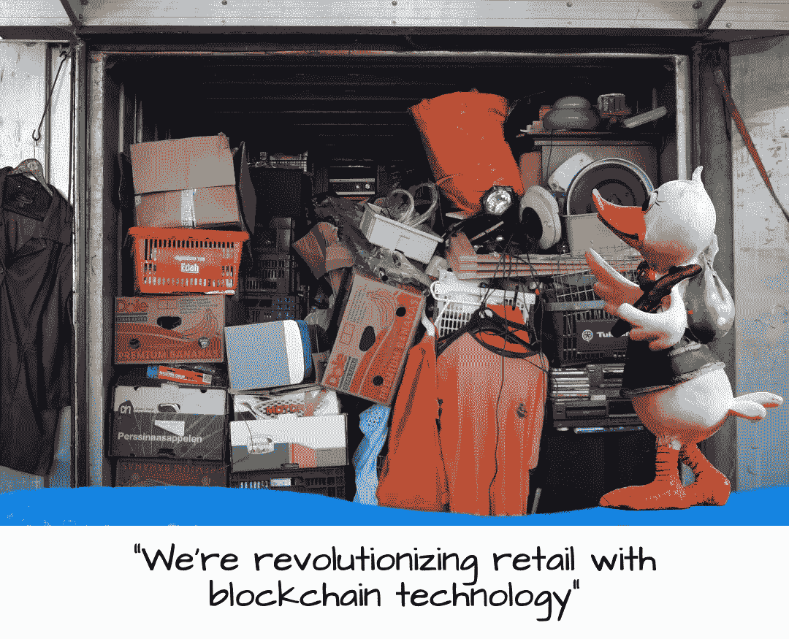

# 秘密风险管理:对风险投资，还是不对风险投资…

> 原文：<https://medium.com/coinmonks/crypto-risk-management-to-vc-or-not-to-vc-60dc3682a857?source=collection_archive---------12----------------------->

> 假设有 10%的机会获得 100 倍的回报，你每次都应该下注——杰夫·贝索斯

***理解风险***

我认为大多数从事加密工作的人都意识到了其中的风险。不幸的是，当我阅读一个特定项目的电报或不和谐反馈时，我经常看到合法的风险被忽视为“恐惧，不确定性和怀疑”(FUD)。FUD 可以干扰有效的决策。它的存在也是有原因的:保护我们免受伤害。

一个人如何应对风险？在最基本的层面上，我们需要定义什么是风险。在此基础上，我们可以大致规划出一个人如何在承受水平内最安全地应对风险。记住这一点，有两种类型的风险:

冒险；或者

处于危险之中

冒险是在寻找机会的同时将自己暴露于危险之中。处于危险中是暴露在外部危险中。投资加密(或任何真正的东西)涉及两者。这听起来很简单，但它变得更加复杂。第一个问题是，风险取决于观察者。

想象你第一次去外国。你决定穿过一片开满野花的美丽田野去散步。在你出发之前，一个当地人走过来说‘你可以走过去，但是要小心，这个地区布满了地雷。他们已经清除了大部分，但你永远不知道。

> 第一个问题是，风险取决于观察者

作为观察者，你的初始状态可能是高度确定的(尽管是错误的)。在你的内心深处，你可能会担心蛇，或者虫子，或者过敏，或者类似的事情。但是，总的来说，与在美丽的田野里散步的回报相比，这些风险似乎是可以忍受的。如果你走在自己家附近的田野上，你可能不会有第二个想法。但是，当当地人告诉你地雷的潜在危险时，你的状态就会变得高度不确定。

这就引出了第二个问题。观察者必须从不确定的状态开始*，然后才能意识到他们所面临的风险。当地人告诉你地雷会带来不确定性，从而改变你在野外散步时观察到的风险。为了减少不确定性，必须增加知识。*

在战场的情况下，你可能会看到是否有地图显示地雷被放置或清除的位置。你可以看看是否有人知道哪些地方可以安全行走，或者哪些地方是严格禁止的。你掌握的信息越多，你就越有把握。

现在，稍微改变一下场景。让我们说，在你去外国之前，一个可靠的人告诉你有一百万美元的黄金埋在田野的尽头*和*他们告诉你关于地雷。更糟糕的是，清除地雷的人没有记录。现在，减轻你所面临的危险的努力要高得多，*但是回报也高得多。*

一个大胆(或鲁莽)的人可能只是跑过田野，然后抱着最好的希望。一个谨慎的人可能会买一个金属探测器，或者试着炸开一条路。一个非常谨慎的人可能根本不会去。这就是坚果壳中的风险承受能力。

***我知道价格，但成本是多少？***

问题是，解决危险是有成本的。在上面的例子中，大胆的人几乎没有初始成本，但他们可能会付出可怕的代价。如果成功，他们还将获得最高的奖励。谨慎的人会有很高的初始成本，这降低了回报的价值(回报减去费用)。谨慎的人初始成本最低，零回报。只有你能说你你的包容是什么；每个人都不一样。我建议你建立一个客观合理的计划，保持在你的风险承受范围内，并坚持下去，除非或者直到你的承受能力改变。

投资——无论是股票、债券、黄金、密码，还是其他任何东西——只会带来一种总体风险:赔钱。就像上面的雷区一样，你如何解决这个危险有着非常不同的成本。如果你不投资，你就不能从投资中赚钱。鲁莽的投资会让你失去所有的钱。这里的目标是帮助你找到一种合理的方式，舒适地处于两者之间。

> 投资……只会带来一个总体风险:赔钱

***这些不是你爷爷的股票……***

投资加密资产类似于投资公开股票，但也有很大不同。我认为，如今投资加密资产更接近于风险投资(VC)。我喜欢说 crypto 就像大众的 VC。在大多数情况下，如果你今天在美国，除非你是一个[合格投资者](https://www.investor.gov/introduction-investing/general-resources/news-alerts/alerts-bulletins/investor-bulletins/updated-3)，否则你将无法参与早期种子或发展风险投资。但是，在加密领域，大多数项目相当于早期种子投资或发展投资。

因此，这种风险状况与投资公共股票截然不同。在一家公司被允许向公众出售股票之前，有一个重要的审查过程。审查旨在确保上市公司长期成功的几率很高。可以肯定的是，一些公开上市的公司确实会失败，但与创业公司相比，这一比例非常低。

另一方面，风险投资家必须亲自审查项目。作为合格投资者，他们被赋予了更多的监管空间，因为从本质上讲，他们可以承受亏损。但是，随之而来的是防止损失的责任。如果他们投资的公司管理或商业行为非常糟糕，他们无法向监管机构投诉。

> 风险投资家……必须自己审查项目

风险资本家做这件事的方式千差万别。有些人花大量时间研究一家公司，或者与公司所有者/董事会成员交谈。他们可能会翻翻账本，或者看看公司已经取得了哪些成功，或者看看他们与竞争对手有什么不同。不管他们使用什么方法，目标都是对一家公司是否会成功做出有根据的猜测。但是，这始终是一个*猜测*在一天结束的时候。

考虑一下亚马逊。想象一下，1994 年，杰夫·贝索斯提出了网上售书的想法。投资前你会问哪些问题？你会给他一天的时间吗？某个车库里有一堆书，并有一个利用互联网销售这些书的宏伟想法的人？到 1999 年，亚马逊拥有 300 亿美元的市值，仔细听听他在 T2 采访美国消费者新闻与商业频道时得到的反驳。听到什么像 FUD 的声音了吗？

听听贝佐斯的回答，他们说得很对。他直截了当地说，他不知道亚马逊是否会成功。一家拥有 300 亿美元市场份额的公司，一位首席执行官说他不知道这是否行得通？即使在那时，你会向这个疯狂的想法投入 1000 美元吗？在网络泡沫破灭后，你会持有这只股票吗？大多数人没有。那些成功的人变得富有了。

每次你在 DEX 上购买一项加密资产，就像是在 1994 年投资一个有潜力的亚马逊 T2。如果你在一个主要的 [CEX](https://coinmarketcap.com/alexandria/glossary/centralized-exchange-cex) 购买一项加密资产，这就像 1999 年在纳斯达克投资一个*潜力*亚马逊。在 1994 年，亚马逊是一项非常高风险的投资。这只是一个聪明、有进取心的人的想法。到 1999 年，风险较低，但与购买可口可乐或强生公司相比仍然很高。需要说明的是，目前还没有一家加密公司拥有与美国公开交易股票同等程度的确定性或稳定性。

***应该交易还是 hodl？***

这让我想到了另一点，风险投资通常不会交易。有些要等到公司起步，有些要等到公司上市，有些还要更久。这完全取决于风投的退出策略，但风投一般不会收购初创公司来换取其他初创公司。也就是说，加密领域的交易策略(通常改编自股票和外汇市场)并不基于合理的原则。一般来说，加密交易策略通常会严重低估交易窗口内发生的[尾部概率](https://www.sciencedirect.com/topics/mathematics/tail-probability)事件的规模、范围和可能性。

换句话说，这些交易可能会毫无征兆地适得其反。有人通过密码交易赚钱吗？是的，绝对的。是否在我的风险承受范围内？绝对不行。显然，你可以随心所欲地花钱。就我个人而言，我不推荐密码领域的任何交易策略。随着这个领域的成熟，低风险的交易策略可能会出现。我坚信我们还没有到那一步，但是，嘿，YMMV。

要知道，风投的[成功率大约在 7.5%](https://corporatefinanceinstitute.com/resources/knowledge/other/how-vcs-look-at-startups-and-founders/) 左右。我只能猜测，但我想加密投资者的成功率可能是相似的，这取决于人们如何定义“成功”。换句话说，要有一个稳定的、现实的*赚钱机会*，你需要投资 14 到 15 个*高质量项目*才能找到一个赢家。是的，你可能通过交易 YouTube 或 Reddit 上炒作的狗屎硬币赚钱，但这真的只是赌博。那对你来说可能没问题。我不能告诉你你的风险承受能力是多少。

> …风险投资的成功率约为 7.5%

***我可以给你一些我认为比较安全的建议***

你想从他们那里拿什么就拿什么，只要记住无论如何——如果你把钱投入到 crypto——这绝对是，100%，毫无疑问的高风险投资。如果你决定参与加密投资，你有很大的机会失去你投入的一切。相应投资。如果我今天开始，我会:

避开比特币，就像它是一个吃脑子的僵尸

在一个主要的 CEX 上，比如比特币基地，找到 6 到 8 个吸引我的加密项目，然后购买相等比例的项目，比如每个 100 美元(或者 1000 美元，或者其他)

找到六到八个在主要指标上吸引我的加密项目，比如 PancakeSwap 或 UniSwap，然后购买同等比例的项目(100 美元、1000 美元或其他)

保持和观察

如果一个项目的价值增加了 400-500 %,出售我 10-40%的股份

将利润转移到合法的稳定硬币(如 Paxos Gold)

等待一年将利润转换为现金(减少资本收益税)

实现收益

保持和观察

冲洗并重复

这不是一个有保证的策略。我相信这是一个比交易风险更低、回报更高的策略。当然，有些人会比其他人幸运。一些项目可能在纸面上看起来很棒，但永远不会交付。法规可能会关闭另一个项目。创始人可能会开始争吵，或者其中一个可能会和另一个的伴侣上床。高管们乘坐的飞机可能会坠毁。一场战争可能会爆发。

关键是，在早期和开发阶段，对于一个项目来说，可能出错的事情比可能正确的事情要多得多。这也是秘密风险投资的乐趣所在…你可以看到你对未来的愿景与市场的契合程度。聪明一点，记住基督山伯爵，“……人类所有的智慧都包含在这两个字里，‘等待和希望’。”“这样做，你可能会很幸运。

> 加入 Coinmonks [电报频道](https://t.me/coincodecap)和 [Youtube 频道](https://www.youtube.com/c/coinmonks/videos)了解加密交易和投资

## 也阅读

 [## 杠杆代币[多头代币]终极指南

### 杠杆化令牌是具有杠杆化风险敞口的 ERC20 令牌，不考虑保证金、要求、管理…

medium.com](/coinmonks/leveraged-token-3f5257808b22)  [## 最佳加密交易所| 2021 年十大加密货币交易所

### 编辑描述

blog.coincodecap.com](https://blog.coincodecap.com/crypto-exchange)  [## 2021 年最佳加密借贷平台| 6 大比特币借贷平台

### 获得比特币和其他加密货币的最佳贷款利率

medium.com](/coinmonks/top-5-crypto-lending-platforms-in-2020-that-you-need-to-know-a1b675cec3fa)  [## 2021 年最佳免费加密交易机器人

### 2021 年币安、比特币基地、库币和其他密码交易所的最佳密码交易机器人。四进制，位间隙…

medium.com](/coinmonks/crypto-trading-bot-c2ffce8acb2a)  [## 最佳 4 个加密交易信号电报通道

### 这是乏味的找到正确的加密交易信号提供商。因此，在本文中，我们将讨论最好的…

medium.com](/coinmonks/best-crypto-signals-telegram-5785cdbc4b2b)  [## 5 个最佳社交交易平台[2021] | CoinCodeCap

### 编辑描述

blog.coincodecap.com](https://blog.coincodecap.com/best-social-trading-platforms)  [## BlockFi 评论 2021:利弊和利率| CoinCodeCap

### 编辑描述

blog.coincodecap.com](https://blog.coincodecap.com/blockfi-review)  [## 如何在印度购买比特币？2021 年购买比特币的 7 款最佳应用[手机版]

### 如何使用移动应用程序购买比特币印度

medium.com](/coinmonks/buy-bitcoin-in-india-feb50ddfef94)  [## 加密税务软件——五大最佳比特币税务计算器[2021]

### 不管你是刚接触加密还是已经在这个领域呆了一段时间，你都需要交税。

medium.com](/coinmonks/best-crypto-tax-tool-for-my-money-72d4b430816b)  [## 存储比特币的最佳加密硬件钱包[2021] | CoinCodeCap

### 编辑描述

blog.coincodecap.com](https://blog.coincodecap.com/best-hardware-wallet-bitcoin)  [## Pionex 评论 2021 |免费加密交易机器人和交换

### Pionex 是为交易自动化提供工具的后起之秀。Pionex 上提供了 9 个加密交易机器人…

medium.com](/coinmonks/pionex-review-exchange-with-crypto-trading-bot-1e459d0191ea)