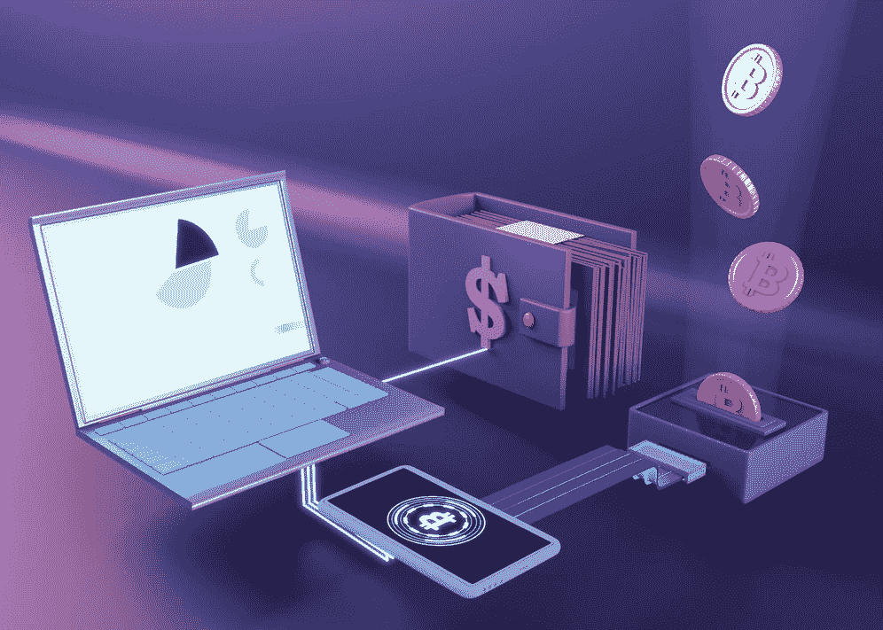
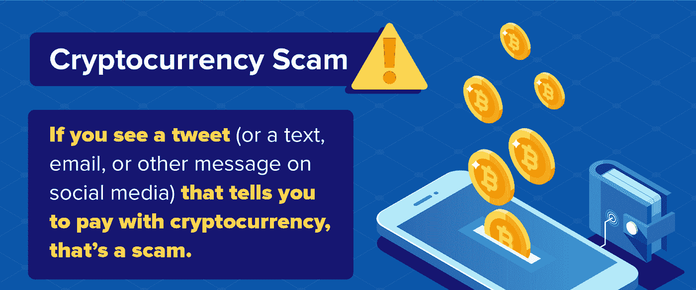
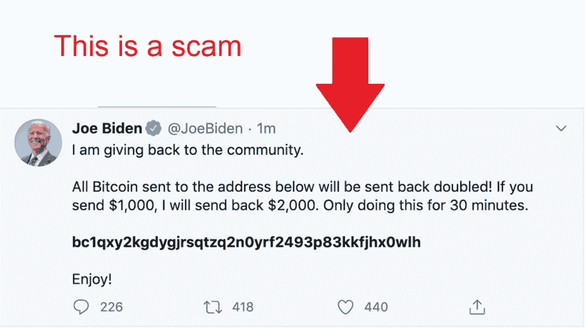

# 揭秘加密骗局:如何保证加密货币的安全

> 原文：<https://medium.com/coinmonks/crypto-scams-how-to-avoid-money-loss-in-crypto-31bcb93e8dac?source=collection_archive---------9----------------------->

# 仅在 2021 年，就有价值 120 亿美元的加密货币资产被发送到非法地址。这是你可以避免成为统计的一部分。

尽管加密货币世界年轻而充满希望，但它也存在裂缝。大量的加密骗局导致每年数十亿美元的加密货币资产损失。

随着密码市场的大规模增长和新项目的不断推出，与密码相关的诈骗也在增加。因此，投资者必须保护自己的资金免受欺诈性加密货币活动的影响。

[根据](https://www.cnbc.com/2021/11/19/over-10-billion-lost-to-defi-scams-and-thefts-in-2021.html)美国消费者新闻与商业频道的数据，仅在 2021 年，加密盗窃、黑客攻击和诈骗造成的损失就超过了 120 亿美元。欺诈和盗窃占了总数的大部分，达到 105 亿美元，比去年增长了 7 倍多。在 2022 年的 Q1，我们见证了最大的密码盗窃案，Axie Infinity 的浪人桥被[黑客](https://cointelegraph.com/news/axie-infinity-s-ronin-bridge-hacked-for-over-600m)攻击，损失超过 6 亿美元。

下面，我将分享识别最具欺骗性的加密货币骗局的技巧以及保护您的加密钱包安全的方法。

# 2022 年顶级加密骗局

不幸的是，加密骗局的清单很长。从电子邮件诈骗到雇佣密码诈骗，坏人有很多方法来窃取他们目标的身份和金钱。以下是投资者在 2022 年经历的一些最常见的情况。

# 诈骗邮件

诈骗邮件可能看起来像合法的加密公司，使收件人更难识别。

在投资前检查它们的有效性。如果你对这封邮件有疑问，你可以直接联系在那里工作的人。

诈骗邮件也可能诱使读者点击重定向到不同网站的链接。千万不要点击电子邮件上的链接，它会把你带到一个你不知道的网站。ICOs，即首次发行硬币，是骗子通过电子邮件引诱目标的另一种方式。花点时间仔细阅读整封邮件，避免陷入这类骗局。

类似的骗局被称为勒索电子邮件。在这种情况下，电子邮件可能声称某人拥有关于你的令人尴尬或有损隐私的图像、磁带或个人信息。然后，他们威胁或勒索你，如果你拒绝以加密货币的形式支付一定金额，就公开发布它。

不要顺从骗子。相反，向你国家的[美国联邦贸易委员会](https://www.investopedia.com/terms/f/ftc.asp)报告。

# 雇佣秘密骗局

像其他加密投资机会骗局，就业加密骗局往往提出一个不真实的工作机会，通过链接指向一个欺诈网站。然后，潜在的“雇主”通常会索要“培训费用和代理费”他们需要一定数量的加密资产，因为很难(或不可能)找回它们。

# 欺诈性推文和其他社交媒体帖子

在 crypto 中，恶意机器人随处可见，甚至冒充公众人物。不要接受来自 Twitter 或其他社交媒体平台的邀请，即使结果看起来很大。此外，这些数字的帖子上的评论也是机器人，试图让你相信这是一个合法的帐户。

# 假冒手机应用

另一种形式的加密骗局是假冒的应用程序或 dapps。这些恶意应用看起来像正版品牌，往往可以在 iOS 或 Android 设备上下载。

虽然你通常可以在不久后发现并删除该应用程序，但损害往往不会就此结束。据网络安全公司 Sophos 称，2021 年，数百万人被 167 款虚假应用欺骗。虽然 Android 用户面临更高的风险，但 iOS 设备也不能幸免。

# DeFi 地毯拉手

分散金融(DeFi)旨在消除金融交易的障碍，DeFi 已经成为加密生态系统中的一项重要创新。

然而，DeFi 协议的发展给了许多骗子一个机会，他们带走了投资者的资金——这种做法被称为拉地毯。该方法导致 2021 年加密货币资产损失超过 100 亿美元。

# 验证或更新钱包的骗局

涉及“钱包认证或续订”的骗局是 2022 年最常见的欺诈性骗局之一。这种方法通常发生在欺诈者提出扫描条形码，并承诺解决您可能遇到的问题或只是在受损网站上付款时。条形码扫描让骗子可以完全进入钱包。

# 一句话:下一步做什么

在决定首次投资
加密货币之前，以下是一些需要注意的事情。

*   自己做研究(DYOR)。在进行任何投资之前，尤其是在一个承诺“一夜暴富的投资机会”的项目中，首先要做好自己的研究。如果好得难以置信，那么这很有可能是个骗局。
*   **切勿向任何人透露您的加密钱包的私钥或种子短语。**为了提高安全性，建议将这些信息存储在脱机的地方。
*   在您使用的任何加密钱包或交换中启用双因素身份验证。这可能不是你的资金牢不可破的保险箱，[就像比特币基地黑客事件](https://krebsonsecurity.com/2021/10/how-coinbase-phishers-steal-one-time-passwords/)，但这是一个重要的安全步骤。
*   **反复检查网站网址。**网络钓鱼诈骗可能只是简单地交换一个字母或数字(例如将“I”替换为“1”，或者将“O”替换为数字“0”)，使 URL 看起来像真的一样。

随着加密货币世界的不断发展壮大，它也将受到恶意参与者的关注。

通过了解骗子试图窃取您的信息并最终窃取您的加密货币的常见方式，您将更有可能尽早识别加密骗局并保护您的加密钱包的安全。