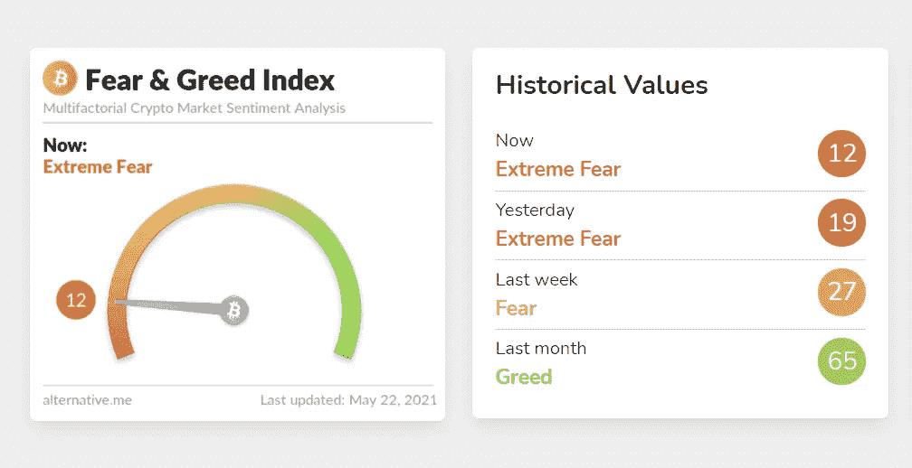

# 隐性压力。如何在市场波动时保持冷静，不失去你的收益

> 原文：<https://medium.com/coinmonks/crypto-stress-how-to-stay-calm-during-market-swings-and-not-lose-your-gains-d51fe721376c?source=collection_archive---------4----------------------->

## 保持冷静，HODL！

[Source](https://alternative.me/crypto/fear-and-greed-index/)

我们现在压力很大。我们在一个月内从贪婪走向极度恐惧。**最大的问题是不确定性:牛市是否已经结束？我们可以确定的是我们在垃圾场。**