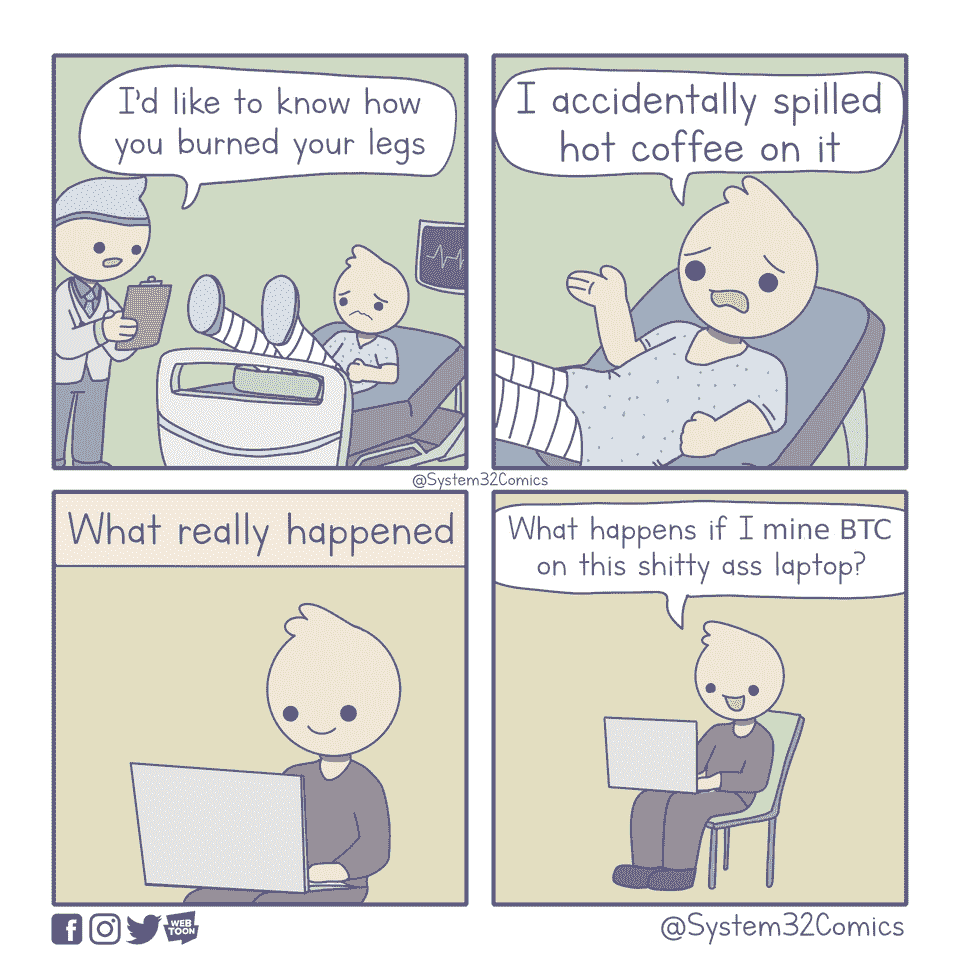
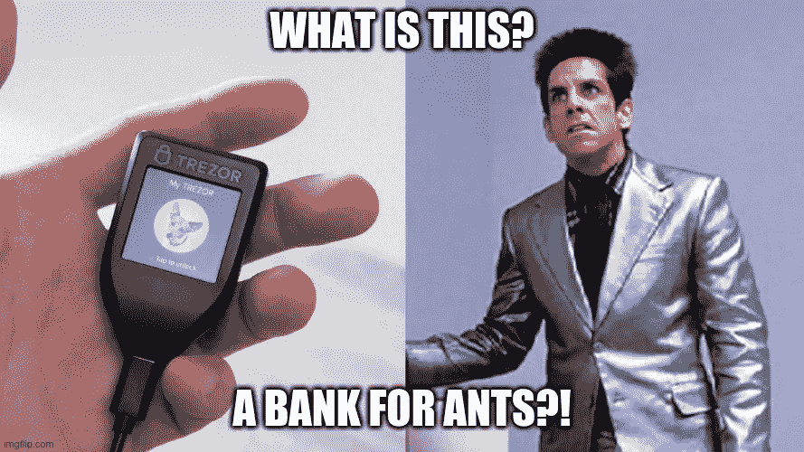
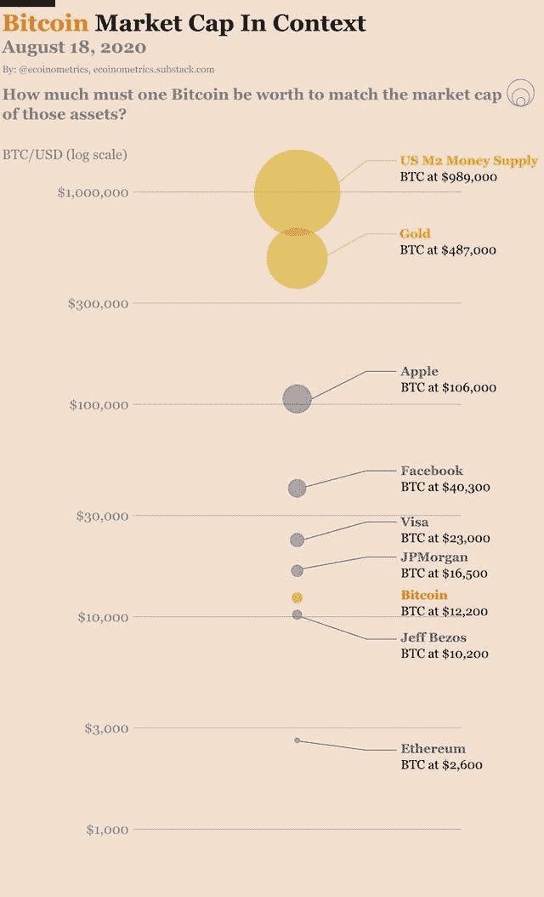

# 加密税务服务被黑/ DeFi 无担保借款/ Ripple 面临诉讼

> 原文：<https://medium.com/coinmonks/crypto-tax-service-hacked-defi-unsecured-borrowing-ripple-faces-lawsuit-7d8834d414ef?source=collection_archive---------2----------------------->

## 中国建立区块链平台来管理人们的数据

[Don’t try this at home](https://www.reddit.com/r/CryptoCurrency/comments/idwjst/dont_try_this_at_home/)

## 最新消息📰

*   [黑客从加密报税服务中窃取了](https://www.coindesk.com/hacker-cryptotrader-tax) 1，000 名交易员的个人数据
*   Aave 获得了[电子货币机构牌照](https://www.theblockcrypto.com/post/75845/aave-uk-fca-emi-license-defi)
*   鲍威尔将发表意义深远的[演讲，改变美联储对通胀的看法](https://www.cnbc.com/2020/08/24/powell-set-to-deliver-profoundly-consequential-speech-changing-how-the-fed-views-inflation.html)
*   先来看看[中国的数字人民币在行动](/coinmonks/first-look-at-chinas-digital-yuan-in-action-standard-chartered-bank-conducting-blockchain-64338c2b668c) /渣打银行进行区块链交易/美国专利署专利区块链投票系统
*   OMG 网络上的系绳 [Live](https://tether.to/tether-usdt-integration-live-on-omg-network/)
*   BitMEX 向[封杀安大略](https://www.coindesk.com/bitmex-crypto-derivatives-exchange-ontario-canada-regulator)交易员
*   系绳是将 10 亿枚 USDT 硬币从创转移到区块链以太坊
*   蒂姆·劳加登将在《EIP 1559》中工作
*   阿彻诉比特币基地:不是你的钥匙，也不是你的硬币
*   加拿大软件初创公司将 40%的现金储备投入比特币
*   中国[建立区块链平台](https://www.coindesk.com/huawei-builds-blockchain-platform-so-beijing-govt-can-better-manage-peoples-data)管理人们的数据
*   超过 100 万美元的 Ryuk 勒索软件比特币在币安被“套现”
*   [不需要抵押品](https://www.coindesk.com/aave-unsecured-borrowing-defi):aan 是如何将无担保借款变成 DeFi 的
*   [Ripple 在澳大利亚因“PayID”商标面临诉讼](https://decrypt.co/39713/ripple-faces-lawsuit-over-payid-trademark-in-australia)
*   英国监管机构[希望加密公司](https://decrypt.co/39676/uk-regulator-wants-crypto-firms-to-share-money-laundering-data)共享洗钱数据
*   曲线创始人[夺取曲线刀 71%](https://decrypt.co/39599/curve-founder-seizes-71-of-curve-dao-voting-power) 投票权
*   支持比特币的参议员候选人[赢得怀俄明州的初选](https://www.nasdaq.com/articles/pro-bitcoin-senate-candidate-wins-primary-race-in-wyoming-2020-08-19)

## 播客💽

*   Saifedean 的[比特币标准](https://saifedean.com/podcast/)播客
*   投资 [DeFi 范式](http://podcast.banklesshq.com/26-eth-has-to-be-money-charlie-noyes) |查理·诺伊斯

## 好的读物📑

*   [信任模型](https://vitalik.ca/general/2020/08/20/trust.html)
*   创业公司需要一个新的选择:[退出社区](https://ioo.coop/2019/09/startups-need-a-new-option-exit-to-community/)
*   [解绑 Uniswap](/dragonfly-research/unbundling-uniswap-the-future-of-on-chain-market-making-1c7d6948d570) :链上做市的未来
*   全球观察[央行数字货币](https://www.theblockcrypto.com/post/75022/a-global-look-at-central-bank-digital-currencies-full-research-report)
*   以太坊的费用意味着在世界计算机和金融网络之间做出选择
*   不要害怕[死神](/@nic__carter/dont-fear-the-reaper-8bbb42358efb)
*   加密货币有可能[可扩展吗](/coinmonks/can-cryptocurrency-ever-be-scalable-8dca44c3f9be)？
*   $CRV 发生了什么事？
*   用于代币价值流的[框架](https://bankless.substack.com/p/a-framework-for-token-value-flows)
*   [DeFi 费用爆炸](https://coinmetrics.io/the-defi-fee-explosion-how-yams-collapse-drove-ethereum-fees-to-new-heights/):YAM 的垮台如何将以太坊费用推向新的高度
*   山药:[比游戏多](/@elmoretrent/yam-more-than-a-game-potentially-49664b83254e)(潜在)
*   网络[飞轮](https://twitter.com/ali01/status/1296831069065375749)效应
*   审查[在人格方案证明中针对梅毒抗性的主观方法](https://docs.google.com/viewer?embedded=true&url=https%3A%2F%2Farxiv.org%2Fpdf%2F2008.05300.pdf)
*   金钱再现:[定义历史](https://www.coindesk.com/money-reimagined-defi-ing-history)
*   加密多头和空头:监管者在想什么？
*   为什么任是一个[中本聪](https://insights.deribit.com/market-research/why-yam-is-a-nakamoto-scheme/)

[A bank for ants](https://www.reddit.com/r/Bitcoin/comments/iekvkn/what_is_this_a_bank_for_ants/)

## 开发商

*   [帕托什](https://bitslog.com/2020/08/22/the-patoshi-mining-machine/)采掘机
*   连接[以太坊和附近的](https://near.org/blog/eth-near-rainbow-bridge/)区块链
*   认识一下 [Pickles SNARK](/codaprotocol/meet-pickles-snark-enabling-smart-contract-on-coda-protocol-7ede3b54c250) :在 Coda 协议上启用智能合约
*   元掩码[不再是自由软件](/metamask/evolving-our-license-for-the-next-wave-of-metamask-users-81b0b494c09a)
*   Wasabi 钱包发现两个[漏洞](/oxt-research/a-statement-on-two-discovered-vulnerabilities-in-wasabi-wallet-6e11e29a6ea8)
*   [编程](https://programmingblockchain.gitbook.io/programmingblockchain/)c#中的区块链
*   定罪资助[社区补助](https://aragon.org/blog/introducing-the-conviction-funding-pilot)试点
*   [用零知识密码术进行缩放定义](/coinmonks/scaling-defi-with-zero-knowledge-cryptography-35b6218380ec)
*   YieldSpace:为 yTokens 提供自动化流动性的供应商
*   以太坊[客户端多样性](/ethereum-cat-herders/the-state-of-client-diversity-in-ethereum-2ca915a3d768)的状态
*   [获取以太坊供应和数据的简单 API](https://blog.bitquery.io/get-ethereum-total-supply)
*   智能合同[不是数据库](https://hackernoon.com/smart-contracts-are-not-databases-t43532qc)
*   使用[鼹鼠](https://blog.trailofbits.com/2020/08/17/using-echidna-to-test-a-smart-contract-library/)测试智能合同库
*   [调试](https://notes.ethereum.org/@protolambda/rumor-tutorial) Eth2 客户端有谣言
*   梅达拉[熔化](https://hackmd.io/@benjaminion/eth2_news/https%3A%2F%2Fhackmd.io%2F%40benjaminion%2Fwnie2_200822)还原
*   EVM384 — [我们能在 EVM 做快速加密](https://notes.ethereum.org/@axic/evm384)吗？
*   状态访问操作码的气体成本[增加](https://notes.ethereum.org/@vbuterin/BkrNbeAfD)
*   [THEMIS](https://brave.com/themis-smart-contracts-and-sidechains/) :通过智能合同和侧链逐步去中心化
*   SharedForestStore:一种新的开源方式来“锁定”IPFS 上的内容
*   [xSNXa](/xtoken/xsnxa-false-start-post-mortem-f26a7a735383) 错误开始:事后检查

## 多方面的

*   [DeFi 安全](https://defisafety.com/)
*   Turbogeth [阿尔法](https://github.com/ledgerwatch/turbo-geth/releases/tag/v2020.08.03-alpha)发布
*   比特币客户端[病毒总量](https://bitcoinissafe.com/)跟踪器
*   [Eth2 工装](https://notes.ethereum.org/@protolambda/eth2_tooling)
*   P2P [衍生品](/crypto-garage/announcing-the-global-launch-of-p2p-derivatives-beta-application-7ecc02fa02a1)在比特币上的测试应用
*   假人[阿尔法](https://blog.golemproject.net/alpha-reveal-new-golem/)透露
*   [合成期货](https://blog.synthetix.io/synthetic-futures-primer/)引物
*   初始 DEX [产品](/@dxdao/how-to-conduct-your-ido-on-mesa-aef5bb4c48e9) (IDO)
*   [闪电终端](https://lightning.engineering/posts/2020-08-04-lightning-terminal/):你的闪电流动之家
*   1 英寸令牌和[流动性挖掘公告](/@1inch.exchange/1inch-token-and-liquidity-mining-announcement-5a75bad40ded)
*   [市值最高的资产](https://assetdash.com/)
*   发现新趋势 [Uniswap 池](https://tokenscan.xyz/)
*   [lnd 0.11-beta:让我们做好万博的准备吧！](https://lightning.engineering/posts/2020-08-20-lnd-v0.11/)

## 照片说明了一切📷

[Bitcoin market cap in context](https://www.reddit.com/r/CryptoCurrency/comments/id1jna/bitcoin_market_cap_in_context/)

## 在 Coinmonks 上发布

如果你喜欢在 crypto/区块链空间上写教育文章，并且想在 Coinmonks 出版物上发表。只需在***【gaurav@coincodecap.com】****或 DM 我**[***推特***](https://twitter.com/coinmonks)*

> **“如果你喜欢读***[*你也可以捐我们*](/coinmonks/monks-need-your-help-7440418d67ec) *。****

> ***[*在您的收件箱中直接获得最佳软件交易*](https://coincodecap.com/?utm_source=coinmonks)***

******