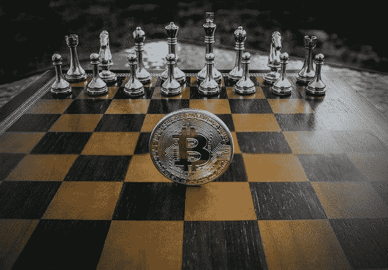
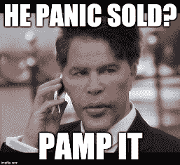

# 加密:赋予个人权力的金融未来

> 原文：<https://medium.com/coinmonks/crypto-the-finance-of-the-future-that-empowers-the-individual-368e752feee4?source=collection_archive---------12----------------------->

[Source](https://pixabay.com/photos/cryptocurrency-concept-chess-3412233/)

每天，我都与世界各地使用加密货币的人交谈。这些讨论让我相信这是一个关键时刻，可以将加密技术的采用推向新的领域。

在过去的两年里，我们见证了投资者的大幅增加。第一次进入隐密体的是数亿人。虽然这种采用主要是投机性的，但预计大多数将只是为了利润而进入。

流行的投资移动应用程序中的加密功能帮助价格爆炸，一些大肆宣传的硬币得到了最好的回报。

Robinhood 和 Square，甚至 PayPal、e-Toro 和 Revolut 都对加密货币投资产生了极大的兴趣。仅仅一年之内，就有一亿多人成为密码持有者。

## 到目前为止，牛市平淡无奇——期待更多行动

今年我们甚至有了 Doge millionaire，一个 Robinhood 投资者，他在短时间内将他的 10 万美元投资翻了 10 倍。虽然，我不知道他的确切计划是什么，因为他甚至在 10 倍后仍继续持有，没有获得任何利润，等待他的投资先达到 1000 万美元。

这需要付出很多努力，但希望总是存在的。既然迹象在那里，他还在盈利，也许持有和希望是最好的行动。

不过，坦白地说。到目前为止，这次奔牛节好玩吗？除了 Doge 家伙，我发现这个牛市是无聊的。2017 年年中加入，当时还有课。迷因处于 200 智商水平，笑话永无止境，每个人都在看着一场革命，认为这一切都是可能的。

没有成千上万的新迷因和加密歌曲，我拒绝称这是一场牛市。

## 很少有人敢讨论萨尔瓦多交易的问题

和往常一样，要进入严肃模式，每个故事都有两个方面。随着加密市场的持续增长，那些认为自己的利益受到威胁的人的反应将变得更加激烈。

尽管如此，在这次萨尔瓦多的惨败中，我一直是 BTC 社区的强烈批评者(它将会成为一个),这是有充分理由的。

密码是一个激进的金融系统。它从政府和银行卡特尔手中夺取权力，然后把权力交给人民。我们大多数人加入是为了财务方面，我们只是想赚些好钱。曾经有过极高回报的承诺，现在依然如此。有些人成功了，但大多数人没有。

过一段时间，我们必须找出更多关于我们投资的确切位置。

[Source](https://pixabay.com/illustrations/freedom-silhouette-woman-2053281/)

当我们把资金转移到一个非托管的钱包里，我们了解到私钥的时候，我们就完全理解了这个“加密的东西”是怎么回事。

我们所投资的是如此强大的东西，它有可能重塑金融机构，为竞争性的自由市场创造一个健康的金融环境，这一切都是通过赋予个人权力来实现的。

加密货币提供的金融自由是让我们留下来承受两年熊市和损失的原因。

我们是否买了泡沫的顶部并不重要。加密货币市场是疯狂的，但它们也是自由市场。重要的是将比特币、以太坊、BCH，甚至我们购买的 Dogecoins，从集中的平台转移到非托管的钱包中，确保你的财务自由。

可悲的是，萨尔瓦多已经强迫使用 BTC，而不是自愿允许它，还强迫在保管钱包像罢工和奇沃。BTC 将仅在萨尔瓦多的这些集中、托管和政府监管的金融服务中使用。

我读到了关于萨尔瓦多闪电裁决的欢呼和喜悦的评论，而应该是怀疑。

如果我们通过一个中央钱包使用 BTC，政府可以很容易关闭，并没收我们的资金，这不会改变什么。这与使用老一套的银行融资没有任何区别。

加密货币提供的金融自由在萨尔瓦多已经被抹去。

# 最后

大多数新人通过甚至不允许提现的平台投资 crypto。如果我错了，请纠正我，但我认为 Robinhood、CashApp、Revolut、PayPal 和大多数类似的投资平台都没有提供加密取款的权限。KYC 现在也是强制性的，虽然有一些 P2P 交易所，但它们也面临着政府的问题。

虽然 KYC 不是这里的主要问题。我重视隐私，但在使用加密货币时匿名已经很难了(除了 Monero 和 ZCash)。真正的问题是，从这些平台购买的新用户不会成为加密革命的一部分。

这些投资者注定要呆在法定账户中，经常投机，但永远不会真正意识到加密所代表的真正自由。

Crypto 很有可能重塑金融体系。它不需要被强迫，甚至允许(监管)，我们只需要理解加密提供的财务自由的方面，然后就会利大于弊。

## 记得订阅和喜欢！

# *最初由 Hive via Leo 发布。金融*

**在以下网络上书写:**

*●*[***read cash***](https://read.cash/@Pantera)*●*[***noise cash***](https://noise.cash/u/Pantera99)*●*[***Medium***](/@panterabch)*●*[***Hive***](https://hive.blog/@pantera1)*●*[***steem it*** *●*](https://steemit.com/@pantera1)[***Twitter***](https://twitter.com/Panterabch)*●*[***LinkedIn***](https://www.linkedin.com/in/panterabch/)**●*[***Reddit***](https://www.reddit.com/user/PanteraBCH)*

****原载于 2021 年 9 月 8 日*[*https://Leo finance . io*](https://leofinance.io/@pantera1/crypto-empowering-the-individual)*。****

> ***加入 [Coinmonks 电报频道](https://t.me/coincodecap)，了解加密交易和投资***

## ***另外，阅读***

*   ***[CoinFLEX 评论](https://blog.coincodecap.com/coinflex-review) | [AEX 交易所评论](https://blog.coincodecap.com/aex-exchange-review) | [UPbit 评论](https://blog.coincodecap.com/upbit-review)***
*   ***[AscendEx 保证金交易](https://blog.coincodecap.com/ascendex-margin-trading) | [Bitfinex 赌注](https://blog.coincodecap.com/bitfinex-staking) | [bitFlyer 评论](https://blog.coincodecap.com/bitflyer-review)***
*   ***[AscendEx Staking](https://blog.coincodecap.com/ascendex-staking)|[Bot Ocean Review](https://blog.coincodecap.com/bot-ocean-review)|[最佳比特币钱包](https://blog.coincodecap.com/bitcoin-wallets-india)***
*   ***[Bitget 回顾](https://blog.coincodecap.com/bitget-review) | [双子星 vs BlockFi](https://blog.coincodecap.com/gemini-vs-blockfi) | [OKEx 期货交易](https://blog.coincodecap.com/okex-futures-trading)***
*   ***[霍比评论](https://blog.coincodecap.com/huobi-review) | [OKEx 保证金交易](https://blog.coincodecap.com/okex-margin-trading) | [期货交易](https://blog.coincodecap.com/futures-trading)***
*   ***[麻雀交换评论](https://blog.coincodecap.com/sparrow-exchange-review) | [纳什交换评论](https://blog.coincodecap.com/nash-exchange-review)***
*   ***最好的[加密税务软件](/coinmonks/best-crypto-tax-tool-for-my-money-72d4b430816b) | [硬币追踪评论](/coinmonks/cointracking-review-a-reliable-cryptocurrency-tax-software-5114e3eb5737)***
*   ***[Stackedinvest 评论](https://blog.coincodecap.com/stackedinvest-review) | [北海巨妖评论](/coinmonks/kraken-review-6165fc1056ac) | [期货交易机器人](/coinmonks/futures-trading-bots-5a282ccee3f5)***
*   ***最佳[加密借贷平台](/coinmonks/top-5-crypto-lending-platforms-in-2020-that-you-need-to-know-a1b675cec3fa) | [杠杆令牌](/coinmonks/leveraged-token-3f5257808b22) | [Stormgain 评论](https://blog.coincodecap.com/stormgain-review)***
*   ***最佳[加密制图工具](/coinmonks/what-are-the-best-charting-platforms-for-cryptocurrency-trading-85aade584d80) | [最佳加密交易所](/coinmonks/crypto-exchange-dd2f9d6f3769) | [概率单位评论](https://blog.coincodecap.com/probit-review)***
*   ***[比特币基地僵尸工具](/coinmonks/coinbase-bots-ac6359e897f3) | [AscendEX 审查](/coinmonks/ascendex-review-53e829cf75fa) | [OKEx 交易僵尸工具](/coinmonks/okex-trading-bots-234920f61e60)***
*   ***[如何在印度购买比特币？](/coinmonks/buy-bitcoin-in-india-feb50ddfef94) | [瓦济克斯评论](/coinmonks/wazirx-review-5c811b074f5b) | [俱吠罗评论](/coinmonks/coinswitch-kuber-review-1a8dc5c7a739)***
*   ***[CryptoHopper 替代品](/coinmonks/cryptohopper-alternatives-d67287b16d27) | [HitBTC 评论](/coinmonks/hitbtc-review-c5143c5d53c2) | [Kucoin 交易机器人](/coinmonks/kucoin-trading-bot-automate-your-trades-8cf0ca2138e0)***
*   ***[WazirX vs coin dcx vs bit bns](/coinmonks/wazirx-vs-coindcx-vs-bitbns-149f4f19a2f1)|[block fi vs coin loan vs Nexo](/coinmonks/blockfi-vs-coinloan-vs-nexo-cb624635230d)***
*   ***[本地比特币审核](/coinmonks/localbitcoins-review-6cc001c6ed56) | [加密货币储蓄账户](https://blog.coincodecap.com/cryptocurrency-savings-accounts)***
*   ***[比特币基地评论](/coinmonks/coinbase-review-6ef4e0f56064) | [德里比特评论](/coinmonks/deribit-review-options-fees-apis-and-testnet-2ca16c4bbdb2) | [FTX 评论](/coinmonks/ftx-crypto-exchange-review-53664ac1198f) | [StealthEX 评论](/coinmonks/stealthex-review-396c67309988)***
*   ***[n rave 零点回顾](/coinmonks/ngrave-zero-review-c465cf8307fc) | [Phemex 回顾](/coinmonks/phemex-review-4cfba0b49e28) | [PrimeXBT 回顾](/coinmonks/primexbt-review-88e0815be858)***
*   ***最佳[区块链分析](https://bitquery.io/blog/best-blockchain-analysis-tools-and-software)工具| [赚比特币](/coinmonks/earn-bitcoin-6e8bd3c592d9) | [Swapzone 评论](/coinmonks/swapzone-review-crypto-exchange-data-aggregator-e0ad78e55ed7)***
*   ***[加密套利](/coinmonks/crypto-arbitrage-guide-how-to-make-money-as-a-beginner-62bfe5c868f6)指南| [如何做空比特币](/coinmonks/how-to-short-bitcoin-568a2d0b4ae5) | [Bybit vs 币安](https://blog.coincodecap.com/bybit-binance-moonxbt)***
*   ***[币安交易机器人](/coinmonks/binance-trading-bots-d0d57bb62c4c) | [OKEx 评论](/coinmonks/okex-review-6b369304110f) | [阿塔尼评论](https://blog.coincodecap.com/atani-review)***
*   ***[最佳加密交易信号电报](/coinmonks/best-crypto-signals-telegram-5785cdbc4b2b) | [MoonXBT 评论](/coinmonks/moonxbt-review-6e4ab26d037)***
*   ***[Godex.io 审核](/coinmonks/godex-io-review-7366086519fb) | [邀请审核](/coinmonks/invity-review-70f3030c0502) | [BitForex 审核](https://blog.coincodecap.com/bitforex-review)***
*   ***[火币交易机器人](https://blog.coincodecap.com/huobi-trading-bot) | [如何购买 ADA](https://blog.coincodecap.com/buy-ada-cardano) | [Geco？一次审查](https://blog.coincodecap.com/geco-one-review)***
*   ***[币安 vs Bitstamp](https://blog.coincodecap.com/binance-vs-bitstamp)|[bit panda vs 比特币基地 vs Coinsbit](https://blog.coincodecap.com/bitpanda-coinbase-coinsbit)***
*   ***[如何购买 Ripple (XRP)](https://blog.coincodecap.com/buy-ripple-india) | [非洲最好的加密交易所](https://blog.coincodecap.com/crypto-exchange-africa)***
*   ***[非洲最佳加密交易所](https://blog.coincodecap.com/crypto-exchange-africa) | [胡交易所评论](https://blog.coincodecap.com/hoo-exchange-review)***
*   ***[eToro vs 罗宾汉](https://blog.coincodecap.com/etoro-robinhood)|[MoonXBT vs Bybit vs Bityard](https://blog.coincodecap.com/bybit-bityard-moonxbt)***
*   ***[有哪些交易信号？](https://blog.coincodecap.com/trading-signal) | [比特斯坦普 vs 比特币基地](https://blog.coincodecap.com/bitstamp-coinbase)***
*   ***[ProfitFarmers 回顾](https://blog.coincodecap.com/profitfarmers-review) | [如何使用 Cornix Trading Bot](https://blog.coincodecap.com/cornix-trading-bot)***
*   ***[如何在势不可挡的域名上购买域名？](https://blog.coincodecap.com/buy-domain-on-unstoppable-domains)***
*   ***[印度的秘密税](https://blog.coincodecap.com/crypto-tax-india) | [altFINS 审查](https://blog.coincodecap.com/altfins-review) | [Prokey 审查](/coinmonks/prokey-review-26611173c13c)***
*   ***[Blockfi vs 比特币基地](https://blog.coincodecap.com/blockfi-vs-coinbase) | [BitKan 评论](https://blog.coincodecap.com/bitkan-review) | [Bexplus 评论](https://blog.coincodecap.com/bexplus-review)***