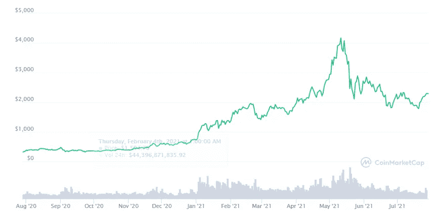

# 密码交易商:以太坊 2021 年涨到 10000 美元

> 原文：<https://medium.com/coinmonks/crypto-trader-ethereum-will-rise-to-10-000-in-2021-78b2de977a90?source=collection_archive---------7----------------------->

以太坊在今年年初表现良好，达到了近 4300 美元的历史最高水平，但最近几个月，就市值而言，第二大加密货币遭受了重大打击。价格减半，几天前发现自己在 1800 美元左右。与此同时，瑞士联邦理工学院(ETH)已设法再次突破 2300 美元大关。

ETH performance — [coinmarketcap.com](https://coinmarketcap.com/en/currencies/ethereum/)