# 2021 年加密交易回顾:17 项高级+ 15 项神经网络策略测试(第 7 部分)

> 原文：<https://medium.com/coinmonks/crypto-trading-2018-in-review-17-advanced-15-neural-net-strategies-tested-part-7-d308963d13e9?source=collection_archive---------0----------------------->

*查看我最新的 app—*[***trading ym***](https://tradinggym.app)*。这是一个交易模拟器，帮助你用更快的反馈/学习循环和最小的前瞻偏差来练习交易。打开应用程序后，您将看到一个图表，其中包含随机时间点的随机资产。进行交易和快进时间，看看结果如何。*

*这是多部分系列的第 7 部分:*

*   [***第一部分***](/@deandree/can-you-profit-in-crypto-markets-with-basic-strategies-773a7262346a) *:基本策略，入门，设置，测试 vs 6-7 月行情。*
*   [***第二部分***](/@deandree/can-you-profit-in-crypto-markets-with-not-so-basic-strategies-part2-6cbc97a5f960) *:高级策略以及在哪里找到它们，测试 vs 6-7 月市场。*
*   [***第三部分***](/@deandree/can-you-profit-in-crypto-markets-august-update-part-3-de43970a5128) *:基础和高级策略测试 vs 八月行情。*
*   [***第四部分***](/@deandree/can-neural-networks-beat-the-crypto-market-of-september-part-4-66547b5fe415) *:神经网络策略描述及针对 9 月行情的回测。*
*   [***第五部分***](/@deandree/can-neural-networks-beat-the-crypto-market-of-october-part-5-89714e61a925) *:针对 10 月行情的神经网络策略回测。*
*   [***第六部分***](/@deandree/did-neural-network-strategies-predict-november-14th-price-drop-cebfc168c34) *:神经网络策略预测 11 月 14 日价格下跌了吗？*
*   [***第七部分***](/@deandree/crypto-trading-2018-in-review-17-advanced-15-neural-net-strategies-tested-part-7-d308963d13e9) *:密码交易 2018 年回顾:17 项高级+ 15 项神经网络策略测试*
*   [***第八部分***](/@deandree/is-pairs-trading-profitable-in-crypto-part8-fba698abcd6f) *:* *密码对交易中的统计套利简介*
*   ***【新】*** [***第九部分***](/@deandree/crypto-trading-2019-half-year-review-17-advanced-15-neural-net-strategies-tested-part-9-1b737b93490f)*:****密码交易 2019 年半年回顾:17 项高级+ 15 项神经网络策略测试***

对于 Crypto 来说，艰难的一年已经结束，所以我认为总结这一年(感谢 mark.sch 的想法)并回顾它在交易收益方面的潜力是一个好主意。尽管大多数硬币至少下跌了 80%，但我们仍然有一些很好的上下波动，在短时间内上涨了 10%甚至 100%，就像 4 月份 EOS 在几周内飙升 300%以上，所以我很有兴趣看看策略如何应对这种过山车。

每个人都觉得今年的加密交易有多糟糕，但我想用数字来表示。这是一张图表，显示了每个硬币在一年中逐月的利润/亏损百分比(市场价值)。条形图表示从月初到月末的百分比变化。

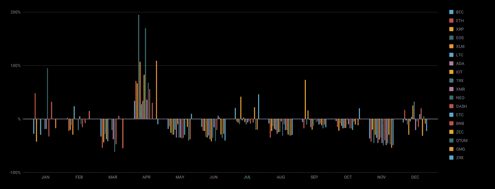

我认为这提供了一个很好的总体情况。虽然许多硬币在 2017 年底开始下跌，但一些硬币在 1 月份仍然保持了一些势头。二月还可以，但是三月是最糟糕的月份之一。四月是巨大的，在两周内三位数的增长，人们开始计算到年底单 BTC 将值多少钱，EOS 将很快成为第一名并超过所有其他硬币，但五月将我们带回现实。6 月份保持了同样的下降势头，7 月份带来了一点希望，但在那之后都下降了，直到 11 月份，大幅下降。12 月份带来了一些复苏，但我认为这主要是由于跌幅太大。

# 测试格式

在我们得到结果之前，关于我的测试格式有几件事:

1.  我仍然在使用同样的**前 20 名硬币**从以前的部分**减去文和 BCH** (分叉，太多的斗争重新进口/测试)这使它成为 18 个硬币。
2.  测试日期为**从 2018 年 1 月 1 日 00:00** (减去预热时间，为每个策略单独计算)**到 2019 年 1 月 1 日 00:00** 。
3.  由于一些硬币(如 EOS、ADA、IOT 等)没有前几个月的交易数据，**我将使用第一个可用日期作为** `**daterange.from**`。
4.  我将总共测试 32 种策略。10 从[第 2 部分](/@deandree/can-you-profit-in-crypto-markets-with-not-so-basic-strategies-part2-6cbc97a5f960)前进。15 来自[第 4 部分](/@deandree/can-neural-networks-beat-the-crypto-market-of-september-part-4-66547b5fe415)的神经网络。和 7 名新人，属于高级组。
5.  **对于某些策略，我将不再使用默认设置**。大多数公开可用的策略是为牛市制定的，并为 2017 年底/2018 年初进行了优化。此外，它们是为了更小的蜡烛尺寸(< 60m)，这似乎不再是最好的时间框架(至少在我的测试中)。在这篇文章之前，我用默认设置进行了回溯测试，结果相当糟糕——主要是因为交易太多(每天多次)或者不够(一年 10 次)。所以我做了一些优化，以更好地适应当前的市场，并尝试**不要过度适应**。

# 7 项新战略

大多数新策略都使用标准指标，所以我不会深入探讨其中的机制。我试图找到原始来源，但有时很难。所有的荣誉都归于作者。

*   **T5【夏泼 这里[发现](https://github.com/zschro/GekkoSchaffTrendCycle)**
*   ***stratego _ smaxv 7 _ SL***—在用户 *xteejx* 的# share-strategies(*Gekko*Discord Channel)中找到
*   ***BBRSI*** —在这里找到
*   ***HL****——**找到了[这里](https://github.com/mounirlabaied/gekko-strat-hl)*
*   ****RBB_ADX_BB*** —在这里找到*
*   ****ATR_ADX*** —在这里找到了*
*   ****w2*** —在这里找到了*

# *高级策略的结果*

*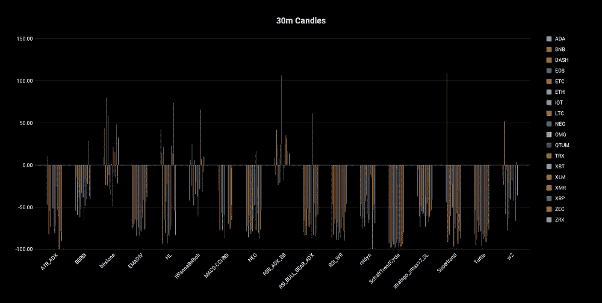**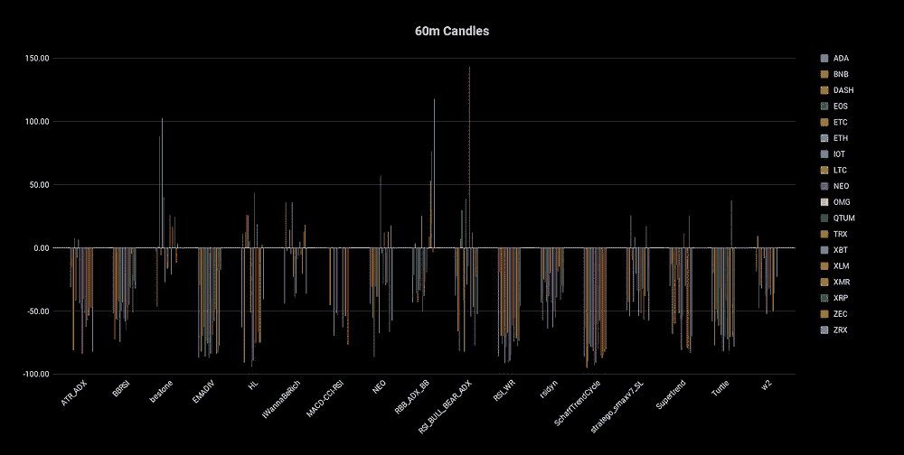**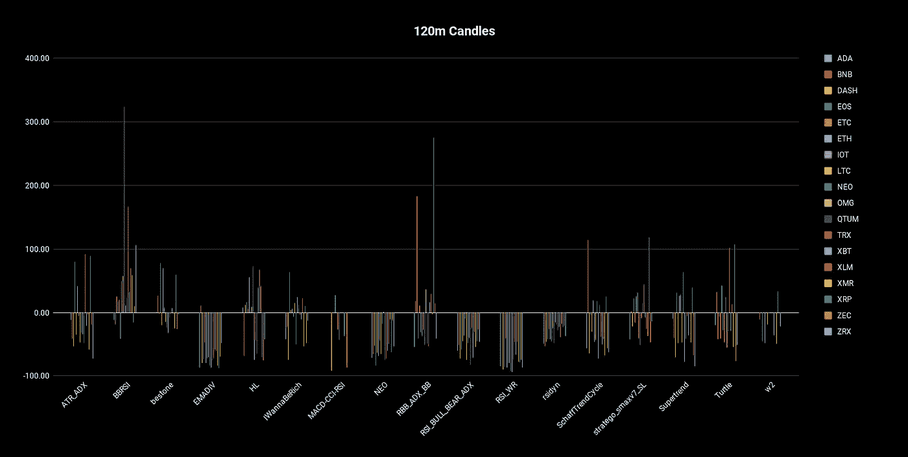**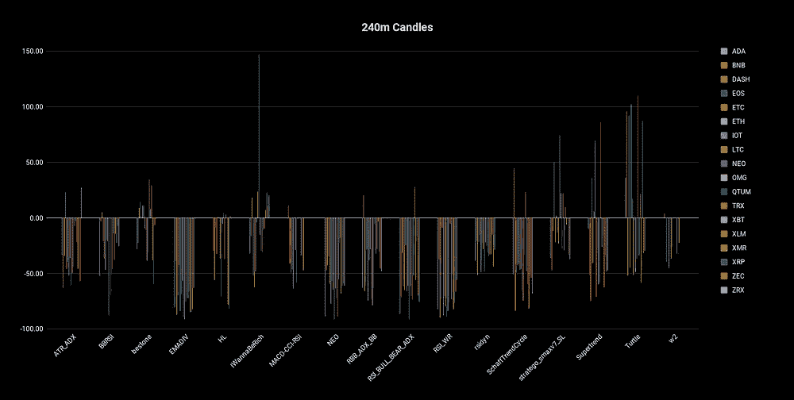**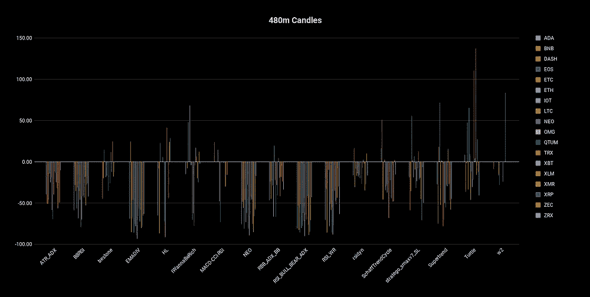*

*总的来说，我认为结果还可以，考虑到市场下跌了 80%。但是有几件事让我有点惊讶。*

*   *完全没想到 30m 会有什么希望，不过 2 策略其实在里面挺好的。*
*   *我原本预计 4.8 亿英镑会表现得更好。*
*   *我没想到一些策略会在所有蜡烛尺寸的所有硬币上 100%下跌。即使有遗传算法优化，我也不能让他们表现出任何承诺。我的最佳猜测是，它们要么是为了牛市，要么是更小的蜡烛尺寸。*

*有几个策略看起来很有希望:*

*   ****bestone***——在多个时间框架上看起来不错，尤其是在较小的时间框架上。*
*   **——120 米非常好，整体最好成绩之一。但其他的都很糟糕。可能是运气。**
*   *****HL***——不是最好的结果，但我喜欢它在所有时间范围内至少得到一些结果。**
*   *****IWannaBeRich***——总体结果接近 50/50，但似乎也适用于所有时间框架，我认为这是有希望的。**
*   *****RBB-ADX-BB*** —在较小的 30m/60m 时间框架上看起来非常好。最好的结果之一。**
*   *****海龟***——有趣的是，最好的结果之一来自最古老(20 世纪 80 年代)也是最著名的策略之一，有一本关于它的书。尤其适用于更长的时间范围(240 米/480 米)。**

**我的 TOP3 由此而来(混序)——***乌龟******Rb b-ADX-BB***和 ***bestone*** 。**

**让我们看看一些最好的结果是如何实现的。**

## **BBRSI 120m 米**

**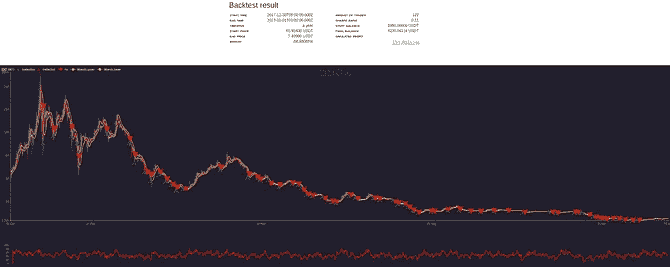****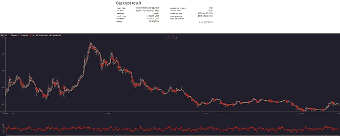****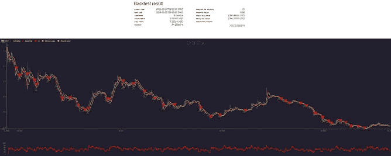**

**全年进行大量交易，这很重要，因为有一些策略取得了良好的效果，主要是因为很好地利用了 4 月份的超级牛市，然后在今年剩下的时间里保持观望。许多小的，持续的交易。**

## **120 米**

**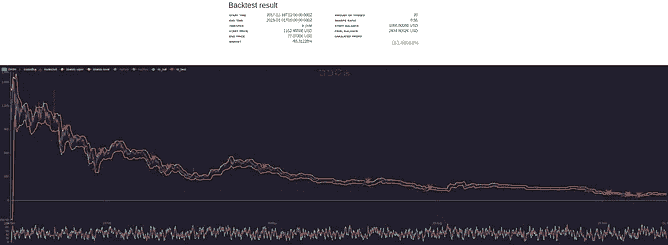********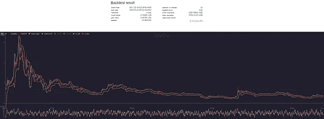**

**交易量相对较小，这引起了过度拟合的怀疑。此外，在年初有更多的交易，这意味着如果我们现在尝试这个，可能会与市场完全不同步。在年初抓住了一些大的波动，但完全错过了之后所有的大动作。**

## **海龟 480 米**

**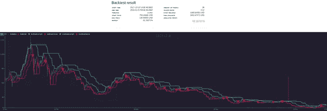****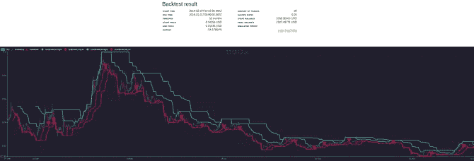****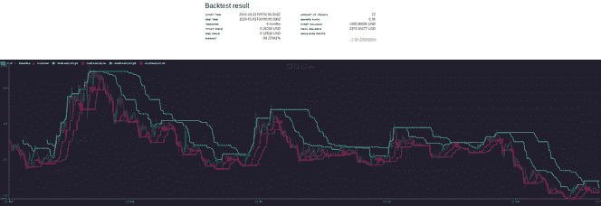**

**做海龟策略应该做的——跟随趋势，做得很好。可能是这里最稳定和可预测的策略。我喜欢退场，它不会像很多均值回复策略那样一直拿着****的袋子。由于去年有很多****要把握，简单的趋势跟踪似乎是一个不错的选择。**

## **百通 60 米**

**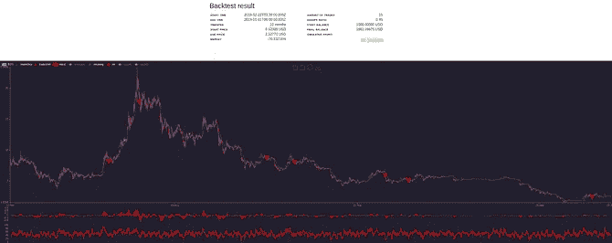****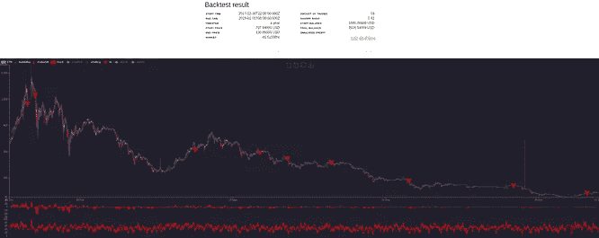****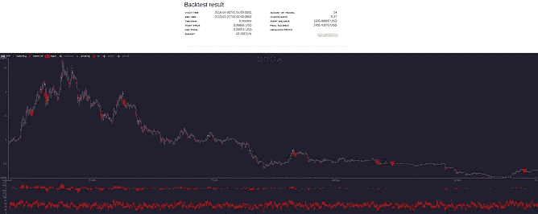**

**这是一个很好的策略例子，在年初获得大部分收益，然后做得很少。尽管它在最后抓住了最后一次机会(12 月复苏)。**

# **神经网络策略的结果**

**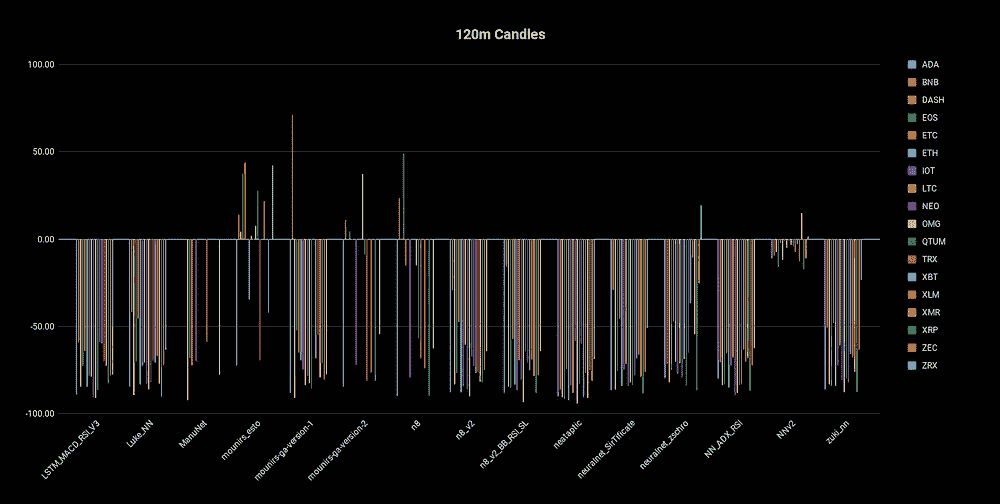****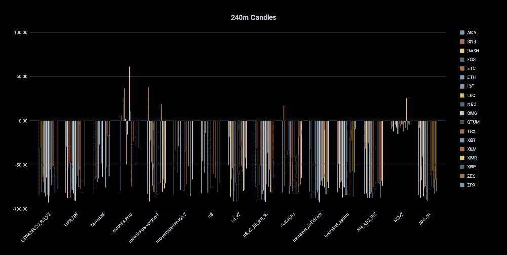****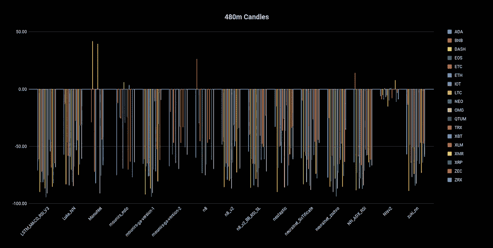****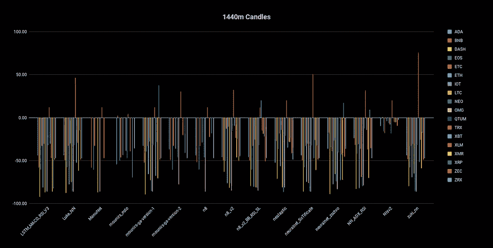**

**也许有些人会对这有多糟糕感到惊讶，但我个人不会。我一直在深入挖掘神经网络策略的代码，所以我非常熟悉在引擎盖下发生了什么，以及其中许多不太正确的地方。我可能会写一个单独的帖子，解释为什么他们不像他们应该的那样工作，但主要原因是很少有预测在进行。他们所做的大部分是事后对价格做出反应。**

**“预测”通常有三种类型:**

*   **价格非常接近，但是后面的蜡烛很少。这实际上使他们只是一个滞后的价格线。**
*   **严重滞后和圆形，看起来像一个波浪。**
*   **价格忽高忽低，远远高于/低于实际价格。通常以负 99%结束，因为下一根蜡烛线是买/卖/买/卖等等。**

**以下是 480m 蜡烛的一些例子。注意浅绿线，是神经网络做出的价格预测。**

**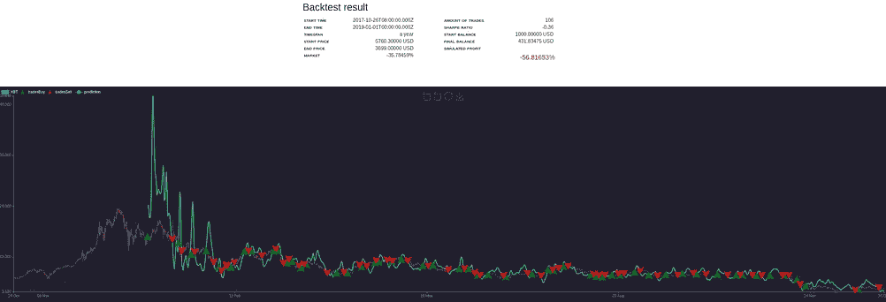****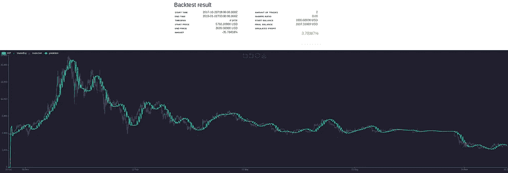**

**LSTM_MACD_RSI_V3 and mounirs_esto**

**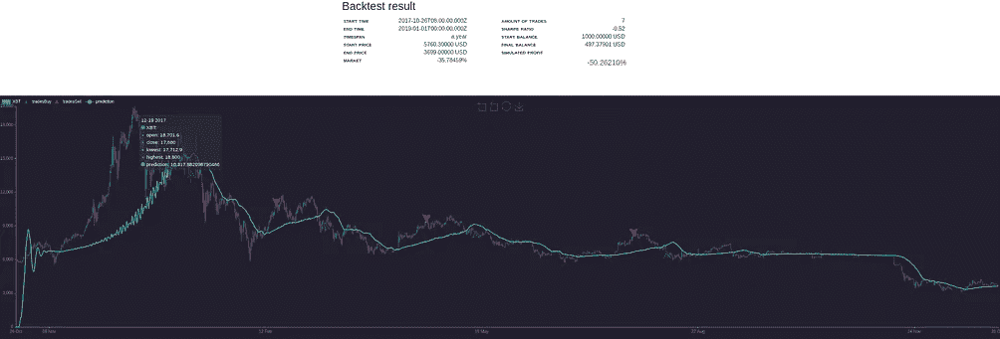****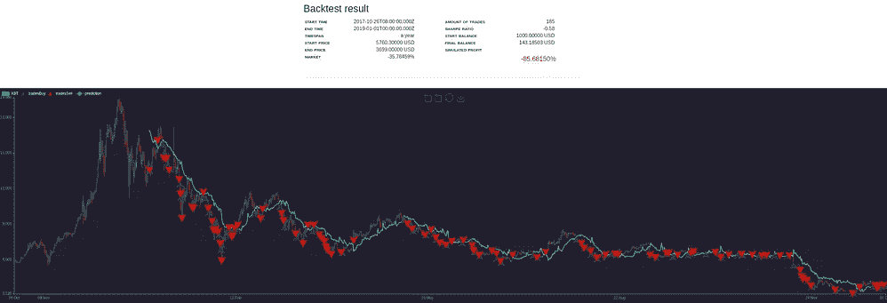**

**n8_v2 and neataptic**

**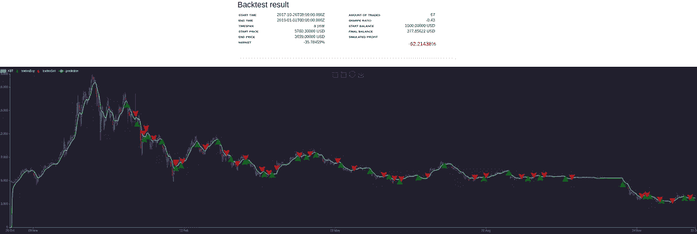****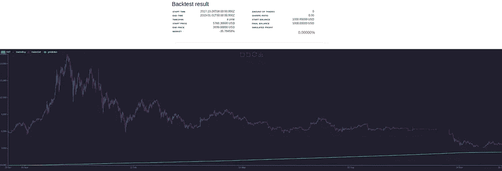**

**neuralnet_zschro and NNv2**

**我认为唯一有可能预测的策略是*(下图)。它也是唯一一个不预测价格，而是预测上下波动的(我在[第四部分](/@deandree/can-neural-networks-beat-the-crypto-market-of-september-part-4-66547b5fe415)中描述了差异和更多细节)。***

***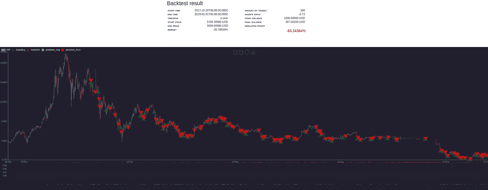***

***ManuNet***

***正如我们所见，买入/卖出逻辑过于简单，因为它试图对每个方向变化做出反应。但如果你看看预测(底部的红/绿点，绿色=做多，红色=做空)，我认为即使在价格行动之前也有一些相关性。不是在单个点上，而是在它们形成的总体集群上。***

# ***结论***

***我的建议是批判性地看待这些结果。你应该记住的一件事是，今年年初的市场与现在非常不同。上半年仍然受到盲目乐观和跟风的推动，但之后现实开始出现——熊市是真实的，可能会持续一段时间。许多策略在今年上半年获利最多，尤其是 4 月份。我的建议是你回溯测试最近的数据，集中在过去的几个月(3-6 个月)。***

***此外，我特意没有张贴我使用的策略设置。我强烈建议你根据个人需求和交易风格来优化和调整策略。如果你真的想要，PM 我的不和谐，我会把它们发给你。***

***希望这个市场能推动我们学习并更好地交易。因此，当多头回到镇上时，我们已经准备好，知道如何利用这一点。2019 年好运！***

> ***加入 Coinmonks [电报频道](https://t.me/coincodecap)和 [Youtube 频道](https://www.youtube.com/c/coinmonks/videos)获取每日[加密新闻](http://coincodecap.com/)***

## ***另外，阅读***

*   ***[复制交易](/coinmonks/top-10-crypto-copy-trading-platforms-for-beginners-d0c37c7d698c) | [加密税务软件](/coinmonks/crypto-tax-software-ed4b4810e338)***
*   ***[网格交易](https://coincodecap.com/grid-trading) | [加密硬件钱包](/coinmonks/the-best-cryptocurrency-hardware-wallets-of-2020-e28b1c124069)***
*   ***[密码电报信号](http://Top 4 Telegram Channels for Crypto Traders) | [密码交易机器人](/coinmonks/crypto-trading-bot-c2ffce8acb2a)***
*   ***[币安交易机器人](/coinmonks/binance-trading-bots-d0d57bb62c4c) | [OKEx 评论](/coinmonks/okex-review-6b369304110f) | [Atani 评论](https://coincodecap.com/atani-review)***
*   ***[最佳加密交易信号电报](/coinmonks/best-crypto-signals-telegram-5785cdbc4b2b) | [MoonXBT 评论](/coinmonks/moonxbt-review-6e4ab26d037)***
*   ***[如何在 Bitbns 上购买柴犬(SHIB)币？](https://coincodecap.com/buy-shiba-bitbns) | [买弗洛基](https://coincodecap.com/buy-floki-inu-token)***
*   ***[CoinFLEX 评论](https://coincodecap.com/coinflex-review) | [AEX 交易所评论](https://coincodecap.com/aex-exchange-review) | [UPbit 评论](https://coincodecap.com/upbit-review)***
*   ***[十大最佳加密货币博客](https://coincodecap.com/best-cryptocurrency-blogs) | [YouHodler 评论](https://coincodecap.com/youhodler-review)***
*   ***[最佳加密交易所](/coinmonks/crypto-exchange-dd2f9d6f3769) | [印度最佳加密交易所](/coinmonks/bitcoin-exchange-in-india-7f1fe79715c9)***
*   ***[开发人员的最佳加密 API](/coinmonks/best-crypto-apis-for-developers-5efe3a597a9f)***
*   ***最佳[密码借贷平台](/coinmonks/top-5-crypto-lending-platforms-in-2020-that-you-need-to-know-a1b675cec3fa)***
*   ***[免费加密信号](/coinmonks/free-crypto-signals-48b25e61a8da) | [加密交易机器人](/coinmonks/crypto-trading-bot-c2ffce8acb2a)***
*   ***杠杆代币的终极指南***