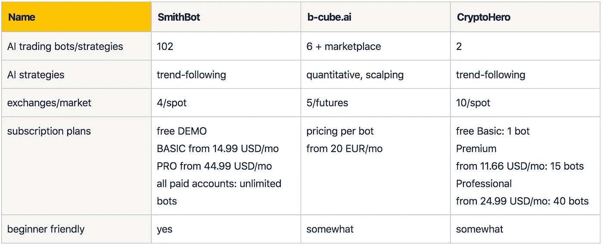
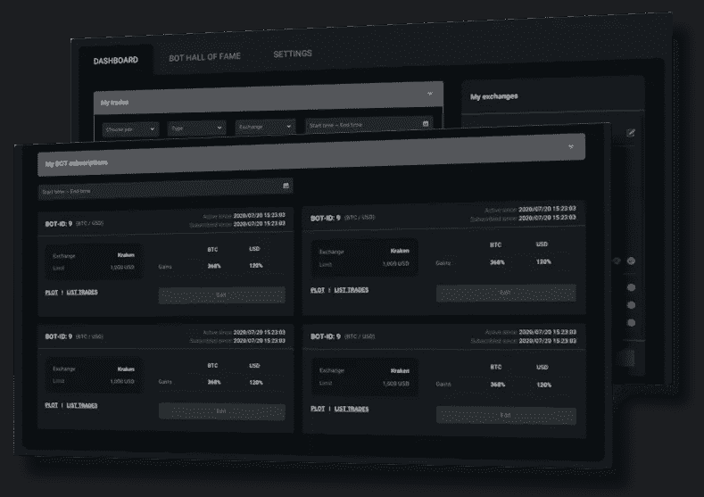
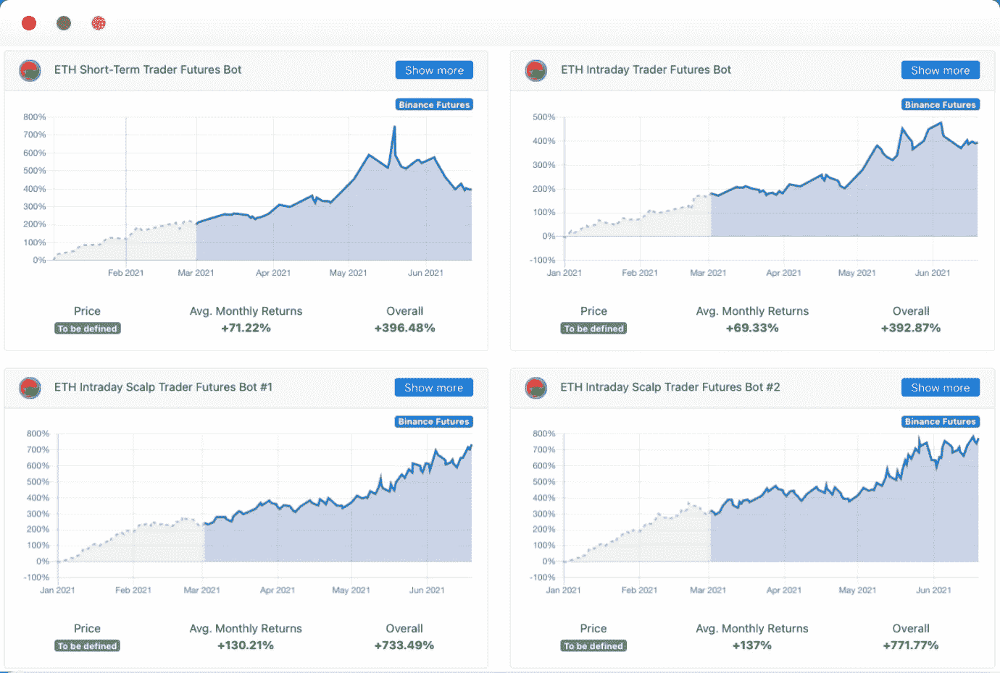
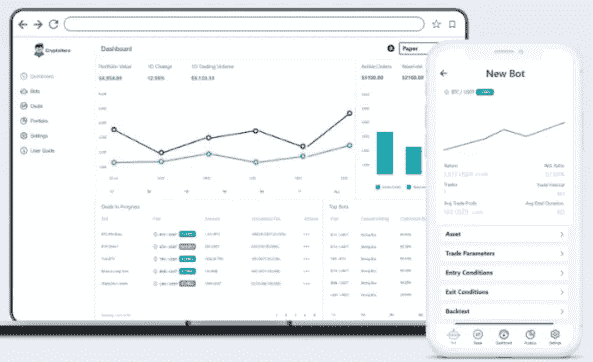

# 密码交易机器人——2021 年最佳人工智能密码交易机器人

> 原文：<https://medium.com/coinmonks/crypto-trading-bot-best-ai-crypto-trading-bots-2021-de0247d9ee2c?source=collection_archive---------3----------------------->

交易加密货币很难。因为市场是 24/7 开放的，所以交易者有必要大部分时间监控图表，以免错过交易的好机会。因此，在过去的几年里，使用加密货币交易机器人来自动化交易者提供的交易策略变得很普遍。

到目前为止，大多数加密货币机器人提供商提供传统策略的手动机器人设置。但是这将寻找有利可图的设置的努力、负担和风险加在了用户身上。事实上，大多数交易者从来没有成功地找到一个长期战略，这是不亏钱的。

最近，人工智能交易机器人可以实现更高水平的性能。此外，用户不必研究和尝试不同的策略和参数。 [**SmithBot**](https://smithbot.com/) 、 [**b-cube.ai**](https://www.b-cube.ai/) 、 **CryptoHero** 都是利用 **AI(人工智能)**和大数据分析的创新交易机器人提供商的例子。他们甚至让非专业交易者也能使用高利润的策略。

尽管没有或至少没有很多手动设置，他们提供了一个简单和安全的交易体验。

*越来越多的密码爱好者使用 AI* [*密码交易机器人*](/coinmonks/crypto-trading-bot-c2ffce8acb2a) *来实现投资自动化，并在交易过程中实现利润最大化。但是有什么特点，或者说怎么才能找到 2021 年最顶尖的 AI 密码交易机器人？*

# 2021 年顶级人工智能加密交易机器人

# 1.史密斯博特

[**史密斯博特**](https://smithbot.com/) 是一个比较新的玩家。他们致力于为经验不足的交易者提供先进的加密货币交易方法。因此，他们使用基于新型自适应算法的最先进和专有的人工智能，而不仅仅是优化已知的方法。SmithBot 目前为其基于云的自动交易平台提供 102 个预先训练和测试的交易机器人。他们的网络应用程序使得在任何现代浏览器中选择最好的机器人变得容易。

SmithBot 交易引擎在现货市场上运行，在不利用这种降低风险的情况下实现了高性能。此外，SmithBot 目前支持一些领先的交易所，包括币安、Bitfinex、Bitstamp 和北海巨妖。

## 用户体验

SmithBot 提供了许多人工智能加密货币交易机器人，这些机器人由他们的研究团队训练和测试。这意味着，没有用户必须选择的参数或策略选项。这使得新手交易者很容易选择一个成功的机器人，而不必花时间研究和测试不同的设置。

web 应用程序可以在所有现代 web 浏览器中完美运行。它有两个主屏幕，排列在选项卡中。首先，仪表板收集所有个人信息，如您订阅的机器人、您连接的交易所的余额以及您的机器人下的订单。在那里，你的每一个机器人都显示了基于来自交易所的订单数据的真实性能。

第二，“机器人名人堂”提供了各种排名和绘图功能，可以轻松选择性能最佳的机器人。一个有趣的特征是除了用引用符号计算的普通性能测量之外，还用基本符号对性能进行排序和绘图。然后，您可以从该选项卡直接订阅机器人。

总的来说，用户界面易于使用，给人一种精简的印象，只提供所需的功能。

## 交易策略

SmithBot 的算法基本上是复杂的趋势跟踪策略。这些都是基于灵活和自适应的人工智能模型，可以模仿成熟的策略、策略组合或学习全新的方法。

这意味着，用户不需要选择正确的参数或策略。SmithBot 专家已经从大量历史数据中训练了所有机器人，以实现最佳结果。此外，他们考虑所有相关的现实世界的影响，如传播，交易费用，滑点和通信延迟。

## 透明度

SmithBot 的云应用程序显示了所有机器人的历史性能。所显示的业绩还会根据不同的交易费用进行修正，并根据基准和报价符号进行计算。有趣的是，基本符号性能是一个独特的功能，用来衡量机器人跑赢市场的程度。

由于 SmithBot 的工作方式，不需要纸质交易模式。没有用户设置，所有的机器人一直在运行。例如，如果你想知道下个月内的现场表演，只需绘制一个月后的表演即可。

此外，SmithBot 用户界面显示任何 Bot 发出的所有订单，包括时间戳和参考价格等信息。

## 安全性

SmithBot 是一项非托管服务。用户的资金留在他的交易所，提供商不能提取。

该平台运行在云中，具有最先进的安全性和加密功能。因为它运行在一家大型云提供商的服务器上，具有高度冗余，正常运行时间应该不成问题。

## 定价

SmithBot 提供了一个免费的演示帐户，它提供了探索人工智能交易机器人的所有可视化功能。

对于实际交易，您需要目前提供的两种付费订阅级别中的一种。基本订阅计划的起价为 14.99 美元，而专业计划的起价为每月 44.99 美元。这两者在功能上没有区别。基本帐户提供高达$20，000 的合并交易限额，而专业帐户提供$100，000。这种“综合交易限额”对所有订阅的机器人来说是一种智能限制。如果他们的下一个订单的总和超过这个限制，那么购买订单被限制。因此，即使达到了上限，机器人仍然可以盈利交易。

SmithBot 不限制用户可以订阅的交易所和机器人的数量。换句话说，用户可以同时订阅目前所有的 102 个机器人，而不需要额外的费用。

# 2.b-cube.ai

[**b-cube.ai**](https://www.b-cube.ai/index.html) 成立于 2020 年 11 月，是一家运行在 ai 和量化分析上的自动加密货币交易机器人的提供商。它提供内部开发的策略，以及用户提供的机器人和交易信号的市场。此外，它允许交易者连接他们喜欢的交易所，然后开始自动交易。

此外，他们还创建了自己的 BCUBE 令牌，可以在他们的平台上交易信号订阅或教育课程等服务。

b-cube.ai 平台已经整合了一些领先的交易所，如币安、FTX、BitMex、Kucoin 和币安期货，以进行多空交易。

## 用户体验

该提供商提供由他们的专家团队培训和配置的现成的机器人。你可以选择不同策略的交易机器人，但它们没有任何用户可配置的参数。这对初学者来说很容易，因为他们可以只通过查看历史性能来选择机器人。因此，用户不需要手动决策，也不需要重复冗长的回溯测试模拟。

选择一个机器人后，你连接你的交易所，机器人自动开始交易，无需进一步的手动操作。

另一方面，一些机器人在期货市场上交易，这对于新手来说可能不容易理解。

## 交易策略

该平台通过 AI/ML 引擎实时生成交易信号。它使用情绪和定量方法的技术分析。

此外，模型动态地适应不断变化的市场条件。总的来说，该策略旨在以更高的胜率进行交易。

## 透明度

该平台提供了高度的透明度。用户可以查看所有机器人的交易历史和历史表现。此外，他可以在创建一个免费账户后查看交易的时间戳等详细信息。

和 SmithBot 一样，因为这个提供商的所有 Bot 都已经设置好了，不需要实时交易模拟模式。

## 安全性

b-cube.ai 也是一种不管理用户资金的非托管服务。这些文件保存在交换中，提供商无法访问它们。

该平台运行在云中，并采用最先进的安全和加密技术进行保护。

## 定价

报名 b-cube.ai 的平台是免费的。然后，您可以探索他们的机器人的所有历史性能。

b-cube.ai 根据用户想要使用的交易机器人为其服务定价。但任何服务或 bot 的价格都取决于其历史交易收益，并单独支付。用户可以在 b-cube.ai 的市场上开始真正的交易，€每月 20 英镑，€每月 49 英镑。

# 3.CryptoHero

[**CryptoHero**](https://cryptohero.ai/) 是一个自动化的加密交易机器人平台，于 2020 年 10 月推出。他们提供了两种基本的 bot 策略，即长期和短期策略。因此，用户必须设置几个参数。他们还提供人工智能优化的机器人。然而，这到底是如何工作的还不清楚。

CryptoHero 目前支持的主要交易所包括币安、Bitfinex、Bitstamp、Bittrex、比特币基地 Pro、北海巨妖和币安。US、火币、Gate.io、Kucoin、Okex。它可以在现货市场交易，有保证金也可以没有保证金。他们提供了一个可以在任何浏览器上运行的网络应用，以及一个适用于 iOS 和 Android 的应用。

## 用户体验

用户可以通过选择两种策略中的一种并设置一些参数(如交易频率)来轻松设置机器人。接下来，用户需要根据四个可用的技术指标指定机器人交易的进入和退出条件。

CryptoHero 还提供回溯测试功能，用于验证用户策略的性能。此外，纸面交易模式是对交易机器人进行无风险的实时模拟，而不是在交易所实际下单。

当找到一个好的策略时，机器人就会连接到一个交易所，开始自动交易。该平台还有一个界面和投资组合，可以跟踪用户在多个交易所的表现。

对于想马上开始交易的新手，CryptoHero 有一些策略参数的推荐设置。但是最佳选择取决于期望的风险状况。

## 交易策略

CryptoHero 提供了技术指标“布林线”、“指数移动平均线”、“相对强度指数”和“随机相对强度指数”，用于您的进场和出场条件。可以选择多头策略，也可以选择空头策略和 AI 优化的 bot。

## 透明度

CryptoHero 提供历史数据的机器人模拟，让用户选择策略、参数和进出条件的组合。回溯测试功能评估历史市场数据的模拟性能。此外，该平台还可以实时运行模拟机器人来测试策略，而无需实际下单。

## 安全性

CryptoHero 也提供非托管服务，不持有用户的资金。它们总是停留在用户的加密货币交易所，无法访问。

该平台运行在云中，具有最先进的安全性和加密功能。

## 定价

至于 CryptoHero 的定价，基本的订阅计划是在 1 个交易所免费提供 1 个机器人。

高级计划是每月 11.66 美元，最多 15 个机器人，在 3 个交易所，而专业计划是每月 24.99 美元，最多 40 个机器人，没有兑换限制。交易量不限。

# 结论

基于人工智能策略的加密货币交易机器人正在慢慢从机构交易转向零售交易者。它们承诺更易于使用，并有可能带来更高的利润。目前市场上似乎还没有多少提供商拥有专业的人工智能交易方法。有些人只是把人工智能作为一个营销术语，而没有任何实际的内涵。

我们比较了 3 家提供加密货币的**人工智能交易机器人的供应商: [**史密斯博特**](https://smithbot.com) 、 [**b-cube.ai**](http://b-cube.ai) 和 **CryptoHero** 。除了这些，前两个似乎有一个完整的人工智能方法。但后者仅将人工智能应用于其服务的某些方面。否则，它仍然使用传统策略的变体，并需要手动设置。**

所有审查加密交易机器人提供商适合经验不足的交易者。然而，有些人仍然需要手动选择参数或策略，这可能会让初学者不知所措。由于所有的机器人都是非托管交易，这意味着他们不持有你的钱，你的资金安全得到保证。

基于人工智能的加密货币交易机器人将彻底改变交易，并大大超过基于技术指标的经典方法。开发现在已经开始，将来肯定会加速。特别是，SmithBot 和 b-cubes.ai 是让这项创新技术为每个人所用的先驱。

此处提供了文章的更新版本[。](/coinmonks/crypto-trading-bot-best-ai-crypto-trading-bots-2022-97328dc1d2cd)

> 加入 [Coinmonks 电报频道](https://t.me/coincodecap)，了解加密交易和投资

## 也阅读

 [## 最佳加密交易所| 2021 年十大加密货币交易所

### 加密货币交易所的加密交易需要了解市场，这可以帮助你获得利润…

blog.coincodecap.com](https://blog.coincodecap.com/crypto-exchange)  [## 2021 年 9 大最佳加密借贷平台

### 当谈到加密货币贷款时，大量因素等同于良好的收入状况。此外，借款的一部分…

blog.coincodecap.com](https://blog.coincodecap.com/crypto-lending)  [## 2021 年最佳加密交易机器人(免费和付费)

### 2021 年币安、比特币基地、库币和其他密码交易所的最佳密码交易机器人。四进制，位间隙…

medium.com](/coinmonks/crypto-trading-bot-c2ffce8acb2a)  [## 最佳 4 个加密交易信号电报通道

### 这是乏味的找到正确的加密交易信号提供商。因此，在本文中，我们将讨论最好的…

medium.com](/coinmonks/best-crypto-signals-telegram-5785cdbc4b2b)  [## BlockFi 评论 2021:利弊和利率

### 今天，我们提出了一个全面的 BlockFi 评论，这是一个成立于 2017 年的加密贷款平台，拥有其…

blog.coincodecap.com](https://blog.coincodecap.com/blockfi-review)  [## 如何在印度购买比特币？2021 年购买比特币的 7 款最佳应用[手机版]

### 如何使用移动应用程序购买比特币印度

medium.com](/coinmonks/buy-bitcoin-in-india-feb50ddfef94)  [## 加密税务软件——五大最佳比特币税务计算器[2021]

### 不管你是刚接触加密还是已经在这个领域呆了一段时间，你都需要交税。

medium.com](/coinmonks/best-crypto-tax-tool-for-my-money-72d4b430816b)  [## Pionex 评论-被动交易者的简单交易机器人

### 在本文中，我们将回顾 Pionex，它提供了加密交易机器人自动化工具，集成了一个…

blog.coincodecap.com](https://blog.coincodecap.com/pionex-review-exchange-with-crypto-trading-bot)  [## 存储比特币的最佳加密硬件钱包[2021]

### 保管您的数字资产很容易，但找到正确的存储方式却是一项繁琐的任务。在线钱包有一个风险…

blog.coincodecap.com](https://blog.coincodecap.com/best-hardware-wallet-bitcoin)